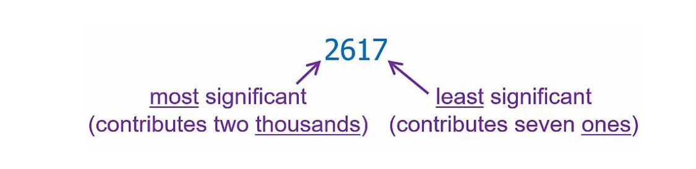

# Computer System Architecture

## digital circuit recap

**complement representation**

positive: same as itself

negative: equal to (radix-minus-one complement + 1)

**arithmetic with 2's Complement(signed)**

no need carry,just add the complement

**DeMorgan's law**

$\overline{\text{A + B}}$ = $\overline{\text{A}}$ * $\overline{\text{B}}$

$\overline{\text{A * B}}$ = $\overline{\text{A}}$  +  $\overline{\text{B}}$

**Transistors**

negative type

positive type

.png)

**Logic Gates**

.png)

## Decoder
.png)
## Multiplexers

.png)

## binary addition hardware

full adder

Si=Ai⊕Bi⊕Cin

Cout = Ai \* Bi+Ai \* Cin + Bi \* Cin

## D Latch

store info

## D Flip-Flop

D Latch + CLK(Clock)

## FSM

## defines

LSB: least-significant digit

MSB: most-significant digit

A AND B = A * B

A OR B = A + B

NOT A = $\overline{\text{A}}$

DEC: Decoder

MUX: Multiplexer

Sequential Circuits: store info

FSM: Finite State Machine
