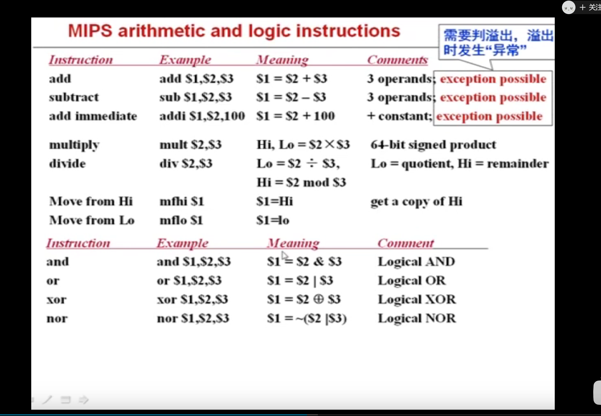

# MIPS

指令集以及寄存器 https://blog.csdn.net/gujing001/article/details/8476685

存储函数结果 \$v0,\$v1

函数返回 $ra

保存的参数（地址）\$s0-\$s7

临时变量 \$t0-\$t7

堆栈指针 \$sp

## 地址类型

32位基址 + 16位偏移（带符号扩展）

ps：每个数组元素占4位

## 方法



.png)

.png)

.png)

.png)

.png)

.png)

.png)

.png)

## 编写逻辑

1.保存现场 寄存器S和R

```mips
addi $sp,$sp,-12
sw $ra,8($sp)
sw $s0,4($sp)
sw $s1,0($sp)
```

2.业务代码

3.恢复现场

```mips
lw $ra,8($sp)
lw $s0,4($sp)
lw $s1,0($sp)
addi $sp,$sp,12
jr $rs
```

ps: 函数调用要用jal

## 寄存器

| REGISTER | NAME    | USAGE                                                        |
| -------- | ------- | ------------------------------------------------------------ |
| $0       | $zero   | 常量0(constant value 0)                                      |
| $1       | $at     | 保留给汇编器(Reserved for assembler)                         |
| $2-$3    | $v0-$v1 | 函数调用返回值(values for results and expression evaluation) |
| $4-$7    | $a0-$a3 | 函数调用参数(arguments)                                      |
| $8-$15   | $t0-$t7 | 暂时的(或随便用的)                                           |
| $16-$23  | $s0-$s7 | 保存的(或如果用，需要SAVE/RESTORE的)(saved)                  |
| $24-$25  | $t8-$t9 | 暂时的(或随便用的)                                           |
| $28      | $gp     | 全局指针(Global Pointer)                                     |
| $29      | $sp     | 堆栈指针(Stack Pointer)                                      |
| $30      | $fp     | 帧指针(Frame Pointer)                                        |
| $31      | $ra     | 返回地址(return address)                                     |

特殊寄存器 Hi,Lo

## 类型

### r-type

寄存器寻址

.jpg)

### i-type

根据op

### j-type

伪直接寻址