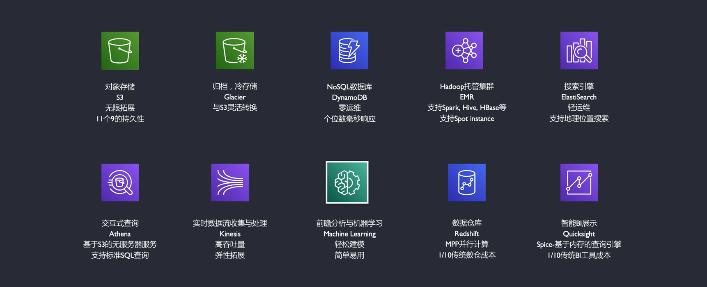

[TOC]
# 云计算

## 服务模式

IAAS：基础设施即服务（机器）

> 基础设施即服务有时缩写为 IaaS，包含云 IT 的基本构建块，通常提供对联网功能、计算机（虚拟或专用硬件）以及数据存储空间的访问。基础设施即服务提供最高等级的灵活性和对 IT 资源的管理控制，其机制与现今众多 IT 部门和开发人员所熟悉的现有 IT 资源最为接近。

PAAS：平台即服务（机器+操作系统+运行库+数据库）

> 平台即服务消除了组织对底层基础设施（一般是硬件和操作系统）的管理需要，让您可以将更多精力放在应用程序的部署和管理上面。这有助于提高效率，因为您不用操心资源购置、容量规划、软件维护、补丁安装或与应用程序运行有关的任何无差别的繁重工作。

SAAS：软件即服务（机器+操作系统+运行库+数据库+软件）

> 软件即服务提供了一种完善的产品，其运行和管理皆由服务提供商负责。人们通常所说的软件即服务指的是终端用户应用程序。使用 SaaS 产品时，服务的维护和底层基础设施的管理都不用您操心，您只需要考虑怎样使用 SaaS 软件就可以了。SaaS 的常见应用是基于 Web 的电子邮件，在这种应用场景中，您可以收发电子邮件而不用管理电子邮件产品的功能添加，也不需要维护电子邮件程序运行所在的服务器和操作系统。

## 部署类型

公有云

> 云端资源开发给社会公众使用。云端的所有权、日常管理和操作的主体可以是一个商业组织、学术机构、政府部门或者它们其中的几个联合。云端可能部署在本地，也可能部署于其他地方，比如中山市民公共云的云端可能就建在中山，也可能建在深圳。	

私有云

> 云端资源只给一个单位组织内的用户使用，这是私有云的核心特征。而云端的所有权、日程管理和操作的主体到底属于谁并没有严格的规定，可能是本单位，也可能是第三方机构，还可能是二者的联合。云端可能位于本单位内部，也可能托管在其他地方。

社区云

> 云端资源专门给固定的几个单位内的用户使用，而这些单位对云端具有相同的诉求（如安全要求、云端使命、规章制度、合规性要求等）。云端的所有权、日常管理的操作的主体可能是本社区内的一个或多个单位，也可能是社区外的第三方机构，还可能是二者的联合。云端可能部署在本地，也可能部署与他处。

混合云

> 混合云由两个或两个以上不同类型的云（私有云、社区云、公共云）组成，它们各自独立，但用标准的或专有的技术将它们组合起点，而这些技术能实现云之间的数据和应用程序的平滑流转。由多个相同类型的云组合在一起，混合云属于多云的一种。私有云和公共云构成的混合云是目前最流行的——当私有云资源短暂性需求过大（称为云爆发，Cloud Bursting）时，自动租赁公共云资源来平抑私有云资源的需求峰值。例如，网店在节假日期间点击量巨大，这时就会临时使用公共云资源的应急。

**对比**

|        | 公有云             | 私有云     | 社区云             | 混合云 |
| ------ | ------------------ | ---------- | ------------------ | ------ |
| 受众   | 社会公众           | 单一组织   | 固定单位           | 混合体 |
| 管理者 | 单个或多个部门联合 | 无明确规定 | 单个或多个部门联合 | 混合体 |

## 常见厂家

AWS，阿里云，腾讯，微软

## 优势
1.增加速度和灵活性
2.减少维护成本
3.从大规模经济中获益
4.资本投入变成可变投入
5.无需计算所需资源
6.快速扩展到全球（由于云计算的机房在全球各地）

# AWS（Amazon Web Service）

## 服务模式

IAAS:EC2,VPC,DX

PAAS:S3,AMI,Cloud Watch(监控平台),Cloud Watch Log(监控日志)

SAAS:RDS,DynamoDB,Redshift,AWS Glue,AWS EMR

## 基础服务
1.计算资源服务：EC2,ECS,Lambda,ESR,Elastic Beanstalk LightSail
2.数据库：Amazon Aurora（关系型数据库）,DynamoDB(K-V数据库 和 文档数据库)，ElasticCache，Redshift，RDS
3.存储：EBS（持久化磁盘）,EPS,S3,Glacier,Snowball,Storage Gateway
4.网络：VPC,Route53,CloudFront（CDN服务器）,API,GateWay,Direct Connect(DX)
5.管理与合成：CloudWatch,CloudTrail（链路追踪）,CloudFormation,AWS CLI
6.多媒体服务：Elastic Transcoder，Kiness Video Streams，Elemental MedaConnect
7.迁移服务：Database Migration Service,DataSync,Sonwball,Snowmobile
8.移动服务：API Gateway,Pinpoint ,Amplify,AppSync,Device Farm
9.安全与身份：Directory Service,IAM,Organizations,Shield,WAF
10.其他服务：机器学习，IoT，区块链，卫星服务，机器人服务，语音识别，大数据处理，AR/VR等

## 计算服务

Amazon EC2：云中的弹性 虚拟服务器
Amazon ECS：Docker 容器集群管理
Auto Scaling：自动缩放EC2容量
Elastic Load Balancing：动态 流量分发（负载均衡）
Amazon EKS：高可用的Kubernetes服务，进行服务托管
Amazon Fargate：无需管理服务器或集群运行容器
Amazon LightSail：提供快速启动项目 一切资源
AWS Batch：完全托管的批处理服务

**EC2实例类型**

**EC2计费模式**

**支持微服务+无服务（AWS Lambda）（直接跑代码）**

## 存储服务

**存储方案**

Elastic Block Store
Simple Storage System
Elastic File System
AWS Snowball
AWS Storage Gateway
AWS S3 Glacier

**S3（Simple Storage System）(访问从频繁到不频繁)**
S3 Standard -> S3 Intellingent-Tiering -> S3 Standard-IA -> S3 One Zone-IA -> S3 Glacier -> S3 Glacier deep archive

**大量数据数据迁移**

## 网络服务

VPC（Virtual Private Cloud）：隔离的专属网络（虚拟局域网）

VPN（Virtual Private Network）：自己数据中心与AWS网络之间的基于Internet的加密通道

DirectConnect：自己数据中心与AWS网络的专线

CloudFront CDN：CDN服务器

## 数据库服务

Amazon Aurora,MariaDB,PostgreSQL,Microsoft SQL Server,MySQL,Oracle

## 其他服务

## DynamoDB

[文档](https://docs.aws.amazon.com/zh_cn/amazondynamodb/latest/developerguide/Introduction.html)

## EC2

## Route53

使用Route53后会将查询转到最近的服务器位置，Route53服务器帮助返回IP地址，使浏览器能够加载网站或应用程序

**优势**

Route53有遍布全球的DNS服务器，可以自动扩展处理DNS查询中的大量数据或者峰值

**使用步骤**

1.购买Route53域名
2.创建托管区域
3.主机区域创建记录（类似于host）
4.使用AWS IAM（Identity and Access Management），控制访问权限
5.别名映射

**配置route53**
用AWS Console 或者 API 或SDK来配置DNS

1.配置管理区域，添加健康检查

2.创建故障转移用的DNS记录（一主多从）

3.使用web服务器的ip地址为域创建DNS记录

4.创建健康检查

5.配置故障转移（服务降级）

