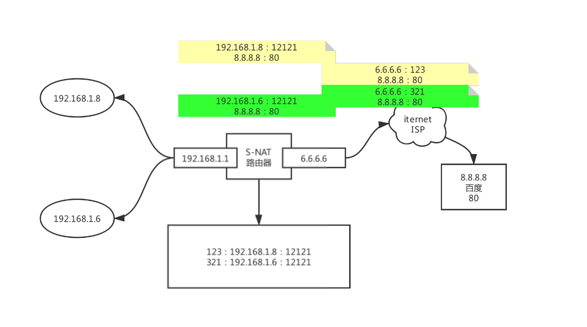
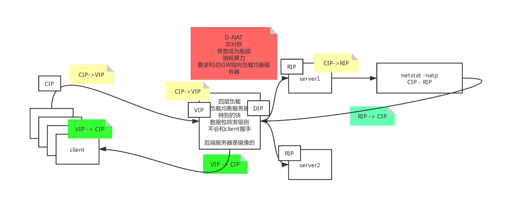
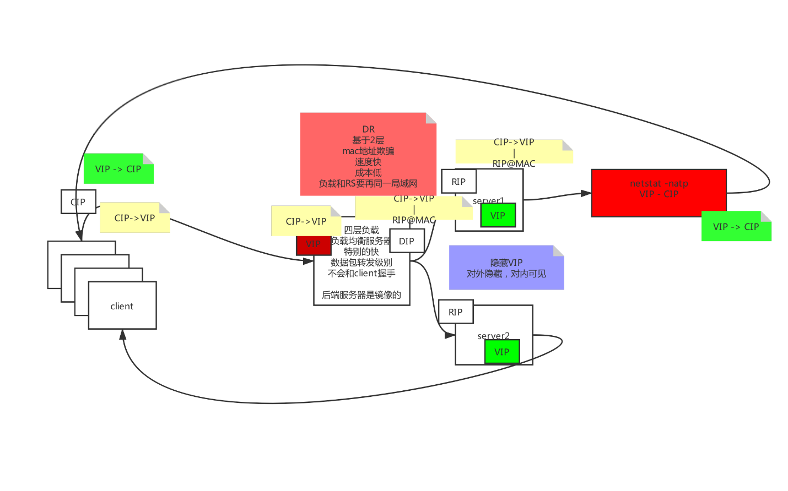
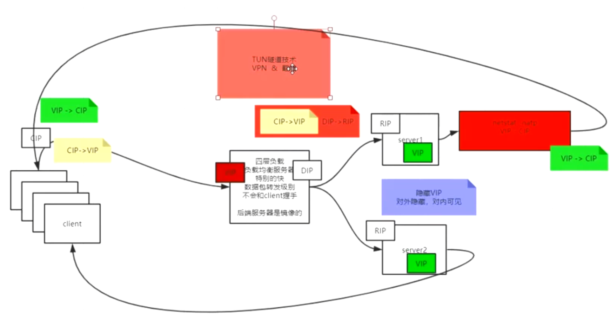
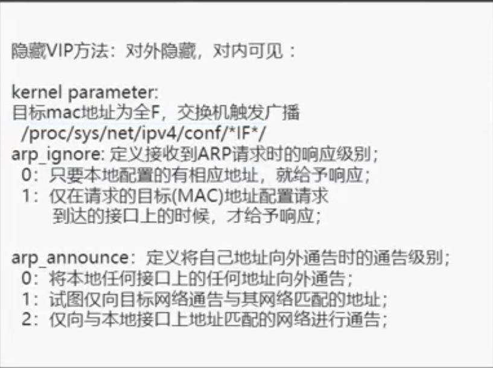

[TOC](目录)

# 高并发，负载均衡，高可用
## 高并发负载均衡
### 网络协议管理

#### 副产品好处
可以分析：
渠道流量的质量
每个渠道的转化率（购买力）
卖服务：帮助店家分析

#### 什么是协议？
协议就是一个固定的格式，是一种规范

#### 应用层
Http协议，ssh协议，tls协议，ssl协议，Https协议

#### 传输控制层
TCP/IP协议：面向连接的可靠的传输方式

UDP协议：无连接的不可靠的传输方式

##### 三次握手和四次挥手
三次握手>应用层会打开线程，传输数据 > 四次挥手

最小粒度单元，不可被分割

###### 三次握手
客户端向服务器发送连接请求，服务器确认并向客户端发送确认信息，客户端确认并向服务器返回确认信息，最终建立连接

###### 四次挥手
客户端向服务器发送断开连接请求，服务器接收并响应，但是并不会立马断开，因为可能服务端也需要向客户端发送信息，在这种情况下，服务器端不会向客户端发送断开连接请求，等到任务全部完成，才会发送请求，等待客户端确认后，解除连接

###### 查询linux上所有tcp端口
netstat  -natp
n是不解析name，直接用ip，a是all，t是tcp，p是pid

##### 总结
TCP/IP协议是基于下一跳机制，IP是端点间的，MAC是节点间的

#### 网络层（下一跳机制）
##### 计算机中的IP地址，掩码，网关，域名解析器DNS分别为什么
IP地址：由网络号+主机位组成

掩码：与IP地址进行与运算后可以算出网络号

网关：与掩码按位与运算后与路由表中的地址相比较，指出下一个我要去的地址，如果是0.0.0.0，证明在同一局域网，是一个电脑与外界交互的出口

DNS：将对应的域名映射到IP上

##### arp协议 
会解释网关IP地址和网卡硬件（MAC）地址的映射（获取MAC地址）

构成：
目标MAC地址，源MAC地址，目标IP，源IP

当目标MAC地址为FFFFFFFF时，交换机会进行广播，广播了之后，如果到达了目标IP地址，目标IP地址就会响应，如果到达其他地址，其他机器就会丢弃数据包

##### 原理
DNS将对应的域名解释为IP地址，然后通过路由表找掩码，掩码与IP地址做与运算，得出对应的网络号，如果是局域网，那么就直接通讯，不然就走网关，通过去找下一个地址（下一跳）

#### 链路层
节点间通讯

## 负载均衡模型
### 四层负载均衡技术
#### 思考：为什么Tomcat慢，负载均衡快？
从通信角度来看，Tomcat要经过七层模型，到达应用层，并且Tomcat内部还有一个虚拟机，相当于在电脑上找到Tomcat的进程之后，还要去切换Java虚拟机那边进行处理，所以慢。负载均衡是获取数据包直接转发的，甚至不会进行三次握手，并不会到达应用层，所以快，但是后端服务器是镜像的。

### NAT（网络地址转换）路由器
S-NAT（源地址转换）：就是将私有IP地址换成公网IP地址，并且修改了Port
D-NAT（目标地址转换）：将公网目标地址转换成真正的目标地址

#### NAT模型

#### D-NAT模型

#### DR（直接路由）模型

#### TUN（隧道）模型

### LVS（Linux Virtual Server）
#### 隐藏vip

在这个基础知识的前提下，先通过修改linux内核映射的文件信息，也就是配置信息，将arp_ignore设置为1，arp_announce设置为2，就可以阻止刚上电的时候就将网卡信息广播出去，但是还有一个问题需要解决，就是如何不让外界发现，因为一旦外界直接与该网卡相接触，仍然会发现，所以还需要一个虚拟网卡，即lo，内部环形网卡，这个网卡永远不会对外发送信息，将我们的虚拟IP地址加在这块网卡上，就能实现对内部可见，对外部隐藏。

ps: 用重定向去改协议

#### 调度算法
静态调度：
rr：轮询
wrr：加权轮询
dh：目标地址散列
sh：源地址散列

动态调度
lc ：最少连接数
wlc：加权最少连接数
sed：最短期望延迟
nq：never queue
LBLC：基于本地最少连接

#### ipvs内核模块（被Linux创始人收录进了内核中）
使用ipvsadm去操作这个模块
yum install ipvsadm -y

**管理集群服务**

添加： -A -t|u|f service -address [-s scheduler]
-t:TCP
-u:UDP
service-address:Mark Number
修改：-E
删除：-D -t|u|f service -address

eg：ipvsadm -A -t 192.168.9.100:80 -s rr

**管理集群服务中的RS**

添加： -a -t|u|f service -address -r server-address \[-g|i|m][-w weight]
g:DR模型
i:TUN模型
m:NAT模型
修改：-e
删除：-d -t|u|f service -address -r server-address
eg：ipvsadm -a -t 192.168.9.100:80 -r 192.168.10.8  -g

**查看**

-L|I
-n:数字格式显示主机地址和端口
--stats:统计数据
--rate:速率
-- timeout:显示tcp、fin和udp的会话超时时长
-c:显示当前的ipvs连接状况

**删除所有集群服务**

-C: 清空ipvs规则

**保存规则**

保存规则
-S
eg: ipvsadm -S > /path/to/somefile

**载入此前的规则:**

-R
eg: ipvsadm -R </path/form/Somefile

## 高可用
前提：LVS技术存在的一定问题，比如说RS挂了会造成部分用户使用异常，负载均衡（单点）服务器挂了（故障）会造成全站崩溃

### 主备和主主
可以用主服务器和备用服务器去解决单点服务器的这个问题，当主服务器宕机，备用服务器立马顶上

#### 主备
RS挂了怎么确定？
直接用浏览器访问，检验是否通过七层协议，验证应用层的http协议，发送请求返回200 ok

##### keepalived
1.监控RS
2.主机广播自己alive，备机监听，如果宕机，推举新的主机
3.帮助配置VIP,启动ipvs
4.监控自己的服务

ps：keepalived是通用工具，主要实现HA（高可用）