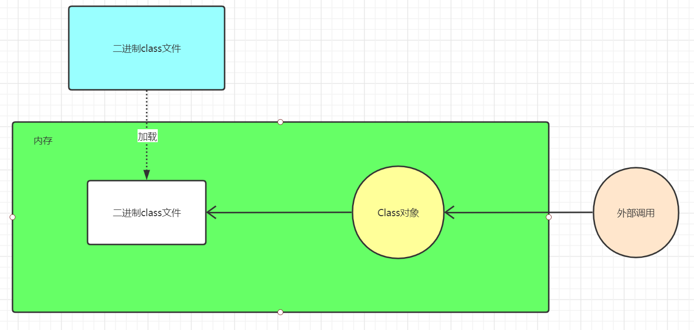
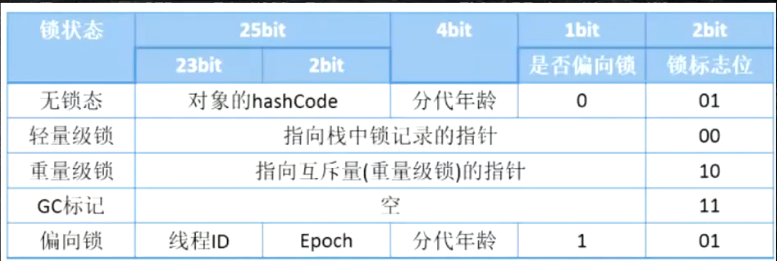
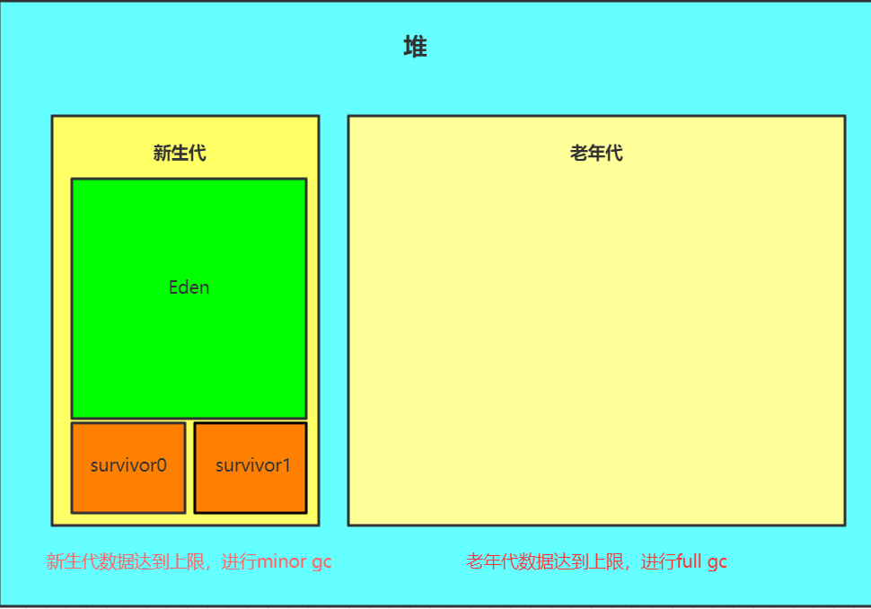
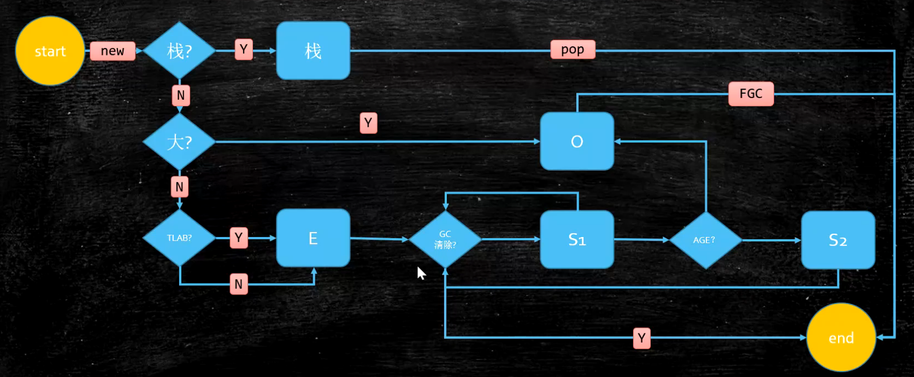
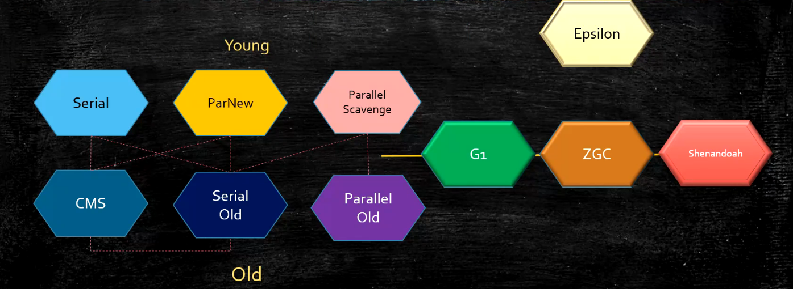

# JVM

## jvm是什么
java virtual machine，是一种规范，jvm主要由三大块组成
1.类加载子系统
2.运行时方法区
3.执行引擎

## 常用的JVM
常用的JVM有
HotSpot
老版的Jrockit
TaobaoVM
MicroSoft VM
LiquidVM

## JDK,JRE,JVM
JRE由JVM和核心类库构成
JDK由JRE和开发者工具构成

# Class文件
是一种二进制字节流

## 结构
**Magic Number - u4**
魔数，用于判断文件是否损坏，在class文件中是cafe babe（唯一标识符）
**Minor Version**
小版本号
**Major Version**
大版本号
**constant_pool_count - u2**
常量池大小，因为是无符号2字节，所以是16位，所以大小为65535
包含的信息：
标志tag
索引
类型

**constant_pool**
常量池具体实现，编号从1开始，所以常量池的数量是constant_pool_count - 1
**access_flags - u2**
修饰符
public 0x0001
final    0x0010
interface 0x0200
abstract  0x0400
annotation 0x2000
enum 0x4000
ACC_SYNTHETIC 0x1000，编译器生成
ACC_SUPER 0x0020，该标志位必须为真，JDK1.0.2之后编译的class均为真

全部属性相与就能得到最终的修饰符
**this_class - u2**
当前类名（指向常量池中的内容）
**super_class - u2**
父类名（指向常量池中的内容）
**interfaces_count - u2**
实现了几个接口
**interfaces**
具体实现的接口
**fields_count**
有几个属性

描述符索引
B - byte
C - char
D - double
F -float
I - int
J - long
S - short
Z - boolean
V - void
L - Object
数组[
**fields**
具体属性
**methods_count**
有几个方法
**methods**
具体方法
**attributes_count - u2**
几个附加属性
**attributes**
具体附加属性

## 观察bytecode的方式
1.javap -v [path]
2.JClassLib - IDEA插件

# 类加载器
## 加载过程
1.loading
2.linking
  1.verification
    检查加载到内存中的字节码的正确性(是否有CAFE BABE)
  2.preparation
    将类中的静态成员变量赋默认值
  3.resolution
    将符号引用解析为直接访问的地址
3.initializing

## loading
### ClassLoader

加载的时候实际上不仅将字节码原封不动放入内存外，还生成了一个Class类对象（metaspace中）指向那块内存区域，然后其他对象通过Class类对象去访问字节码文件

通过类的getClassLoader()方法可以获取对应的类加载
（1）启动类加载器（BootStrap ClassLoader）：用来加载java核心类，加载lib/rt.jar,lib/resources.jar等核心类。get的时候为null因为是C++实现的。
（2）扩展类加载器（Extension ClassLoader）：用来加载外部引入的jar包，即ext包下的jar。
（3）应用类加载器（Application ClassLoader）：用来加载应用程序内自己写的类，用户路径（classpath）下的类。

classLoader源码：
findCache -> parent.loadClass -> findClass
#### 双亲委派机制


千万注意双亲委派并不是继承关系，父加载器并不是父类。
每个classloader都有一个缓存，缓存着已经加载过的类，当接收到加载类的请求时，先去缓存中查询，找到就返回，找不到就去父加载器找，直到找到最顶层的bootstrap，如果bootstrap还找不到，就让Ext去加载，如果Ext加载成功，就返回，如果加载失败，让App去找，直到找到最先进来的那个类加载器，如果最终加载失败抛出ClassNotFoundException

总结：自底向上依次进行缓存查询，自顶向下依次尝试加载类

**为什么要有双亲委派机制**
为了安全，保证java的核心类库不被偷偷摸摸的改写，加载一个奇奇怪怪的类进去
如果没有双亲委派机制，就可以偷偷自定义一个和java核心类库中一模一样的类，然后覆盖原始类，打成jar包给客户使用的时候可以获取一些不正当的信息

### Launcher(1.8)/ClassLoaders(11)
Launcher/ClassLoaders中有ExtClassLoader和AppClassLoader
里面指定了
BootStrapClassLoader加载sun.boot.class.path
ExtClassLoader加载java.ext.dirs
AppClassLoader加载java.class.path

### 如何加载一个类
调用类加载器的loadClass方法

什么时候需要加载一个类？热部署

### 自定义类加载器（模板方法模式）
继承ClassLoader实现findClass方法，用defineClass转化成内存对象

#### 可以实现加密
防止别人用其他的classloader来load你的类

### 混合模式
解释器（bytecode intepreter）+及时编译器（JIT）

混合使用解释器 + 热点代码编译
起始阶段采用解释执行
热点代码检测：
  多次被调用的方法（方法计数器：监测方法执行频率）
  多次被调用的循环（回边计数器：检测循环执行频率）
  进行编译，编译成本地（native）代码

--Xmixed 默认为混合模式
--Xint 使用纯解释模式，启动快执行慢
--Xcomp 使用纯编译，启动慢执行快
--XX:CompileThreshold=10000

### lazyLoading
严格叫lazyInitializing，JVM并没有规定何时懒加载，只规定了何时初始化

### question
1.如何自定义父加载器？
ClassLoader构造方法中调用父类构造方法，默认的是通过无参构造方法创建的AppClassLoader

2.如何打破双亲委派机制？
因为双亲委派机制实质是模板方法的设计模式，它的loadclass方法中调用了父加载器并且loadclass方法是非final的，可以通过重写loadclass方法去打破双亲委派机制

3.何时打破？
Tomcat热部署，热启动的时候，需要加载同一类库的不同版本，如果使用双亲委派就无法加载,在加载前就已经从缓存中取出了
```java
    static class ClassL extends ClassLoader{
        @Override
        public Class<?> loadClass(String name) throws ClassNotFoundException {
            Class<?> ret = null;
            String path = "D:/Spring/untitled/target/classes/" + name.replace('.', '/').concat(".class");
            File file = new File(path);
            if(!file.exists())
                return super.loadClass(name);
            try {
                InputStream inputStream = new FileInputStream(file);
                byte [] b = new byte[inputStream.available()];
                inputStream.read(b);
                ret = defineClass(name,b,0,b.length);
            } catch (FileNotFoundException e) {
                e.printStackTrace();
            } catch (IOException e) {
                e.printStackTrace();
            }
            return ret;
        }
    }
```

## linking and initializing
### question
1.DCL（Double Check Loading）中已经有了synchronized锁为什么要加volatile？
因为synchronized只能保证线程互斥，而DCL中生成单例对象时，有一个new对象然后赋值给属性的一个过程，这一过程并不是原子操作，它分为三步，第一步分配空间给对象赋默认值，第二步进行初始化，第三步将引用指向初始化好的对象，如果线程一创建对象时发生了指令重排序，刚好执行了13步，还没执行第二步，线程二过来检测发现属性已经不为空了，就直接返回了，此时返回的对象是半初始化对象，属性全是默认值，还没进行初始化的赋值，所以要加volatile

# JMM
主要是规定了每个线程都有自己独享的工作内存，存储变量副本，并且通过对主内存的读写进行通讯，主内存中存储的是共享变量

## 存储器的层次结构

CPU内部
L0:寄存器
L1:高速缓存
L2:高速缓存

CPU共享
L3:高速缓存
L4:主存
L5:磁盘
L6: 远程文件存储

## 多线程一致性的硬件支持
老CPU实现通过总线锁

现代CPU使用 总线锁(缓存锁无法处理)+缓存锁保证硬件的缓存一致性
新型CPU使用各种协议保证数据一致性
像MESI（Intel）,MSI,MOSI等
缓存锁实现之一
M(Modified):有效数据，和主存数据不一致，数据存在CPU本地缓存
E(Exclusive):有效数据，CPU独享，数据存在CPU本地缓存
S(Shared):有效数据，CPU共享，和主存数据一致，数据存在CPU本地缓存
I(Invalid):无效数据，被其他CPU修改

## 缓存行
一个缓存行为64字节

利用缓存行做的优化，消除伪共享
```java
//Disrupter
    public static final long INITIAL_CURSOR_VALUE = Sequence.INITIAL_VALUE;
    protected long p1, p2, p3, p4, p5, p6, p7;
```
### question
1.伪共享？
位于同一缓存行的两个不同数据，被两个不同CPU锁定，产生互相影响的伪共享问题
解决：使用缓存行对齐，@Contended注解

## 指令重排
### 乱序问题
为了加快运行速度，会对指令进行优化，乱序执行，读指令的同时执行其他不影响当前指令的指令，写指令的同时进行合并写（WriteCombiningBuffer）（写入L2时可能由于新来的指令改变了写入L2的值，所以将两条指令合并计算最后结果写入）
两条指令无依赖关系，会乱序执行

### 合并写缓存
速度快于L1缓存，不过缓存只有4字节，非常珍贵

### 硬件级别下保证有序
**CPU内存屏障x86**
sfence(save fence):在sfence之前的写操作必须在之后的写操作前完成
lfence(load fence):在lfence前的读操作必须在lfence后的读操作前完成
mfence(memory fence):在mfence前的读写必须在mfence后的读写操作前完成

原子指令，如x86上的lock指令，锁定内存区域
**java内存屏障规范**
LoadLoad屏障：
对于语句 Load1;LoadLoad;Load2
Load1要在Load2前被读取
StoreStore屏障：
对于语句 Store1;StoreStore;Store2
Store1要在Store2执行前被刷新回内存
LoadStore屏障：
对于语句 Load1;LoadStore;Store2
Load1要在Store2前被读取
StoreLoad屏障：
对于语句 Store1;StoreLoad;Load2
Store1要在Load2前刷新回内存

### volatile实现细节
1.字节码
access_flag:ACC_VOLATILE
2.JVM
StoreStore
volatile 写
StoreLoad

LoadLoad
volatile 读
LoadStore

3.OS和硬件
windows使用lock指令去实现（每个系统具体实现都不一样）

### synchronized实现细节
1.字节码
access_flag:
方法前的synchronized：ACC_SYNCHRONIZED
代码块前的synchronized：
monitorenter/monitorexit

2.JVM
C/C++调用操作系统的同步方法

3.OS和硬件
x86：lock compxchg xxx

### as if serial
不管指令如何重排序，都保证单线程下的最终结果一致性

### 面试题
1.请解释一下对象创建的过程
如果说对象的类还未被加载，就需要进行类加载
①loading，将类装载到内存
②linking，对装载到内存中的类进行verification检查，是否符合Java文件标准，preparation准备，对类中的静态成员变量设置默认值，resolution解析，将符号引用改成具体的地址引用，也就是直接引用
③initialization，初始化，对类中静态成员变量进行初始化，执行类静态代码块
当对象的类被加载到内存中后，开始创建对象
①分配内存空间
②对对象属性设置默认值
③初始化对象，对对象赋初始值
  成员变量依次赋初始值
  调用构造方法

2.对象在内存中的存储布局(64位机器)
对象在内存中的存储布局分两种，一种是普通对象，一种是数组对象
对于普通对象，它在内存中的分布为
①对象头markword 8字节
②klass pointer 指向类对象的指针 4字节（如果-XX: +UseCompressClassPointers 开启，为4字节，不开为8字节）
③实例数据
  对于基础类型，byte 1 字节，boolean （不一定，《Java虚拟机规范》中说，按照规范是4字节，数组1字节，但是具体还是要看虚拟机实现），short 2字节，int 4字节，float 4字节，long 8字节，double 8字节，char 2字节，如果是引用类型，要看-XX:UseCompressOops是否开启，默认开启时引用类型为4字节，正常为8字节
④padding对齐 为8字节的倍数

对于数组对象，它在内存中的分布为
①对象头markword 8字节
②klass pointer 指向类对象的指针 4字节
③数组大小 4字节
④数组实例数据
⑤padding对齐 为8字节的倍数

ps：Oops：Ordinary Object Pointers
3.对象头具体包括些什么？
一共64位，里面有GC标记，分代年龄，锁状态，hashcode不调用不存储，如果hashcode方法被重写了就用重写的值，如果未被重写，就根据内存布局去计算（System.identityHashCode）
当一个对象已经计算过identityHashCode，就无法进入偏向锁状态

32位图

64位图

| 锁状态 | 25bit  | 31bit    | 1bit   | 4bit | 1bit（是否偏向锁） | 2bit（锁标志位） |
| ------ | ------ | -------- | ------ | ---- | ------------------ | ---------------- |
| 无锁态 | unused | hashCode | unused | age  | 0                  | 01               |

| 锁状态 | 54bit      | 2bit  | 1bit   | 4bit | 1bit(是否偏向锁) | 2bit（锁标志位） |
| ------ | ---------- | ----- | ------ | ---- | ---------------- | ---------------- |
| 偏向锁 | javaThread | Epoch | unused | age  | 1                | 01               |

| 锁状态   | 62位                                   | 2bit（锁标志位） |
| -------- | -------------------------------------- | ---------------- |
| 轻量级锁 | 指向线程栈中记录的指针（非内核锁）     | 00               |
| 重量级锁 | 指向互斥量（重量级锁）的指针（内核锁） | 10               |
| GC标记   | 看具体GC实现                           | 11               |

ps：关于 epoch，真正理解 epoch 的概念比较复杂，这里简单理解，就是 epoch 的值可以作为一种检测偏向锁有效性的时间戳	

ps：为什么GC年龄默认是15，因为对象头中只有4位表示它

ps:在hotSpot中，如果调用一个对象的hash方法或者System.identityHashCode方法，由于偏向锁和轻量级锁在对象头（markword）中没有存储hashcode的位置，会导致锁升级成重量级锁

4.对象怎么定位
①句柄池
ps：句柄池就是指定位时在堆中开辟一块空间存放具体对象指针和方法区类数据指针，引用类型通过句柄去访问对应的对象
②直接指针（hotspot使用）
ps：就是指引用类型直接访问的堆中对象，如果需要取到对象在方法区中的类数据信息，需要通过对象中的KlassPointer去访问

5.对象怎么分配
 [对象分配过程](#对象分配过程)

6.Object = new Object在内存中占用多少字节？
16字节

7.类的生命周期
加载链接初始化使用卸载

### HotSpot开启内存压缩的规则（64位机）
1.4G以下，砍掉高32位
2.4G - 32G，默认开启
3.32G以上，使用64位

# 运行时方法区
## 构成（来源：JVMS13）
**PC（程序计数器）**
> 每个线程都有它自己的PC，用于存放下一条指令的位置

**JVM stack（java虚拟机栈）**
> 每个线程都有它自己的栈，栈中存放的是栈帧（frames），每个方法都是一个栈帧 

栈帧（Frame）
> 存储数据和中间结果，也表现为动态链接，返回值和分发异常
> 局部变量表
> 操作数栈
> 动态链接：指向运行时常量池的方法引用。当类被编译成字节码时，方法A引用方法B用的引用是符号引用，引用到的是常量池中的某个位置，当JVM运行后，class常量池变成运行时常量池，如果方法A第一次调用到方法B，就会将方法A中的符号引用进行解析，改成直接引用，以后再进来就不用再次解析了
> 返回地址：返回方法被调用的那个位置，那个点，返回值会放在调用方法时的栈顶

**native method stack（本地方法栈 JNI）**
> 每个线程都有它自己的本地方法栈，本地方法的栈（C/C ++写的那种方法）

**heap（堆）**
> 存放的是对象实例，线程共享

**method area（方法区）**
> 方法区是逻辑概念，具体实现是1.8前是永久代（Permanent Generation），1.8后是metaspace
> 1.8前字符串常量池位于永久代，FGC不会清理永久代，如果动态产生了很多类，会产生OOM，大小启动的时候指定，不会变
> 1.8后字符串常量池位于堆，会触发FGC清理，不设定（受限于物理内存）
> 存放每个类的结构信息，运行时常量池，线程共享

问题：如何证明1.7前字符串常量池位于永久代，1.7后字符串常量池位于堆？
在JDK1.7之前无限创建字符串常量，产生OOM:java permgen space，1.7之后无限创建产生OOM:Java heap space

**Direct Memory（jdk1.4之后添加 直接内存 NIO，非java虚拟机中的内存）**
> JVM可以直接访问的内核空间的内存（操作系统管理的内存）
> NIO，ZERO COPY

## 思考
1.为什么每个线程都必须要有自己的PC？
因为线程切换的原因，当我线程切换回来的时候需要知道自己运行到了哪个位置

## 指令
### putstatic
putstatic + 符号引用：会从栈中弹出一个值赋值给对应常量池中静态成员变量

### putfield
putfield + 符号引用：会从堆栈中弹出两个值，远离栈顶的值会被赋值为靠近栈顶的值，因为虽然知道了符号引用在哪，但是没法确定要赋值给哪个具体的实例对象

### invokespecial
invokespecial + 符号引用:会从栈中弹出n个值（包含具体实例对象）执行对应的方法
指的是可以直接定位的，不用多态的方法（private和构造方法，final虽然不是多态但是用的是invokevirtual）

### invokestatic
invokestatic + 符号引用:会从栈中弹出n个值执行对应的静态方法

### invokevirtual
invokevirtual + 符号引用:会从栈中弹出n（包含具体实例对象）个值执行对应的方法

### invokedynamic
使用lambda表达式或者反射或者CGLIB等类似的动态产生的class，会使用

## 垃圾回收
### 判断可用对象（垃圾定位算法）
#### 引用计数法
特点：如果一个对象被引用，就会给计数器+1，如果计数器减为0，就代表对象无用
缺点：无法处理循环依赖

#### GC Root（可达性分析）
特点：从GC Root开始向下搜索，未被搜索到的对象就是无用对象
> GC Root:主要分为JVM栈中引用的对象，本地方法栈中引用的对象，方法区静态变量引用的对象，方法区中运行时常量池引用的对象

### 垃圾回收算法
#### 标记清除（mark-sweep）
找到可回收对象，然后直接清除对应的内存空间
特点：存活对象较多的情况下效率高
缺点：两遍扫描，效率偏低，容易产生碎片

#### 复制（copying）
分为两块内存，将有数据的那块的存活对象找出来，然后复制到无数据的那块，然后将有数据那块全部清除
特点：没有碎片，单次扫描，速度快，适用于存活对象较少的情况
缺点：移动复制对象，需要调整对象引用，空间浪费

#### 标记整理（mark-compact）
标记无用对象，让存活对象靠一端移动，然后堆剩余空间进行清理
特点：不会产生碎片，方便对象分配，不会产生内存减半
缺点：扫描两次，移动对象，效率偏低，需要调整对象引用

### 堆内存逻辑分区（不适用不分代垃圾收集器）


新生代老年代比例1：2，eden和survivor 8：1：1

#### 分代回收
新生代使用复制算法，老年代使用标记清除/整理算法
> 除Epsilon,ZGC,Shenandoah之外的GC都是使用逻辑分代模型
> G1是逻辑分代，物理不分代

#### 栈上分配
> 线程私有小对象
> 无逃逸（只在某段代码中使用，出了这段代码就没人用了）
> 可以标量替换（用基本数据类型替换整个对象）
> 无需调整

#### 线程本地分配 TLAB（Thread Local Allocate Buffer）
每个线程都有自己的一个本地区域

> 占用eden，默认1%
> 多线程的时候不用竞争eden就可以申请空间，提高效率
> 小对象
> 无需调整

#### GC概念
MinorGC/YGC:年轻代（new/yong）空间耗尽
MajorGC/FullGC：老年代（tenured/old）空间耗尽，新生代老年代同时回收

**参数设置**
> -Xmn新生代大小
> -Xss线程栈大小
> -Xmx最大堆大小
> -Xms初始堆大小

#### <a name="对象分配过程">对象何时进入老年代</a>

1.超过-XX:MaxTenuringThreshold指定次数
-Parallel Scavenge 15
-CMS 6
-G1 15

2.动态年龄
- s1+eden  - > s2 超过 s2的50%时，hotspot会从小到大累加计算刚好超出50%时的年龄的阈值，然后将那个年龄阈值和参数阈值比较取最小，年龄大于等于那个阈值的将进入老年代
> -XX:TargetSurvivorRatio:默认为50% 

#### 空间分配担保
YGC期间survivor区空间不够了，就会把空间不够的那部分对象直接扔到老年代

#### java GC命令行相关参数
> -XX:MaxTenuringThreshold：配置分代年龄
> -XX:-DoEscapeAnalysis：去除逃逸分析
> -XX:-EliminateAllocations：去掉标量替换
> -XX:-UseTLAB:关闭线程本地分配
> -XX:+PrintFlagsFinal：显示所有参数 windows中用find过滤选项，linux中用grep

### 常见的垃圾回收器

1.Serial
串行（单线程）执行，产生STW（在safe point上停止），使用复制算法
2.ParNew
并行（多线程）执行，使用复制算法，做了一些增强让它可以与CMS配合使用
3.Parallel Scavenge
并行（多线程）执行，使用复制算法，可以设置停顿时间和时间比例来提高吞吐量
4.Serial Old
Serial的老年代版本，使用标记整理算法
5.Parallel old
Parallel Scanvage的老年代版本，使用标记整理算法
6.CMS（Concurrent Mark Sweep）
回收的时候能同时产生新垃圾，使用标记清除算法，响应时间优先
并发标记算法：三色标记 + Incremental Update
7.G1(10ms)
并发标记算法：三色标记 + SATB
8.ZGC(1ms)
并发标记算法：ColoredPointers + 写屏障
9.Shenandoah
并发标记算法：ColoredPointers + 读屏障
10.Eplison
debug用的

#### 垃圾收集器跟内存大小的关系
1.serial 几十兆
2.PS 上百兆-几个G
3.CMS 20G
4.G1 上百G
5.ZGC - 4T - 16T

#### 常用的垃圾回收器的组合
1.-XX:+UseSerialGC: Serial + Serial Old
2.-XX:+UseParallelGC: Parallel Scavenage + Serial Old
3.-XX:+UseParallelOldGC: Parallel Scavenage + Parallel Old
4.-XX:+UseParNewGC: ParNew + Serial Old
5.-XX:+UseConc(urrent)MarkSweepGC: ParNew + (CMS + Serial Old)
6.-XX:+UseG1GC:G1

#### CMS
**执行过程-四个阶段**
1.初始标记：单线程标记根对象,STW
2.并发标记：标记可达对象
3.重新标记：多线程并行标记在并发标记过程中新产生的垃圾，或者原本是垃圾的重新被拾起来，STW
4.并发清理：这个阶段产生的垃圾叫浮动垃圾，只能等下一次CMS处理

##### CMS的问题
1.Promotion Failed
> 指发生Minor GC后，Survivor放不下，对象放入老年代，老年代也放不下，就会让Serial Old工作，对内存进行压缩，会产生产生长时间的STW，多由于空间未压缩（内存碎片话）产生

如何解决 ：
-XX:UseCMSCompactAtFullCollection
-XX:CMSFullGCsBeforeCompaction
指每隔多少次FullGC进行压缩，减少碎片化空间

2.Concurrent Mode Failure
> CMS的垃圾清理和引用线程是并行进行的，如果在并行清理的过程中老年代的空间不足以容纳应用产生的垃圾

如何解决 ：
①-XX:CMSInitiatingOccupancyFraction 默认68/92%（1.5/1.6），表示到达多少空间才会进行FGC，降低这个阈值保持老年代足够的空间
②-XX:UseCMSCompactAtFullCollection
-XX:CMSFullGCsBeforeCompaction
指每隔多少次FullGC进行压缩，减少碎片化空间
③晋升阈值过小，survivor和eden过小

#### 并发标记（Concurrent Mark）阶段的算法
CMS：三色标记 + Incremental Update
G1：三色标记 + SATB（Snapshot at the begining）
ZGC：ColoredPointer

#### 问题
1.ParNew和Parallel的区别？
ParNew能配合CMS使用，响应时间优先，减少STW的次数
Parallel Scanvage吞吐量优先，可以设置停顿时间和时间占比来提高吞吐量

### JVM调优
**HotSpot参数分类**
> 标准： -开头，所有HotSpot都支持
> 非标准： -X开头，特定版本支持
> 不稳定：-XX开头，下版本可能取消

**常用参数**
1.java -XX:PrintCommandLineFlags
显示启动参数
2.java -Xmn10M -Xms40M -Xmx60M
设置新生代大小，最小堆大小最大堆大小（最好设置成一样的，不要让堆有弹性浪费性能）
3.java -XX:+PrintGC -XX:+PrintGCTimeStamps -XX:+PrintGCDetails -XX:PrintGCCause
打印GC回收的信息，打印GC时间戳，打印GC细节，打印GC回收原因（默认true）
4.java -XX:+PrintFlagsFinal 
最终参数值
5.java -XX:+PrintFlagsInitial
默认参数值

#### GC日志
```java
[GC (Allocation Failure) [PSYoungGen: 24103K->943K(29696K)] 24103K->21431K(98304K), 0.0068764 secs] [Times: user=0.00 sys=0.00, real=0.01 secs] 
```
> GC：未标明Full GC就是minor GC
> Allocation Failure：GC 原因
> PSYoungGen:垃圾收集器类型
> 24103K->943K(29696K)：新生代GC前->GC后（总新生代大小）
> 24103K->21431K(98304K)：堆GC前->GC后（总堆大小）
> 0.0068764 secs：总用时
> Times: user=0.00 sys=0.00, real=0.01 secs：用户态所占时间，内核态所占时间，总时间

产生OOM之后会把heap 信息dump出来
```java
Heap
 PSYoungGen      total 29696K, used 21108K [0x00000000fdf00000, 0x0000000100000000, 0x0000000100000000)
  eden space 25600K, 82% used [0x00000000fdf00000,0x00000000ff39d388,0x00000000ff800000)
  from space 4096K, 0% used [0x00000000ff800000,0x00000000ff800000,0x00000000ffc00000)
  to   space 4096K, 0% used [0x00000000ffc00000,0x00000000ffc00000,0x0000000100000000)
 ParOldGen       total 68608K, used 62026K [0x00000000f9c00000, 0x00000000fdf00000, 0x00000000fdf00000)
  object space 68608K, 90% used [0x00000000f9c00000,0x00000000fd8928b8,0x00000000fdf00000)
 Metaspace       used 3090K, capacity 4556K, committed 4864K, reserved 1056768K
  class space    used 326K, capacity 392K, committed 512K, reserved 1048576K
```
total = eden + 1个survivor

eden space 25600K, 82% used [0x00000000fdf00000,0x00000000ff39d388,0x00000000ff800000)
> 表示内存地址：起始地址，使用空间结束地址，整体空间结束地址

Metaspace       used 3090K, capacity 4556K, committed 4864K, reserved 1056768K
> 表示 真正使用的大小，整个metaspace的容量，虚拟内存占用，虚拟内存保留

#### 调优前的基础概念
**吞吐量（throughput）**
指的是用户代码执行时间占总时间的比重
总时间 = 用户代码执行时间 + 垃圾回收时间

**响应时间（response time）**
指的是响应用户的速度，STW越短响应时间越快

PS：调优追求的标准，是吞吐量优先还是响应时间优先

PS：吞吐量优先：科学计算，数据挖掘（PS + PO）
响应时间优先：网站，GUI，API（1.8 G1）

#### 什么是调优
1.根据需求进行JVM规划和预调优
2.优化运行JVM运行环境（慢，卡顿）
3.解决JVM运行过程中出现的各种问题

**专业术语**
QPS（Qureies）:每秒多少查询
PPS（Page view）:每秒多少页面访问
TPS（Transaction）:每秒多少事务（百万并发聊的是这个）
#### 预规划
步骤：
1.熟悉业务场景，选择垃圾回收器（响应时间优先还是吞吐量）
2.计算内存需求
3.选定CPU（越高越好，CPU强的回收快）
4.设定年代大小，晋升阈值
5.设定日志参数
> -Xloggc:/opt/xxx/logs/xxx-xxx-gc-%t.log -XX:+UseGCLogFileRotation -XX:NumberOfGCLogFiles=5 -XX:GCLogFileSize=20M -XX:+PrintGCDetails -XX:+PrintGCDateStamps -XX:+PrintGCCause
> 或者每天产生一个日志文件

6.观察日志情况

##### 案例1：垂直电商（只卖一类产品），最高每日百万订单，处理订单系统需要什么样的服务器配置？
算他百万订单在高峰时间段2小时内产生72w订单，一小时36w订单，一秒100订单，可能一小时中有个巅峰点为1000订单/秒，要根据这个去算
如果要计算的话，需要去计算一个订单产生需要多少内存，按照512K来算，新生代500M内存就够了，只多不少
根据压力测试，要求响应时间在100ms以下

挑一个市面上性价比高的服务器拿过来做压测，不行就加CPU扩内存，再不行就上云

##### 案例2：12306遭遇春节大规模抢票如何支持？
CDN加速服务器 -> LVS负载均衡 -> NGINX负载均衡 -> 业务系统 -> 每台机器1w并发（Redis能撑住） 用100台机器
12306可能使用的模型：下单 -> 减库存 和 订单（redis kafka）同时异步进行 -> 等付款，付款完成就会持久化最终的数据
大流量的处理方法：分而治之

#### 优化环境
1.有一个50W PV（Page View）的资料类网站（从磁盘提取文档到内存）原服务器32位，1.5G的堆内存，用户反馈网站比较缓慢，因此公司决定升级，新的服务器为64位，16G堆内存，结果用户反馈卡顿十分严重反而比以前效率更低了，为什么？
①1.5G为什么慢？
频繁GC，产生STW，响应时间慢
②为什么会更卡顿？
内存越大，FGC时间越长
③如何处理？
文档不走JVM（更好）
换GC：PS -> PN + CMS 或者 G1

2.系统CPU经常100%如何调优（HotSpot）
CPU100%，那么一定有线程在占用系统资源
①找出哪个进程CPU高（top）
②该进程中的哪个线程CPU高（top -Hp）
③如果Java程序，导出该线程的堆栈（jstack）
④查找哪个栈帧消耗时间（jstack）

3.系统内存飙高如何查找问题（HotSpot）
①导出堆内存（jmap）
②分析（jhat jvisualvm mat jprofiler...）

4.如何监控JVM
jstat jvisualvm jprofiler athas top ...

#### 风控案例
```java
public class FullGC_Problem01 {
    private static class CardInfo {
        BigDecimal price = new BigDecimal(0.0);
        String name = "张三";
        int age = 5;
        Date birthdate = new Date();

        public void m() {

        }
    }

    private static ScheduledThreadPoolExecutor executor = new ScheduledThreadPoolExecutor(50,
            new ThreadPoolExecutor.DiscardOldestPolicy());

    public static void main(String[] args) throws Exception {
        executor.setMaximumPoolSize(50);

        for (;;){
            modelFit();
            Thread.sleep(100);
        }
    }

    private static void modelFit(){
        List<CardInfo> taskList = getAllCardInfo();
        taskList.forEach(info -> {
            // do something
            executor.scheduleWithFixedDelay(() -> {
                //do sth with info
                info.m();

            }, 2, 3, TimeUnit.SECONDS);
        });
    }

    private static List<CardInfo> getAllCardInfo(){
        List<CardInfo> taskList = new ArrayList<>();

        for (int i = 0; i < 100; i++) {
            CardInfo ci = new CardInfo();
            taskList.add(ci);
        }

        return taskList;
    }
}
```

1.首先通过top找到cpu较高的进程PID
2.然后通过top -hp xxxx 找到进程中使用最高的线程（因为肯定是这条线程在执行导致过高）
3.然后用jstack指令dump出线程堆栈，根据线程名称去找到对应线程（这也就是为什么要设置线程ID，方便查找问题）

ps:
jps指令，查看当前java进程
jinfo指令，查看当前java进程信息
jstat -gc [pid]  [time]指令，查看gc状态的指令
jconsole指令，调出java控制台（图形界面）

#### jconsole远程连接
1.程序中加入启动参数打开JMX（Java Management Extensions）协议
java -Djava.rmi.server.hostname=xxx.xxx.xx.xx -Dcom.sun.management.jmxremote
-Dcom.sun.management.jmxremote.port=xxxxx
-Dcom.sun.management.jmxremote.authenticate=false
-Dcom.sun.management.jmxremote.ssl=false

2.通过jconsole调出控制台，进行远程连接

ps：关闭linux的防火墙（实战打开对应端口）
如果遭遇Local host name unknown : XXX，设置hosts文件
