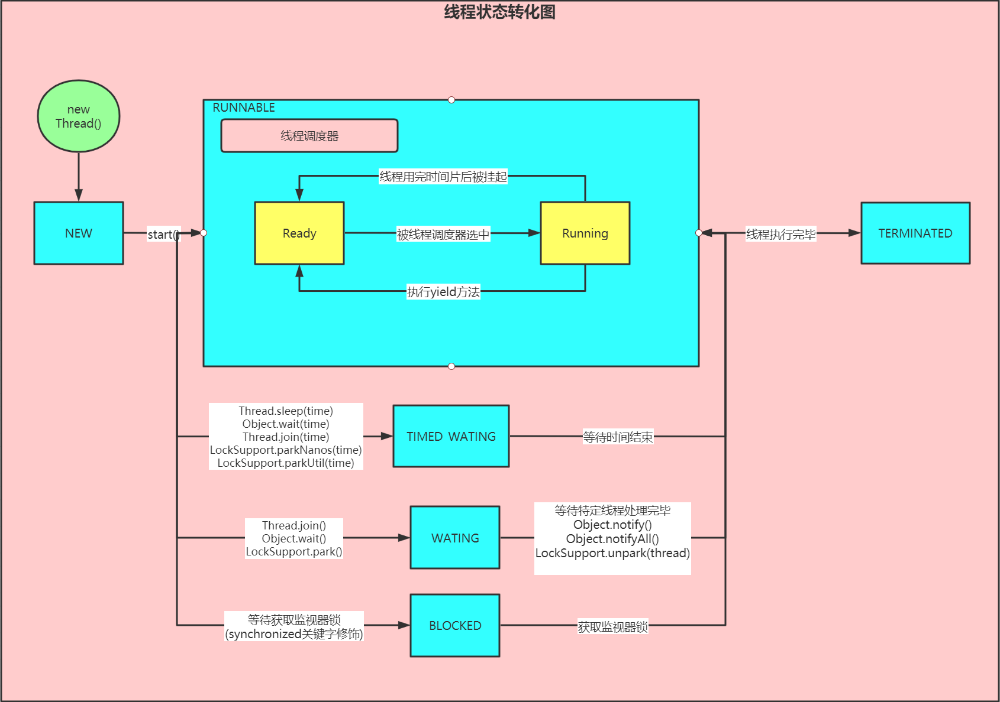
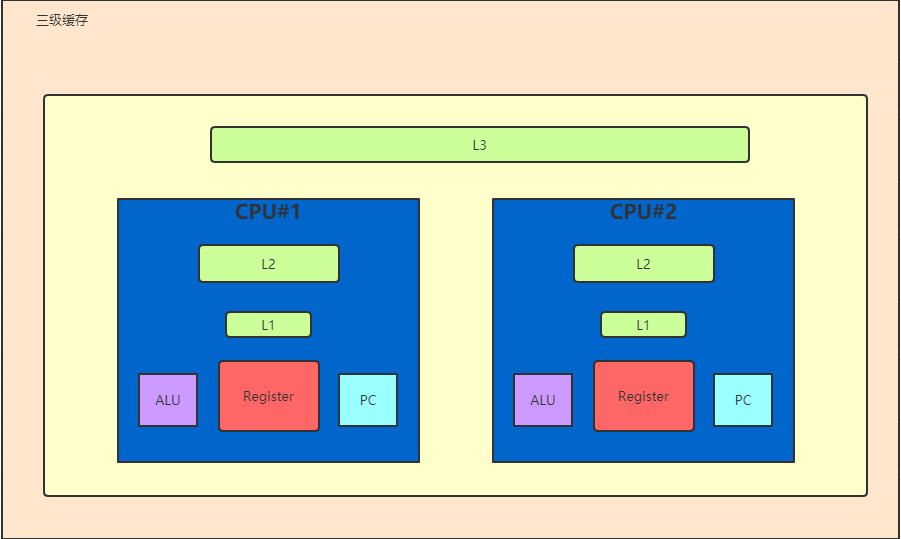

[TOC]
# 多线程
## 线程基础知识
### 什么是进程，线程，纤程/协程，程序？
1.进程就是运行在电脑上的程序，是操作系统进行资源分配的最小单位，一个程序可以在电脑上运行多份，也就是说一个程序对应多个进程

2.线程是cpu调度执行的最小单位，一个进程有多个线程

3.纤程/协程是绿色线程，一个线程有多个纤程，它不被操作系统管理，由程序自己管理

4.程序是一个磁盘上的可执行文件

### 线程的上下文切换过程
有T1，T2两个线程，T1线程执行到cpu时间片结束，被挂起，此时将T1线程的信息存储到缓存中，然后执行T2的内容，等到T2用完了时间片，再从缓存中读取T1信息，继续在cpu中运行

### 单核CPU设定多线程是否有意义？
有意义，当线程运行时，有时候会进行io操作，需要等待用户输入（会进入等待状态，不消耗cpu），此时如果使用多线程的话就可以充分利用cpu资源

### 线程数是不是设置的越大越好？
不是，因为线程间的切换也需要消耗资源

### 线程数量设置多少最为合适？
具体问题具体分析，根据cpu计算能力来设置，通过压力测试找到合适数。

公式为`$N_{threads} = N_{cpu} * U{cpu} * (1 + W / C)$`

即 `$线程数 = cpu核数 * cpu期望利用率[0-1] * （1 + 等待时间 / 计算[cpu使用]时间）$`

如何获取W和C？
使用Profiler（性能分析工具），本地使用JProfiler，服务器可以使用Arthas

## 线程实践
### 创建线程的五种方法
1.继承Thread类，重写run方法

2.实现Runnable接口，重写run方法

3.callable接口，重写call方法，装载到FuntureTask中，使用new Thread执行

4.lamda表达式

5.executors创建线程池，实现execute方法或者submit方法，通过future去获取计算返回值

------------------------------------------
1.new MyThread().start()

2.new Thread(runnable).start()

3.new Thread(lamda).start()

4.ThreadPool

5.FutureTask Callable
#### 使用runnable好还是thread好？
java是单继承多实现的语言，使用runnable更好

## 线程状态
### 线程的六种状态
1.NEW

线程被创建完成，未调用start方法

2.RUNNABLE

线程处于可运行状态（可能是ready状态也可能是running状态）

3.BLOCK

线程处于阻塞状态，等待锁

4.WAITING

线程处于等待状态需要被notify,notifyAll等方法唤醒

5.TIMED_WATING

线程处于等待状态需要等待时间结束自动唤醒

6.TERMINATED

线程处于终止状态

### 线程状态转化图


## 线程的打断（interrupt）
### 相关方法
1.interrupt()

打断某个线程（设置标志位，默认为false）等待处理

2.isInterrupted()

查询某个线程是否被打断（查询标志位）

3.static interruptted()

查询当前线程是否被打断，并重置

### interrupt()与sleep(),wait(),join()
在sleep(),wait(),join()方法执行过程中，线程被设置标志位后，会抛出InterruptedException异常，并且系统会重置标志位

### interrupt()与synchronized修饰符， lock.lock()
不会有反应，但是使用lockInterruptibly()方法可以监视标志位是否改变并且抛出异常

### 面试题：如何优雅的结束线程？
1.调用stop方法（不推荐，废弃方法）（过于粗暴，会无脑释放所有锁，会产生数据不一致的问题）

2.调用suspend和resume方法（不推荐，废弃方法）（过于粗暴，suspend会无脑保持所有锁，会产生死锁）

3.violatile 变量控制线程结束

4.interrupt 结束线程

## 锁
### synchronized
synchronized加在方法前和synchronized(this)包住整个方法体等效
如果是静态方法synchronized加在方法前和synchronized(X.class)包住整个方法体等效
加了synchronized就无须加volatile，因为synchronized保证了可见性和原子性

**对象头**
对象中除了存有本身信息，还会有个对象头的信息，对象头中记录了markword和类型指针，markdown中标记了当前对象锁信息和偏向锁的id

**注意**
synchronized不能锁String常量，Integer，Long

#### 性质
是可重入锁（当同一线程去获取同一把锁时可以重复获取，不然会出现死锁问题）

#### 题目
1.模拟银行账户，对业务读方法加锁，对业务写方法不加锁，可行吗？
看业务逻辑，如果脏读不影响整体逻辑，就无所谓，不然就不行

#### 异常和锁
如果出现异常，默认锁会被释放

#### 偏向锁，自旋锁，重量级锁
1.偏向锁
当线程去获取对象锁的时候，如果是第一个访问该对象的线程，会在对象头中记录锁为偏向锁，并且设置线程ID，等下一次同线程访问的时候可以直接访问，而不同线程访问的时候不允许访问

2.自旋锁
如果能请求到对象锁就执行，如果不能请求到锁就自旋等待，等待锁的时间内会占用CPU资源

3.重量级锁
进入等待队列去操作系统内核请求分配一把锁，开销较大，会导致用户态和内核态的切换，不占用CPU资源

#### 底层实现
JDK早期 重量级（每次去OS申请锁）
后来（1.6之后）改进：锁升级（无法降级）（1.8某个版本加入了偏向锁）

Hotspot实现：
当sync (Object),会在对象头中用markword记录线程ID和锁类型（偏向锁）
如果线程争用，升级为自旋锁（占用CPU，不访问操作系统）
自旋到一定值（10）或者自旋锁数量达到阈值（自旋线程超过cpu内核数一半），升级为重量级锁（不占用CPU，访问操作系统）

ps：锁的选择：执行时间长用重量级锁，短的并且线程数少用自旋锁

#### 锁重入机制
每个对象都有一个monitor，线程去请求这个对象的锁时，会去看monitor计数器是否为0，如果为0线程就持有该对象，如果不为0就去判断是否为当前线程持有，如果持有就将monitor计数器-1，不然就等待

# 并发编程的三大特性
## 可见性（visibility）
保证在线程中运行的变量对所有线程可见
### volatile
使用volatile保证属性可见（主要的工作是每次用到volitile的属性时都从主内存读，而不是从线程缓存中读）
volatile修饰引用类型，引用类型内部属性更改对其他线程不可见
ps:某些语句操作的时候会触发缓存同步

### 三级缓存



### 缓存行
一次读64字节（Byte），CPU之间通过缓存一致性协议去保持一致

**使用**
LinkedBlockingQueue
Disruptor(单机效率最高的MQ)中有用到缓存行对齐

**1.8时使用@Contended来保证数据不在同一行，只有1.8起作用，使用时要指定-XX:-RestrictContended**

### 题目
1.volatile作用
①保证线程可见性
总线嗅探和缓存一致性协议（Modified,Exclusive,Shared,Invalid）
（ps：总线嗅探：通过对总线上的数据进行嗅探检查自己缓存数据是否有效，如果无效，就将自己的缓存的数据状态改成Invalid，过多的使用volatile会导致cpu做过多的嗅探和CAS，导致总线带宽达到峰值，造成风暴）
②防止指令重排序


## 有序性（ordering）
### 乱序的验证
```java
//乱序代码
public class Test {
    static int a;
    static int b;
    static int x;
    static int y;

    public static void main(String[] args) throws InterruptedException {
        int i = 0;
        while (true) {
            a = 0;
            b = 0;
            x = 0;
            y = 0;
            CountDownLatch countDownLatch = new CountDownLatch(2);
            new Thread(new Runnable() {
                @Override
                public void run() {
                    a = 1;
                    y = b;
                    countDownLatch.countDown();
                }
            }).start();
            new Thread(new Runnable() {
                @Override
                public void run() {
                    b = 1;
                    x = a;
                    countDownLatch.countDown();
                }
            }).start();
            countDownLatch.await();
            i++;
            if (x == 0 && y == 0) {
                System.out.println("第" + i + "次");
                break;
            }
        }
    }
}
```
### 为什么会存在乱序
cpu去内存读取数据的时候，可能先做一些本地的操作，在不影响单线程最终一致性的情况下，先执行某些语句

### 创建对象
```
0 new #2 <java/lang/Object> //申请空间
3 dup
4 invokespecial #1 <java/lang/Object.<init>> //初始化
7 astore_1   // 连接
8 return
```

### this对象逸出
在执行对象初始化时进行this对象的调用，由于指令重排序，47重排，可能会找到还未被初始化好的值，这件事情警告我们千万不要在初始化方法中启动线程（调用start方法）

## 原子性（atomicity）

# 线程池
## 常用线程池体系结构
1.Executor:线程池顶级接口，定义了execute方法
2.ExecutorService:线程池次级接口，扩展Executor接口，在Executor基础上增加了线程池的服务
3.ScheduledExecutorService:扩展ExecutorService接口，增加定时任务
4.AbstractExecutorService:抽象类，实现了一部分方法，运用了模板方法的设计模式
5.ThreadPoolExecutor:普通线程池
6.ScheduledThreadPoolExecutor:定时任务线程池
7.ForkJoinPool:java7新增线程池，基于工作窃取（work-stealing）理论实现，拆分大任务变成小任务，分部运算，得到结果
7.Excutors:线程池工具类，定义了一些操作线程池的方法

### Future的意义
主要用来控制线程，控制线程执行，取消，获取线程执行结果

### ExecutorService
给线程池提供一些基础服务
```java
void shutdown();
List<Runnable> shutdownNow();
boolean isShutdown();
<T> Future<T> submit(Callable<T> task);
```
### AbstractExecutorService
定义一些模板方法，实现了对线程池中线程的启动和关闭

**invokeAll()** 
执行所有任务

ps：调用invokeAll方法时如果时间给的很短，会导致所有的任务取消，所以会有一些任务没有执行的返回值

**invokeAny()**

只要有一个完成，就完成任务

**cancelAll()**
jdk11中出现，打断所有正在运行的线程

**ExecutorCompletionService**
当任务完成后或抛出异常后或被中断后，将Future类型的实例放入到completionQueue中
通过poll可以取到最先完成的任务

### ThreadPoolExecutor
线程池的组成：线程容器，任务队列（BlockingQueue）（如果没有指定大小，就是无限大小），创建线程的工厂（threadFactory），核心线程数（corePoolSize）（长期占有机器资源），最大线程数（maximumPoolSize）（最大线程数=核心线程数+临时线程数），keepAliveTime（临时线程，不需要的时候释放资源）等待时间，TimeUnit 时间单位，RejectExecutionHandler 拒绝执行处理器（任务队列满的时候要执行什么策略）

**构造函数**
```java
public ThreadPoolExecutor(int corePoolSize,
                     int maximumPoolSize,
                     long keepAliveTime,
                     TimeUnit unit,
                     BlockingQueue<Runnable> workQueue,
                     ThreadFactory threadFactory,
                     RejectedExecutionHandler handler)
```

**ThreadFactory（interface）**
创建线程

**RejectExecutionHandler（interface）**
当workQueue未设置容量，永远不会产生RejectExecutionHandler

策略模式，当任务数量 > `maximumPoolSize + workQueue.size()`,拒绝任务处理器，四种拒绝策略

1.ThreadPoolExecutor.AbortPolicy
终止策略（默认）：死给你看，抛出RejectedExecutionException异常

2.ThreadPoolExecutor.CallerRunsPolicy
呼叫者自处理策略：自己玩去（背压：用消费者抑制生产者的生产水平）

3.ThreadPoolExecutor.DiscardPolicy
丢弃策略：全给你丢完

4.ThreadPoolExecutor.DiscardOldestPolicy
丢弃老的策略：老的不用了，把最前面没执行的干掉，你去排队

**BlockingQueue（interface）**
生产者消费者模型（线程安全）,定义了阻塞队列的增删改查
阻塞队列：当存的时候，如果队列满，就阻塞，当取的时候，如果队列空，就阻塞

**==DefaultThreadFactory==**
1.创建的线程是不是守护线程，如果没有设置，默认是守护线程
2.默认的权限是正常权限NORM_PRIORITY=5

```java
//src
//class: Executors
    static class DefaultThreadFactory implements ThreadFactory {
        private static final AtomicInteger poolNumber = new AtomicInteger(1);
        private final ThreadGroup group;
        private final AtomicInteger threadNumber = new AtomicInteger(1);
        private final String namePrefix;

        DefaultThreadFactory() {
            SecurityManager s = System.getSecurityManager();
            group = (s != null) ? s.getThreadGroup() :
                                  Thread.currentThread().getThreadGroup();
            namePrefix = "pool-" +
                          poolNumber.getAndIncrement() +
                         "-thread-";
        }

        public Thread newThread(Runnable r) {
            Thread t = new Thread(group, r,
                                  namePrefix + threadNumber.getAndIncrement(),
                                  0);
            if (t.isDaemon())
                t.setDaemon(false);
            if (t.getPriority() != Thread.NORM_PRIORITY)
                t.setPriority(Thread.NORM_PRIORITY);
            return t;
        }
```
**状态参数**
ctl中前3位存储了线程池状态，后29位存储了工作线程数（所以工作线程数上限为2^29 - 1），分别通过runStateOf和workerCountOf去计算，默认running状态

```java
private final AtomicInteger ctl = new AtomicInteger(ctlOf(RUNNING, 0));
    private static final int COUNT_BITS = Integer.SIZE - 3;
    private static final int CAPACITY   = (1 << COUNT_BITS) - 1;

    // runState is stored in the high-order bits
	//接受新任务并且处理队列任务
    private static final int RUNNING    = -1 << COUNT_BITS;
	//不接受新任务，但是执行队列任务
    private static final int SHUTDOWN   =  0 << COUNT_BITS;
	//不接受新任务，不执行队列任务，并且中断正在执行的任务
    private static final int STOP       =  1 << COUNT_BITS;
	//所有任务中断，workerCount清0，回调terminated()方法
    private static final int TIDYING    =  2 << COUNT_BITS;
	//terminated()执行完成
    private static final int TERMINATED =  3 << COUNT_BITS;

    // Packing and unpacking ctl
    private static int runStateOf(int c)     { return c & ~CAPACITY; }
    private static int workerCountOf(int c)  { return c & CAPACITY; }
    private static int ctlOf(int rs, int wc) { return rs | wc; }
```

**状态转换**

```java
RUNNING -> SHUTDOWN：shutdown()
(RUNNING or SHUTDOWN) -> STOP：shutdownNow()
SHUTDOWN -> TIDYING：当Queue和线程池均为空
STOP -> TIDYING：线程池为空
TIDYING -> TERMINATED：terminated()回调完成
```
#### 方法解析
**==execute方法==**
1.如果当前线程数小于核心线程数，直接加核心线程并启动
2.如果核心线程数满，放入阻塞队列
3.如果阻塞队列满，尝试添加临时线程处理，如果处理不了，直接调用RejectExecuteHandler

**addWorker方法**
1.判断线程池状态是否能够添加新的工作线程，如果能就先增加工作线程数量计数器
2.创建工作线程并添加进工作线程组（HashSet中）
3.如果添加成功，启动线程，如果添加失败，试图从移除刚加入的工作线程，并减少工作线程数量计数器

**runWorker方法**
1.判断线程池状态，如果不能执行任务，就将所有任务包括队列中的任务中断
2.如果能执行，就执行任务，在执行任务前调用beforeExecute处理，在执行任务后调用afterExecute处理

**processWorkerExit方法**
清理工作线程，如果线程正常退出，如果异常退出（beforeExecute，afterExecute出错），就减少工作线程数量计数器

**shutdown**
1.核实shutdown权限
2.推进到SHUTDOWN状态
3.打断空闲工作线程
4.回调shutdown方法
5.尝试调用terminate

**shutdownNow**
1.核实shutdown权限
2.推进到STOP状态
3.打断工作线程
4.清空队列并返回
5.尝试调用terminate

**tryTerminate**
如果符合线程池关闭条件，就转为TERMINATED状态，如果工作线程不为空，就减少一个工作线程数量并退出

#### 题目
1.如何获取线程池中线程执行抛出的异常？
①继承ThreadPoolExecutor并重写afterExecute方法
②自己线程内部用try catch包裹
③从FutureTask中获取
④线程池中创建线程的时候给线程设置未捕捉异常处理器（uncaughtExceptionHandler）

2.当线程遭遇了用户异常，会新起一个线程吗？
会，因为遭遇异常时会先将移除当前工作线程，然后重新添加一个非核心线程

3.ctl是什么？
用来记录线程池状态和工作线程数的

4.execute干了什么？
判断当前工作线程数是否小于核心线程数，如果小于就添加核心线程
如果大于就判断阻塞队列是否满，不满就将任务添加到阻塞队列中，检查工作线程数是否为0，如果为0就添加
如果阻塞队列满了，看看能否加入临时工作线程进行处理，不能就调用拒绝执行处理器执行

### ScheduledThreadPoolExecutor
执行延迟任务

**结构**
使用DelayedWorkQueue（无界Queue，谨慎使用），最大线程数设置为Integer.MAX_VALUE,存活时间为0，默认时间单位为nanotime，由于无界队列，最大线程数，存活时间，默认时间单位不生效

使用自定义任务类型ScheduledFutureTask，是一个小顶堆
sequenceNumber：序列号
time：超时时间
period：周期
outerTask：
heapIndex：堆中索引

#### 主方法
**scheduleAtFixedRate()**
任务一开始就开始计时

**scheduleWithFixedDelay()**
当任务执行完才开始计时

**schedule()**
装饰任务，延迟执行任务

#### 题目
1.ScheduledThreadPoolExecutor的maximumPoolSize和keepAliveTime和时间单位生效吗？
不生效，因为ScheduledThreadPoolExecutor使用的是DelayWorkQueue,是一个无界队列（每次增长幅度为原始的1.5倍），所以不生效

2.怎么控制周期的？
通过DelayedWorkQueue的take方法去控制获取任务的时间

3.核心线程数设置为0时，如何处理？
添加非核心线程（ensurePrestart）

源码5：56分

### CAS

compareAndSwap
对比某个地址上的值是否与期望值相等，相等就替换

实现自旋锁的原理：
无限制与某块地址进行值比较，如果为初始值，就修改值并退出，如果不为初始值，就代表有其他线程正在使用，轮循访问那块地址，直到其他地方的线程将其改回成初始值

## AQS