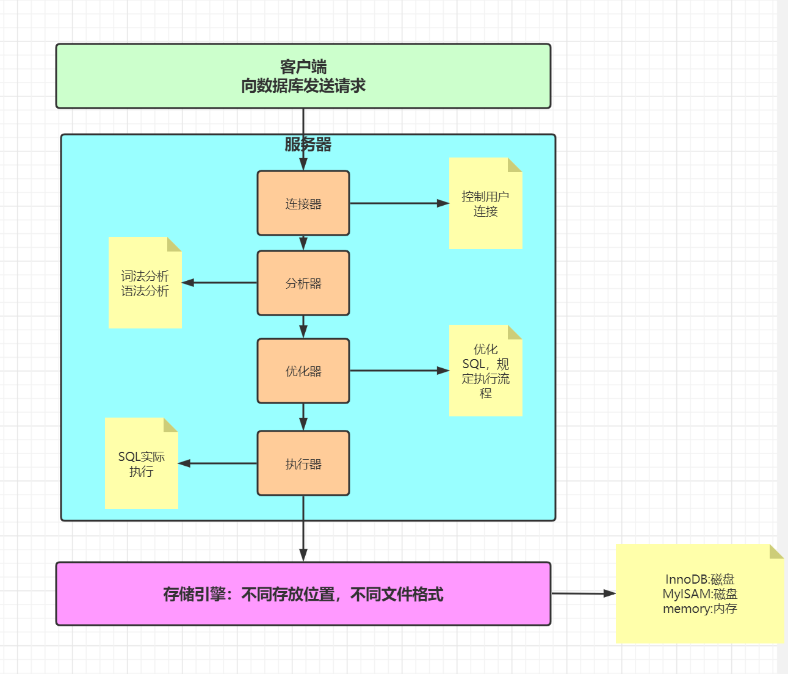
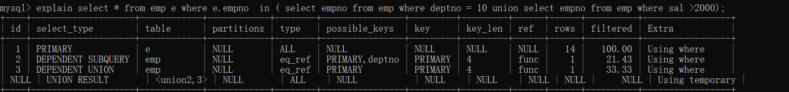
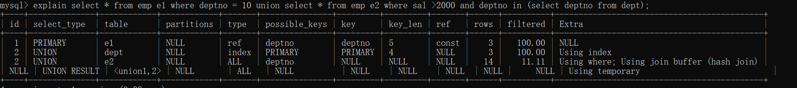
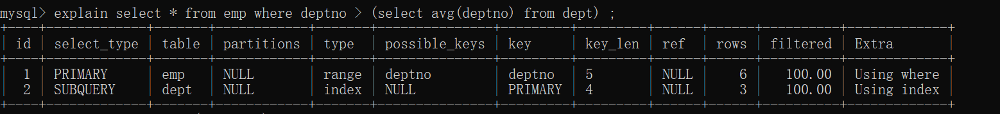
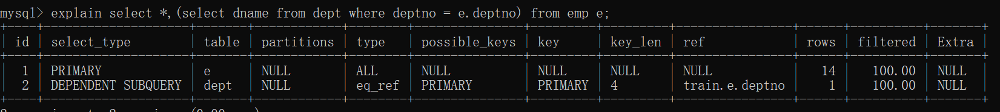
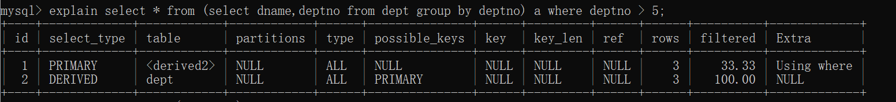
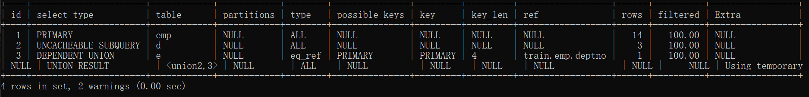
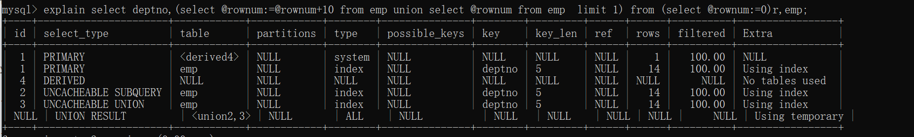

# MySQL

## MySQL服务架构


client发送请求到server，server的连接器处理请求，解析器（词法分析，语法分析）解析SQL，优化器（决定用哪个索引优化，决定多表关联时表的连接顺序等）优化SQL，执行器执行SQL。最后到达存储引擎，不同存放位置，不同文件格式。

ps：在老版本还会有缓存器存储缓存，但是由于缓存命中率较低，不推荐使用，所以后续删除了

## Redo日志-innodb存储引擎的日志文件
Redo log的存在保证了持久化这一事务特性
当向db写入数据时，先写入Redo log，然后再由redo log刷到磁盘中，同时生成redo log file，如果宕机，那么会读取磁盘上的 Redo log file进行恢复

某种方式指：
1.线程周期性任务，每10秒，将redo log buffer刷新到磁盘（包含未提交事务）
2.每秒，将redo log buffer刷新到磁盘‘
3.redo log buffer size空间小于$\frac12$（innodb_log_buffer_size参数），将redo log buffer刷新到磁盘
4.redo log file大小达到阈值

## 导入官方数据库
source /xxx/xxx/xxx-schema.sql

## 优化器优化方式
基于规则的优化(RBO)regular based optimise
基于成本的优化(CBO)cost based optimise

## 性能监控
**开启追踪时间，精确到小数点6位（此项已准备弃用）**
设置profiles属性：set profiling=1;
查看时间：show profiles;
查看时间细节：show profile;

**替代品：Performance Schema**
查看performance_schema状态
> SHOW VARIABLES LIKE 'performance_schema';

查看当前数据库
> show databases

查看当前db下所有表
> show tables

查看建表语句
> show create table 

**performance schema表分类**
```sql
--语句事件记录表，这些表记录了语句事件信息，当前语句事件表events_statements_current、历史语句事件表events_statements_history和长语句历史事件表events_statements_history_long、以及聚合后的摘要表summary，其中，summary表还可以根据帐号(account)，主机(host)，程序(program)，线程(thread)，用户(user)和全局(global)再进行细分)
show tables like '%statement%';

--等待事件记录表，与语句事件类型的相关记录表类似：
show tables like '%wait%';

--阶段事件记录表，记录语句执行的阶段事件的表
show tables like '%stage%';

--事务事件记录表，记录事务相关的事件的表
show tables like '%transaction%';

--监控文件系统层调用的表
show tables like '%file%';

--监视内存使用的表
show tables like '%memory%';

--动态对performance_schema进行配置的配置表
show tables like '%setup%';
```

**show processlist 查看连接池线程个数**

## schema与数据类型优化（发生于构建项目初期）
### 数据类型的优化
1.更小通常的更好
2.简单就好
> 尽量使用自带的数据类型，能用int不用string，能用date不用string,存ip的时候可以存整形，用INET_ATON()和INET_NTOA()进行转化 ，A address N number,提高效率和可读性用string，不然用整形

3.尽量避免null
> 可以为null使索引更加复杂，但是优化方便没必要，设计的时候要注意

4.实际细节
①整形类型
TINYINT:8（位）
SMALLINT:16（位）
MEDIUMINT:24（位）
INT:32（位）
BIGINT:64（位）
尽量使用满足需求最小数据类型，带大小参数的int不会影响具体存储长度

②字符串和字符串类型
CHAR:
最大长度255，会自动删除末尾的空格，检索效率，写效率会比varchar高，以空间换时间
场景：存储长度波动不大的数据，存储短字符串，经常更新的字符串

VARCHAR:
可变长度，varchar(n)小于等于255使用额外一个字节保存长度，n> 255使用额外两个字节保存长度
varchar(5)与varchar (255)保存同样的内容，硬盘存储空间系统，实际内存空间占用不同。varchar在mysql5.6之前变更长度，或者从255以下变成255以上时，会导致锁表
场景：内容长度不均，多字节字符，字符串更新很少

TEXT:
大文本

BLOB:
二进制

③datetime和timestamp
datetime占用8字节，与时区无关，保存到毫秒，保存时间范围大（1000-9999）
timestamp占用4字节，精确到秒，采用整形存储，时间范围1970-1-1到2038-1-19，设置时区，自动更新timestamp列的值
date占用字节数少，3字节，1000-1-1到9999-12-31之间，可以直接用日期函数计算

④枚举类型代替字符串
```sql
create table enum_test(e enum('fish','apple','dog') not null);
insert into enum_test(e) values('fish'),('apple'),('dog');
//修改
alter table enum_test modify val enum('fish','apple');
```
排序的时候根据enum值排序，实际存储存整形，如果一组可以规定的字符串，不会改变，可以使用enum

⑤特殊类型数据
IP地址，本质是32位无符号整数

## 合理使用范式和反范式
三范式（normal forms）规则
1NF（一范式）
每个分类不可继续拆分（每列的原子性）
1）有主键，且不为空
2）字段不能再分

2NF（二范式）
范式一基础上，每一个非主属性完全函数依赖于主键
1）满足1NF
2）表中每一个非主属性，必须完全依赖于本表主键
3）主键是联合索引的情况，如果其他属性只是依赖于主键部分，则不符合2NF

3NF（三范式）
范式二基础上，每个属性都应该与主键有直接关系，而不是间接关系

范式（遵循规则）
> 优点：
> 范式化的更新通常比反范式快
> 当数据较好的范式化后，很少或者没有冗余数据
> 范式化的数据比较小，可以放在内存中操作快
> 
> 缺点：
> 需要进行表关联

反范式（打破规则）
> 优点：
> 所有数据都在同一表中，可以避免关联
> 可以设计有效的索引
>
> 缺点：
> 冗余数据过多

**问题**
1.为什么要禁止三张表以上的join？
因为三张表可能数据量较大

## 主键的选择
### 代理主键
与业务无关

### 自然主键
事物属性中的自然唯一标识

### 推荐使用代理主键
好处：不与业务耦合，通用的键策略能够减少需要编写的源码数量，减少系统的总体拥有成本

## 字符集的选择
1.纯拉丁字符能表示的内容，没必要选择latin1以外的编码，因为会节省大量存储空间
2.如果确定不存放多种语言，没必要使用utf-8或者unicode，会造成空间浪费
3.mysql数据类型可以精确到字段，当需要存放多字节数据时，可以通过对不同表不同字段使用不同数据类型来减小数据量，降低IO次数增加命中率

ps ：单独设置utf8如果中文网站可能会出现乱码，常使用utf8mb4解决（most byte），主要处理四字节的内容，保证不产生乱码

## 存储引擎(数据文件的组织形式)的选择
默认innodb，可以在建表时候选择 memory（数据结构hash table）,innodb（数据结构B+树）, myisam（数据结构B+树）

非常用有archive，merge，CSV，BlackHole，BDB，Federated，Cluster（高冗余）

### MyISAM VS InnoDB

|              | MyISAM       | Innodb                 |
| ------------ | ------------ | ---------------------- |
| 索引类型     | 非聚簇索引   | 聚簇索引               |
| 支持事务     | 否           | 是                     |
| 支持表锁     | 是           | 是                     |
| 支持行锁     | 否           | 是                     |
| 支持外键     | 否           | 是                     |
| 支持全文索引 | 是           | 是 after5.6            |
| 适合操作类型 | select       | update，delete，insert |
| 数据存放方式 | 数据索引分开 | 数据索引存在一块       |
|锁|共享读锁，独占写锁 |共享锁，排他锁|

老版本（8.0之前）用.frm存储表结构，MyISAM用.MYD（数据）,.MYI（索引）存储数据，Innodb用.ibd存储数据
8.0之后，删除.frm，表结构存储在元数据信息中，默认ibdata1文件，对于非Innodb表，冗余存储一份SDI（Serialized Dictionary Information）数据在.sdi中，对于Innodb表，直接存储与.idb中

不同点：
虽然都使用了B+树，但是Innodb由于存储的数据在同一份文件（.idb）中，所以叶子结点存放的是具体的数据，但是MyISAM由于存储的时候是分开存储的，所以放的是数据行的地址，然后去.MYD中读取

**Innodb**
innodb创建的时候会按照主键生成树，如果没有主键，找唯一键进行排序存储，如果没有唯一键，自己生成一个6位的row_id作为主键

### 数据冗余

1.被频繁引用且只能通过join 2张（或者更多）大表的方式才能得到的独立小字段
2.这样的场景由于每次join仅仅只是为了取到某个小字段的值，Join到的记录大，造成不必要的IO，用空间去换时间

### 适当拆分
当大部分访问某张表时访问不到一个数据很大的大字段时，需要将表分离

### training table
```sql
create table dept(
    -- 部门编号
    deptno      int unsigned auto_increment primary key,
    -- 部门名称
    dname       varchar(15)     ,
    -- 部门所在位置
    loc         varchar(50)    
)engine = InnoDB;


--创建 scott 数据库中的 emp 表
 create table emp(
    -- 雇员编号
    empno           int unsigned auto_increment primary key,
    -- 雇员姓名
    ename           varchar(15)     ,
    -- 雇员职位
    job             varchar(10)     ,
    -- 雇员对应的领导的编号
    mgr             int unsigned    ,
    -- 雇员的雇佣日期
    hiredate        date            ,
    -- 雇员的基本工资
    sal             decimal(7,2)    ,
    -- 奖金
    comm            decimal(7,2)    ,
    -- 所在部门
    deptno          int unsigned    ,
    foreign key(deptno) references dept(deptno)
)engine = innodb;


--创建数据库 scott 中的 salgrade 表，工资等级表
create table salgrade(
    -- 工资等级
    grade       int unsigned    ,
    -- 此等级的最低工资
    losal       int unsigned    ,
    -- 此等级的最高工资
    hisal       int unsigned   
)engine=innodb;


--创建数据库 scott 的 bonus 表，工资表
create table bonus(
    -- 雇员姓名
    ename       varchar(10),
    -- 雇员职位
    job         varchar(9),
    -- 雇员工资
    sal         decimal(7,2),
    -- 雇员资金
    comm        decimal(7,2)
)engine=innodb;

--dept表中的数据
INSERT INTO dept VALUES (10,'ACCOUNTING','NEW YORK'); 
INSERT INTO dept VALUES (20,'RESEARCH','DALLAS'); 
INSERT INTO dept VALUES (30,'SALES','CHICAGO'); 
INSERT INTO dept VALUES (40,'OPERATIONS','BOSTON'); 


--salgrade表中的数据
INSERT INTO salgrade VALUES (1,700,1200); 
INSERT INTO salgrade VALUES (2,1201,1400); 
INSERT INTO salgrade VALUES (3,1401,2000); 
INSERT INTO salgrade VALUES (4,2001,3000); 
INSERT INTO salgrade VALUES (5,3001,9999);


--emp表中的数据
INSERT INTO emp VALUES  (7369,'SMITH','CLERK',7902,'1980-12-17',800,NULL,20);
INSERT INTO emp VALUES  (7499,'ALLEN','SALESMAN',7698,'1981-2-20',1600,300,30);
INSERT INTO emp VALUES  (7521,'WARD','SALESMAN',7698,'1981-2-22',1250,500,30);
INSERT INTO emp VALUES  (7566,'JONES','MANAGER',7839,'1981-4-2',2975,NULL,20);
INSERT INTO emp VALUES  (7654,'MARTIN','SALESMAN',7698,'1981-9-28',1250,1400,30);
INSERT INTO emp VALUES  (7698,'BLAKE','MANAGER',7839,'1981-5-1',2850,NULL,30);
INSERT INTO emp VALUES  (7782,'CLARK','MANAGER',7839,'1981-6-9',2450,NULL,10);
INSERT INTO emp VALUES  (7788,'SCOTT','ANALYST',7566,'87-7-13',3000,NULL,20);
INSERT INTO emp VALUES  (7839,'KING','PRESIDENT',NULL,'1981-11-17',5000,NULL,10);
INSERT INTO emp VALUES  (7844,'TURNER','SALESMAN',7698,'1981-9-8',1500,0,30);
INSERT INTO emp VALUES  (7876,'ADAMS','CLERK',7788,'1987-7-13',1100,NULL,20);
INSERT INTO emp VALUES  (7900,'JAMES','CLERK',7698,'1981-12-3',950,NULL,30);
INSERT INTO emp VALUES  (7902,'FORD','ANALYST',7566,'1981-12-3',3000,NULL,20);
INSERT INTO emp VALUES  (7934,'MILLER','CLERK',7782,'1982-1-23',1300,NULL,10);
```

### explain table

|    Column     |                    Meaning                     |
| :-----------: | :--------------------------------------------: |
|      id       |            The `SELECT` identifier             |
|  select_type  |               The `SELECT` type                |
|     table     |          The table for the output row          |
|  partitions   |            The matching partitions             |
|     type      |                 The join type                  |
| possible_keys |         The possible indexes to choose         |
|      key      |           The index actually chosen            |
|    key_len    |          The length of the chosen key          |
|      ref      |       The columns compared to the index        |
|     rows      |        Estimate of rows to be examined         |
|   filtered    | Percentage of rows filtered by table condition |
|     extra     |             Additional information             |
#### id
id表示运行顺序，同id从上到下，不同id从大到小

eg：
explain select * from emp t1 join dept t2 on t1.deptno = t2.deptno;


explain select * from emp e union select * from emp e2;

union的时候会显示null

#### select_type
查询的类型：普通查询，联合查询，子查询

| select_type **Value** | 意义                                                         |
| --------------------- | ------------------------------------------------------------ |
| SIMPLE                | 简单查询（不使用union和子查询，或者只使用简单的子查询）      |
| PRIMARY               | 包含复杂子查询，外层查询为Primary                            |
| UNION                 | 如果select出现在union后，就被标记为union                     |
| DEPENDENT UNION       | 如果select出现在union后，依赖于外层查询                      |
| UNION RESULT          | union表的结果                                                |
| SUBQUERY              | 在select或者where列表(不使用函数可能被优化器优化)中包含子查询 |
| DEPENDENT SUBQUERY    | 子查询要依赖于主查询的查询结果                               |
| DERIVED（派生表）     | from语句后，where语句前，类似于视图                          |
| DEPENDENT DERIVED     | 派生表依赖于其他表                                           |
| MATERIALIZED          | 实体化子查询（物化表），子查询优化策略                       |
| UNCACHEABLE SUBQUERY  | 无法缓存结果的子查询，必须为每一行重新计算值                 |
| UNCACHEABLE UNION     | 无法缓存结果的联合查询，必须为每一行重新计算值               |

explain select * from emp e where e.deptno in (select d.deptno from dept d where d.dname = 'SALES');


explain select * from emp e where e.deptno in (select d.deptno from dept d where d.dname = (select d.deptno from dept d where d.dname ='SALES'));


explain select * from emp e1 where deptno = 10 union select * from emp e2 where sal >2000;


explain select * from emp e where e.empno  in ( select empno from emp where deptno = 10 union select empno from emp where sal >2000);



explain select * from emp e1 where deptno = 10 union select * from emp e2 where sal >2000 and deptno in (select deptno from dept);



explain select * from emp where deptno > (select avg(deptno) from dept) ;



explain select *,(select dname from dept where deptno = e.deptno) from emp e;



explain select * from (select dname,deptno from dept group by deptno) a where deptno > 5;



explain select *,(select dname from dept d union select dname from dept e where deptno = emp.deptno) from emp;



explain select deptno,(select @rownum:=@rownum+10 from emp union select @rownum from emp  limit 1) from (select @rownum:=0)r,emp;



#### table

表示对应的表名，可能是别名，代号

#### partitions

显示查询的字段是表中的哪个分区


ps：partition的功能是将真正存储的磁盘文件按照要求进行分割存储，但是查询时仍然是一张表，防止文件过大查询过慢

#### type

type显示的是访问类型，访问类型表示我是以何种方式去访问我们的数据，最容易想的是全表扫描，直接暴力的遍历一张表去寻找需要的数据，效率非常低下，访问的类型有很多，效率从最好到最坏依次是：

system > const > eq_ref > ref > fulltext > ref_or_null > index_merge > unique_subquery > index_subquery > range > index > ALL 

一般情况下，得保证查询至少达到range级别，最好能达到ref

```sql
--all:全表扫描，一般情况下出现这样的sql语句而且数据量比较大的话那么就需要进行优化。
explain select * from emp;

--index：全索引扫描这个比all的效率要好，主要有两种情况，一种是当前的查询时覆盖索引，即我们需要的数据在索引中就可以索取，或者是使用了索引进行排序，这样就避免数据的重排序
explain  select empno from emp;

--range：表示利用索引查询的时候限制了范围，在指定范围内进行查询，这样避免了index的全索引扫描，适用的操作符： =, <>, >, >=, <, <=, IS NULL, BETWEEN, LIKE, or IN() 
explain select * from emp where empno between 7000 and 7500;

--index_subquery：利用索引来关联子查询，不再扫描全表
explain select * from emp where emp.job in (select job from t_job);

--unique_subquery:该连接类型类似与index_subquery,使用的是唯一索引
 explain select * from emp e where e.deptno in (select distinct deptno from dept);
 
--index_merge：在查询过程中需要多个索引组合使用，没有模拟出来

--ref_or_null：对于某个非主键字段既需要关联条件，也需要null值的情况下，查询优化器会选择这种访问方式
explain select * from emp e where e.deptno is null or e.deptno = 10;

--ref：使用了非唯一性索引进行数据的查找
 create index idx_3 on emp(deptno);
 explain select * from emp e,dept d where e.deptno =d.deptno;

--eq_ref ：使用唯一性索引进行数据查找
explain select * from emp,emp2 where emp.empno = emp2.empno;

--const：这个表至多有一个匹配行，
explain select * from emp where empno = 7369;
 
--system：表只有一行记录（等于系统表），这是const类型的特例，平时不会出现
```

#### possible_keys

显示可能用到的所有索引

#### key

显示真正用到的索引

#### key_len

显示索引使用的字节数，越少越好

#### ref

索引的具体匹配表中的字段

#### rows

大致估计找出所需记录需要读取的长度，越少越好

#### filtered

大致估计按条件被过滤的行的百分比，rows\*filtered计算出下一轮计算要读取的大小

#### Extra

包含额外的信息。

```sql
--using filesort:说明mysql无法利用索引进行排序，只能利用排序算法进行排序，会消耗额外的位置
explain select * from emp order by sal;

--using temporary:建立临时表来保存中间结果，查询完成之后把临时表删除
explain select ename,count(*) from emp where deptno = 10 group by ename;

--using index:这个表示当前的查询时覆盖索引的，直接从索引中读取数据，而不用访问数据表。如果同时出现using where 表名索引被用来执行索引键值的查找，如果没有，表面索引被用来读取数据，而不是真的查找
explain select deptno,count(*) from emp group by deptno limit 10;

--using where:使用where进行条件过滤
explain select * from t_user where id = 1;

--using join buffer:使用连接缓存
explain select * from emp e left join (select * from dept where deptno > 10) d on e.deptno = d.deptno;

--no matching row in const table语句的结果总是false
explain select * from emp where empno = 7469;
```

## 通过索引进行优化

### 树的演化
二叉树
二叉搜索树：右孩子比根大，左孩子比根小
AVL（平衡二叉树）：基于二叉搜索树，由于二叉搜索树可能产生严重倾斜问题，产生了平衡二叉树，规定任何结点左右孩子高度差不能大于1
红黑树：由于平衡二叉树的插入效率太慢，需要做大量的旋转，所以产生了红黑树，其特性为树高不超过最低树高的2倍（损失了部分查询性能，找到插入查找的平衡），树上不存在连续的两个红色结点，从一个结点出发到叶子结点途径的结点中，黑色结点个数相同

二叉树由于每个结点最多只有两个分支，产生了一个深度的瓶颈，深度导致IO过多，所以数据库不会用二叉树，从而产生了B树和B+树

B树特点：
1.所有键值分布在整棵树中
2.搜索有可能在非叶子结点结束
3.每个结点最多拥有m个子树
4.根节点至少有两个子树
5.分支结点至少有m/2棵子树
6.所有叶子结点都在同一层，每个结点最多可以有m-1个key，并且以升序排列

ps：innodb默认读16KB，也就是1页

B+树：
基于B树的优化，将数据移到叶子结点，大大增加了一次IO读取的索引数量，增加了查询效率，为了支撑范围查询，叶子结点之间增加指针

B\*树：
在B+树基础之上，在非叶子结点之间增加了指针

### 索引的优点
1.大大减少了服务器需要扫描的数据量
2.帮助服务器避免排序和临时表
3.将随机io变成顺序io

ps：
随机IO：读写操作时间连续但是地址不连续
顺序IO：读写操作的访问地址连续

### 索引用处
1.快速查找匹配where子句的行
2.如果可以在多个索引之间进行选择，通常会选择使用最少行的索引（row数值越小越好）
3.如果表中有多列索引，优化器可以使用索引的任何最左前缀来查找行
4.当表连接的时候，从其他表检索行数据
5.查找特定索引列的min或者max
6.如果排序或者分组是在可用索引的最左前缀上完成的，则对表进行排序和分组
7.在某些情况下，可以优化查询以检索值而无需查询数据行

### 索引分类
主键索引
> ALTER  TABLE  `table_name`  ADD  PRIMARY  KEY (  `column`  ) 

唯一索引
> ALTER  TABLE  `table_name`  ADD  UNIQUE (`column` ) 

普通索引
> ALTER  TABLE  `table_name`  ADD  INDEX index_name (  `column`  )

全文索引（一般给varchar，text这种）
>ALTER  TABLE  `table_name`  ADD  FULLTEXT ( `column` )
>alter table `table_name` add key(`column`(`len`))

组合索引
> ALTER  TABLE  `table_name`  ADD  INDEX index_name (  `column1`,  `column2`,  `column3`  )

### 索引匹配方式（组合索引）
样例表
> create table staffs(
    id int primary key auto_increment,
    name varchar(24) not null default '' comment '姓名' ,
    age int not null default 0 comment '年龄',
    pos varchar(20) not null default '' comment '职位',
    add_time timestamp not null default current_timestamp comment '入职时间'
    )charset utf8mb4 comment '员工记录表';
>
> alter table staffs add index idx_nap(name,age,pos);

#### 全值匹配
explain select * from staffs where name = 'July' and age='23' and pos='dev';

#### 匹配最左前缀
非全匹配，只匹配前面几列
explain select * from staffs where name = 'July' and age='23' 

#### 匹配列前缀
只匹配某一列的开头部分
explain select * from staffs where name like 'Ju%';

#### 匹配范围值
explain select * from staffs where name >  'July';
如果联合索引某个点开始使用了范围查询，后面的索引均不生效

#### 精确匹配某一列并范围匹配另外一列
explain select * from staffs where name = 'July' and age > 23

#### 只访问索引的查询
覆盖索引（Extra中出现using index）

**注意**
千万不要用like并且条件以%开头，无法使用索引

### hash索引
特点：
基于哈希表的实现，只有精确匹配才能查询
哈希索引速度快
在mysql中，只有memory支持
限制：
1.索引只包含hash值和行指针，不能使用索引去判断对应行是否有效
2.不按照索引顺序存储，无法排序
3.不支持部分列匹配查找，因为hash值是根据全部列进行计算的
4.支持等值比较查找不支持范围查找
5.访问速度很快，除非有很多哈希冲突，实际mysql用的链地址法
6.哈希冲突比较多，维护代价会提高

可以当缓存使用

ps：
如何避免hash冲突问题？
1.链地址法
2.开放地址法
3.最重要的是要编写优秀的hash函数

CRC32是什么？
循环冗余校验，保证数据准确性
用途：如果要存很多url，可以用CRC32将url变成整数值，再进行比较

### 聚簇索引
数据行和相邻的键值紧凑的存储在一起
优点：
可以将相关数据保存在一起
数据访问更快
可以使用覆盖索引
缺点：
1.聚簇数据提高IO密集型应用的性能，如果数据全部存放在内存，就没有优势
2.插入速度严重依赖于插入顺序，按照主键插入是最快的方式
3.更新聚簇索引列的代价很高，因为会强制将每个被更新的行移动到新的位置
4.基于聚簇索引的表在插入新行，或者主键被更新导致需要移动行的时候，可能面临页分裂的问题
5.聚簇索引可能导致全表扫描变慢，尤其是行比较稀疏，或者由于页分裂导致数据存储不连续的时候

ps：数据移动的时候可以通过关闭索引防止索引频繁更新，然后最后打开索引进行一个更新，这样移动的速度更快

### 非聚簇索引
索引存放顺序与实际存放的顺序不同，体现在文件中就是数据文件和索引文件分开存放

### 覆盖索引
优势：
减少IO，提高IO密集型的性能

### 优化细节
1.使用索引列进行查询的时候不要使用表达式，把计算放到业务层（索引废了）
2.尽量使用主键查询，因为主键查询不会触发回表
3.使用前缀索引（索引BLOB,TEXT,VARCHAR的列，选择合适的过滤条件类似abc%，可以查看重复的部分，用某一个部分去创建索引）
alter table citydemo add key(city(7))
show index from citydemo
有个Cardinality字段，显示了当前根据索引产生的数据基数有多少，HyperLogLog算法用来计算基数（Distinct Value），基数越小越好
4.使用索引扫描来排序（创建组合索引的时候默认是升序排列，所以如果是升序排列，请不要一个升序一个降序）（组成最左前缀）
5.union all,in,or 都能够使用索引，推荐使用in（如果in和exist要选择的话，推荐exist）
6.范围列可以使用索引，但是后续列无法用于索引（范围条件是!=,>,<;>=;<=;between）
7.强转会产生全表扫描
8.更新十分频繁，数据区分度不高的字段不建议建立索引(维护成本比较高，要产生页合并和页分裂，区分度太低（小于80%）不建议)
9.创建索引的列，不允许为null，可能会得到不符合预期的结果
10.当需要进行表连接的时候，不要超过三张表
11.如果明确知道只有一条结果返回，limit能提高效率
12.单表索引建议控制在5个以内
13.组合索引不宜建超过5个
14.创建索引的时候应该避免以下错误概念
(1) 过早优化
(2)索引越多越好

## 索引监控
show status like 'Handler_read%'

| Variable_name                          | Value | use                            |
| -------------------------------------- | ----- | ------------------------------ |
| Handler_read_first                     | 11    | 读取索引第一个条目的次数       |
| **Handler_read_key（Attention）**      | 36    | 通过index获取数据的次数        |
| Handler_read_last                      | 0     | 读取索引最后一个条目的次数     |
| Handler_read_next                      | 53    | 通过索引读取下一条数据的次数   |
| Handler_read_prev                      | 0     | 通过索引读取上一条数据的次数   |
| Handler_read_rnd                       | 3     | 从固定位置读取数据的次数       |
| **Handler_read_rnd_next（Attention）** | 89    | 从数据结点读取下一条数据的次数 |

## 关于join
Simple nested loop join
简单嵌套连接
A表驱动B表，从A中取出记录匹配B表中的列，然后在合并结果

Index nested loop join
非驱动表（匹配）上加索引
只有当索引匹配才会进行回表查询

Block nested loop join
加入一个缓存（默认值为join_buffer_size = 256K，最大4G），将驱动表数据全部加载到内存，然后批量与非驱动表进行匹配，默认情况下开启，在optimizer_switch下的block_nested_loop=on

show variables like '%join_buffer%';
show variables like '%optimizer_switch%'
set optimizer_switch='block_nested_loop=off'

ps：
如果两表进行inner join，那么后面过滤条件写在on中和写在where中没有区别
如果两表进行left join，那么后面过滤条件只对右表生效，左表永远为全部值
如果两表进行right join，那么后面过滤条件只对左表生效，右表永远为全部值

ps:
如果大表join大表，最好的方式是做分区预算（分区表）

## 查询优化
### 查询慢的原因
网络
CPU
IO
上下文切换
系统调用
生成统计信息
锁等待

### 优化数据访问
**查询性能低下主要原因是访问数据太多，某些查询不可避免的需要筛选大量的数据，我们可以通过减少访问数据量的方式进行优化**
确认应用程序是否检索大量不需要的数据
确认mysql服务器是否在分析大量超过需要的数据行

**是否向数据库请求了不需要的数据**
查询不需要的记录：优化方式时尽量使用limit，不然可能查完还会继续向下查，造成不必要的开支
多表关联时返回全部列：不要返回不要的字段
总是取出全部列
重复查询相同的数据

## 执行过程的优化
### 查询缓存（8以前）
查询一个语句的时候先检查缓存，如果命中直接返回

### 查询优化处理
**语法解析器和预处理**
mysql通过语法解析器会将SQL转成AST树，预处理器会验证树是否合法，例如表名列名是否存在，是否有歧义，并且验证权限

如果要自己写，可以借助Apache Calcite库

**查询优化器**
优化器会选择成本最小的一个执行方式

查看成本（越高越差）：show status = 'last_query_cost'
通过一系列计算得出：根据表或索引的页面个数，索引基数，索引和数据行的长度，索引分部来计算

在很多情况下mysql会选择错误的执行计划，原因如下
优化器的优化策略
> 静态优化（只执行一次）：直接对解析树进行分析，完成优化
> 动态优化（每次都要执行）：与查询上下文有关，可能跟取值，索引对应的行数有关

优化器的优化类型
> 重新定义关联表的顺序
> 将外连接转化成内连接，内连接效率比外连接快
> 使用等价变换规则
> 优化count(),min(),max()
> 预估并转换为常数表达式，类似于select * from A where x_col = 1,会将1转成常量值
> 索引覆盖
> 子查询优化，将子查询放入缓存
> 等值传播（就是能用一个值判断的不用两个值）：类似于select * from A join B on A.col=B.col where A.col = 1 and B.col = 1会被优化成select * from A join B on A.col=B.col where A.col = 1

关联查询

> simple nested loop join
> index nested loop join
> block nested loop join
>
> 
>
> ps:加入straight_join强制指定表连接的顺序
> 类似于select straight_join xxxxxx;

排序优化

> 两次传输排序：第一次先读出需要排序的字段排好序，再去查找对应的数据行。缺点：随机IO，读取成本高。优点：排序的时候存储少的数据，充分利用缓冲区
>
> 单次传输排序：先读取查询需要的所有列，再根据对应列进行排序。优点：没有随机IO，速度快。缺点：占用存储空间，可能缓冲区放不下
>
> 选择：当需要排序的列的总大小+orderby的列的大小超过max_length_for_sort_data（8.0以上为4096）定义的字节，就会选用两次排序，否则使用单次

## 优化对应
### 优化count()查询
注意，在计算全部列数量的时候，在MySQL中，不管是count(\*),count(1),count(列)（可能出现不统计null的情况），效果是一样的

1.MyISAM中有一个变量记录整体插入数据的行数，所以MyISAM进行不带任何条件的count(\*)时比较快，不然其实和其他速度一样
2.使用近似值，如果不是需要一个精确值，可以记录一个近似值替代
3.更复杂的优化（实际操作的时候，可以在外部维护一个缓存）

### 优化关联查询
确保on或者using子句中的列上有索引，在创建索引的时候就要考虑到关联顺序
尽量在order by和group by中用到索引

### 优化子查询

### 优化group by和distinct

## 名词

**回表**
通过其他索引找到主键，然后通过主键索引查询对应的数据叫回表
**覆盖索引**
MyISAM和Innodb支持，select中的值使用到了索引，不用再回表了，Extra中使用using index
**最左匹配（前缀）**
联合索引的时候，按照第一个where条件去联合索引中找，如果联合索引的第一个不是当前条件，那么就无法使用该索引，只有一一匹配才能使用（先有最左边才能查右边）
**索引下推（5.6之后）**
联合索引的时候，如果where中的值是我所使用的索引，会根据索引先匹配完毕，然后再向服务器查询数据，IO较少（充分利用索引数据）
**谓词下推(优化器)**
SQL中的谓词主要有 LKIE、BETWEEN、IS NULL、IS NOT NULL、IN、EXISTS
数据表进行join的时候，将过滤表达式尽可能移动至靠近数据源的位置，以使真正执行时能直接跳过无关的数据
eg:select count(1) from A Join B on A.id = B.id where A.a > 10 and B.b < 100;
**页分裂**
在进行插入的时候，如果到达100%，正常应该把数据存放到下一页，如果下一个也没有足够空间存放，那就创建一个新页，然后从可以分裂的点开始分裂成两页，并调整相应页面的头尾指针（所以会产生页错位，逻辑上仍然有序，但是物理上无序）

如果要处理页错位问题，那么就要进行页合并，或者用optimize重新整理表
**页合并**
在进行删除的时候，如果当前区域到达一个阈值，默认是页的50%以下，就会去找相邻的页，查看是否可以合并成一个新页
**IO密集型**
消耗资源比较多
**CPU密集型**
消耗cpu（计算）比较多
**OLAP(On-Line Analytical Processing)**
联机分析处理
**OLTP(On-Line  Transaction Processing)**
联机事务处理
**等值传播**
就是能用一个值判断的不用两个值
类似于select * from A join B on A.col=B.col where A.col = 1 and B.col = 1会被优化成select * from A join B on A.col=B.col where A.col = 1