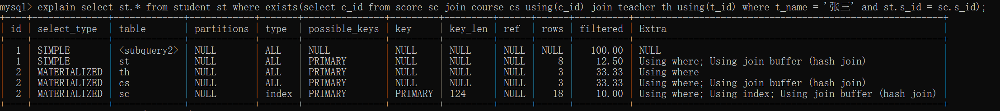
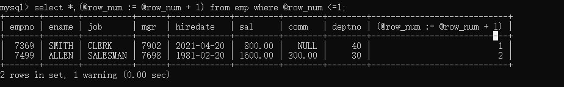
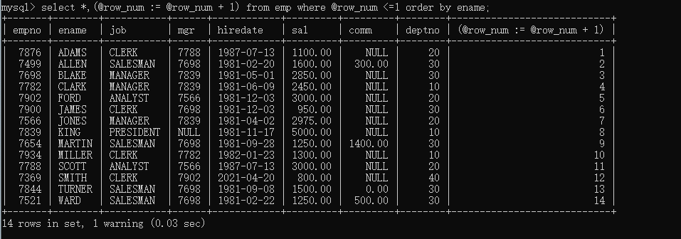

# MySQL

## MySQL服务架构


client发送请求到server，server的连接器处理请求，解析器（词法分析，语法分析）解析SQL，优化器（决定用哪个索引优化，决定多表关联时表的连接顺序等）优化SQL，执行器执行SQL。最后到达存储引擎，不同存放位置，不同文件格式。

ps：在老版本还会有缓存器存储缓存，但是由于缓存命中率较低，不推荐使用，所以后续删除了

## Redo日志-innodb存储引擎的日志文件
Redo log的存在保证了持久化这一事务特性
当向db写入数据时，先写入Redo log，然后再由redo log刷到磁盘中，同时生成redo log file，如果宕机，那么会读取磁盘上的 Redo log file进行恢复

某种方式指：
1.线程周期性任务，每10秒，将redo log buffer刷新到磁盘（包含未提交事务）
2.每秒，将redo log buffer刷新到磁盘‘
3.redo log buffer size空间小于$\frac12$（innodb_log_buffer_size参数），将redo log buffer刷新到磁盘
4.redo log file大小达到阈值

## 导入官方数据库
source /xxx/xxx/xxx-schema.sql

## 优化器优化方式
基于规则的优化(RBO)regular based optimise
基于成本的优化(CBO)cost based optimise

## 性能监控
**开启追踪时间，精确到小数点6位（此项已准备弃用）**
设置profiles属性：set profiling=1;
查看时间：show profiles;
查看时间细节：show profile;

**替代品：Performance Schema**
查看performance_schema状态
> SHOW VARIABLES LIKE 'performance_schema';

查看当前数据库
> show databases

查看当前db下所有表
> show tables

查看建表语句
> show create table 

**performance schema表分类**
```sql
--语句事件记录表，这些表记录了语句事件信息，当前语句事件表events_statements_current、历史语句事件表events_statements_history和长语句历史事件表events_statements_history_long、以及聚合后的摘要表summary，其中，summary表还可以根据帐号(account)，主机(host)，程序(program)，线程(thread)，用户(user)和全局(global)再进行细分)
show tables like '%statement%';

--等待事件记录表，与语句事件类型的相关记录表类似：
show tables like '%wait%';

--阶段事件记录表，记录语句执行的阶段事件的表
show tables like '%stage%';

--事务事件记录表，记录事务相关的事件的表
show tables like '%transaction%';

--监控文件系统层调用的表
show tables like '%file%';

--监视内存使用的表
show tables like '%memory%';

--动态对performance_schema进行配置的配置表
show tables like '%setup%';
```

**show processlist 查看连接池线程个数**

## schema与数据类型优化（发生于构建项目初期）
### 数据类型的优化
1.更小通常的更好
2.简单就好
> 尽量使用自带的数据类型，能用int不用string，能用date不用string,存ip的时候可以存整形，用INET_ATON()和INET_NTOA()进行转化 ，A address N number,提高效率和可读性用string，不然用整形

3.尽量避免null
> 可以为null使索引更加复杂，但是优化方便没必要，设计的时候要注意

4.实际细节
①整形类型
TINYINT:8（位）
SMALLINT:16（位）
MEDIUMINT:24（位）
INT:32（位）
BIGINT:64（位）
尽量使用满足需求最小数据类型，带大小参数的int不会影响具体存储长度

②字符串和字符串类型
CHAR:
最大长度255，会自动删除末尾的空格，检索效率，写效率会比varchar高，以空间换时间
场景：存储长度波动不大的数据，存储短字符串，经常更新的字符串

VARCHAR:
可变长度，varchar(n)小于等于255使用额外一个字节保存长度，n> 255使用额外两个字节保存长度
varchar(5)与varchar (255)保存同样的内容，硬盘存储空间系统，实际内存空间占用不同。varchar在mysql5.6之前变更长度，或者从255以下变成255以上时，会导致锁表
场景：内容长度不均，多字节字符，字符串更新很少

TEXT:
大文本

BLOB:
二进制

③datetime和timestamp
datetime占用8字节，与时区无关，保存到毫秒，保存时间范围大（1000-9999）
timestamp占用4字节，精确到秒，采用整形存储，时间范围1970-1-1到2038-1-19，设置时区，自动更新timestamp列的值
date占用字节数少，3字节，1000-1-1到9999-12-31之间，可以直接用日期函数计算

④枚举类型代替字符串
```sql
create table enum_test(e enum('fish','apple','dog') not null);
insert into enum_test(e) values('fish'),('apple'),('dog');
//修改
alter table enum_test modify val enum('fish','apple');
```
排序的时候根据enum值排序，实际存储存整形，如果一组可以规定的字符串，不会改变，可以使用enum

⑤特殊类型数据
IP地址，本质是32位无符号整数

## 合理使用范式和反范式
三范式（normal forms）规则
1NF（一范式）
每个分类不可继续拆分（每列的原子性）
1）有主键，且不为空
2）字段不能再分

2NF（二范式）
范式一基础上，每一个非主属性完全函数依赖于主键
1）满足1NF
2）表中每一个非主属性，必须完全依赖于本表主键
3）主键是联合索引的情况，如果其他属性只是依赖于主键部分，则不符合2NF

3NF（三范式）
范式二基础上，每个属性都应该与主键有直接关系，而不是间接关系

范式（遵循规则）
> 优点：
> 范式化的更新通常比反范式快
> 当数据较好的范式化后，很少或者没有冗余数据
> 范式化的数据比较小，可以放在内存中操作快
> 
> 缺点：
> 需要进行表关联

反范式（打破规则）
> 优点：
> 所有数据都在同一表中，可以避免关联
> 可以设计有效的索引
>
> 缺点：
> 冗余数据过多

**问题**
1.为什么要禁止三张表以上的join？
因为三张表可能数据量较大

## 主键的选择
### 代理主键
与业务无关

### 自然主键
事物属性中的自然唯一标识

### 推荐使用代理主键
好处：不与业务耦合，通用的键策略能够减少需要编写的源码数量，减少系统的总体拥有成本

## 字符集的选择
1.纯拉丁字符能表示的内容，没必要选择latin1以外的编码，因为会节省大量存储空间
2.如果确定不存放多种语言，没必要使用utf-8或者unicode，会造成空间浪费
3.mysql数据类型可以精确到字段，当需要存放多字节数据时，可以通过对不同表不同字段使用不同数据类型来减小数据量，降低IO次数增加命中率

ps ：单独设置utf8如果中文网站可能会出现乱码，常使用utf8mb4解决（most byte），主要处理四字节的内容，保证不产生乱码

## 存储引擎(数据文件的组织形式)的选择
默认innodb，可以在建表时候选择 memory（数据结构hash table）,innodb（数据结构B+树）, myisam（数据结构B+树）

非常用有archive，merge，CSV，BlackHole，BDB，Federated，Cluster（高冗余）

### MyISAM VS InnoDB

|              | MyISAM       | Innodb                 |
| ------------ | ------------ | ---------------------- |
| 索引类型     | 非聚簇索引   | 聚簇索引               |
| 支持事务     | 否           | 是                     |
| 支持表锁     | 是           | 是                     |
| 支持行锁     | 否           | 是                     |
| 支持外键     | 否           | 是                     |
| 支持全文索引 | 是           | 是 after5.6            |
| 适合操作类型 | select       | update，delete，insert |
| 数据存放方式 | 数据索引分开 | 数据索引存在一块       |

老版本（8.0之前）用.frm存储表结构，MyISAM用.MYD（数据）,.MYI（索引）存储数据，Innodb用.ibd存储数据
8.0之后，删除.frm，表结构存储在元数据信息中，默认ibdata1文件，对于非Innodb表，冗余存储一份SDI（Serialized Dictionary Information）数据在.sdi中，对于Innodb表，直接存储与.idb中

不同点：
虽然都使用了B+树，但是Innodb由于存储的数据在同一份文件（.idb）中，所以叶子结点存放的是具体的数据，但是MyISAM由于存储的时候是分开存储的，所以放的是数据行的地址，然后去.MYD中读取

**Innodb**
innodb创建的时候会按照主键生成树，如果没有主键，找唯一键进行排序存储，如果没有唯一键，自己生成一个6位的row_id作为主键

innodb对mvcc的支持：
通过对每一行记录添加两个额外的隐藏值来实现MVCC，一个记录这条数据何时被创建，一个记录何时过期。注意，mysql并没有存储实际发生的时间，而是存储了一个版本号，版本号随着事务的创建而增长，当一个事务开始时会记录版本号，进行查询时比较版本号是否相同。

在repeatable read时，必须做两件事情：
1.找到一个行版本，至少要和事务的版本一样老（即他的版本<=事务版本）。这一点保证开始读取的时候，数据存在。
2.这行数据的删除版本必须未定义或者比当前版本大。保证开始读取的时候，数据还未被删除。

### 数据冗余

1.被频繁引用且只能通过join 2张（或者更多）大表的方式才能得到的独立小字段
2.这样的场景由于每次join仅仅只是为了取到某个小字段的值，Join到的记录大，造成不必要的IO，用空间去换时间

### 适当拆分
当大部分访问某张表时访问不到一个数据很大的大字段时，需要将表分离

### training table
```sql
create table dept(
    -- 部门编号
    deptno      int unsigned auto_increment primary key,
    -- 部门名称
    dname       varchar(15)     ,
    -- 部门所在位置
    loc         varchar(50)    
)engine = InnoDB;


--创建 scott 数据库中的 emp 表
 create table emp(
    -- 雇员编号
    empno           int unsigned auto_increment primary key,
    -- 雇员姓名
    ename           varchar(15)     ,
    -- 雇员职位
    job             varchar(10)     ,
    -- 雇员对应的领导的编号
    mgr             int unsigned    ,
    -- 雇员的雇佣日期
    hiredate        date            ,
    -- 雇员的基本工资
    sal             decimal(7,2)    ,
    -- 奖金
    comm            decimal(7,2)    ,
    -- 所在部门
    deptno          int unsigned    ,
    foreign key(deptno) references dept(deptno)
)engine = innodb;


--创建数据库 scott 中的 salgrade 表，工资等级表
create table salgrade(
    -- 工资等级
    grade       int unsigned    ,
    -- 此等级的最低工资
    losal       int unsigned    ,
    -- 此等级的最高工资
    hisal       int unsigned   
)engine=innodb;


--创建数据库 scott 的 bonus 表，工资表
create table bonus(
    -- 雇员姓名
    ename       varchar(10),
    -- 雇员职位
    job         varchar(9),
    -- 雇员工资
    sal         decimal(7,2),
    -- 雇员资金
    comm        decimal(7,2)
)engine=innodb;

--dept表中的数据
INSERT INTO dept VALUES (10,'ACCOUNTING','NEW YORK'); 
INSERT INTO dept VALUES (20,'RESEARCH','DALLAS'); 
INSERT INTO dept VALUES (30,'SALES','CHICAGO'); 
INSERT INTO dept VALUES (40,'OPERATIONS','BOSTON'); 


--salgrade表中的数据
INSERT INTO salgrade VALUES (1,700,1200); 
INSERT INTO salgrade VALUES (2,1201,1400); 
INSERT INTO salgrade VALUES (3,1401,2000); 
INSERT INTO salgrade VALUES (4,2001,3000); 
INSERT INTO salgrade VALUES (5,3001,9999);


--emp表中的数据
INSERT INTO emp VALUES  (7369,'SMITH','CLERK',7902,'1980-12-17',800,NULL,20);
INSERT INTO emp VALUES  (7499,'ALLEN','SALESMAN',7698,'1981-2-20',1600,300,30);
INSERT INTO emp VALUES  (7521,'WARD','SALESMAN',7698,'1981-2-22',1250,500,30);
INSERT INTO emp VALUES  (7566,'JONES','MANAGER',7839,'1981-4-2',2975,NULL,20);
INSERT INTO emp VALUES  (7654,'MARTIN','SALESMAN',7698,'1981-9-28',1250,1400,30);
INSERT INTO emp VALUES  (7698,'BLAKE','MANAGER',7839,'1981-5-1',2850,NULL,30);
INSERT INTO emp VALUES  (7782,'CLARK','MANAGER',7839,'1981-6-9',2450,NULL,10);
INSERT INTO emp VALUES  (7788,'SCOTT','ANALYST',7566,'87-7-13',3000,NULL,20);
INSERT INTO emp VALUES  (7839,'KING','PRESIDENT',NULL,'1981-11-17',5000,NULL,10);
INSERT INTO emp VALUES  (7844,'TURNER','SALESMAN',7698,'1981-9-8',1500,0,30);
INSERT INTO emp VALUES  (7876,'ADAMS','CLERK',7788,'1987-7-13',1100,NULL,20);
INSERT INTO emp VALUES  (7900,'JAMES','CLERK',7698,'1981-12-3',950,NULL,30);
INSERT INTO emp VALUES  (7902,'FORD','ANALYST',7566,'1981-12-3',3000,NULL,20);
INSERT INTO emp VALUES  (7934,'MILLER','CLERK',7782,'1982-1-23',1300,NULL,10);
```

### explain table

|    Column     |                    Meaning                     |
| :-----------: | :--------------------------------------------: |
|      id       |            The `SELECT` identifier             |
|  select_type  |               The `SELECT` type                |
|     table     |          The table for the output row          |
|  partitions   |            The matching partitions             |
|     type      |                 The join type                  |
| possible_keys |         The possible indexes to choose         |
|      key      |           The index actually chosen            |
|    key_len    |          The length of the chosen key          |
|      ref      |       The columns compared to the index        |
|     rows      |        Estimate of rows to be examined         |
|   filtered    | Percentage of rows filtered by table condition |
|     extra     |             Additional information             |
#### id
id表示运行顺序，同id从上到下，不同id从大到小

eg：
explain select * from emp t1 join dept t2 on t1.deptno = t2.deptno;


explain select * from emp e union select * from emp e2;

union的时候会显示null

#### select_type
查询的类型：普通查询，联合查询，子查询

| select_type **Value** | 意义                                                         |
| --------------------- | ------------------------------------------------------------ |
| SIMPLE                | 简单查询（不使用union和子查询，或者只使用简单的子查询）      |
| PRIMARY               | 包含复杂子查询，外层查询为Primary                            |
| UNION                 | 如果select出现在union后，就被标记为union                     |
| DEPENDENT UNION       | 如果select出现在union后，依赖于外层查询                      |
| UNION RESULT          | union表的结果                                                |
| SUBQUERY              | 在select或者where列表(不使用函数可能被优化器优化)中包含子查询 |
| DEPENDENT SUBQUERY    | 子查询要依赖于主查询的查询结果                               |
| DERIVED（派生表）     | from语句后，where语句前，类似于视图                          |
| DEPENDENT DERIVED     | 派生表依赖于其他表                                           |
| MATERIALIZED          | 实体化子查询（物化表），子查询优化策略                       |
| UNCACHEABLE SUBQUERY  | 无法缓存结果的子查询，必须为每一行重新计算值                 |
| UNCACHEABLE UNION     | 无法缓存结果的联合查询，必须为每一行重新计算值               |

explain select * from emp e where e.deptno in (select d.deptno from dept d where d.dname = 'SALES');


explain select * from emp e where e.deptno in (select d.deptno from dept d where d.dname = (select d.deptno from dept d where d.dname ='SALES'));


explain select * from emp e1 where deptno = 10 union select * from emp e2 where sal >2000;


explain select * from emp e where e.empno  in ( select empno from emp where deptno = 10 union select empno from emp where sal >2000);


explain select * from emp e1 where deptno = 10 union select * from emp e2 where sal >2000 and deptno in (select deptno from dept);


explain select * from emp where deptno > (select avg(deptno) from dept) ;


explain select *,(select dname from dept where deptno = e.deptno) from emp e;


explain select * from (select dname,deptno from dept group by deptno) a where deptno > 5;


explain select st.* from student st where exists(select c_id from score sc join course cs using(c_id) join teacher th using(t_id) where t_name = '张三' and st.s_id = sc.s_id);




explain select *,(select dname from dept d union select dname from dept e where deptno = emp.deptno) from emp;


explain select deptno,(select @rownum:=@rownum+10 from emp union select @rownum from emp  limit 1) from (select @rownum:=0)r,emp;


#### table

表示对应的表名，可能是别名，代号

#### partitions

显示查询的字段是表中的哪个分区

ps：partition的功能是将真正存储的磁盘文件按照要求进行分割存储，但是查询时仍然是一张表，防止文件过大查询过慢

#### type

type显示的是访问类型，访问类型表示我是以何种方式去访问我们的数据，最容易想的是全表扫描，直接暴力的遍历一张表去寻找需要的数据，效率非常低下，访问的类型有很多，效率从最好到最坏依次是：

system > const > eq_ref > ref > fulltext > ref_or_null > index_merge > unique_subquery > index_subquery > range > index > ALL 

一般情况下，得保证查询至少达到range级别，最好能达到ref

```sql
--all:全表扫描，一般情况下出现这样的sql语句而且数据量比较大的话那么就需要进行优化。
explain select * from emp;

--index：全索引扫描这个比all的效率要好，主要有两种情况，一种是当前的查询时覆盖索引，即我们需要的数据在索引中就可以索取，或者是使用了索引进行排序，这样就避免数据的重排序
explain  select empno from emp;

--range：表示利用索引查询的时候限制了范围，在指定范围内进行查询，这样避免了index的全索引扫描，适用的操作符： =, <>, >, >=, <, <=, IS NULL, BETWEEN, LIKE, or IN() 
explain select * from emp where empno between 7000 and 7500;

--index_subquery：利用索引来关联子查询，不再扫描全表
explain select * from emp where emp.job in (select job from t_job);

--unique_subquery:该连接类型类似与index_subquery,使用的是唯一索引
 explain select * from emp e where e.deptno in (select distinct deptno from dept);
 
--index_merge：在查询过程中需要多个索引组合使用，没有模拟出来

--ref_or_null：对于某个非主键字段既需要关联条件，也需要null值的情况下，查询优化器会选择这种访问方式
explain select * from emp e where e.deptno is null or e.deptno = 10;

--ref：使用了非唯一性索引进行数据的查找
 create index idx_3 on emp(deptno);
 explain select * from emp e,dept d where e.deptno =d.deptno;

--eq_ref ：使用唯一性索引进行数据查找
explain select * from emp,emp2 where emp.empno = emp2.empno;

--const：这个表至多有一个匹配行，
explain select * from emp where empno = 7369;
 
--system：表只有一行记录（等于系统表），这是const类型的特例，平时不会出现
```

#### possible_keys

显示可能用到的所有索引

#### key

显示真正用到的索引

#### key_len

显示索引使用的字节数，越少越好

#### ref

索引的具体匹配表中的字段

#### rows

大致估计找出所需记录需要读取的长度，越少越好

#### filtered

大致估计按条件被过滤的行的百分比，rows\*filtered计算出下一轮计算要读取的大小

#### Extra

包含额外的信息。

```sql
--using filesort:说明mysql无法利用索引进行排序，只能利用排序算法进行排序，会消耗额外的位置
explain select * from emp order by sal;

--using temporary:建立临时表来保存中间结果，查询完成之后把临时表删除
explain select ename,count(*) from emp where deptno = 10 group by ename;

--using index:这个表示当前的查询时覆盖索引的，直接从索引中读取数据，而不用访问数据表。如果同时出现using where 表名索引被用来执行索引键值的查找，如果没有，表面索引被用来读取数据，而不是真的查找
explain select deptno,count(*) from emp group by deptno limit 10;

--using where:使用where进行条件过滤
explain select * from t_user where id = 1;

--using join buffer:使用连接缓存
explain select * from emp e left join (select * from dept where deptno > 10) d on e.deptno = d.deptno;

--no matching row in const table语句的结果总是false
explain select * from emp where empno = 7469;
```

## 通过索引进行优化

### 树的演化
二叉树
二叉搜索树：右孩子比根大，左孩子比根小
AVL（平衡二叉树）：基于二叉搜索树，由于二叉搜索树可能产生严重倾斜问题，产生了平衡二叉树，规定任何结点左右孩子高度差不能大于1
红黑树：由于平衡二叉树的插入效率太慢，需要做大量的旋转，所以产生了红黑树，其特性为树高不超过最低树高的2倍（损失了部分查询性能，找到插入查找的平衡），树上不存在连续的两个红色结点，从一个结点出发到叶子结点途径的结点中，黑色结点个数相同

二叉树由于每个结点最多只有两个分支，产生了一个深度的瓶颈，深度导致IO过多，所以数据库不会用二叉树，从而产生了B树和B+树

B树特点：
1.所有键值分布在整棵树中
2.搜索有可能在非叶子结点结束
3.每个结点最多拥有m个子树
4.根节点至少有两个子树
5.分支结点至少有m/2棵子树
6.所有叶子结点都在同一层，每个结点最多可以有m-1个key，并且以升序排列

ps：innodb默认读16KB，也就是1页

B+树：
基于B树的优化，将数据移到叶子结点，大大增加了一次IO读取的索引数量，增加了查询效率，为了支撑范围查询，叶子结点之间增加指针

B\*树：
在B+树基础之上，在非叶子结点之间增加了指针

### 索引的优点
1.大大减少了服务器需要扫描的数据量
2.帮助服务器避免排序和临时表
3.将随机io变成顺序io

ps：
随机IO：读写操作时间连续但是地址不连续
顺序IO：读写操作的访问地址连续

### 索引用处
1.快速查找匹配where子句的行
2.如果可以在多个索引之间进行选择，通常会选择使用最少行的索引（row数值越小越好）
3.如果表中有多列索引，优化器可以使用索引的任何最左前缀来查找行
4.当表连接的时候，从其他表检索行数据
5.查找特定索引列的min或者max
6.如果排序或者分组是在可用索引的最左前缀上完成的，则对表进行排序和分组
7.在某些情况下，可以优化查询以检索值而无需查询数据行

### 索引分类
主键索引
> ALTER  TABLE  `table_name`  ADD  PRIMARY  KEY (  `column`  ) 

唯一索引
> ALTER  TABLE  `table_name`  ADD  UNIQUE (`column` ) 

普通索引
> ALTER  TABLE  `table_name`  ADD  INDEX index_name (  `column`  )

全文索引（一般给varchar，text这种）
>ALTER  TABLE  `table_name`  ADD  FULLTEXT ( `column` )
>alter table `table_name` add key(`column`(`len`))

组合索引
> ALTER  TABLE  `table_name`  ADD  INDEX index_name (  `column1`,  `column2`,  `column3`  )

### 索引匹配方式（组合索引）
样例表
> create table staffs(
    id int primary key auto_increment,
    name varchar(24) not null default '' comment '姓名' ,
    age int not null default 0 comment '年龄',
    pos varchar(20) not null default '' comment '职位',
    add_time timestamp not null default current_timestamp comment '入职时间'
    )charset utf8mb4 comment '员工记录表';
>
> alter table staffs add index idx_nap(name,age,pos);

#### 全值匹配
explain select * from staffs where name = 'July' and age='23' and pos='dev';

#### 匹配最左前缀
非全匹配，只匹配前面几列
explain select * from staffs where name = 'July' and age='23' 

#### 匹配列前缀
只匹配某一列的开头部分
explain select * from staffs where name like 'Ju%';

#### 匹配范围值
explain select * from staffs where name >  'July';
如果联合索引某个点开始使用了范围查询，后面的索引均不生效

#### 精确匹配某一列并范围匹配另外一列
explain select * from staffs where name = 'July' and age > 23

#### 只访问索引的查询
覆盖索引（Extra中出现using index）

**注意**
千万不要用like并且条件以%开头，无法使用索引

### hash索引
特点：
基于哈希表的实现，只有精确匹配才能查询
哈希索引速度快
在mysql中，只有memory支持
限制：
1.索引只包含hash值和行指针，不能使用索引去判断对应行是否有效
2.不按照索引顺序存储，无法排序
3.不支持部分列匹配查找，因为hash值是根据全部列进行计算的
4.支持等值比较查找不支持范围查找
5.访问速度很快，除非有很多哈希冲突，实际mysql用的链地址法
6.哈希冲突比较多，维护代价会提高

可以当缓存使用

ps：
如何避免hash冲突问题？
1.链地址法
2.开放地址法
3.最重要的是要编写优秀的hash函数

CRC32是什么？
循环冗余校验，保证数据准确性
用途：如果要存很多url，可以用CRC32将url变成整数值，使用hash索引，再进行比较

### 聚簇索引
数据行和相邻的键值紧凑的存储在一起
优点：
可以将相关数据保存在一起
数据访问更快
可以使用覆盖索引
缺点：
1.聚簇数据提高IO密集型应用的性能，如果数据全部存放在内存，就没有优势
2.插入速度严重依赖于插入顺序，按照主键插入是最快的方式
3.更新聚簇索引列的代价很高，因为会强制将每个被更新的行移动到新的位置
4.基于聚簇索引的表在插入新行，或者主键被更新导致需要移动行的时候，可能面临页分裂的问题
5.聚簇索引可能导致全表扫描变慢，尤其是行比较稀疏，或者由于页分裂导致数据存储不连续的时候

ps：数据移动的时候可以通过关闭索引防止索引频繁更新，然后最后打开索引进行一个更新，这样移动的速度更快

### 非聚簇索引
索引存放顺序与实际存放的顺序不同，体现在文件中就是数据文件和索引文件分开存放

### 覆盖索引
优势：
减少IO，提高IO密集型的性能

### 优化细节
1.使用索引列进行查询的时候不要使用表达式，把计算放到业务层（索引废了）
2.尽量使用主键查询，因为主键查询不会触发回表
3.使用前缀索引（索引BLOB,TEXT,VARCHAR的列，选择合适的过滤条件类似abc%，可以查看重复的部分，用某一个部分去创建索引）
alter table citydemo add key(city(7))
show index from citydemo
有个Cardinality字段，显示了当前根据索引产生的数据基数有多少，HyperLogLog算法用来计算基数（Distinct Value），基数越小越好
4.使用索引扫描来排序（创建组合索引的时候默认是升序排列，所以如果是升序排列，请不要一个升序一个降序）（组成最左前缀）
5.union all,in,or 都能够使用索引，推荐使用in（如果in和exist要选择的话，推荐exist）
6.范围列可以使用索引，但是后续列无法用于索引（范围条件是!=,>,<;>=;<=;between）
7.强转会产生全表扫描
8.更新十分频繁，数据区分度不高的字段不建议建立索引(维护成本比较高，要产生页合并和页分裂，区分度太低（小于80%）不建议)
9.创建索引的列，不允许为null，可能会得到不符合预期的结果
10.当需要进行表连接的时候，不要超过三张表
11.如果明确知道只有一条结果返回，limit能提高效率
12.单表索引建议控制在5个以内
13.组合索引不宜建超过5个
14.创建索引的时候应该避免以下错误概念
(1) 过早优化
(2)索引越多越好

## 索引监控
show status like 'Handler_read%'

| Variable_name                          | Value | use                            |
| -------------------------------------- | ----- | ------------------------------ |
| Handler_read_first                     | 11    | 读取索引第一个条目的次数       |
| **Handler_read_key（Attention）**      | 36    | 通过index获取数据的次数        |
| Handler_read_last                      | 0     | 读取索引最后一个条目的次数     |
| Handler_read_next                      | 53    | 通过索引读取下一条数据的次数   |
| Handler_read_prev                      | 0     | 通过索引读取上一条数据的次数   |
| Handler_read_rnd                       | 3     | 从固定位置读取数据的次数       |
| **Handler_read_rnd_next（Attention）** | 89    | 从数据结点读取下一条数据的次数 |

## 关于join
Simple nested loop join
简单嵌套连接
A表驱动B表，从A中取出记录匹配B表中的列，然后在合并结果

Index nested loop join
非驱动表（匹配）上加索引
只有当索引匹配才会进行回表查询

Block nested loop join
加入一个缓存（默认值为join_buffer_size = 256K，最大4G），将驱动表数据全部加载到内存，然后批量与非驱动表进行匹配，默认情况下开启，在optimizer_switch下的block_nested_loop=on

show variables like '%join_buffer%';
show variables like '%optimizer_switch%'
set optimizer_switch='block_nested_loop=off'

ps：
如果两表进行inner join，那么后面过滤条件写在on中和写在where中没有区别
如果两表进行left join，那么后面过滤条件只对右表生效，左表永远为全部值
如果两表进行right join，那么后面过滤条件只对左表生效，右表永远为全部值

ps:
如果大表join大表，最好的方式是做分区预算（分区表）

## 查询优化
### 查询慢的原因
网络
CPU
IO
上下文切换
系统调用
生成统计信息
锁等待

### 优化数据访问
**查询性能低下主要原因是访问数据太多，某些查询不可避免的需要筛选大量的数据，我们可以通过减少访问数据量的方式进行优化**
确认应用程序是否检索大量不需要的数据
确认mysql服务器是否在分析大量超过需要的数据行

**是否向数据库请求了不需要的数据**
查询不需要的记录：优化方式时尽量使用limit，不然可能查完还会继续向下查，造成不必要的开支

多表关联时返回全部列：不要返回不要的字段
总是取出全部列
重复查询相同的数据

## 执行过程的优化
### 查询缓存（8以前）
查询一个语句的时候先检查缓存，如果命中直接返回

### 查询优化处理
**语法解析器和预处理**
mysql通过语法解析器会将SQL转成AST树，预处理器会验证树是否合法，例如表名列名是否存在，是否有歧义，并且验证权限

如果要自己写，可以借助Apache Calcite库

**查询优化器**
优化器会选择成本最小的一个执行方式

查看成本（越高越差）：show status like 'last_query_cost'
通过一系列计算得出：根据表或索引的页面个数，索引基数，索引和数据行的长度，索引分部来计算

在很多情况下mysql会选择错误的执行计划，原因如下
优化器的优化策略
> 静态优化（只执行一次）：直接对解析树进行分析，完成优化
> 动态优化（每次都要执行）：与查询上下文有关，可能跟取值，索引对应的行数有关

优化器的优化类型
> 重新定义关联表的顺序
> 将外连接转化成内连接，内连接效率比外连接快
> 使用等价变换规则
> 优化count(),min(),max()
> 预估并转换为常数表达式，类似于select * from A where x_col = 1,会将1转成常量值
> 索引覆盖
> 子查询优化，将子查询放入缓存
> 等值传播（就是能用一个值判断的不用两个值）：类似于select * from A join B on A.col=B.col where A.col = 1 and B.col = 1会被优化成select * from A join B on A.col=B.col where A.col = 1

关联查询

> simple nested loop join
> index nested loop join
> block nested loop join
>
> ps:加入straight_join强制指定表连接的顺序
> 类似于select straight_join xxxxxx;

排序优化

> 两次传输排序：第一次先读出需要排序的字段排好序，再去查找对应的数据行。缺点：随机IO，读取成本高。优点：排序的时候存储少的数据，充分利用缓冲区
>
> 单次传输排序：先读取查询需要的所有列，再根据对应列进行排序。优点：没有随机IO，速度快。缺点：占用存储空间，可能缓冲区放不下
>
> 选择：当需要排序的列的总大小+orderby的列的大小超过max_length_for_sort_data（8.0以上为4096）定义的字节，就会选用两次排序，否则使用单次

## 优化对应
### 优化count()查询
注意，在计算全部列数量的时候，在MySQL中，不管是count(\*),count(1),count(列)（可能出现不统计null的情况），效果是一样的

1.MyISAM中有一个变量记录整体插入数据的行数，所以MyISAM进行不带任何条件的count(\*)时比较快，不然其实和其他速度一样
2.使用近似值，如果不是需要一个精确值，可以记录一个近似值替代
3.更复杂的优化（实际操作的时候，可以在外部维护一个缓存）

### 优化关联查询
确保on或者using子句中的列上有索引，在创建索引的时候就要考虑到关联顺序
尽量在order by和group by中用到索引

### 优化子查询

尽量能使用join的就用join
因为子查询会产生临时表，并且那个临时表是个中间表，会增加IO
join虽然也会产生临时表但是join的临时表其实是结果表，IO次数较少

### 优化group by和distinct
不重要，在非严格情况下可以使用id做group by

### 优化limit的写法
如果类似于 select * from A limit 1000000,5 的写法，可以优化，让其先通过索引过滤，再进行查询，而不是直接过滤，优化后的SQL为select * from A join (select id from A limit 1000000,5) B on A.id = B.id

### 推荐使用用户自定义变量
#### 自定义变量的限制
1.无法使用查询缓存
2.不能在使用常量或者标识符的地方使用
3.自定义变量只在一次会话中生效
4.不能显示声明自定义变量的类型
5.mysql优化器可能对变量进行优化
6.在使用赋值表达的时候明确使用括号
7.使用未定义变量不会产生语法错误

#### 使用样例
**优化排名语句**
1.在给一个变量赋值的时候同时使用这个变量
set @row_num=0;
select \*,(@row_num := @row_num + 1) from emp;

2.更新完之后想记录原数据可以用变量去记录
update emp set deptno = 40 where empno = 7369 and @row_num=deptno;
> 相当于先赋值再查询

减少了插入后的查询
update emp set hiredate = now() where empno=7369 and @row_num:=now();

3.在赋值和读取变量的时候可能是在查询的不同阶段（谨慎使用）
select \*,(@row_num := @row_num + 1) from emp where @row_num <=1;

解决方式：
select \*,@row_num from emp where (@row_num:=@row_num + 1)  <=1;

select \*,(@row_num := @row_num + 1) from emp where @row_num <=1 order by ename;


## 分区表
### 应用场景
1.表非常大，无法全部放在内存中
2.分区表数据更容易维护
3.分区表的数据可以分部在不同的物理设备上，从而高效的利用多个硬件设备
4.可以使用分区表来避免某些特殊的瓶颈
> innodb的单个索引的互斥访问；ext3文件系统的innode锁竞争

5.可以备份和恢复独立的分区

### 限制
1.一个表最多只有1024个分区，8196
2.在早期mysql中，分区表达式必须是整数或者返回整数的表达式，在5.5之后，可以直接用列进行分区
**3.如果分区字段中有主键或者唯一索引的列，那么所有主键列和唯一索引列都必须包含进来**
4.分区表无法用外键约束

### 原理
底层原理：分区表由一个个底层表实现，可以直接访问各个分区。分区表的索引只是在各个底层表上各自加了一个完全相同的索引。存储引擎的角度来看，底层表和普通表没有啥区别，存储引擎无需知道这是分区表的部分还是普通表。

**select**
查询的时候，分区层先打开并锁住所有底层表，优化器判断过滤分区，再进行访问
**insert**
插入的时候，分区层先打开并锁住所有底层表，优化器判断分区，再进行写入
**delete**
删除的时候，分区层先打开并锁住所有底层表，优化器判断分区，再进行删除
**update**
更新的时候，分区层先打开并锁住所有底层表，优化器判断分区，取出数据并更新，判断更新后的数据在哪个分区，如果分区列被更新，就到新分区写入，然后在旧分区删除

### 分区表的类型
#### 范围分区
https://dev.mysql.com/doc/refman/8.0/en/partitioning-management-range-list.html
```SQL
CREATE TABLE tr (id INT, name VARCHAR(50), purchased DATE)
        PARTITION BY RANGE( YEAR(purchased) ) (
           PARTITION p0 VALUES LESS THAN (1990),
           PARTITION p1 VALUES LESS THAN (1995),
           PARTITION p2 VALUES LESS THAN (2000),
           PARTITION p3 VALUES LESS THAN (2005),
           PARTITION p4 VALUES LESS THAN (2010),
           PARTITION p5 VALUES LESS THAN (2015)
        );
INSERT INTO tr VALUES
        (1, 'desk organiser', '2003-10-15'),
        (2, 'alarm clock', '1997-11-05'),
        (3, 'chair', '2009-03-10'),
       (4, 'bookcase', '1989-01-10'),
        (5, 'exercise bike', '2014-05-09'),
        (6, 'sofa', '1987-06-05'),
         (7, 'espresso maker', '2011-11-22'),
        (8, 'aquarium', '1992-08-04'),
         (9, 'study desk', '2006-09-16'),
        (10, 'lava lamp', '1998-12-25');
```
#### 列表分区
```SQL
CREATE TABLE tt (
    id INT,
    data INT
)
PARTITION BY LIST(data) (
    PARTITION p0 VALUES IN (5, 10, 15),
    PARTITION p1 VALUES IN (6, 12, 18)
);
```

#### 列分区
就是列表分区和范围分区的整合，是一个变种，它支持分区键中使用多个列
```SQL
CREATE TABLE td (
    id INT,
    data INT
)
PARTITION BY LIST COLUMNS(data,id) (
    PARTITION p0 VALUES IN ((5,1), (10,3), (15,5)),
    PARTITION p1 VALUES IN ((6, 2),(12,4), (18,6))
);
---------------------------------------------
CREATE TABLE tr (id INT, name VARCHAR(50), purchased DATE)
        PARTITION BY RANGE COLUMNS( YEAR(purchased) ) (
           PARTITION p0 VALUES LESS THAN (1990),
           PARTITION p1 VALUES LESS THAN (1995),
           PARTITION p2 VALUES LESS THAN (2000),
           PARTITION p3 VALUES LESS THAN (2005),
           PARTITION p4 VALUES LESS THAN (2010),
           PARTITION p5 VALUES LESS THAN (2015)
        );
INSERT INTO tr VALUES
        (1, 'desk organiser', '2003-10-15'),
        (2, 'alarm clock', '1997-11-05'),
        (3, 'chair', '2009-03-10'),
       (4, 'bookcase', '1989-01-10'),
        (5, 'exercise bike', '2014-05-09'),
        (6, 'sofa', '1987-06-05'),
         (7, 'espresso maker', '2011-11-22'),
        (8, 'aquarium', '1992-08-04'),
         (9, 'study desk', '2006-09-16'),
        (10, 'lava lamp', '1998-12-25');
```

#### hash分区(不能drop删除partition)
https://dev.mysql.com/doc/refman/8.0/en/partitioning-management-hash-key.html
```SQL
CREATE TABLE clients (
    id INT,
    fname VARCHAR(30),
    lname VARCHAR(30),
    signed DATE
)
PARTITION BY HASH( MONTH(signed) ) --对某个值进行hash分区
PARTITIONS 12; --指定创建的分区表
```
#### key分区(不能drop删除partition)
主键和唯一键的分区，要注意的是，如果一个表既包含主键又包含带索引的唯一键，那么分区的时候要全部包含进来
```SQL
--默认主键
CREATE TABLE k1 (
    id INT NOT NULL PRIMARY KEY,
    name VARCHAR(20)
)
PARTITION BY KEY()
PARTITIONS 2;
--没有主键默认唯一键（但是必须不为空，如果设置为空，则创建失败）
CREATE TABLE k1 (
    id INT NOT NULL,
    name VARCHAR(20),
    UNIQUE KEY (id)
)
PARTITION BY KEY()
PARTITIONS 2;
--或者如果自己指定就没限制
CREATE TABLE tm2 (
    s1 CHAR(32) PRIMARY KEY
)
PARTITION BY KEY(s1)
PARTITIONS 10;
```
直接哈希取模存储

#### 子分区（SUBPARTITION）（复合分区）
https://dev.mysql.com/doc/refman/8.0/en/partitioning-management-exchange.html
在分区的基础上继续分区,注意子分区只能用key或者hash的形式，主分区只支持range和list
```SQL
CREATE TABLE ts (id INT, purchased DATE)
    PARTITION BY RANGE( YEAR(purchased) )
    SUBPARTITION BY HASH( TO_DAYS(purchased) )
    SUBPARTITIONS 2 (
        PARTITION p0 VALUES LESS THAN (1990),
        PARTITION p1 VALUES LESS THAN (2000),
        PARTITION p2 VALUES LESS THAN MAXVALUE
    );
    
--对于 SUBPARTITIONS语法，不支持key的一个默认写法，即SUBPARTITION BY KEY()，暂时只支持手动指定
CREATE TABLE ts (id INT, purchased DATE)
    PARTITION BY RANGE( YEAR(purchased) )
    SUBPARTITION BY HASH( TO_DAYS(purchased) ) (
        PARTITION p0 VALUES LESS THAN (1990) (
            SUBPARTITION s0,
            SUBPARTITION s1
        ),
        PARTITION p1 VALUES LESS THAN (2000) (
            SUBPARTITION s2,
            SUBPARTITION s3
        ),
        PARTITION p2 VALUES LESS THAN MAXVALUE (
            SUBPARTITION s4,
            SUBPARTITION s5
        )
    );
```
#### 分区公用语句
**移除分区**
ALTER TABLE TR REMOVE PARTITIONING
这个不会删除数据，会删除所有的分区表并且将分区文件进行一个合并
**删除分区**
ALTER TABLE tr DROP PARTITION p2;
注意，拿掉分区了之后，分区中的数据全部消失
**添加分区**
ALTER TABLE members ADD PARTITION (PARTITION p3 VALUES LESS THAN (2010));
注意，只能添加相对大的分区，如果小的会报错，如果一定要分小的，可以使用reorgnize
ALTER TABLE members
    REORGANIZE PARTITION p0 INTO (
        PARTITION n0 VALUES LESS THAN (1970),
        PARTITION n1 VALUES LESS THAN (1980)
);
**组合分区**
ALTER TABLE members
    REORGANIZE PARTITION p01,p02 INTO (
        PARTITION p0 VALUES LESS THAN (1990)
);

### 如何使用分区
1.全是扫描数据，不要任何索引（写查询的时候尽量用分区字段）
2.索引数据，分离热点（如果数据有明显热点：经常查询的数据，那么可以将这部分数据单独放在一个分区中）

场景：从非常大的表中查询一段段时间的记录，可以进行分区表的划分

### 使用分区表要注意的问题
1.null使分区过滤无效
2.分区列和索引列不匹配，导致无法进行分区过滤
3.选择分区的成本可能很高
4.打开并锁住所有底层表的成本可能很高
5.维护分区的成本可能很高

## MySQL参数设置
### general
**basedir=/var/lib/mysql**
mysql 安装目录
**datadir=/var/lib/mysql**
数据文件存放的目录
**socket=/var/lib/mysql/mysql.sock**
使用localhost连接时用到的
**pid_file=/var/lib/mysql/mysql.pid**
存储mysql的pid（pid用来杀死进程）
**port=3306**
mysql服务器的端口号
**default_storage_engine=InnoDB**
默认存储引擎
**skip-grant-tables**
忘记密码的时候，可以配置这个参数，跳过权限验证，不需要密码进行登陆

### character
**character_set_client**
客户端数据的字符集
**character_set_connection**
mysql处理消息的时候将数据转成连接的字符集格式
**character_set_results**
mysql发送给客户端的结果集所用的字符集
**character_set_database**
数据库默认的字符集
**character_set_server**
服务器默认的字符集

### connection
**max_connections**
mysql的最大连接数，如果并发请求较多，应该调大
set global max_connection = 1024;
**max_used_connections**
限制每个用户的连接个数，默认0表示无上限
**back_log**
mysql能够暂存的连接数量，当mysql的线程在一个很短时间内获得到非常多的连接请求时，如果连接数到达max_connections时，会将请求缓存在堆栈中，如果数量超过back_log，就不再接受连接资源
**wait_timeout**
mysql 关闭一个非交互式连接前要等待的时间
**interactive_timeout**
mysql关闭一个交互式连接要等待的时间

### log
**log_error**
指定错误日志文件名称，用于记录当mysqld启动和停止时，以及服务器在运行中发生严重错误时的相关信息
**bin_log（5.7默认不开启，8.0之后默认开启）(重要)**
指定二进制日志文件名称，用于记录对数据造成更改的所有查询语句
log-bin=master-bin
主要用于主从复制和数据恢复

8.0之后默认开启
> Binary logging is enabled by default (the log_bin system variable is set to ON) --出自8.0文档

可以通过`binlog-format=xxx`指定binlog的存储形式，默认为ROW
```SQL
SET GLOBAL binlog_format = 'STATEMENT'; --记录每一条修改数据的SQL语句(批量修改时，记录的不是单条SQL语句，而是批量修改的SQL语句事件，所以大大减少了binlog日志量)，但是要记录执行时的状态，并且用了某些动态生成的函数的，无法完全复制，如UUID(),LOAD_FILE(),USER()等，不推荐使用，会导致数据不一致
SET GLOBAL binlog_format = 'ROW'; --记录每行记录修改的记录，默认方式，保证数据准确，不过在记录批量修改时，会产生大量SQL
SET GLOBAL binlog_format = 'MIXED'; --混合的，一般语句使用STATEMENT，如果STATEMENT会产生一致性问题的语句，用'ROW'
```

**binlog_do_db**
指定将更新记录到二进制日志的数据库，其他所有没有显式指定的数据库将忽略，不记录在日志中
**binlog_ignore_db**
指定不将记录更新到二进制日志的数据库
**sync_binlog**
指定多少次写日志后同步磁盘
**general_log**
是否开启查询日志记录
**general_log_file**
指定查询日志文件名，记录所有的查询语句
**slow_query_log**
是否开启慢查询日志记录
**slow_query_log_file**
指定慢查询日志文件名，记录耗时较长的查询语句
**long_query_time**
设置慢查询的时间，超过时间才会被记录
**log_slow_admin_statements**
是否将管理语句写入慢查询日志

### cache
**key_buffer_size**
索引缓存区的大小（只对MyISAM有效）
**query_cache(5.7之后删除)**
查询缓存的系列参数
query_cache_size:查询缓存的大小，未来被删除
query_cache_limit:超出此大小的查询不被缓存
query_cache_min_res_unit:缓存块的最小大小
query_cache_type:缓存类型，0表示禁用，1表示标记sql_no_cache的语句不缓存，2表示只有标记了sql_cache的语句才缓存
**sort_buffer_size**
为每个排序线程分配的缓冲区
**max_allowed_packet=32M**
mysql server能够接受的数据包的大小
**join_buffer_size=2M**
关联缓存的大小
**thread_cache_size**
类似于线程池

### innodb
**innodb_buffer_pool_size**
该参数指定大小的内存来缓冲数据和索引，最大可以设置为物理内存的80%

**innodb_flush_log_at_trx_commit**
能够控制日志的刷新行为
0：事务完成时，先放到用户态的log buffer中，然后每秒从log buffer中读取到os buffer并且直接调用fsync()异写操作放入log表
1：事务完成时，直接丢进磁盘
2：事务完成时，先丢进OS buffer然后每秒进行异写到磁盘

**innodb_thread_concurrency**
设置并发线程数，默认0表示不受限制，如果要设置，建议为CPU核心数的2倍或者一样

**innodb_log_buffer_size**
日志缓冲区大小，以M为单位

**innodb_log_file_size**
日志文件大小，以M为单位

**innodb_log_files_in_group**
以循环方式将日志文件写到多个文件中

**read_buffer_size**
mysql读入缓冲区大小，顺序扫描的请求会分配到这个buffer中

**read_rnd_buffer_size**
mysql随机读入缓冲区大小

**innodb_file_per_table**
为每张表分配一个新文件

## 日志
关系，redo log和undo log是Innodb中的，binlog是mysql中的

事务隔离级别
Atomic：由undo log实现
Consistent：由AID实现
Isolation：由锁实现
Duration：由redo log实现

正常的一个写入redo log或者undo log数据的操作：
在用户空间进行一个写入，写入到用户态的redo log buffer中，然后再写入到内核态的OS buffer，通过调用一个fsync()的异步写入方法，对磁盘进行一个输出，写入到redo log或者undo log文件中

### Redo log
当发生数据修改时，innodb先将记录记录到redo log，此时更新操作完成。innodb会再找个合适的时间进行一个写入，将数据持久化到磁盘。

特点：redo log是固定大小的，是循环写的过程
有redo log之后，如果数据库发生异常，记录不会丢失，叫做crash-safe
记录的是某些行修改后的一个状态，只记录最后一次，恢复的时候只能恢复到最后一次

**write pos**
可以从write pos向后进行一个写入

**check point**
要删除数据的位置，如果write pos = check point 那么就要将一部分记录擦除并同步到具体数据文件

**redo log的二阶段提交**
prepare阶段和commit阶段

为什么会有二阶段提交？
保证数据一致性
如果先写redo log 后写 bin log，bin log未写入时服务器宕机，那么redo log中存放了修改后的值，但是通过bin log进行数据恢复的时候不能恢复数据
如果先写bin log再写redo log，redo log未写入时服务器宕机，那么bin log恢复的时候多了一条数据，依然不正确
二阶段提交保证了bin log与redo log中的数据一致性

### undo log
保证原子性

逻辑日志，只是将数据库逻辑地恢复到原来的样子，所有修改都被逻辑地取消，内部结构可能产生变化

具体执行过程：进行操作数据之前，首先将数据进行备份，可以认为是备份一条相反的sql到undo log，然后修改数据，如果出现了错误或者执行了回滚，系统可以利用undo log中的备份将数据恢复到事务开始之前或者上一步。同时，undo log也会产生redo log，业务undo log也要被持久化保护

拉链式存储，回滚段的概念，对于每种操作，记录的数据都不一样

用处：提供回滚和MVCC

### bin log
server层日志

| Bin Log                                              | Redo Log                         |
| ---------------------------------------------------- | -------------------------------- |
| 存储的逻辑日志（记录的原始逻辑）                     | 存储的物理日志（记录的最终状态） |
| 当数据超出文件大小时，会新建文件进行存储，是追加写的 | 当数据超出文件大小时，会循环写   |
| 速度快，因为是顺序写                                 | 速度慢，因为要进行擦除操作       |
| server共享                                           | innodb独享                       |

## sql执行顺序
1.from
2.join
3.on
4.where
5.group by
6.函数
7.having
8.select
9.distinct
10.order by
11.limit

## 锁
锁根据存储引擎的不同，采用的锁方式也不同
如Innodb支持表级锁和行级锁，而memory和MyISAM只支持表级锁

### 行级锁 vs 表级锁

| 行级锁       | 表级锁       |
| ------------ | ------------ |
| 加锁速度慢   | 加锁速度快   |
| 粒度小       | 粒度大       |
| 产生冲突小   | 产生冲突多   |
| 并发度高     | 并发度低     |
| 开销大       | 开销小       |
| 可能产生死锁 | 不会产生死锁 |

### MyISAM锁
#### MyISAM锁操作
给表加写/读锁
lock table xxx write/read
释放表写/读锁
unlock tables

#### MyISAM锁表现
为某一张表加入了读锁之后，其他会话可以读取db中的所有表，可以插入db中的未锁表，但是当前会话除了加锁的表之外，无法读取和插入其他的表和当前表。

为某一张表加入写锁之后，其他会话可以读取db中所有未锁表，可以插入db中的未锁表，无法对已锁表进行插入和读取，当前会话可以对锁表进行crud

**Attention**
MyISAM在执行查询语句时会自动加读锁，在执行更新语句时，会自动加写锁，不用手动去加

#### MyISAM的锁调度
写锁会插队，插入到读锁的前面
调节参数：
low-priority-updates：读请求优先
max_write_lock_count：到达这个值的写锁请求后，暂时转化为读锁优先

#### MyISAM的并发（查询插入并发）插入问题
lock table xxx read local
通过这种方式加入的读锁，当前会话无法进行一个更新或者插入删除，其他会话可以对那张表进行插入和读取（不能更新），但是在当前会话中看不到修改后的值，也不能进行一个修改
show status like 'table_locks_waited'
可以查看表锁竞争的情况，大表示争抢严重
show status like 'table_locks_immediate'
可以查看立即获得表锁的次数，越大越好

### Innodb锁
#### 事务的属性
Atomic（原子性）：指一组操作要么全部完成要么全部失败
Consistent（一致性）：指事务开始时和完成时，数据状态必须一致
Isolation（隔离性）：指事务的执行不被其他事务所干扰
Duration（持久化）：指事务一旦提交就被持久化到硬盘，即使出现异常也能够保持

#### 并发事务带来的问题
##### 脏读
指读到了其他人未提交的记录，然后其他人将改动rollback了，读到的记录就是脏数据，产生脏读

##### 不可重复读
指读到记录后，别人修改了对应记录并提交，再读的时候读到了别人新提交的记录，两次读取不一样，产生不可重复读的问题

##### 幻读（phantom read）
指同一句查询语句，由于其他线程的插入或者删除操作，导致两次查询产生不同结果集时就叫幻读
ps：Innodb通过MVCC解决了这种情况，但是，如果进行一个正常的更新操作，会提示重复主键，所以可重复读的隔离级别下依然会产生幻读

#### innodb的行锁
共享锁（S）：又称读锁。允许一个事务去读一行，阻止其他事务获得相同数据集的排他锁（写锁）。若事务T对数据对象A加上S锁，则事务T可以读A但不能修改A，其他事务只能再对A加S锁，而不能加X锁，直到T释放A上的S锁。这保证了其他事务可以读A，但在T释放A上的S锁之前不能对A做任何修改。

排他锁（X）：又称写锁。允许获取排他锁的事务更新数据，阻止其他事务取得相同的数据集共享读锁和排他写锁。若事务T对数据对象A加上X锁，事务T可以读A也可以修改A，其他事务不能再对A加任何锁，直到T释放A上的锁。

默认情况下，innodb进行操作的时候，insert，delete，update会给涉及到的数据加上排他锁，而select不进行任何加锁操作，如果需要的话，加排他锁用for update，加共享锁用lock in share mode语句。对于加了排他锁的数据行，不能用其他加排他锁或者共享锁的方式去访问，但是可以用无锁方式去访问。

注意，innodb的行锁是加在索引上的，不是加在数据块上的，所以，当表没有索引或者没有用到索引的时候，innodb会将行锁退化成表锁

> mysql> show status like 'innodb_row_lock%';
+-------------------------------+-------+
| Variable_name                 | Value |
+-------------------------------+-------+
| Innodb_row_lock_current_waits | 0     |
| Innodb_row_lock_time          | 37516 |
| Innodb_row_lock_time_avg      | 9379  |
| Innodb_row_lock_time_max      | 23280 |
| Innodb_row_lock_waits         | 4     |
+-------------------------------+-------+
InnoDB_row_lock_waits和InnoDB_row_lock_time_avg的值比较高,那么锁争用比较严重

#### 意向共享锁(IS intention share)和意向排他锁（IX intention exclusive）（均为表级锁，因为性能高）
在加入共享锁和排他锁之前，要先获取意向共享锁和意向排他锁，当然，意向锁是innodb自动加的，不需要用户去加。
意向锁是为了解决行锁与表锁的冲突问题而产生的。如果没有意向锁，那么对于事务B去请求一个表级锁的时候，需要检查对应表是否含有表锁和行锁，这样检查速度较慢，而如果有了意向锁，那么进行行锁的时候在表中就已经存在了意向锁锁住整个表，判断过程就变成了判断当前表是否有表锁这一个判断条件，是非常快的。

#### 怎么实现悲观锁
可以使用innodb自带的for update和lock in share mode来实现独占锁和共享锁，他们都是悲观锁

#### 怎么实现乐观锁
mysql并没有帮我们实现一个乐观锁的机制，需要我们自己写代码去实现，具体方式是多加一个版本号的列，如果更新时版本号与读取时一致，那么进行修改，不然处理对应失败逻辑

#### 间隙锁与临键锁
原则 1：加锁的基本单位是 next-key lock（临键锁）。next-key lock 是前开后闭区间。
 原则 2：查找过程中访问到的对象才会加锁。
 优化 1：索引上的等值查询，给唯一索引加锁的时候，next-key lock 退化为行锁。
 优化 2：索引上的等值查询，向右遍历时且最后一个值不满足等值条件的时候，next-key lock 退化为间隙锁。
 一个 bug：唯一索引上的范围查询会访问到不满足条件的第一个值为止。

## 名词
**自增锁**
就是指MySQL会通过自增锁去维护自增字段，保证其不重复，就算是未提交的自增字段，仍然会被记录。是一种特殊的表锁，如果有insert语句，mysql会执行完sql后立即释放这个锁。

在8.0前，默认为1
在8.0中，默认为2，所有自增都是并发的，自增id可能不连续
还有其他两种模式
0：表锁
1：产生轻量锁，保证连续插入
**主从复制**
备用服务器从主服务器获取binlog数据，然后通过执行binlog中的语句进行一个主从复制保证数据的一致性
MySQL 5.7之后 MTS会处理binlog延迟问题
**回表**
通过其他索引找到主键，然后通过主键索引查询对应的数据叫回表
**覆盖索引**
MyISAM和Innodb支持，select中的值使用到了索引，不用再回表了，Extra中使用using index
**最左匹配（前缀）**
联合索引的时候，按照第一个where条件去联合索引中找，如果联合索引的第一个不是当前条件，那么就无法使用该索引，只有一一匹配才能使用（先有最左边才能查右边）
**索引下推（5.6之后）**
联合索引的时候，如果where中的值是我所使用的索引，会根据索引先匹配完毕，然后再向服务器查询数据，IO较少（充分利用索引数据）
**谓词下推(优化器)**
SQL中的谓词主要有 LKIE、BETWEEN、IS NULL、IS NOT NULL、IN、EXISTS
数据表进行join的时候，将过滤表达式尽可能移动至靠近数据源的位置，以使真正执行时能直接跳过无关的数据
eg:select count(1) from A Join B on A.id = B.id where A.a > 10 and B.b < 100;
**页分裂**
在进行插入的时候，如果到达100%，正常应该把数据存放到下一页，如果下一个也没有足够空间存放，那就创建一个新页，然后从可以分裂的点开始分裂成两页，并调整相应页面的头尾指针（所以会产生页错位，逻辑上仍然有序，但是物理上无序）

如果要处理页错位问题，那么就要进行页合并，或者用optimize重新整理表
**页合并**
在进行删除或添加的时候，如果当前区域到达一个阈值，默认是页的50%以下，就会去找相邻的页，查看是否可以合并成一个新页
**IO密集型**
消耗资源比较多
**CPU密集型**
消耗cpu（计算）比较多
**OLAP(On-Line Analytical Processing)**
联机分析处理
**OLTP(On-Line  Transaction Processing)**
联机事务处理
**等值传播**
就是能用一个值判断的不用两个值
类似于select * from A join B on A.col=B.col where A.col = 1 and B.col = 1会被优化成select * from A join B on A.col=B.col where A.col = 1
**垂直分区**
就是按照业务分区
**水平分区**
不按业务，按照一个与业务无关的条件分区
**交互连接**
长连接，命令行，连接池
**非交互连接**
短连接，JDBC
**即席查询**
立即执行的查询语句