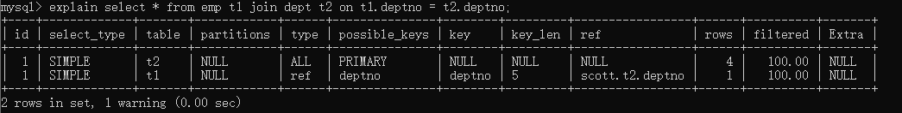
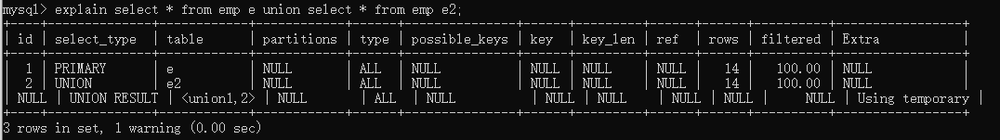

# MySQL

## MySQL服务架构


client发送请求到server，server的连接器处理请求，解析器（词法分析，语法分析）解析SQL，优化器（决定用哪个索引优化，决定多表关联时表的连接顺序等）优化SQL，执行器执行SQL。最后到达存储引擎，不同存放位置，不同文件格式。

ps：在老版本还会有缓存器存储缓存，但是由于缓存命中率较低，不推荐使用，所以后续删除了

## Redo日志-innodb存储引擎的日志文件
Redo log的存在保证了持久化这一事务特性
当向db写入数据时，先写入Redo log，然后再由redo log刷到磁盘中，同时生成redo log file，如果宕机，那么会读取磁盘上的 Redo log file进行恢复

某种方式指：
1.线程周期性任务，每10秒，将redo log buffer刷新到磁盘（包含未提交事务）
2.每秒，将redo log buffer刷新到磁盘‘
3.redo log buffer size空间小于$\frac12$（innodb_log_buffer_size参数），将redo log buffer刷新到磁盘
4.redo log file大小达到阈值

## 优化器优化方式
基于规则的优化(RBO)regular based optimise
基于成本的优化(CBO)cost based optimise

## 性能监控
**开启追踪时间，精确到小数点6位（此项已准备弃用）**
设置profiles属性：set profiling=1;
查看时间：show profiles;
查看时间细节：show profile;

**替代品：Performance Schema**
查看performance_schema状态
> SHOW VARIABLES LIKE 'performance_schema';

查看当前数据库
> show databases

查看当前db下所有表
> show tables

查看建表语句
> show create table 

**performance schema表分类**
```sql
--语句事件记录表，这些表记录了语句事件信息，当前语句事件表events_statements_current、历史语句事件表events_statements_history和长语句历史事件表events_statements_history_long、以及聚合后的摘要表summary，其中，summary表还可以根据帐号(account)，主机(host)，程序(program)，线程(thread)，用户(user)和全局(global)再进行细分)
show tables like '%statement%';

--等待事件记录表，与语句事件类型的相关记录表类似：
show tables like '%wait%';

--阶段事件记录表，记录语句执行的阶段事件的表
show tables like '%stage%';

--事务事件记录表，记录事务相关的事件的表
show tables like '%transaction%';

--监控文件系统层调用的表
show tables like '%file%';

--监视内存使用的表
show tables like '%memory%';

--动态对performance_schema进行配置的配置表
show tables like '%setup%';
```

**show processlist 查看连接池线程个数**

## schema与数据类型优化（发生于构建项目初期）
### 数据类型的优化
1.更小通常的更好
2.简单就好
> 尽量使用自带的数据类型，能用int不用string，能用date不用string,存ip的时候可以存整形，用INET_ATON()和INET_NTOA()进行转化 ，A address N number,提高效率和可读性用string，不然用整形

3.尽量避免null
> 可以为null使索引更加复杂，但是优化方便没必要，设计的时候要注意

4.实际细节
①整形类型
TINYINT:8（位）
SMALLINT:16（位）
MEDIUMINT:24（位）
INT:32（位）
BIGINT:64（位）
尽量使用满足需求最小数据类型，带大小参数的int不会影响具体存储长度

②字符串和字符串类型
CHAR:
最大长度255，会自动删除末尾的空格，检索效率，写效率会比varchar高，以空间换时间
场景：存储长度波动不大的数据，存储短字符串，经常更新的字符串

VARCHAR:
可变长度，varchar(n)小于等于255使用额外一个字节保存长度，n> 255使用额外两个字节保存长度
varchar(5)与varchar (255)保存同样的内容，硬盘存储空间系统，实际内存空间占用不同。varchar在mysql5.6之前变更长度，或者从255以下变成255以上时，会导致锁表
场景：内容长度不均，多字节字符，字符串更新很少

TEXT:
大文本

BLOB:
二进制

③datetime和timestamp
datetime占用8字节，与时区无关，保存到毫秒，保存时间范围大（1000-9999）
timestamp占用4字节，精确到秒，采用整形存储，时间范围1970-1-1到2038-1-19，设置时区，自动更新timestamp列的值
date占用字节数少，3字节，1000-1-1到9999-12-31之间，可以直接用日期函数计算

④枚举类型代替字符串
```sql
create table enum_test(e enum('fish','apple','dog') not null);
insert into enum_test(e) values('fish'),('apple'),('dog');
//修改
alter table enum_test modify val enum('fish','apple');
```
排序的时候根据enum值排序，实际存储存整形，如果一组可以规定的字符串，不会改变，可以使用enum

⑤特殊类型数据
IP地址，本质是32位无符号整数

## 合理使用范式和反范式
三范式（normal forms）规则
1NF（一范式）
每个分类不可继续拆分（每列的原子性）
1）有主键，且不为空
2）字段不能再分

2NF（二范式）
范式一基础上，每一个非主属性完全函数依赖于主键
1）满足1NF
2）表中每一个非主属性，必须完全依赖于本表主键
3）主键是联合索引的情况，如果其他属性只是依赖于主键部分，则不符合2NF

3NF（三范式）
范式二基础上，每个属性都应该与主键有直接关系，而不是间接关系

范式（遵循规则）
> 优点：
> 范式化的更新通常比反范式快
> 当数据较好的范式化后，很少或者没有冗余数据
> 范式化的数据比较小，可以放在内存中操作快
> 
> 缺点：
> 需要进行表关联

反范式（打破规则）
> 优点：
> 所有数据都在同一表中，可以避免关联
> 可以设计有效的索引
>
> 缺点：
> 冗余数据过多

**问题**
1.为什么要禁止三张表以上的join？
因为三张表可能数据量较大

## 主键的选择
### 代理主键
与业务无关

### 自然主键
事物属性中的自然唯一标识

### 推荐使用代理主键
好处：不与业务耦合，通用的键策略能够减少需要编写的源码数量，减少系统的总体拥有成本

## 字符集的选择
1.纯拉丁字符能表示的内容，没必要选择latin1以外的编码，因为会节省大量存储空间
2.如果确定不存放多种语言，没必要使用utf-8或者unicode，会造成空间浪费
3.mysql数据类型可以精确到字段，当需要存放多字节数据时，可以通过对不同表不同字段使用不同数据类型来减小数据量，降低IO次数增加命中率

ps ：单独设置utf8如果中文网站可能会出现乱码，常使用utf8mb4解决（most byte），主要处理四字节的内容，保证不产生乱码

## 存储引擎(数据文件的组织形式)的选择
默认innodb，可以在建表时候选择

### MyISAM VS InnoDB

|              | MyISAM     | Innodb                 |
| ------------ | ---------- | ---------------------- |
| 索引类型     | 非聚簇索引 | 聚簇索引               |
| 支持事务     | 否         | 是                     |
| 支持表锁     | 是         | 是                     |
| 支持行锁     | 否         | 是                     |
| 支持外键     | 否         | 是                     |
| 支持全文索引 | 是         | 是 after5.6            |
| 适合操作类型 | select     | update，delete，insert |

### 数据冗余
1.被频繁引用且只能通过join 2张（或者更多）大表的方式才能得到的独立小字段
2.这样的场景由于每次join仅仅只是为了取到某个小字段的值，Join到的记录大，造成不必要的IO，用空间去换时间

### 适当拆分
当大部分访问某张表时访问不到一个数据很大的大字段时，需要将表分离

### training table
```sql
create table dept(
    -- 部门编号
    deptno      int unsigned auto_increment primary key,
    -- 部门名称
    dname       varchar(15)     ,
    -- 部门所在位置
    loc         varchar(50)    
)engine = InnoDB;


创建 scott 数据库中的 emp 表
 create table emp(
    -- 雇员编号
    empno           int unsigned auto_increment primary key,
    -- 雇员姓名
    ename           varchar(15)     ,
    -- 雇员职位
    job             varchar(10)     ,
    -- 雇员对应的领导的编号
    mgr             int unsigned    ,
    -- 雇员的雇佣日期
    hiredate        date            ,
    -- 雇员的基本工资
    sal             decimal(7,2)    ,
    -- 奖金
    comm            decimal(7,2)    ,
    -- 所在部门
    deptno          int unsigned    ,
    foreign key(deptno) references dept(deptno)
)engine = innodb;


创建数据库 scott 中的 salgrade 表，工资等级表
create table salgrade(
    -- 工资等级
    grade       int unsigned    ,
    -- 此等级的最低工资
    losal       int unsigned    ,
    -- 此等级的最高工资
    hisal       int unsigned   
)engine=innodb;


创建数据库 scott 的 bonus 表，工资表
create table bonus(
    -- 雇员姓名
    ename       varchar(10),
    -- 雇员职位
    job         varchar(9),
    -- 雇员工资
    sal         decimal(7,2),
    -- 雇员资金
    comm        decimal(7,2)
)engine=innodb;

 


dept表中的数据
INSERT INTO dept VALUES (10,'ACCOUNTING','NEW YORK'); 
INSERT INTO dept VALUES (20,'RESEARCH','DALLAS'); 
INSERT INTO dept VALUES (30,'SALES','CHICAGO'); 
INSERT INTO dept VALUES (40,'OPERATIONS','BOSTON'); 


salgrade表中的数据
INSERT INTO salgrade VALUES (1,700,1200); 
INSERT INTO salgrade VALUES (2,1201,1400); 
INSERT INTO salgrade VALUES (3,1401,2000); 
INSERT INTO salgrade VALUES (4,2001,3000); 
INSERT INTO salgrade VALUES (5,3001,9999);


emp表中的数据
INSERT INTO emp VALUES  (7369,'SMITH','CLERK',7902,'1980-12-17',800,NULL,20);
INSERT INTO emp VALUES  (7499,'ALLEN','SALESMAN',7698,'1981-2-20',1600,300,30);
INSERT INTO emp VALUES  (7521,'WARD','SALESMAN',7698,'1981-2-22',1250,500,30);
INSERT INTO emp VALUES  (7566,'JONES','MANAGER',7839,'1981-4-2',2975,NULL,20);
INSERT INTO emp VALUES  (7654,'MARTIN','SALESMAN',7698,'1981-9-28',1250,1400,30);
INSERT INTO emp VALUES  (7698,'BLAKE','MANAGER',7839,'1981-5-1',2850,NULL,30);
INSERT INTO emp VALUES  (7782,'CLARK','MANAGER',7839,'1981-6-9',2450,NULL,10);
INSERT INTO emp VALUES  (7788,'SCOTT','ANALYST',7566,'87-7-13',3000,NULL,20);
INSERT INTO emp VALUES  (7839,'KING','PRESIDENT',NULL,'1981-11-17',5000,NULL,10);
INSERT INTO emp VALUES  (7844,'TURNER','SALESMAN',7698,'1981-9-8',1500,0,30);
INSERT INTO emp VALUES  (7876,'ADAMS','CLERK',7788,'1987-7-13',1100,NULL,20);
INSERT INTO emp VALUES  (7900,'JAMES','CLERK',7698,'1981-12-3',950,NULL,30);
INSERT INTO emp VALUES  (7902,'FORD','ANALYST',7566,'1981-12-3',3000,NULL,20);
INSERT INTO emp VALUES  (7934,'MILLER','CLERK',7782,'1982-1-23',1300,NULL,10);
```

### explain table

|    Column     |                    Meaning                     |
| :-----------: | :--------------------------------------------: |
|      id       |            The `SELECT` identifier             |
|  select_type  |               The `SELECT` type                |
|     table     |          The table for the output row          |
|  partitions   |            The matching partitions             |
|     type      |                 The join type                  |
| possible_keys |         The possible indexes to choose         |
|      key      |           The index actually chosen            |
|    key_len    |          The length of the chosen key          |
|      ref      |       The columns compared to the index        |
|     rows      |        Estimate of rows to be examined         |
|   filtered    | Percentage of rows filtered by table condition |
|     extra     |             Additional information             |
#### id
id表示运行顺序，同id从上到下，不同id从大到小

eg：
explain select * from emp t1 join dept t2 on t1.deptno = t2.deptno;


explain select * from emp e union select * from emp e2;

union的时候会显示null

#### select_type
查询的类型：普通查询，联合查询，子查询


#### table

#### partitions

#### type

#### possible_keys

#### key

#### key_len

#### ref

#### rows

#### filtered

#### Extra

## 名词
**索引下推**
减少回表次数