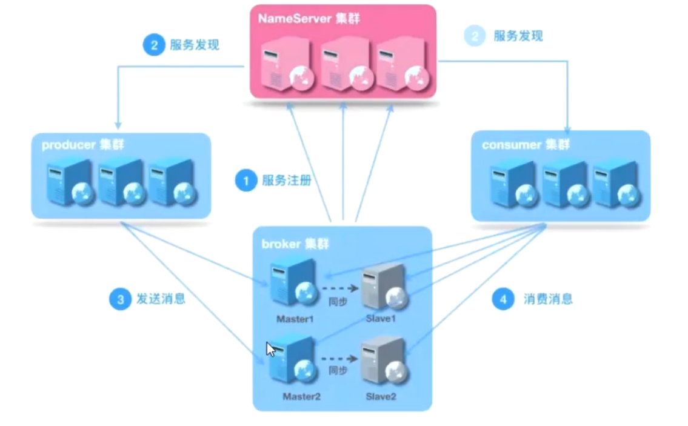
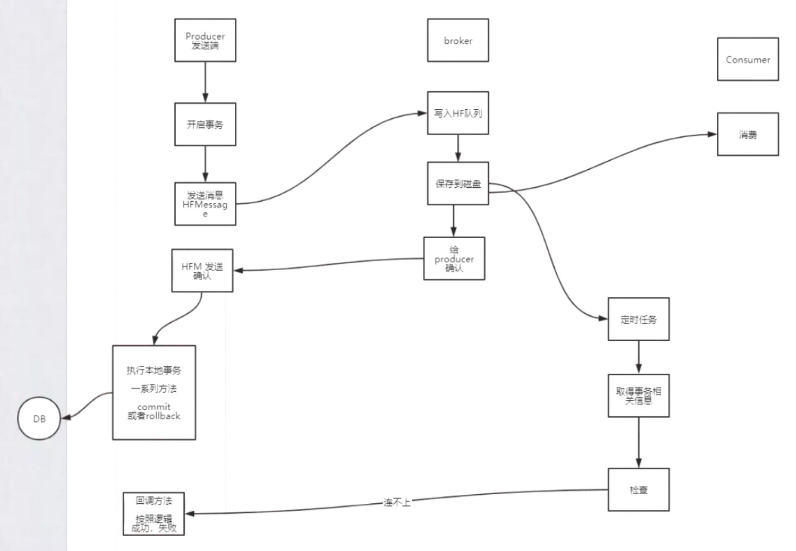

# RocketMQ

[官网](http://rocketmq.apache.org/)

[github](https://github.com/apache/rocketmq)

## 简单了解

### 特点

java开发的，分布式架构，当大量数据的时候可以选用，是一种消息中间件
对应用进行解耦，对流量进行削峰，数据异步消费
非jms标准

### 选型

| 特性       | ActiveMQ                                                     | RabbitMQ                                                     | RocketMQ                 | kafka                                                        |
| ---------- | ------------------------------------------------------------ | ------------------------------------------------------------ | ------------------------ | ------------------------------------------------------------ |
| 开发语言   | java                                                         | erlang                                                       | java                     | scala                                                        |
| 单机吞吐量 | 万级                                                         | 万级                                                         | 10万级                   | 10万级                                                       |
| 时效性     | ms级                                                         | us级                                                         | ms级                     | ms级以内                                                     |
| 可用性     | 高(主从架构)                                                 | 高(主从架构)                                                 | 非常高(分布式架构)       | 非常高(分布式架构)                                           |
| 功能特性   | 成熟的产品，在很多公司得到应用；有较多的文档；各种协议支持较好 | 基于erlang开发，所以并发能力很强，性能极其好，延时很低;管理界面较丰富 | MQ功能比较完备，扩展性佳 | 只支持主要的MQ功能，像一些消息查询，消息回溯等功能没有提供，毕竟是为大数据准备的，在大数据领域应用广 |

### 安装

#### 准备
The following softwares are assumed installed:

1. 64bit OS, Linux/Unix/Mac is recommended;(Windows user see guide below)
2. 64bit JDK 1.8+;
3. Maven 3.2.x;
4. 4g+ free disk for Broker server

### 应用场景

#### 解耦

AB应用不再互相依赖

#### 削峰，异步

流量高峰时期，使用限流算法控制流量，防止服务器瘫痪，但是会产生数据丢失
此时使用消息中间件可以保存数据，慢慢消费（异步），防止服务器瘫痪

#### 大数据风控
对数据的收集可以先放到MQ中，慢慢处理

### 特性
低延迟，面向金融的，行业可发展性，中立厂商，大数据友好，大量堆积

## 角色



### NameServer
收集其他角色信息（默认情况下数据存在内存，不会将数据进行持久化），各个nameserver之间不通讯，不保证数据一致性，如果下线，重启，可能导致数据不一致
定期（10s）清理不活跃（2分钟）的连接

底层使用netty（网络通讯框架）实现，提供了路由管理，服务注册发现功能，是一个无状态节点

#### 为什么不用zookeeper而使用nameserver作为服务注册发现中心呢？
因为根据CAP原则，zookeeper符合的是CP而不是AP，如果宕机会导致无法使用，而服务注册发现追求的就是高可用，可以牺牲一定的一致性，所以选择nameserver这种轻量级的注册中心

### producer
生产者
通过nameserver集群的一个节点，建立长连接，获取topic信息，找到对应的broker的master ip，定期（30s）查询信息
然后与broker的master建立长连接，写入信息，定期（30s）发送心跳

可以生产很多个topic下的消息

### consumer
消费者
通过nameserver集群的一个节点，建立长连接，获取topic信息，找到对应的broker的master/slave ips，定期（30s）查询信息
然后与master/slave都建立长连接，消费信息，定期（30s）发送心跳

consumer是集群式消费，两个group就会对订阅的同一topic消费两次，不管一个group有多少consumer，只要consumer类型是cluster，那么在同一group中就只会被消费一次

**持久化**
开启线程处理1s/次刷盘到consumerqueue，直到broker停止
开启线程每隔10ms（距离上一次刷盘完成后的10ms）刷盘到commitlog，直到broker停止

### broker
协调者，协调producer和consumer

每个broker节点在启动时，都会遍历nameserver列表，对所有nameserver进行一个服务注册和长连接，定时（30s）上报自己的topic信息（发送心跳）
定期（10s）清理不活跃（2分钟）的producer和consumer

心跳包内容：
header：broker id，name，addr，cluster name，haServerAddr
body：crc32校验，class过滤器，topic信息
同步定时开启线程发送心跳包

### broker集群
broker集群是主从模式，读写分离（slave只进行消息分发，不负责写入，写入的时候只能连master，但是slave分发时也会进行写操作，会通知master去写，master读写都可以）

master对应多个slave，HA使用raft协议进行选主（参考redis sentinel选主）
master和slave对应关系通过指定相同的brokerName，不同的brokerid来定义，brokerid为0表示master，其余为slave


**运作**
producer发送消息的时候，nameserver根据请求的topic发现broker在哪，并将ip告诉producer，producer再将数据丢到broker中，consumer消费消息的时候，根据Topic让nameserver去取对应的broker的ip，再发送给consumer

## API
[simple example](http://rocketmq.apache.org/docs/simple-example/)
[order example](http://rocketmq.apache.org/docs/order-example/)

### consumer
**ack**
```java
consumer.registerMessageListener(new MessageListenerConcurrently() {
            @Override
            public ConsumeConcurrentlyStatus consumeMessage(List<MessageExt> msgs, ConsumeConcurrentlyContext context) {
                System.out.printf("%s Receive New Messages: %s %n", Thread.currentThread().getName(), new String(msgs.get(0).getBody()));
                return ConsumeConcurrentlyStatus.CONSUME_SUCCESS;
            }
        });
```
ConsumeConcurrentlyStatus.CONSUME_SUCCESS 表示消息消费了
ConsumeConcurrentlyStatus.RECONSUME_LATER 表示之后再消费一次

**广播消息**
注意，不要在同一group中进行不一样的设置
理论上同一group中所有的配置应该相同，包括消费topic的配置

*消费多次*
consumer.setMessageModel(MessageModel.BROADCASTING);
消息的状态由consumer维护
重投机制失效，保证每个消费者消费一次

*消费一次*
consumer.setMessageModel(MessageModel.CLUSTERING);
消息的状态由broker维护
如果收到ack并且是success代表消息被成功消费，不然就要进行消息的重新投递

### producer
**同步消息**
```Java 
// 异步发送时 重试次数，默认 2
	producer.setRetryTimesWhenSendAsyncFailed(1);
	// 同步发送时 重试次数，默认 2
	producer.setRetryTimesWhenSendFailed(1);	
	
	// 是否向其他broker发送请求 默认false
	producer.setRetryAnotherBrokerWhenNotStoreOK(true);
```
*一对一*
producer.send(Message)
```java
    public static void main(String[] args) throws MQClientException, RemotingException, InterruptedException, MQBrokerException {
        DefaultMQProducer producer = new DefaultMQProducer("hi");
        producer.setNamesrvAddr("192.168.1.100:9876");
        producer.start();
        for(int i = 0;i < 100;i ++){
            SendResult topic = producer.send(new Message("Topic", ("hello world" + i).getBytes()), 1000);
            System.out.printf("%s %s%n", Thread.currentThread().getName(),topic);
        }
        producer.shutdown();
    }
```
*一对多*
producer.send(Collection)
批量消息最好不要超过1M，并且topic要是同一个topic
```java
    public static void main(String[] args) throws MQClientException, RemotingException, InterruptedException, MQBrokerException {
        DefaultMQProducer producer = new DefaultMQProducer("hi");
        producer.setNamesrvAddr("192.168.1.100:9876");
        producer.start();
        List<Message> list = new ArrayList<>();
        for(int i = 0;i < 100;i ++){
            list.add(new Message("Topic", ("hello world" + i).getBytes()));
        }
        SendResult topic = producer.send(list,1000);
        producer.shutdown();
    }
```

**异步消息**
producer.send(Message,SendCallBack)
```java
public static void main(String[] args) throws MQClientException, RemotingException, InterruptedException, MQBrokerException {
        DefaultMQProducer producer = new DefaultMQProducer("hi");
        producer.setNamesrvAddr("192.168.1.100:9876");
        producer.start();
        final CountDownLatch countDownLatch = new CountDownLatch(100);
        for(int i = 0;i < 100;i ++){
            producer.send(new Message("Topic", ("hello world" + i).getBytes()), new SendCallback() {
                @Override
                public void onSuccess(SendResult sendResult) {
                    countDownLatch.countDown();
                    System.out.println(sendResult);
                }
                @Override
                public void onException(Throwable e) {
                    e.printStackTrace();
                }
            });
        }
        countDownLatch.await();
        producer.shutdown();
    }
```

**单向（不可靠）消息，无需答复，如保存日志**
producer.sendOneWay(Message)

### 过滤消息
consumer.subscribe(String,String/MessageSelector);
第二个参数，既可以使用sql进行过滤，也可以使用tag进行过滤，注意，producer写入的时候要带tag
用sql92进行过滤的时候记得开启broker的sql查询参数enablePropertyFilter=true
[sql](http://rocketmq.apache.org/docs/filter-by-sql92-example/)

eg：

```java
//producer
      message.putUserProperty("age",String.valueOf(i));
//consumer
      consumer.subscribe("Topic",MessageSelector.bySql("age >= 10 and age <= 20"));
      consumer.subscribe("Topic","tagA");
```

## 保证消息的顺序消费
1.同一topic
2.同一queue
3.同一线程发送消息

producer.send(MESSAGE,SELECTOR,Object,Long)

comsumer用MessageListenerOrderly去接收

## 事务
[事务](http://rocketmq.apache.org/docs/transaction-example/)


**Half Message：**预处理消息，当broker收到此类消息后，会存储到RMQ_SYS_TRANS_HALF_TOPIC的消息消费队列中

**检查事务状态：**Broker会开启一个定时任务，消费RMQ_SYS_TRANS_HALF_TOPIC队列中的消息，每次执行任务会向消息发送者确认事务执行状态（提交、回滚、未知），如果是未知，等待下一次回调。

**超时：**如果超过回查次数，默认回滚消息

### TransactionListener的两个方法

#### executeLocalTransaction

半消息发送成功触发此方法来执行本地事务

#### checkLocalTransaction

broker将发送检查消息来检查事务状态，并将调用此方法来获取本地事务状态

#### 本地事务执行状态
**LocalTransactionState.COMMIT_MESSAGE**
执行事务成功，确认提交

**LocalTransactionState.ROLLBACK_MESSAGE**
回滚消息，broker端会删除半消息

**LocalTransactionState.UNKNOW**
暂时为未知状态，等待broker回查

```java
public static void main(String[] args) throws MQClientException {
        TransactionMQProducer transactionMQProducer = new TransactionMQProducer("tx_prodRR");
        transactionMQProducer.setNamesrvAddr("192.168.1.100:9876");
        //用来回查的线程池
        ThreadPoolExecutor threadPoolExecutor = new ThreadPoolExecutor(2, 4, 100, TimeUnit.SECONDS, new ArrayBlockingQueue<>(100), new ThreadFactory() {
            @Override
            public Thread newThread(Runnable r) {
                Thread thread = new Thread(r);
                thread.setName("client");
                return thread;
            }
        });

        transactionMQProducer.setExecutorService(threadPoolExecutor);

        //回调
        transactionMQProducer.setTransactionListener(new TransactionListener() {
            @Override
            //执行本地事务
            public LocalTransactionState executeLocalTransaction(Message msg, Object arg) {
                System.out.println("msg body: " + new String(msg.getBody()));
                System.out.println("msg transaction id: " + msg.getTransactionId());
                System.out.println("thread name : " + Thread.currentThread().getName());
                return LocalTransactionState.UNKNOW;
            }

            @Override
            //broker将发送检查消息来检查事务状态，并将调用此方法来获取本地事务状态
            public LocalTransactionState checkLocalTransaction(MessageExt msg) {
                System.out.println("msg body: " + new String(msg.getBody()));
                System.out.println("msg transaction id: " + msg.getTransactionId());
                System.out.println("thread name : " + Thread.currentThread().getName());
                return LocalTransactionState.UNKNOW;
                //return LocalTransactionState.ROLLBACK_MESSAGE;
                //return LocalTransactionState.UNKNOW;
            }
        });

        transactionMQProducer.start();
        transactionMQProducer.sendMessageInTransaction(new Message("TopicTD","ASGA".getBytes()),null);
//        transactionMQProducer.shutdown();
    }
```

### 如何保持分布式系统数据最终一致性

使用分布式事务提交算法，rocketmq使用二阶段提交

**2PC（二阶段提交）**

准备阶段和提交阶段

维护一个数据的数据状态，开始为不可用状态，二次提交的时候变为可用，如果事务回滚就取消发布数据

首先 2PC 是一个**同步阻塞协议**，像第一阶段协调者会等待所有参与者响应才会进行下一步操作，当然第一阶段的**协调者有超时机制**，假设因为网络原因没有收到某参与者的响应或某参与者挂了，那么超时后就会判断事务失败，向所有参与者发送回滚命令。

在第二阶段协调者的没法超时，只能不断重试！

问题

协调者会产生单点故障问题，会造成获取到的资源无法释放，解决的话通过主备模式+日志去解决

总结

2PC 是一种**尽量保证强一致性**的分布式事务，因此它是**同步阻塞**的，而同步阻塞就导致长久的资源锁定问题，**总体而言效率低**，并且存在**单点故障**问题，在极端条件下存在**数据不一致**的风险。

**3PC（三阶段提交）**

准备阶段、预提交阶段和提交阶段
3PC准备阶段协调者只检查参与者的状态，预提交时将数据先提交到数据库，不提交事务，提交阶段提交事务

准备阶段的变更成不会直接执行事务，而是会先去询问此时的参与者是否有条件接这个事务，因此不会一来就干活直接锁资源，使得在某些资源不可用的情况下所有参与者都阻塞着。

3PC在2PC的基础上引入了参与者超时机制，来处理协调者宕机的问题。那么引入了超时机制，参与者就不会傻等了，如果是等待提交命令超时，那么参与者就会提交事务了，因为都到了这一阶段了大概率是提交的，如果是等待预提交命令超时，那该干啥就干啥了，反正本来啥也没干。

然而超时机制也会带来数据不一致的问题，比如在等待提交命令时候超时了，参与者默认执行的是提交事务操作，但是有可能执行的是回滚操作，这样一来数据就不一致了。

从维基百科上看，3PC 的引入是为了解决提交阶段 2PC 协调者和某参与者都挂了之后新选举的协调者不知道当前应该提交还是回滚的问题。

3PC主要还是解决2PC在提交时由于调度者宕机而产生的阻塞问题，未解决数据不一致的问题

**TCC（try confirm cancel）（补偿事务）**

数据库锁定一个数据的数据状态，提交的时候解锁，或者cancel的时候回滚

如果提交不成功或者cancel失败，会多次尝试

**TCC 2PC区别**
如果拿TCC事务的处理流程与2PC两阶段提交做比较，2PC通常都是在跨库的DB层面，而TCC则在应用层面的处理，需要通过业务逻辑来实现。这种分布式事务的实现方式的优势在于，可以让应用自己定义数据操作的粒度，使得降低锁冲突、提高吞吐量成为可能。

**XA协议**
https://blog.csdn.net/weixin_32822759/article/details/106585407

## 对比jms的Topic和Queue
jms标准的Topic是一种广播形式的消息，Queue是一种单次消费的消费
而RocketMQ中没有广播形式的消息，物理上只有Queue这一种消息形式，但是在消费的时候可以对消息进行设置达到广播的效果
RocketMQ中的Topic是逻辑上的概念，它包含了很多Queue，可以同时消费一个Topic，也就是一组Queue，也可以单独消费单个Queue，Topic内容可以在多台broker中，每台broker也可以有多个topic，多对多关系

## RocketMQ的消息存储

存储模式：通过文件系统持久化数据

### M.2 NVME协议的磁盘存储

写入速度3G/s，随机读写2G/s

### RocketMQ为什么快？

使用了数据零拷贝技术，调用内核的sendfile方法，在java中调用MappedByteBuffer类（对标linux mmap方法）

1.java中的MappedByteBuffer类读取的数据大小还是有限制的
2.当文件超出1.5G的时候可以通过position去定位
3.RocketMQ使用的时候每个commitLog文件大小都控制在1G，超过1G会重新建立新文件

## 数据存储
除index是时间为文件名外，其余数据存储的文件名均为offset偏移量

### commitLog
存储堆积的真实的数据

### config
json形式存储了各种配置信息，例如过滤器配置，消费进度，topic的信息，延迟消费的进度，订阅组信息

### consumequeue
基于topic的commitlog索引文件
consumequeue文件采取定长设计，每一个条目共20个字节，分别为8字节的commitlog物理偏移量、4字节的消息长度、8字节tag hashcode，单个文件由30W个条目组成，可以像数组一样随机访问每一个条目，每个ConsumeQueue文件大小约5.72M

### index
存储索引，通过key或时间区间去查询

## 消息分配策略

[策略](https://blog.csdn.net/yewandemty/article/details/81989695)

平均分配策略

环形分配策略

机房分配策略：就近分配原则/指定机房模式（指定某几个机房，可能有机房消费不到）

一致性hash策略

手动分配

## NameServer原理
**职责**
提供服务的注册发现

**特点**
无状态，不开启持久化的情况下不会持久化数据
集群节点间不会通讯，数据不同步

**如何保证高可用**
通过启动多个nameserver集群保证高可用，虽然说是集群，实际上，namesever为了保证速度的极致，并不会互相通讯，broker需要向每一台nameserver进行注册，nameserver每隔10秒会监测broker的心跳，将超过2分钟没有心跳的broker剔除。
producer如果通过nameserver找到的broker不可用，那么数据就会发送失败，producer每隔30s会从nameserver上更新broker的数据，消息发送失败时会进行重投，保证数据投递到依然存活的broker中
comsumer如果通过nameserver找到的broker不可用，那么comsumer每隔30s会从nameserver上更新broker的数据，找到其他broker进行消费，因为broker是主从复制的架构，所以保证了从任何一台broker中获取的数据都是一致的

## 产生消息重复消费的原因
1.consumer重平衡（重平衡是由于某台group中的机器下线导致重新分配消息）
2.拉取broker的时候由于网络原因，延迟收到了consumer的ack，导致消息的重投递
3.consumer group中消费模式的设定不一致导致消息重复消费

## 解决消息重复消费的方案（通用）
### 数据库表
处理消息前，使用消息主键在表中带有约束的字段中insert

### Map
单机时可以使用map *ConcurrentHashMap* -> putIfAbsent   guava cache

### Redis
使用主键或set操作

## 杂项
### 轮询，长链接，长轮询
rocketmq的consumer使用长轮询

**轮询**
每隔一段时间client都会向服务器发送请求获取数据，不管数据是否存在，服务器都会进行一个返回
优点是查询之后连接关闭，不需要维护客户端的状态
缺点是轮询查询造成服务器无用查询过多，压力大，数据延迟

**长连接**
client与sever建立长连接，长连接是双向的，可以互相发送数据
优点是实时
缺点是要维护很多连接，维护客户端的状态，服务器压力很大，服务器不知道客户端消费能力，盲目推送数据可能导致客户端消费不了，然后经过一段时间数据无法消费回退给server进行重投

**长轮询**
客户端向服务器发送请求获取数据，服务器有数据就返回，没数据就挂起，等待数据，直到有数据才返回
优点是实时，并且不会产生客户端接收数据消费不了的问题

# 源码
里面频繁的offset就是索引

## consumer
### PullRequest

拉回来的报文处理类，记录一个topic对应的consumergroup的拉取进度，包括MessageQueue和ProcessQueue，还有拉取的offset

### MessageQueue
元数据信息

### ProcessQueue
真正处理数据的Queue

### OffsetStore
偏移，两个具体实现，对于Clustering的消费模式，从broker中拉取，对于broadcast的消费模式，从本地文件拉取

### PullResult
从broker回来的结果类，包含了消息和offset还有状态

### startScheduledTask() 
设置了一些定时任务
1.如果nameserver没给定，会定时去动态获取nameserver，频率2min/次
2.从nameserver更新路由信息（consumer，producer，topic信息），30s/次
3.清理下线的broker，给broker发送心跳，30s/次
4.同步consumer的消费进度，5s/次
5.调整线程池数量，1s/次（内部方法未实现）

### ps
1.pull下来的queue超过100M的，超过1000个的，都会延迟执行防止拉取过快消费不了

## broker
### initialize()
1.加载topic
2.初始化线程池
3.初始化一些定时任务
> 1.更新broker状态，统计每天消息量，24h/次
> 2.更新consumerOffset信息，5s/次
> 3.更新consumerFilter信息，10s/次
> 4.保护broker，定时检查当前消费组消费消息的进度，超过阈值剔除订阅组，3m/次
> 5.打印水印，各个队列的任务大小以及最早的放入时间，1s/次
> 6.打印已经存储在commitlog中但是没有调度到消费队列的字节数，1m/次
> 7.如果nameserver没给定，会定时去动态获取nameserver的服务列表，频率2min/次
> 8.1如果是从，拉取主的数据，60s/次
> 8.2如果是主，打印主从数据差距，60s/次

4.初始化tls连接
5.初始化事务
6.初始化权限控制
7.初始化远程调用

### doFlush()（重要）
开启线程处理1s/次刷盘到consumerqueue，直到broker停止
开启线程每隔10ms（距离上一次刷盘完成后的10ms）刷盘到commitlog，直到broker停止

## Nameserver
请求先进入netty服务器，然后netty转发到DefaultRequestProcessor类中进行处理

### RouteInfoManager

管理路由消息

### clusterAddrTable(Map)
集群相关信息

### brokerAddrTable(Map)

broker元数据信息

### BrokerLiveInfo

存活的broker列表

### TopicRouteData

根据topic返回给producer和comsumer的信息，包含了QueueData和BrokerData，filterServiceTable

### QueueData
queue元数据信息

brokerName
readQueueNums
writeQueueNums
perm
topicSyncFlag

### BrokerData

cluster
brokerName
HashMap<brokerid,addrs>brokerAddrs

