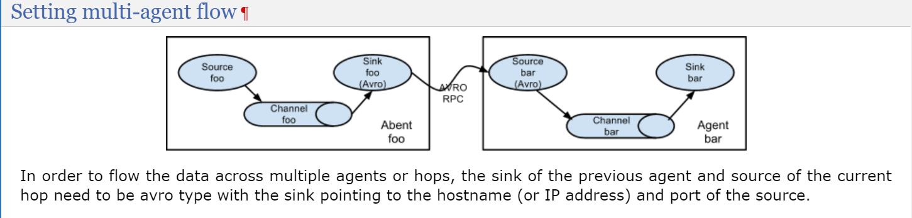

# Flume

是一个分布式的，可靠的，高可用的有效的统计，收集，移动大数据的日志收集器

[flume](https://cwiki.apache.org/confluence/display/FLUME)

[架构图](https://flume.apache.org/FlumeDeveloperGuide.html)

## 架构

Flume以事件为单位处理数据，Flume引擎包含有三个角色，source，channel和sink

source负责接收事件，可能是来自于web server也可能来自于其他的（只要实现了Event接口就行），然后将数据放入各种各样的channel中，例如FileChannel等，channel用于存储数据，用于使source和sink异步执行，sink用于消费channel中的数据，消费完后移除数据，并放入对应的目的地中，例如HDFS（如果使用的sink是HDFSEventSink的话）。

## 可靠性

Flume的可靠性从两个点保证，端对端和点对点

因为Flume单个元件可以接它自己或者接目的地，所以在端对端传输的时候，sink会保证数据落到目的地之后，再将event进行删除

对于点对点的传输，source和sink封装了event的存储和提取在channel提供的事务中，来保证event的不丢失

## 实操

配置JAVA_HOME

https://flume.apache.org/releases/content/1.9.0/FlumeUserGuide.html

搭建一个两台的flume集群



node02配置

```properties
# Name the components on this agent
a1.sources = r1
a1.sinks = k1
a1.channels = c1

# Describe/configure the source
a1.sources.r1.type = netcat
a1.sources.r1.bind = node02
a1.sources.r1.port = 44444

# Describe the sink
a1.sinks.k1.type = avro
a1.sinks.k1.hostname = node03
a1.sinks.k1.port = 10086

# Use a channel which buffers events in memory
a1.channels.c1.type = memory
a1.channels.c1.capacity = 1000
a1.channels.c1.transactionCapacity = 100

# Bind the source and sink to the channel
a1.sources.r1.channels = c1
a1.sinks.k1.channel = c1
```

node03配置
```properties
# Name the components on this agent
a1.sources = r1
a1.sinks = k1
a1.channels = c1

# Describe/configure the source
a1.sources.r1.type = avro
a1.sources.r1.bind = node03
a1.sources.r1.port = 10086

# Describe the sink
a1.sinks.k1.type = logger

# Use a channel which buffers events in memory
a1.channels.c1.type = memory
a1.channels.c1.capacity = 1000
a1.channels.c1.transactionCapacity = 100

# Bind the source and sink to the channel
a1.sources.r1.channels = c1
a1.sinks.k1.channel = c1
```

启动

```shell
flume-ng agent --conf-file example.conf --name a1 -Dflume.root.logger=INFO,console
```

### 配置一个读文件并且输出到HDFS的Flume

node02配置

```properties
# Name the components on this agent
a1.sources = r1
a1.sinks = k1
a1.channels = c1

# Describe/configure the source
a1.sources.r1.type = TAILDIR
a1.sources.r1.filegroups = f1
a1.sources.r1.filegroups.f1 = /opt/data/access.log
a1.sources.r1.positionFile =/var/log/flume/taildir_position.json
a1.sources.r1.fileHeader = true
# Describe the sink
a1.sinks.k1.type = avro
a1.sinks.k1.hostname = node03
a1.sinks.k1.port = 10086

# Use a channel which buffers events in memory
a1.channels.c1.type = memory
a1.channels.c1.capacity = 1000
a1.channels.c1.transactionCapacity = 100

# Bind the source and sink to the channel
a1.sources.r1.channels = c1
a1.sinks.k1.channel = c1
```

node03配置

```properties
# Name the components on this agent
a1.sources = r1
a1.sinks = k1
a1.channels = c1

# Describe/configure the source
a1.sources.r1.type = avro
a1.sources.r1.bind = node03
a1.sources.r1.port = 10086

# Describe the sink
a1.sinks.k1.type = hdfs
a1.sinks.k1.hdfs.path = /log/test1/%y%m%d
a1.sinks.k1.hdfs.rollInterval = 0
a1.sinks.k1.hdfs.rollSize = 10240
a1.sinks.k1.hdfs.rollCount = 0
a1.sinks.k1.hdfs.idleTimeout = 60
a1.sinks.k1.hdfs.fileType = DataStream
a1.sinks.k1.hdfs.useLocalTimeStamp = true

# Use a channel which buffers events in memory
a1.channels.c1.type = memory
a1.channels.c1.capacity = 1000
a1.channels.c1.transactionCapacity = 100

# Bind the source and sink to the channel
a1.sources.r1.channels = c1
a1.sinks.k1.channel = c1
```

启动

```shell
flume-ng agent --conf-file example.conf --name a1 -Dflume.root.logger=INFO,console
```

