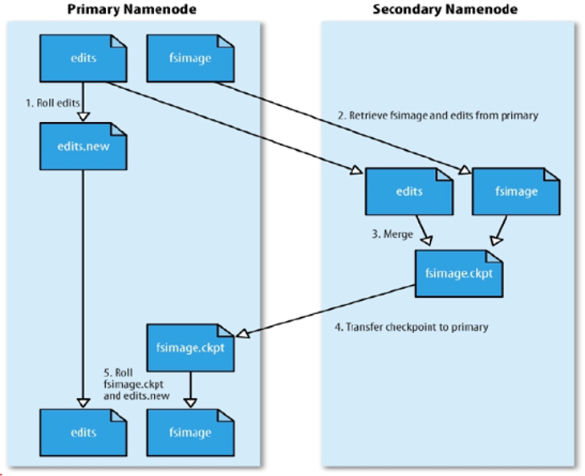
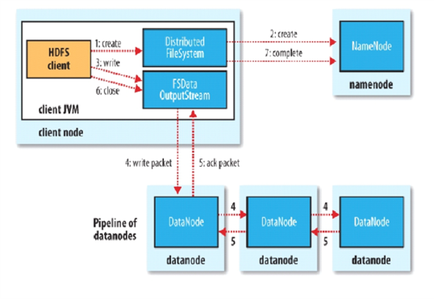
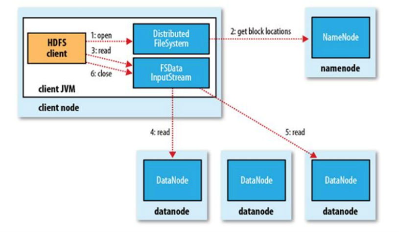

# 核心思想

- 分而治之
- 并行计算
- 计算向数据移动
- 数据本地化读取

# Hadoop

hadoop是apache旗下的顶级项目

大数据生态：[cloudera](https://www.cloudera.com/)

##  [官网](http://hadoop.apache.org/)

## 思考

单机的瓶颈在哪？

磁盘IO

## HDFS

### 思考

文件系统那么多，为什么hadoop项目中还要开发一个hdfs文件系统？

为了支持分布式计算

### 存储模型

- 文件线性按字节切割成块，有offset，id
- 文件与文件的block大小可以不一样
- 一个文件除最后一个block，其他block大小一致
- 单个文件block大小相等，除了最后一个block
- block大小依据硬件的I/O特性调整
- block被分散存放在集群的节点中，具有location
- block具有副本，没有主从概念，副本不能出现在同一节点
- 副本是满足可靠性和性能的关键
- 文件上传可以指定block大小和副本数，上传后只能修改副本数
- 一次写入多次读取，不支持修改
- 支持追加数据

### 架构设计

- 主从架构
- 由NameNode和一些DataNode组成
- 面向文件包含：文件数据和文件元数据
- NameNode负责存储和管理文件元数据，并维护了一个层次型的文件目录树
- DataNode负责存储文件数据（Block块），并提供block的读写
- DataNode与NameNode维护心跳，并汇报自己持有的block信息
- Client和NameNode交互文件元数据和DataNode交互文件block数据

### NameNode和DataNode

NameNode
> 完全基于内存存储文件元数据，目录结构，文件block的映射
> 需要持久化方案
> 提供副本放置策略：
>
> > 第一个副本：放置在上传文件的DN，如果是集群外提交，则随机挑选一台磁盘不太满，CPU不太忙的节点
> >第二个副本：放置在于第一个副本不同的机架的节点上
> > 第三个副本：与第二个副本相同机架的节点
> > 更多副本：随机节点

DataNode
> 基于本地磁盘存储block（文件形式）
> 并保存block的校验和数据保证block的可靠性
> 与NameNode保持心跳，汇报block列表状态

#### 元数据持久化
EditsLog：日志（恢复速度慢，实时保存，体积膨胀）
FsImage：镜像，快照（恢复速度块，容易丢失数据，体积小）

**FI时点的滚动更新**
第一次开机的时候只写一次FI，假设8到9之间的增量EL，去分析EL，再根据当前FI进行合并

**安全模式**

- HDFS搭建时会格式化，格式化操作会产生一个空的FsImage

- 当NameNode启动时，它从硬盘中读取EditLog和FsImage

- 将所有Editlog中的事务作用在内存中的FsImage上

- 并将这个新版本的FsImage从内存中保存到本地磁盘上

- 然后删除旧的Editlog

  

- NameNode启动后会进入安全模式

- 安全模式的NameNode不会进行数据块复制
- NameNode从所有的DataNode接收心跳信号和块状态报告
- 每当NameNode检测确认某个数据块的副本数目达到这个最小值，那么该数据块就会被认为是副本安全的
- 在一定百分比的数据块被NameNode检测确认是安全之后（再加上一个额外的30s等待时间），NameNode将退出安全模式状态
- 接下来它会确定还有哪些数据块的副本没有达到指定数目，并将这些数据块复制到其他DataNode上

**SecondaryNameNode（SNN）**

- 在非HA模式下（2.x有HA模式），SNN一般是独立的节点，周期完成对NN的Editlog向FsImage合并，减少EditLog大小，减少NN启动时间
- 根据配置文件设置的时间间隔fs.checkpoint.period 默认3600秒
- 根据配置文件设置EditLog大小fs.checkpoint.size 规定edits文件的最大默认值是64MB

如图

### HDFS写流程

- Client和NN连接创建文件元数据
- NN判定元数据是否有效
- NN处发副本放置策略，返回一个有序的DN列表
- Client和DN建立Pipeline连接
- Client将块切分成packet（64KB），并使用chunk（512B）+chucksum（4B）填充
- Client将packet放入发送队列dataqueue中，并向第一个DN发送
- 第一个DN收到packet后本地保存并发送给第二个DN
- 第二个DN收到packet后本地保存并发送给第三个DN
- 这一个过程中，上游节点同时发送下一个packet
- 生活中类比工厂的流水线：结论：流式其实也是变种的并行计算
- Hdfs使用这种传输方式，副本数对于client是透明的
- 当block传输完成，DN们各自向NN汇报，同时client继续传输下一个block
- 所以，client的传输和block的汇报也是并行的

### HDFS读流程

 

- 为了降低整体的带宽消耗和读取延时，HDFS会尽量让读取程序读取离它最近的副本。
- 如果在读取程序的同一个机架上有一个副本，那么就读取该副本。
- 如果一个HDFS集群跨越多个数据中心，那么客户端也将首先读本地数据中心的副本。
- 语义：下载一个文件：
-- Client和NN交互文件元数据获取fileBlockLocation
-- NN会按距离策略排序返回
-- Client尝试下载block并校验数据完整性
- 语义：下载一个文件其实是获取文件的所有的block元数据，那么子集获取某些block应该成立
-- Hdfs支持client给出文件的offset自定义连接哪些block的DN，自定义获取数据
-- 这个是支持计算层的分治、并行计算的核心

# 杂项

## 服务器类型
塔式：竖直长方体
机架：扁直长方体
刀片：刀片式服务器可以一片一片的叠放在机柜上

