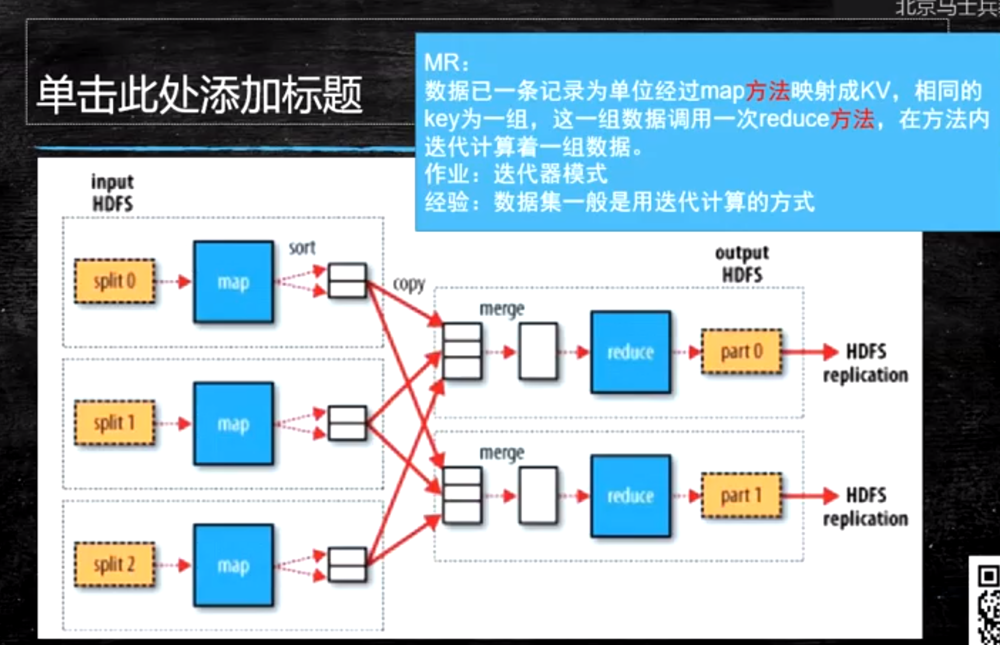

# 核心思想

- 分而治之
- 并行计算
- 计算向数据移动
- 数据本地化读取

# Hadoop

hadoop是apache旗下的顶级项目

大数据生态：[cloudera](https://www.cloudera.com/)

##  [官网](http://hadoop.apache.org/)

## 思考

单机的瓶颈在哪？

磁盘IO

## HDFS

### 思考

文件系统那么多，为什么hadoop项目中还要开发一个hdfs文件系统？

为了支持分布式计算

### 存储模型

- 文件线性按字节切割成块，有offset，id
- 文件与文件的block大小可以不一样
- 一个文件除最后一个block，其他block大小一致
- 单个文件block大小相等，除了最后一个block
- block大小依据硬件的I/O特性调整
- block被分散存放在集群的节点中，具有location
- block具有副本，没有主从概念，副本不能出现在同一节点
- 副本是满足可靠性和性能的关键
- 文件上传可以指定block大小和副本数，上传后只能修改副本数
- 一次写入多次读取，不支持修改
- 支持追加数据

### 架构设计

- 主从架构
- 由NameNode和一些DataNode组成
- 面向文件包含：文件数据和文件元数据
- NameNode负责存储和管理文件元数据，并维护了一个层次型的文件目录树
- DataNode负责存储文件数据（Block块），并提供block的读写
- DataNode与NameNode维护心跳，并汇报自己持有的block信息
- Client和NameNode交互文件元数据和DataNode交互文件block数据

### NameNode和DataNode

NameNode
> 完全基于内存存储文件元数据，目录结构，文件block的映射
> 需要持久化方案
> 提供副本放置策略：
>
> > 第一个副本：放置在上传文件的DN，如果是集群外提交，则随机挑选一台磁盘不太满，CPU不太忙的节点
> >第二个副本：放置在于第一个副本不同的机架的节点上
> > 第三个副本：与第二个副本相同机架的节点
> > 更多副本：随机节点

DataNode
> 基于本地磁盘存储block（文件形式）
> 并保存block的校验和数据保证block的可靠性
> 与NameNode保持心跳，汇报block列表状态

#### 元数据持久化
EditsLog：日志（恢复速度慢，实时保存，体积膨胀）
FsImage：镜像，快照（恢复速度块，容易丢失数据，体积小）

**FI时点的滚动更新**
第一次开机的时候只写一次FI，假设8到9之间的增量EL，去分析EL，再根据当前FI进行合并

**安全模式**

- HDFS搭建时会格式化，格式化操作会产生一个空的FsImage

- 当NameNode启动时，它从硬盘中读取EditLog和FsImage

- 将所有Editlog中的事务作用在内存中的FsImage上

- 并将这个新版本的FsImage从内存中保存到本地磁盘上

- 然后删除旧的Editlog

  

- NameNode启动后会进入安全模式

- 安全模式的NameNode不会进行数据块复制
- NameNode从所有的DataNode接收心跳信号和块状态报告
- 每当NameNode检测确认某个数据块的副本数目达到这个最小值，那么该数据块就会被认为是副本安全的
- 在一定百分比的数据块被NameNode检测确认是安全之后（再加上一个额外的30s等待时间），NameNode将退出安全模式状态
- 接下来它会确定还有哪些数据块的副本没有达到指定数目，并将这些数据块复制到其他DataNode上

**SecondaryNameNode（SNN）**

- 在非HA模式下（2.x有HA模式），SNN一般是独立的节点，周期完成对NN的Editlog向FsImage合并，减少EditLog大小，减少NN启动时间
- 根据配置文件设置的时间间隔fs.checkpoint.period 默认3600秒
- 根据配置文件设置EditLog大小fs.checkpoint.size 规定edits文件的最大默认值是64MB

如图


### HDFS写流程


- Client和NN连接创建文件元数据
- NN判定元数据是否有效
- NN触发副本放置策略，返回一个有序的DN列表
- Client和DN建立Pipeline连接
- Client将块切分成packet（64KB），并使用chunk（512B）+chucksum（4B）填充
- Client将packet放入发送队列dataqueue中，并向第一个DN发送
- 第一个DN收到packet后本地保存并发送给第二个DN
- 第二个DN收到packet后本地保存并发送给第三个DN
- 这一个过程中，上游节点同时发送下一个packet
- 生活中类比工厂的流水线：结论：流式其实也是变种的并行计算
- Hdfs使用这种传输方式，副本数对于client是透明的
- 当block传输完成，DN们各自向NN汇报，同时client继续传输下一个block
- 所以，client的传输和block的汇报也是并行的

### HDFS读流程

 

- 为了降低整体的带宽消耗和读取延时，HDFS会尽量让读取程序读取离它最近的副本。
- 如果在读取程序的同一个机架上有一个副本，那么就读取该副本。
- 如果一个HDFS集群跨越多个数据中心，那么客户端也将首先读本地数据中心的副本。
- 语义：下载一个文件：
  -- Client和NN交互文件元数据获取fileBlockLocation
  -- NN会按距离策略排序返回
  -- Client尝试下载block并校验数据完整性
- 语义：下载一个文件其实是获取文件的所有的block元数据，那么子集获取某些block应该成立
  -- Hdfs支持client给出文件的offset自定义连接哪些block的DN，自定义获取数据
  -- 这个是支持计算层的分治、并行计算的核心

## Hadoop模式

**local 非分布式（debug）**
**pseudo distribute 伪分布式**
单节点 每个角色一个进程，放在一个机器
**full distribute 完全分布式（线上使用）**
单节点每个角色分开放到不同机器

## 实操

https://hadoop.apache.org/docs/stable/hadoop-project-dist/hadoop-common/SingleCluster.html

### 基础设施

**设置静态路由**

```sh
vim /etc/sysconfig/network-scripts/ifcfg-eth0
DEVICE=eth0
ONBOOT=yes
IPADDR=192.168.1.23
NETMASK=255.255.255.0
GATEWAY=192.168.1.1
DNS1=114.114.114.114
```

**设置主机名**

```sh
vim /etc/sysconfig/network

#####################
NETWORKING=yes
HOSTNAME=node01
########### 或者
hostnamectl  set-hostname hostname
```

**设置host映射**

```sh
vim /etc/hosts

#####################
192.168.1.23 node01
192.168.1.46 node02
```

**关闭防火墙**

**时间同步**

**安装jdk**

**设置SSH免秘钥**

### Hadoop部署

**下载**

**配置环境变量**

```sh
export HADOOP_HOME=/xxx/xxx/x
export PATH=$PATH:$HADOOP_HOME/bin:$HADOOP_HOME/sbin
```

**修改配置文件**

etc/hadoop/core-site.xml:（配置nn位置）

```xml
<configuration>
    <property>
        <name>fs.defaultFS</name>
        <value>hdfs://localhost:9000</value>
    </property>
</configuration>
```

etc/hadoop/hdfs-site.xml:（配置副本， 设置保险的目录防止nn，dn，sn数据丢失）

```xml
<configuration>
    <property>
        <name>dfs.replication</name>
        <value>1</value>
    </property>
    <property>
        <name>dfs.namenode.name.dir</name>
        <value>/var/bigdata/hadoop/local/dfs/name</value>
    </property>
    <!-- 原始的目录存放于临时文件夹中，非常不安全 -->
    <property>
        <name>dfs.datanode.data.dir</name>
        <value>/var/bigdata/hadoop/local/dfs/data</value>
    </property>
    <property>
        <name>dfs.namenode.secondary.http-address</name>
        <value>node01:9868</value>
    </property>
    <property>
        <name>dfs.namenode.checkpoint.dir</name>
        <value>/var/bigdata/hadoop/local/dfs/namesecondary</value>
    </property>
</configuration>
```

etc/hadoop/workers（dn位置）

```xml
node01
```

### 初始化和使用

见官网

**格式化硬盘(初始化nn，创建nn目录)**

```sh
bin/hdfs namenode -format
# 其中nn的clusterId相同才能连接对应的dn
```

**第一次启动创建dn和snn目录（启动时）**

```sh
start-dfs.sh
```

**修改配置项**

**访问node01:9870端口有页面显示**

**使用（使用dfs子命令，类似于linux的文件系统）**

```sh
hdfs dfs -help
hdfs dfs -put xxx.zip /directory
hdfs dfs -mkdir /bigdata
hdfs dfs -mkdir -p /user/root
hdfs dfs -dfs.blocksize
# 可以注意到datanode里面有meta 校验和 文件（block）
```

**注意**

psdh默认采用rsh登陆，要用ssh登陆要修改下

export PDSH_RCMD_TYPE=ssh

## HA

单点产生的两个问题（单独问题）？

1. 单点故障

   > 高可用方案，主备切换

2. 压力过大

   > 联邦机制：Federation（元数据分片）
   >
   > 多个NN，管理不同的元数据

### 单点故障问题解决

HDFS通过实现了Paxos协议的JN（分布式存储）实现分布式存储通讯，用于同步editslog，保证数据最终一致性

写数据时，主NN向JN写数据，等待JN返回，备机会读取JN（JournalNode）中的数据

JN实现：主从模式，通过Paxos协议进行数据传递和保证数据一致性

HDFS通过实现了ZAB协议的ZK实现分布式协调，快速选择主节点

.png)

ZK客户端的FailoverController 会干一些事情，并且与NN存在同一个物理机上，保证监控的准确性

1.初始化的时候，所有FailoverController 会抢锁，先抢到锁的作为active，其他为standby NN

2.FailoverController 检测当前master NN是否宕机，如果宕机，则删除当前在ZK上的临时节点，触发事件回调机制，回调之前其他FailoverController 在ZK上注册的事件

3.其他机器接收到事件先进行主存活判断（连接主IP的NN查看是否真正死亡），如果真正死亡就将自己设置成master；如果由于FailoverController宕机造成的删除事件，则将当前的master降级成standby，然后将自己本机设成standby；如果由于FailoverController网与主机NN不通产生的问题，无法将当前升级成master。


#### HA模式下的SNN

1.HA模式不存在SNN，备机的NN会定时做出fsimage给主机

2.非HA模式下，SNN定期拉取editslog去合并，而HA模式NN通过JournalNode实时同步editslog

#### HA下的角色

ACTIVE，STANDBY，JN,ZK，FailoverController（ZKFC）

### 压力过大，内存受限问题解决

联邦制解决，元数据分治，复用DN存储，DN使用目录隔离block（DN会为每个NN创建一个目录 ）

**注意**

访问的时候要搭建一个中转（中台 ）去访问，抽象层

### HA模式搭建

[HA](https://hadoop.apache.org/docs/stable/hadoop-project-dist/hadoop-hdfs/HDFSHighAvailabilityWithQJM.html)

#### 目标

|        | NN   | JN   | DN   | ZK   | ZKFC | NM   | RS   |
| :----- | ---- | ---- | ---- | ---- | ---- | ---- | ---- |
| node01 | *    | *    |      | *    | *    |      |      |
| node02 | *    | *    | *    |      | *    | *    |      |
| node03 |      | *    | *    | *    |      | *    | *    |
| node04 |      |      | *    | *    |      | *    | *    |

#### 操作

**基础设置**

ssh免密：

1.由于启动时NN要ssh连接其他机器去启动集群，所以启动机器一定得能免密登录其他机器

2.由于ZKFC要监控NN的状态，还要检测其他NN的状态，所以这些机器之间也要能免密登陆

#### 配置文件

按照官网要求配置文件

*hdfs-site.xml中*

要配置集群映射

```xml
<property>
  <name>dfs.nameservices</name>
  <value>hdfsCluster</value>
</property>
<property>
  <name>dfs.ha.namenodes.hdfsCluster</name>
  <value>nn1,nn2</value>
</property>
<property>
  <name>dfs.namenode.rpc-address.hdfsCluster.nn1</name>
  <value>node01:8020</value>
</property>
<property>
  <name>dfs.namenode.rpc-address.hdfsCluster.nn2</name>
  <value>node02:8020</value>
</property>
<property>
  <name>dfs.namenode.http-address.hdfsCluster.nn1</name>
  <value>node01:9870</value>
</property>
<property>
  <name>dfs.namenode.http-address.hdfsCluster.nn2</name>
  <value>node02:9870</value>
</property>
```

要配置JN

```xml
<property>
  <name>dfs.namenode.shared.edits.dir</name>
  <value>qjournal://node01:8485;node02:8485;node03:8485/hdfscluster</value>
</property>
<property>
  <name>dfs.journalnode.edits.dir</name>
  <value>/var/bigdata/hadoop/ha/jn/dfs/data</value>
</property>
```

要配置FC代理方法

```xml
<property>
  <name>dfs.client.failover.proxy.provider.hdfsCluster</name> <value>org.apache.hadoop.hdfs.server.namenode.ha.ConfiguredFailoverProxyProvider</value>
</property>
```

要配置FC远程连接模式

```xml
<property>
      <name>dfs.ha.fencing.methods</name>
      <value>sshfence</value>
    </property>

    <property>
      <name>dfs.ha.fencing.ssh.private-key-files</name>
      <value>/root/.ssh/id_rsa</value>
    </property>
 <property>
   <name>dfs.ha.automatic-failover.enabled</name>
   <value>true</value>
 </property>
<!-- 这个不可以配 -->
<property>
  <name>dfs.ha.nn.not-become-active-in-safemode</name>
  <value>true</value>
</property>
```

*core-site.xml中*

修改defaultFS为集群

```xml
<property>
        <name>fs.defaultFS</name>
        <value>hdfs://hdfsCluster</value>
    </property>
<!-- zk 配置 -->
 <property>
   <name>ha.zookeeper.quorum</name>
   <value>node01:2181,node03:2181,node04:2181</value>
 </property>

<!-- 由于启动脚本的问题，NN启动后，十秒内会检测JN是否启动，如果没启动，NN自动退出，把尝试次数和间隔调长就好了 -->
<property>
    <name>ipc.client.connect.max.retries</name>
    <value>100</value>
    <description>Indicates the number of retries a client will make to establish a server connection.</description>
</property>
<property>
    <name>ipc.client.connect.retry.interval</name>
    <value>10000</value>
    <description>Indicates the number of milliseconds a client will wait for before retrying to establish a server connection.</description>
</property>
```

*安装zk*

在zoo.cfg

```xml
server.1=node01:2888:3888
server.2=node03:2888:3888
server.3=node04:2888:3888
```

配置myid，环境变量

启动 zkServer.sh start

#### 启动

**启动前注意**

1.加载journalnode（*hdfs --daemon start journalnode*）

2.加载NN 并格式化JN和NN（主节点格式化，备机同步：同步前启动主机NN  hdfs --daemon start namenode）（*hdfs namenode -format*）（*hdfs namenode -bootstrapStandby*）

3.启动自动故障恢复 hdfs zkfc -formatZK

4.配置用户

5.start-dfs.sh

### Hadoop用户

hadoop的用户跟随着本机，启动nn的用户为超级用户，其他为普通用户，无法进行用户的创建，但是可以进行用户的管理，用户的根目录在 user/ {user}下

#### 验证

步骤

- 添加用户

  > useradd -m {user} //带目录创建user
  >
  > passwd {user}

- 资源分配给用户

  > chown -R meijiaojiao /home/timo/hadoop/hadoop-3.3.1
  >
  > chown -R meijiaojiao /var/bigdata/hadoop/ha

- 配置hdfs-site.xml的免密

- 切换用户启动

- 创建目录，使用其他用户操作目录

  > hdfs dfs -mkdir /meinv
  >
  > hdfs dfs -put b.txt /meinv
  >
  > hdfs dfs -get /meinv/b.txt
  >
  > hdfs dfs -chmod 770 /meinv
  >
  > hdfs dfs -chown meijiaojiao:mygroup /meinv
  >
  > useradd -m testUser
  >
  > groupadd mygroup
  >
  > usermod -a -G mygroup testUser
  >
  > hdfs dfsadmin -refreshUserToGroupsMappings
  >
  > su testUser
  >
  > hdfs dfs -get /meinv/b.txt

### ssh

复制密钥到其他机器

ssh-copy-id -i id_rsa node02

## 开发

开发hdfs的client所使用的用户为

> 1.当前操作系统用户
>
> 2.参考环境变量HADOOP_USER_NAME
>
> 3.代码控制

### maven依赖

> hadoop-common
>
> hadoop-hdfs

### 操作

```java
public class Test {

    private Configuration configuration;
    private FileSystem fileSystem;

    @Before
    public void before() throws Exception {
        configuration = new Configuration(true);
//        fileSystem = FileSystem.get(configuration);
        fileSystem = FileSystem.get(URI.create("hdfs://hdfsCluster"),configuration,"meijiaojiao");
    }

    @org.junit.Test
    public void mkdir() throws IOException {
        fileSystem.mkdirs(new Path("bigdata1"));
    }

    @org.junit.Test
    public void upload() throws IOException {
        FileInputStream fileInputStream = new FileInputStream("E:\\workspace\\src\\test\\test.txt");
        FSDataOutputStream bigdata1 = fileSystem.create(new Path("bigdata1/out.txt"));
        IOUtils.copyBytes(fileInputStream,bigdata1,1024,true);
    }

    @org.junit.Test
    public void download() throws IOException {
        FSDataInputStream bigdata1 = fileSystem.open(new Path("bigdata1/out.txt"));
        FileOutputStream fileInputStream = new FileOutputStream("E:\\workspace\\src\\test\\test1.txt");
        IOUtils.copyBytes(bigdata1,fileInputStream,1024,true);
    }

    @org.junit.Test
    public void delete() throws IOException {
        fileSystem.deleteOnExit(new Path("bigdata1/out.txt"));
    }

    @After
    public void after() throws IOException {
        fileSystem.close();
    }
}
```

**块级操作（可以做到计算向数据移动，分治）**

```java
 @org.junit.Test
    public void block() throws IOException {
        Path path = new Path("a.txt");
        FileStatus fileStatus = fileSystem.getFileStatus(path);
        BlockLocation[] fileBlockLocations = fileSystem.getFileBlockLocations(fileStatus, 0, fileStatus.getLen());

        for (BlockLocation i : fileBlockLocations){
            System.out.println(i.toString());
            //块信息
            //0,1048576,node03,node02
            //1048576,927032,node02,node04
        }
        //由于文件被划分为各个块，块存在于不同的宿主机上，依存于距离（取得最近的块，能本机就本机，不行就机房，依次类推），可以通过seek实现做到计算向数据移动，分治
        FSDataInputStream open = fileSystem.open(path);
        open.seek(1048576);
        System.out.println((char)open.readByte());
        System.out.println((char)open.readByte());
        System.out.println((char)open.readByte());
        System.out.println((char)open.readByte());
        System.out.println((char)open.readByte());
        System.out.println((char)open.readByte());
        System.out.println((char)open.readByte());
        System.out.println((char)open.readByte());
        System.out.println((char)open.readByte());
        System.out.println((char)open.readByte());
}
```

# MapReduce

Map:以一条记录为单位进行映射

Reduce:以一组为单位进行计算

描述：数据以一条记录为单位经过map方法映射成KV，相同的Key为一组，这一组数据调用一次reduce方法，在方法内迭代计算这一组数据



.png)

## MapReduce 原理

**MR计算框架**

思考：如何实现计算向数据移动？

## MR角色

### hadoop1 角色

Cli：客户端

> 1.client通过NN获取hadoop区块信息，进行split的计算，获得切片清单（获得locations信息和offset信息），map数量就有了
>
> 2.客户端生成计算程序未来运行时的相关文件
>
> 3.未来的移动应该相对可靠
>
> - cli会将jar包，split清单，配置xml上传到hdfs（副本数10）

JobTracker：资源管理，任务调度

> 1.从hdfs中取回split清单
>
> 2.根据清单，根据TaskTracker上报的心跳信息进行资源分配，确定需要执行split对应的map的节点
>
> 3.未来，TaskTracker通过心跳获取自己是否有分配的任务，从而拉取jar包和xml进行任务的启动和管理

TaskTracker：任务管理，资源汇报

> 1.定时上报心跳信息
>
> 2.从hdfs拉取任务信息（jar包和xml）
>
> 3.管理计算资源，启动任务，执行map方法或reduce方法

最终，代码在某一个节点被启动，是通过cli上传，TT下载的方式去完成的

**JobTracker的问题**

1.单点故障

2.压力过大

3.集成任务调度和资源管理，耦合过高

- 弊端：未来新的计算框架不能复用资源管理
- 重复造轮子
- 因为各自实现资源管理，不能够感知对方的使用，产生资源争抢

### hadoop2.x

为了解决JobTracker的问题，hadoop进行了重构，产生了yarn架构

#### yarn架构图

.png)


##### yarn角色（主从架构）

Cli：发出请求，计算任务清单，配置文件xml，jar包，提交任务

Resource Manager：

- 资源管理（统一管理，完全解耦）
- 接收Node Manager和App Mstr上报的信息

Node Manager

- 收集本机的资源信息，上报资源
- 启动container资源来执行任务

App Mstr

- 接收Resource Manager传来的信息，拉取split，进行任务调度（阉割版的JobTracker）

Container

- 拉取jar包，通过反射调用任务

##### 流程（MR run on yarn）

1.Client请求Resource Manager 获取节点信息

2.Client根据返回的信息进行配置文件xml的生成，split分片文件的生成，将做好的文件上传到HDFS

3.Resource Manager 获得到请求后挑选一个相对空的节点开启App Mstr（原JobTracker，阉割版，无资源分配）

4.开启后的App Mstr会先去Resource Manager获取Node Manager上报的信息，拉取split进行任务调度，请求RS申请资源

5.RS会让NM在指定的机器上启动container

6.container会先去App Mstr上注册自己

7.App Mstr会发送信息给对应的container，让其执行任务

8.container执行任务的时候去拉取对应的配置文件和jar，进行任务执行，反射进行任务调用

9.不管是App Mstr还是container都有task失败重试的机制

**结论**

通过解耦资源分配与任务调度

1.解决了JT压力过大的问题

2.通过RS ha机制解决了JT单点故障问题

3.解决了由多个JT产生的资源无法通讯问题，统一了资源管理

##### MR启动 + yarn启动

*mapreduce on yarn*

1.修改mapreduce配置文件和yarn配置文件，设置YARN_NODEMANAGER_USER

https://hadoop.apache.org/docs/stable/hadoop-project-dist/hadoop-common/SingleCluster.html

https://hadoop.apache.org/docs/stable/hadoop-yarn/hadoop-yarn-site/ResourceManagerHA.html

**mapred-site.xml**

```xml
<?xml version="1.0"?>
<?xml-stylesheet type="text/xsl" href="configuration.xsl"?>
<!--
  Licensed under the Apache License, Version 2.0 (the "License");
  you may not use this file except in compliance with the License.
  You may obtain a copy of the License at

    http://www.apache.org/licenses/LICENSE-2.0

  Unless required by applicable law or agreed to in writing, software
  distributed under the License is distributed on an "AS IS" BASIS,
  WITHOUT WARRANTIES OR CONDITIONS OF ANY KIND, either express or implied.
  See the License for the specific language governing permissions and
  limitations under the License. See accompanying LICENSE file.
-->

<!-- Put site-specific property overrides in this file. -->

<configuration>
    <property>
	<name>mapreduce.framework.name</name>
        <value>yarn</value>
    </property>
    <property>
        <name>mapreduce.application.classpath</name>
        <value>$HADOOP_HOME/share/hadoop/mapreduce/*:$HADOOP_HOME/share/hadoop/mapreduce/lib/*</value>
    </property>
<property>
  <name>yarn.app.mapreduce.am.env</name>
  <value>HADOOP_MAPRED_HOME=$HADOOP_HOME</value>
</property>
<property>
  <name>mapreduce.map.env</name>
  <value>HADOOP_MAPRED_HOME=$HADOOP_HOME</value>
</property>
<property>
  <name>mapreduce.reduce.env</name>
  <value>HADOOP_MAPRED_HOME=$HADOOP_HOME</value>
</property>
</configuration>
```

**yarn-site.xml**

```xml
<?xml version="1.0"?>
<!--
  Licensed under the Apache License, Version 2.0 (the "License");
  you may not use this file except in compliance with the License.
  You may obtain a copy of the License at

    http://www.apache.org/licenses/LICENSE-2.0

  Unless required by applicable law or agreed to in writing, software
  distributed under the License is distributed on an "AS IS" BASIS,
  WITHOUT WARRANTIES OR CONDITIONS OF ANY KIND, either express or implied.
  See the License for the specific language governing permissions and
  limitations under the License. See accompanying LICENSE file.
-->
<configuration>
    <property>
        <name>yarn.nodemanager.aux-services</name>
        <value>mapreduce_shuffle</value>
    </property>
<property>
  <name>yarn.resourcemanager.ha.enabled</name>
  <value>true</value>
</property>
<property>
  <name>yarn.resourcemanager.cluster-id</name>
  <value>yarn-cluster</value>
</property>
<property>
  <name>yarn.resourcemanager.ha.rm-ids</name>
  <value>rm1,rm2</value>
</property>
<property>
  <name>yarn.resourcemanager.hostname.rm1</name>
  <value>node03</value>
</property>
<property>
  <name>yarn.resourcemanager.hostname.rm2</name>
  <value>node04</value>
</property>
<property>
  <name>yarn.resourcemanager.webapp.address.rm1</name>
  <value>node03:8088</value>
</property>
<property>
  <name>yarn.resourcemanager.webapp.address.rm2</name>
  <value>node04:8088</value>
</property>
<property>
  <name>hadoop.zk.address</name>
  <value>node01:2181,node03:2181,node04:2181</value>
</property>
</configuration>
```


2.启动yarn

start-yarn.sh

yarn --daemon start resourcemanager

3.查看对应8088端口

##### 官方案例解读

> 1.构造测试文件：
>
> for i in `seq 1 100000`;do echo 'hello hadoop '$i >> a.txt; done
>
> 2.上传文件
>
> hdfs dfs -D dfs.blocksize=1048576 -put -f a.txt
>
> 3.执行wordcount程序
>
> cd $HADOOP_HOME/share/hadoop/mapreduce
>
> hadoop jar hadoop-mapreduce-examples-3.3.1.jar wordcount a.txt /output/

https://hadoop.apache.org/docs/stable/hadoop-mapreduce-client/hadoop-mapreduce-client-core/MapReduceTutorial.html

word count sample

[mapper](./code/MyMapper.java)

[reduce](./code/MyReducer.java)

[main](./code/WordCount.java)

##### 执行MR的方式

- 在linux集群上

  > 打jar包，使用hadoop jar xxxx.jar full.name [gloabal param] [private param]

- 在windows单机上

  > 配置单机环境，winutils和hadoop.dll
  >
  > 运行模式设置为单机 
  >
  > conf.set("mapreduce.framework.name","local"); 
  >
  > conf.set("fs.defaultFS","file:///");
  >
  > windows平台设置 
  >
  > conf.set("mapreduce.app-submission.cross-platform","true");


- 在IDE中向集群提交任务

  > windows平台设置 conf.set("mapreduce.app-submission.cross-platform","true");
  >
  > 配置上传的jar包 job.setJar("E:\\workspace\\target\\hadoop_training-1.0-SNAPSHOT.jar");

##### 参数个性化定制

hadoop提供了很方便的参数注入器，可以帮助我们配置全局配置并找出自定义传参

```java
GenericOptionsParser genericOptionsParser = new GenericOptionsParser(args); //设置全局配置，找出以-D 为开始的参数
String[] remainingArgs = genericOptionsParser.getRemainingArgs(); //剔除后的剩余参数
```

#### 源码（3.3.1）

问题？MR如何实现计算向数据移动，实现并行计算？

**client端**

1.依赖于conf获取配置项，依赖于job设置好准备的任务，这些均为准备阶段，直到job.waitForCompletion的调用才会真正开始执行任务

2.waitForCompletion方法主要做了

- **异步提交任务**
- 异步监控任务（verbose控制是否打印log）
- 任务结束后修改任务状态

3.我们知道，任务的准备阶段是在client执行的，client端通过计算split分片，也就是map的数量（并行度），支撑了任务能够最终实现计算向数据移动。一切秘密都在submit中，主要做了

- 任务状态检查
- 使用新的hadoop api
- 连接hadoop
- **使用配置的用户去提交任务 submitter.submitJobInternal(Job.this, cluster);**
- 设置任务状态为RUNNING

4.找到提交任务的地方了，进入submitJobInternal进行观察（调用的JobStatus的submitJobInternal方法，这是核心方法），主要做了

- 输出目录检查，包括输出目录是否干净，传入的输出目录是否为空等检测
- addMRFrameworkToDistributedCache（加缓存，加速计算）
- 任务初始化（包括stage初始化，命令行初始化等，产生jobId，设置用户名，设置执行的目录等，设置一些连接的token）（copyAndConfigureFiles这个方法，把资源上传到了submit dir（stage目录下的对应的job id下）中）
- **核心！创建splits，为计算向数据移动做好支撑 int maps = writeSplits(job, submitJobDir);**
- 把准备好的若干文件提交到submit dir中
- 调用ClientProtocol真正去提交任务

5.writeSplits方法真正开始制作分片文件

- 进入 writeNewSplits(job, jobSubmitDir);
- **反射获取输入类，通过输入类去获取需要被分片的文件集合，开始分片input.getSplits(job);**
- 创建split逻辑分割文件 JobSplitWriter.createSplitFiles(jobSubmitDir, conf, 
      jobSubmitDir.getFileSystem(conf), array);
  - createSplitFiles中的writeNewSplits(conf, splits, out);将文件从block根据split策略进行逻辑分块，封装成SplitMetaInfo并返回

    - 获取mapreduce.job.max.split.locations配置项，获得split对应的最大块机器位置，如果块所在不同机器的位置超过这个值，就取最多这个数目，默认为15
    - 新建Split分片信息，传入参数为块所在位置，偏移和split的大小 new JobSplit.SplitMetaInfo( 
          locations, offset,
          split.getLength());

6.平时用的是FileInputFormat的getSplits方法，这边正式的创建了分片数据，存在内存中

- 通过 mapreduce.input.fileinputformat.split.minsize，mapreduce.input.fileinputformat.split.maxsize 设置分片的最大最小值

- 获取hdfs上的文件信息，获得到FileStatus的list： List<FileStatus> files = listStatus(job);

- 根据最大最小值计算分割大小： long splitSize = computeSplitSize(blockSize, minSize, maxSize);

- **以下代码为根据split块大小来分割block，可以得出，最终剩余的块是可能存在大于split最大值的情况的，因为有10%的震荡，SPLIT_SLOP默认1.1**

- ```java
  while (((double) bytesRemaining)/splitSize > SPLIT_SLOP) {
    int blkIndex = getBlockIndex(blkLocations, length-bytesRemaining);
    splits.add(makeSplit(path, length-bytesRemaining, splitSize,
                blkLocations[blkIndex].getHosts(),
                blkLocations[blkIndex].getCachedHosts()));
    bytesRemaining -= splitSize;
  }
  //makeSplit传入五个参数分别为文件路径，块偏移，分片大小（长度），块所在主机位置，缓存
  if (bytesRemaining != 0) {
    int blkIndex = getBlockIndex(blkLocations, length-bytesRemaining);
    splits.add(makeSplit(path, length-bytesRemaining, bytesRemaining,
       blkLocations[blkIndex].getHosts(),
       blkLocations[blkIndex].getCachedHosts()));
  }
  //放入剩余的，最后一个块
  ```

- 保存输入文件数量，返回分片信息

7.综上，hadoop在client端进行了数据预处理，将物理块转成逻辑分片，以支撑后续的计算向数据移动与并行计算

**Map**

AppMstr请求RS开启container，container反向注册AppMstr后，AppMstr会给container分配消息，启动任务，container会反序列化传入的Mapper和Reduce类，进行对应的方法调用，先查看Mapper类，入口为MapTask的run方法

1.如果不存在reduce就不排序，存在就按map与sort为2：1的资源进行排序

```java
if (isMapTask()) {
  // If there are no reducers then there won't be any sort. Hence the map 
  // phase will govern the entire attempt's progress.
  if (conf.getNumReduceTasks() == 0) {
    mapPhase = getProgress().addPhase("map", 1.0f);
  } else {
    // If there are reducers then the entire attempt's progress will be 
    // split between the map phase (67%) and the sort phase (33%).
    mapPhase = getProgress().addPhase("map", 0.667f);
    sortPhase  = getProgress().addPhase("sort", 0.333f);
  }
}
```

2.初始化

- 准备的outputFormat默认为TextOutputFormat.class（->FileOutputFormat->OutputFormat）配置项mapreduce.job.outputformat.class
- 初始化commiter设置输出路径

3.runNewMapper启动执行mapper

- 反序列化Mapper类和InputFormat类

- 获取分片信息，初始化记录读取器等，默认为NewTrackingRecordReader，其实最终实际作用的是LineRecordReader

  ```java
  this.real = inputFormat.createRecordReader(split, taskContext);
  
  public RecordReader<LongWritable, Text> 
    createRecordReader(InputSplit split,
                       TaskAttemptContext context) {
    String delimiter = context.getConfiguration().get(
        "textinputformat.record.delimiter");
    byte[] recordDelimiterBytes = null;
    if (null != delimiter)
      recordDelimiterBytes = delimiter.getBytes(Charsets.UTF_8);
    return new LineRecordReader(recordDelimiterBytes);
  }
  ```


4.try方法中正式执行任务

**输入部分**

- **input.initialize(split, mapperContext);使用了LineRecordReader的初始化方法，如果不是第一个切片的话，总是会丢弃掉切片的第一行（保证数据拼接的时候是一行），并设置pos到文件头**

  ```java
  // If this is not the first split, we always throw away first record
  // because we always (except the last split) read one extra line in
  // next() method.
  ```

**map部分**

- **调用Mapper类的run方法，传入context，run中会执行对应的setup，map和cleanup方法，用户均可以自己定制**

- **里面准备了上下文，上下文中使用了context.nextKeyValue()，context.getCurrentKey()，context.getCurrentValue()方法，需要我们去了解**

- context.nextKeyValue() -> reader.nextKeyValue()(也就是NewTrackingRecordReader的方法) -> boolean result = real.nextKeyValue();最终调用了LineRecordReader

- LineRecordReader将key设置为当前偏移，将value设置为输入的一行，然后移动偏移pos（读到最后时候会多读一行以保证数据完整）

- getCurrentKey()方法返回设置好的key，getCurrentValue()方法返回设置好的value


**输出部分**

- 在map的时候会通过context.write进行结果输出，最终调用的是NewOutputCollector的输出方法

- NewOutputCollector在创建后的init()会创建排序收集器 `collector`，创建分区器`partitioner`，默认的分区器当reduce数量为1的时候，为

  ```java
  partitioner = new org.apache.hadoop.mapreduce.Partitioner<K,V>() {
    @Override
    public int getPartition(K key, V value, int numPartitions) {
      return partitions - 1;
    }
  };
  ```
  如果大于1,可以使用用户给定的分区器mapreduce.job.partitioner.class,没有就用Hash分区器

  ```java
  public int getPartition(K key, V value,
                          int numReduceTasks) {
    return (key.hashCode() & Integer.MAX_VALUE) % numReduceTasks;
  }
  ```

  分区器的作用就是根据kv和分区数计算所在的分区,收集器的作用就是在内存中对数据进行排序,以分区为主,key排序为辅,以kvp的形式落盘

- **重要配置** 在创建收集器的时候会初始化对应的类,涉及到了部分调优,需要牢记(这边可以获取一个信息就是collector可以是多个,但是会被覆盖)

  ```java
  mapreduce.job.map.output.collector.class; //自定义收集器(比较难写,默认MapOutputBuffer.class)
  
  //以下配置项在 MapOutputBuffer 的init方法中,初始化的时候会调用,以下值均为默认值
  mapreduce.map.sort.spill.percent = 0.8; //溢写百分比,当达到总大小的百分之80时溢写,因为在进行数据收集的时候会新开线程对内存数据块进行锁定并溢写,这样可以保证任务不阻塞
  mapreduce.task.io.sort.mb = 100; //溢写内存大小,最大是100M的内存
  map.sort.class = QuickSort.class; //默认排序方法为快排,如果要自己实现得继承IndexedSorter.class
  mapreduce.map.output.key.class = null; //map key的输出
  mapreduce.map.output.value.class = null; //map value的输出
  mapreduce.job.output.key.comparator.class = null; //比较器,用于排序,自己实现继承RawComparator.class
  //重要参数,默认无combiner,用于在输出到磁盘后,对数据进行合并,从而减少网络IO流量,提高速度
  mapreduce.job.combine.class = null;
  ```

  init方法的最后,开启溢写线程

- 在输出时会调用收集器的collect方法,调用到内部类MapOutputBuffer的collect方法,通过序列化保证存储在内存中的数据不会被后续引用所修改

  ```java
  collector.collect(key, value,partitioner.getPartition(key, value, partitions));
  ```
  
- 当前map线程判断是否数据已经写完了,写完就把剩余的溢写到磁盘,不然就序列化后把数据写到buffer里面

- 把数据的元信息放入kvmeta中,方便之后读取

**Reduce**

# 杂项

## 服务器类型
塔式：竖直长方体
机架：扁直长方体
刀片：刀片式服务器可以一片一片的叠放在机柜上

## ZK和JN的区别

ZK做分布式协调，JN做分布式存储

