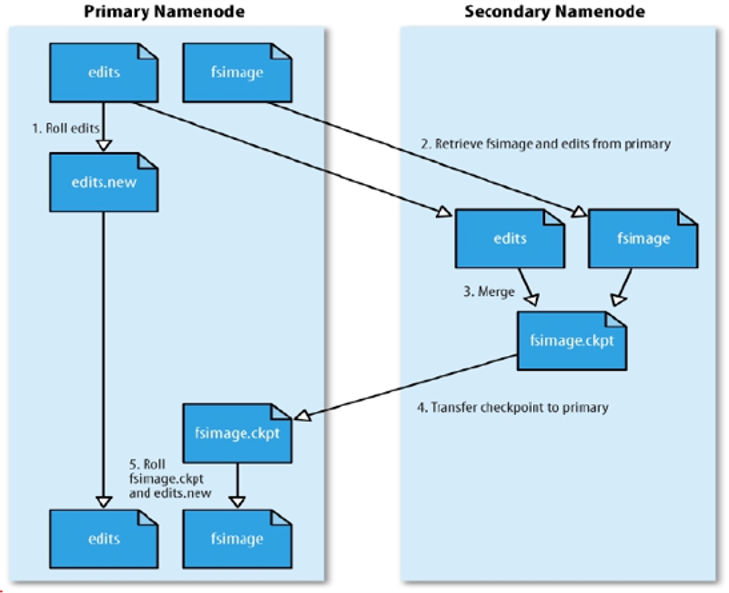
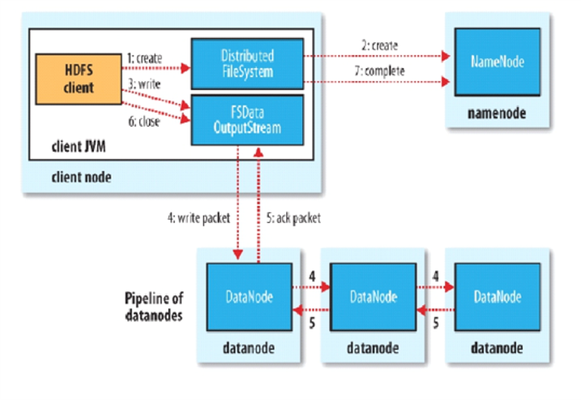
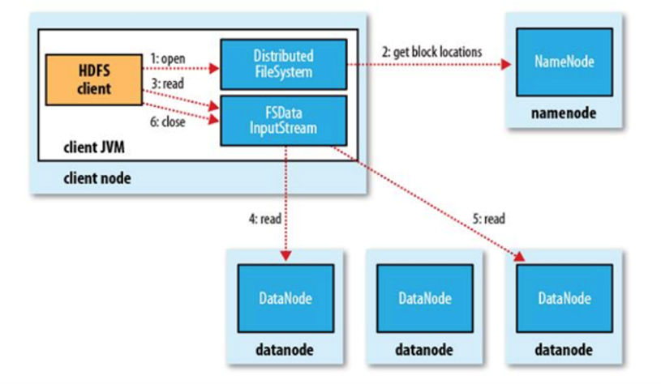
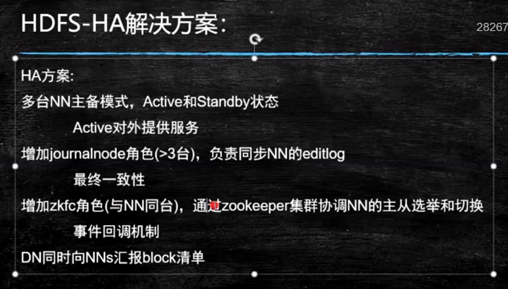

# 核心思想

- 分而治之
- 并行计算
- 计算向数据移动
- 数据本地化读取

# Hadoop

hadoop是apache旗下的顶级项目

大数据生态：[cloudera](https://www.cloudera.com/)

##  [官网](http://hadoop.apache.org/)

## 思考

单机的瓶颈在哪？

磁盘IO

## HDFS

### 思考

文件系统那么多，为什么hadoop项目中还要开发一个hdfs文件系统？

为了支持分布式计算

### 存储模型

- 文件线性按字节切割成块，有offset，id
- 文件与文件的block大小可以不一样
- 一个文件除最后一个block，其他block大小一致
- 单个文件block大小相等，除了最后一个block
- block大小依据硬件的I/O特性调整
- block被分散存放在集群的节点中，具有location
- block具有副本，没有主从概念，副本不能出现在同一节点
- 副本是满足可靠性和性能的关键
- 文件上传可以指定block大小和副本数，上传后只能修改副本数
- 一次写入多次读取，不支持修改
- 支持追加数据

### 架构设计

- 主从架构
- 由NameNode和一些DataNode组成
- 面向文件包含：文件数据和文件元数据
- NameNode负责存储和管理文件元数据，并维护了一个层次型的文件目录树
- DataNode负责存储文件数据（Block块），并提供block的读写
- DataNode与NameNode维护心跳，并汇报自己持有的block信息
- Client和NameNode交互文件元数据和DataNode交互文件block数据

### NameNode和DataNode

NameNode
> 完全基于内存存储文件元数据，目录结构，文件block的映射
> 需要持久化方案
> 提供副本放置策略：
>
> > 第一个副本：放置在上传文件的DN，如果是集群外提交，则随机挑选一台磁盘不太满，CPU不太忙的节点
> >第二个副本：放置在于第一个副本不同的机架的节点上
> > 第三个副本：与第二个副本相同机架的节点
> > 更多副本：随机节点

DataNode
> 基于本地磁盘存储block（文件形式）
> 并保存block的校验和数据保证block的可靠性
> 与NameNode保持心跳，汇报block列表状态

#### 元数据持久化
EditsLog：日志（恢复速度慢，实时保存，体积膨胀）
FsImage：镜像，快照（恢复速度块，容易丢失数据，体积小）

**FI时点的滚动更新**
第一次开机的时候只写一次FI，假设8到9之间的增量EL，去分析EL，再根据当前FI进行合并

**安全模式**

- HDFS搭建时会格式化，格式化操作会产生一个空的FsImage

- 当NameNode启动时，它从硬盘中读取EditLog和FsImage

- 将所有Editlog中的事务作用在内存中的FsImage上

- 并将这个新版本的FsImage从内存中保存到本地磁盘上

- 然后删除旧的Editlog

  

- NameNode启动后会进入安全模式

- 安全模式的NameNode不会进行数据块复制
- NameNode从所有的DataNode接收心跳信号和块状态报告
- 每当NameNode检测确认某个数据块的副本数目达到这个最小值，那么该数据块就会被认为是副本安全的
- 在一定百分比的数据块被NameNode检测确认是安全之后（再加上一个额外的30s等待时间），NameNode将退出安全模式状态
- 接下来它会确定还有哪些数据块的副本没有达到指定数目，并将这些数据块复制到其他DataNode上

**SecondaryNameNode（SNN）**

- 在非HA模式下（2.x有HA模式），SNN一般是独立的节点，周期完成对NN的Editlog向FsImage合并，减少EditLog大小，减少NN启动时间
- 根据配置文件设置的时间间隔fs.checkpoint.period 默认3600秒
- 根据配置文件设置EditLog大小fs.checkpoint.size 规定edits文件的最大默认值是64MB

如图



### HDFS写流程



- Client和NN连接创建文件元数据
- NN判定元数据是否有效
- NN处发副本放置策略，返回一个有序的DN列表
- Client和DN建立Pipeline连接
- Client将块切分成packet（64KB），并使用chunk（512B）+chucksum（4B）填充
- Client将packet放入发送队列dataqueue中，并向第一个DN发送
- 第一个DN收到packet后本地保存并发送给第二个DN
- 第二个DN收到packet后本地保存并发送给第三个DN
- 这一个过程中，上游节点同时发送下一个packet
- 生活中类比工厂的流水线：结论：流式其实也是变种的并行计算
- Hdfs使用这种传输方式，副本数对于client是透明的
- 当block传输完成，DN们各自向NN汇报，同时client继续传输下一个block
- 所以，client的传输和block的汇报也是并行的

### HDFS读流程

 

- 为了降低整体的带宽消耗和读取延时，HDFS会尽量让读取程序读取离它最近的副本。
- 如果在读取程序的同一个机架上有一个副本，那么就读取该副本。
- 如果一个HDFS集群跨越多个数据中心，那么客户端也将首先读本地数据中心的副本。
- 语义：下载一个文件：
  -- Client和NN交互文件元数据获取fileBlockLocation
  -- NN会按距离策略排序返回
  -- Client尝试下载block并校验数据完整性
- 语义：下载一个文件其实是获取文件的所有的block元数据，那么子集获取某些block应该成立
  -- Hdfs支持client给出文件的offset自定义连接哪些block的DN，自定义获取数据
  -- 这个是支持计算层的分治、并行计算的核心

## Hadoop模式

**local 非分布式（debug）**
**pseudo distribute 伪分布式**
单节点 每个角色一个进程，放在一个机器
**full distribute 完全分布式（线上使用）**
单节点每个角色分开放到不同机器

## 实操

https://hadoop.apache.org/docs/stable/hadoop-project-dist/hadoop-common/SingleCluster.html

### 基础设施

**设置静态路由**

```sh
vim /etc/sysconfig/network-scripts/ifcfg-eth0
DEVICE=eth0
ONBOOT=yes
IPADDR=192.168.1.23
NETMASK=255.255.255.0
GATEWAY=192.168.1.1
DNS1=114.114.114.114
```

**设置主机名**

```sh
vim /etc/sysconfig/network

#####################
NETWORKING=yes
HOSTNAME=node01
########### 或者
hostnamectl  set-hostname hostname
```

**设置host映射**

```sh
vim /etc/hosts

#####################
192.168.1.23 node01
192.168.1.46 node02
```

**关闭防火墙**

**时间同步**

**安装jdk**

**设置SSH免秘钥**

### Hadoop部署

**下载**

**配置环境变量**

```sh
export HADOOP_HOME=/xxx/xxx/x
export PATH=$PATH:$HADOOP_HOME/bin:$HADOOP_HOME/sbin
```

**修改配置文件**

etc/hadoop/core-site.xml:（配置nn位置）

```xml
<configuration>
    <property>
        <name>fs.defaultFS</name>
        <value>hdfs://localhost:9000</value>
    </property>
</configuration>
```

etc/hadoop/hdfs-site.xml:（配置副本， 设置保险的目录防止nn，dn，sn数据丢失）

```xml
<configuration>
    <property>
        <name>dfs.replication</name>
        <value>1</value>
    </property>
    <property>
        <name>dfs.namenode.name.dir</name>
        <value>/var/bigdata/hadoop/local/dfs/name</value>
    </property>
    <!-- 原始的目录存放于临时文件夹中，非常不安全 -->
    <property>
        <name>dfs.datanode.data.dir</name>
        <value>/var/bigdata/hadoop/local/dfs/data</value>
    </property>
    <property>
        <name>dfs.namenode.secondary.http-address</name>
        <value>node01:9868</value>
    </property>
    <property>
        <name>dfs.namenode.checkpoint.dir</name>
        <value>/var/bigdata/hadoop/local/dfs/namesecondary</value>
    </property>
</configuration>
```

etc/hadoop/workers（dn位置）

```xml
node01
```

### 初始化和使用

见官网

**格式化硬盘(初始化nn，创建nn目录)**

```sh
bin/hdfs namenode -format
# 其中nn的clusterId相同才能连接对应的dn
```

**第一次启动创建dn和snn目录（启动时）**

```sh
start-dfs.sh
```

**修改配置项**

**访问node01:9870端口有页面显示**

**使用（使用dfs子命令，类似于linux的文件系统）**

```sh
hdfs dfs -help
hdfs dfs -put xxx.zip /directory
hdfs dfs -mkdir /bigdata
hdfs dfs -mkdir -p /user/root
hdfs dfs -dfs.blocksize
# 可以注意到datanode里面有meta 校验和 文件（block）
```

**注意**

psdh默认采用rsh登陆，要用ssh登陆要修改下

export PDSH_RCMD_TYPE=ssh

## HA

单点产生的两个问题（单独问题）？

1. 单点故障

   > 高可用方案，主备切换

2. 压力过大

   > 联邦机制：Federation（元数据分片）
   >
   > 多个NN，管理不同的元数据

### 单点故障问题解决

HDFS通过实现了Paxos协议的JN（分布式存储）实现分布式存储通讯，用于同步editslog，保证数据最终一致性

写数据时，主NN向JN写数据，等待JN返回，备机会读取JN（JournalNode）中的数据

JN实现：主从模式，通过Paxos协议进行数据传递和保证数据一致性

HDFS通过实现了ZAB协议的ZK实现分布式协调，快速选择主节点

.png)

ZK客户端的FailoverController 会干一些事情，并且与NN存在同一个物理机上，保证监控的准确性

1.初始化的时候，所有FailoverController 会抢锁，先抢到锁的作为active，其他为standby NN

2.FailoverController 检测当前master NN是否宕机，如果宕机，则删除当前在ZK上的临时节点，触发事件回调机制，回调之前其他FailoverController 在ZK上注册的事件

3.其他机器接收到事件先进行主存活判断（连接主IP的NN查看是否真正死亡），如果真正死亡就将自己设置成master；如果由于FailoverController宕机造成的删除事件，则将当前的master降级成standby，然后将自己本机设成standby；如果由于FailoverController网与主机NN不通产生的问题，无法将当前升级成master。



#### HA模式下的SNN

1.HA模式不存在SNN，备机的NN会定时做出fsimage给主机

2.非HA模式下，SNN定期拉取editslog去合并，而HA模式NN通过JournalNode实时同步editslog

#### HA下的角色

ACTIVE，STANDBY，JN,ZK，FailoverController（ZKFC）

### 压力过大，内存受限问题解决

联邦制解决，元数据分治，复用DN存储，DN使用目录隔离block（DN会为每个NN创建一个目录 ）

**注意**

访问的时候要搭建一个中转（中台 ）去访问，抽象层

### HA模式搭建

[HA](https://hadoop.apache.org/docs/stable/hadoop-project-dist/hadoop-hdfs/HDFSHighAvailabilityWithQJM.html)


# 杂项

## 服务器类型
塔式：竖直长方体
机架：扁直长方体
刀片：刀片式服务器可以一片一片的叠放在机柜上

CBI-2742自动更新需要监控表变化
新建 一个 lambda data_npd_entity_info_change_lambda

新建 一个 触发器 data_npd_entity_info_change_lambda关联 corpdata_factset_corptree表，corpdata_factset_entity表，corpdata_factset_entity_offset表
lambda 权限参考 data_npd_funded_research_lambda 

data_npd_entity_info_change_lambda 的编辑和发布权限

## ZK和JN的区别

ZK做分布式协调，JN做分布式存储
