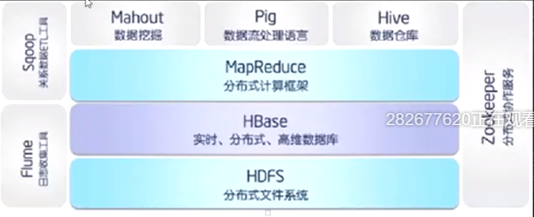
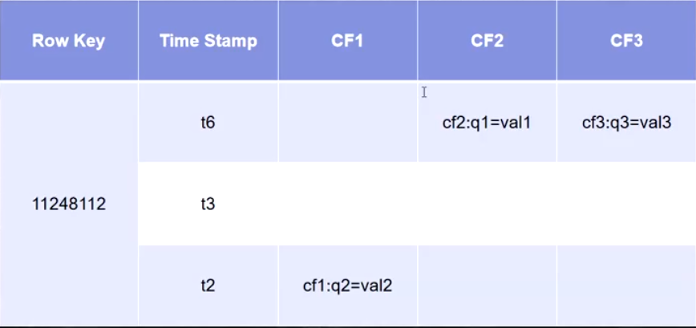
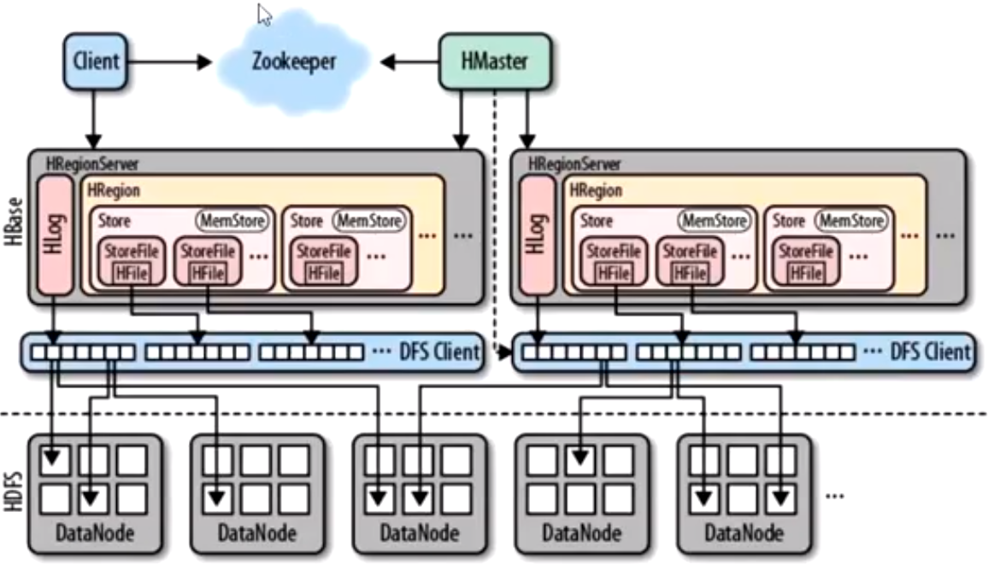
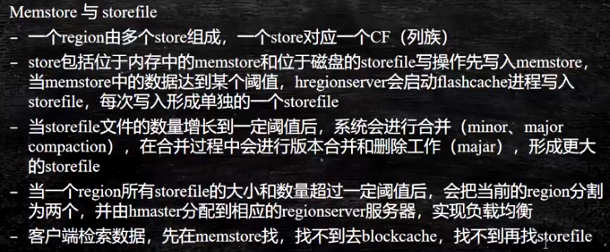
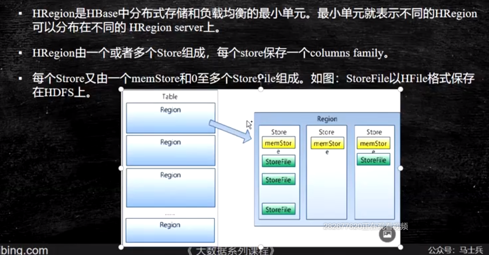
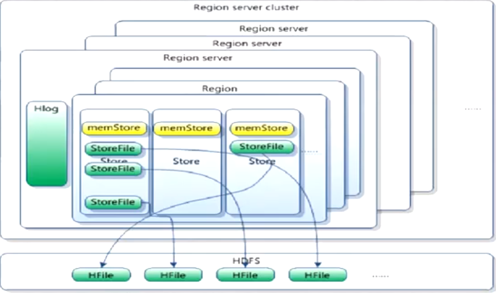

# HBase（Hadoop database）

[官网](https://hbase.apache.org/)

HBase用于实现超大数据量的一个实时读写，基于谷歌三篇论文（DFS,MR,bigtable）的bigtable进行落地，超大数据量指十亿行，百万列这种样子的数据表，他的存储层用的HDFS，计算层用的MR，所以HBase是一个面向列的数据存储

它和Hive的区别就是，Hive不是实时查询的表，只是一个进行统计的数据仓库，而HBase是分布式数据库

总结：HBase 是一个高可靠、高性能、面向列、可伸缩、实时读写的分布式数据库，它利用zk实现分布式协调，主要存放半结构化（json）和非结构化（xml）的松散数据

- 高可靠：基于HDFS，数据不丢失
- 高性能：分布式性能高
- 面向列：面向列的行式存储
- 可伸缩：水平扩展

## HBase生态

- 从flume开始从网站用户记录收集数据
- 然后数据通过HBase存储到HDFS中
- Zookeeper支持HDFS的高可用以及Hive数仓的高可用还有实现HBase的分布式协调
- MR进行分布式计算
- Hive和Pig进行数据分析
- 分析完的数据通过MaHout或者spark的MLLIB库进行数据挖掘
- Sqoop完成数据解析精加工ETL，进入到关系型数据库



### HBase数据模型



以上为逻辑模型，非物理硬盘上的存储形式

上面的格式为一条记录，Row key（行键）表示一条记录的唯一键，每个记录都会存在ts，用以进行版本控制，每个行存储的数据是以Column Famliy（列簇）+ :  + column name（列名）= value（值）存储的

以row key + ts + column group（family） + column name（qualifier） 构成唯一值

#### Row Key

- 决定一行数据
- 按照字典顺序排序
- 只能存储64k的字节数据

查范围数据的时候，通过合理设置的row key（热数据设置成存放在一起的row key）可以顺序读取

一般设置row key尽可能短（10-100字节）

#### 列簇

- HBase的最小控制单元是列簇，而不是列，权限控制和调优还有存储都是在列族层面进行的
- 列簇表示一类列，它们具有公共的性质
- 在定义表的时候就要给出列簇
- 列名以列簇作为前缀，每个列簇可以有多个列成员，如course:english,course:math，后续可以按需加入新的列成员
- HBase把同一列簇的数据保存在同一目录下，由1-N个文件保存

#### ts时间戳

- 在HBase每个存储单元对同一份数据有多个版本，在文件中按照时间倒序排序
- 时间戳类型是64位整型
- 时间戳由HBase默认赋值，为当前系统的毫秒时间
- 当然也可以显示赋值，注意需要唯一

#### cell单元格

- 由行列坐标决定
- 有版本
- 内容是未解析的字节数组
  - 由row key + version + column group + column name唯一确定一个单元
  - 数据没有类型，全部为字节数组

## HBase架构



### 角色

Client，Zookeeper，HMaster，HRegionServer，HRegion，Menstore，Storefile，blockcache

#### Client

包含访问HBase的接口并维护cache来加快对HBase的访问（客户端缓存）

#### Zookeeper

HMaster高可用

存储所有Region的地址

实时监控HRegionServer的上下线信息，通知HMaster

存储HBase的schema和table元数据（不存列簇数据）

#### HMaster

为HRegionServer分配Region

负责HRegionServer的负载均衡

发现失效的HRegionServer并重新分配上面的Region

管理增删改操作

#### HRegionServer

维护region，处理IO请求

切分在运行过程中变得过大的region

#### HRegion

HBase自动把表水平划分成多个region，每个region会保存一个表里面某段连续的数据

每个表一开始只有一个region，数据增大的时候会进行等分（分裂）

当table中的行不断增多，一张表会被负载均衡到多个HRegionServer上

#### 一些小角色







### 读写流程

#### 读流程

- Client会先请求ZK，查看是否有Region信息，如果有的话，直接去对应的位置，如果没有的话，会去找存储元数据的HRegionSever去找对应的Region所在的HRegionServer位置
- 找到位置之后去对应位置，给对应HRegionServer发送读请求
- HRegionServer接收读请求，会让HRegion开始工作，HRegion中存在store的概念，每个store里面有memstore和storefile还有blockcache
- 先读memstore，如果存在则返回，否则读blockcache，最后读对应文件，并缓存回blockcache中
- 如果出现正好blockcache中有缓存，并且menstore数据溢写到磁盘的情况，不会存在数据不一致的问题，因为在写的时候，数据会建立索引，告诉用户去blockcache里面读还是storefile里读。

#### 写流程

- Client会先请求ZK，查看是否有Region信息，如果有的话，直接去对应的位置，如果没有的话，会去找存储元数据的HRegionSever去找对应的Region所在的HRegionServer位置

- 找到位置之后去对应位置，给对应HRegionServer发送写请求
- HRegionServer接收写请求，先写HLog的内存缓冲区，然后把数据写到对应store的memstore中，过一小段时间，会有LogSync线程把HLog的内存缓冲区溢写到磁盘，当memstore达到一定数量级时就进行溢写成文件
- 每隔一段时间都会将溢写产生的小文件进行合并（minor和major合并），删除操作也发生在合并过程中

## 实操

### standalone模式

[官网](https://hbase.apache.org/book.html#quickstart)

访问*[http://node02:16010](http://node02:16010/)*

**配置**

```xml
<property>
    <name>hbase.cluster.distributed</name>
    <value>false</value>
  </property>
  <property>
    <name>hbase.unsafe.stream.capability.enforce</name>
    <value>false</value>
  </property>
  <property>
    <name>hbase.rootdir</name>
    <value>file:///var/bigdata/hbase/</value>
  </property>
```

**连接**

```shell
hbase shell
```

```hbase
help //列出所有操作
list_namespace //列出数据库，默认数据库为default，另外还有个hbase元数据数据库
help 'create'
create 'person','name','age','gender' //创建person表
put 'person','1','name','jay' //插入数据
put 'person','11','age','16'
put 'person','2','gender','man'
scan 'person' //查看表，注意数据是字典序排列的（所以中间一定存在取数排序的操作）
delete 'person','2','gender:' //删除数据
disable 'person' //不可用表，准备删除
drop 'person' //删除person表
```

查看存储文件夹

/var/bigdata/hbase/data/default/person/9e5e1c94829e328a6ab2dab405f147e8

最后一串代表region文件夹

查看落盘的文件，要用命令打开查看

hbase hfile -p -f 1d40d7d54d7b4adf847b510d41488d6d（p代表print，f代表文件）

看到是以KV存储的键值对

K: 1/name:/1653221318078/Put/vlen=3/seqid=4 V: jay

### 完全分布式

https://hbase.apache.org/book.html#quickstart

照着做，睁大眼看清楚，别漏了还有HDFS客户端的配置

**注意**

如果报错，显示没有对应方法，那么就指定用其他wal的实例

```xml
<property>
  <name>hbase.wal.provider</name>
  <value>filesystem</value> <!--也可以用multiwal-->
</property>
```

**观察表合并情况**

配置合并参数

```xml
<property>
  <name>hbase.server.thread.wakefrequency</name>
  <value>1</value>
</property>
<property>
  <name>hbase.hregion.memstore.block.multiplier</name>
  <value>1</value>
</property>
```

经过三次写入并flush后，hbase会将三个文件合并成一个新文件

### java api

https://hbase.apache.org/book.html#hbase_apis

```xml
       <dependency>
            <groupId>org.apache.hbase</groupId>
            <artifactId>hbase-client</artifactId>
            <version>2.4.12</version>
        </dependency>
```

```java
import org.apache.hadoop.conf.Configuration;
import org.apache.hadoop.hbase.Cell;
import org.apache.hadoop.hbase.HBaseConfiguration;
import org.apache.hadoop.hbase.HTableDescriptor;
import org.apache.hadoop.hbase.TableName;
import org.apache.hadoop.hbase.client.*;
import org.apache.hadoop.hbase.util.Bytes;
import org.junit.After;
import org.junit.Before;
import org.junit.Test;

import java.io.IOException;
import java.util.Collections;

public class HBaseTest {
    Configuration config = null;
    Connection connection = null;
    Admin admin = null;
    TableName tableName = null;
    Table table = null;

    @Before
    public void before() throws IOException {
        //配置
        config = HBaseConfiguration.create();
        config.set("hbase.zookeeper.quorum", "node01,node03,node04");
        //创建连接
        connection = ConnectionFactory.createConnection(config);
        //获取admin
        admin = connection.getAdmin();
        //获取table
        table = connection.getTable(TableName.valueOf("test"));
    }


    @Test
    public void scanRecords() throws IOException {
        Scan scan = new Scan();
        ResultScanner scanner = table.getScanner(scan);
        for (Result result : scanner){
            String s = Bytes.toString(result.getValue(Bytes.toBytes("cf"), Bytes.toBytes("name")));
            System.out.println(s);
        }
    }


    @Test
    public void putRecord() throws IOException {
        Put put = new Put("1".getBytes());
        put.addColumn("cf".getBytes(), "name".getBytes(),"shijiahao".getBytes());
        table.put(put);
    }

    @Test
    public void getRecord() throws IOException {
        Get get = new Get("1".getBytes());
        System.out.println(table.get(get));
    }

    @Test
    public void deleteRecord() throws IOException {
        Delete delete = new Delete("1".getBytes());
        table.delete(delete);
    }

    @Test
    public void createTable() throws IOException {
        //通过admin进行操作，构建表
        TableDescriptorBuilder test = TableDescriptorBuilder.newBuilder(TableName.valueOf("test"));
        //构建列族
        ColumnFamilyDescriptorBuilder columnFamilyDescriptorBuilder = ColumnFamilyDescriptorBuilder.newBuilder("cf".getBytes());
        test.setColumnFamilies(Collections.singleton(columnFamilyDescriptorBuilder.build()));
        //如果存在先删除
        if(admin.tableExists(TableName.valueOf("test"))) {
            //删除前需要先disable
            admin.disableTable(TableName.valueOf("test"));
            admin.deleteTable(TableName.valueOf("test"));
        }
        admin.createTable(test.build());
    }

    @After
    //释放连接
    public void after() throws IOException {
        table.close();
        admin.close();
        connection.close();
    }
}
```

上述为简单的增删查操作，考虑一个场景，移动公司通话记录

现在有五个字段，dnum（通话手机号），time（通话时长），date（通话日期），phoneNum（当前手机号），type（接收类型，0为呼出，1为呼入）

需要设计一个结构，让我们快速的查询某一个时间范围内的，某台手机的通话记录

这边主要是考rowkey的设计，我们知道rowkey的在存放的时候，同一个rowkey是紧挨着排列在磁盘上的，更好的rowkey设计有利于我们使用好顺序读写的特性

这边考虑到时间查询的时候，一般我们更加需要最新的数据，所以需要从新到旧排列rowkey，所以设计成 手机号 + 时间戳倒叙（使用Long.MAX_VALUE - 当前时间戳）

代码如下

https://hbase.apache.org/book.html#client.filter

```java
import org.apache.hadoop.conf.Configuration;
import org.apache.hadoop.hbase.CompareOperator;
import org.apache.hadoop.hbase.HBaseConfiguration;
import org.apache.hadoop.hbase.TableName;
import org.apache.hadoop.hbase.client.*;
import org.apache.hadoop.hbase.filter.FilterList;
import org.apache.hadoop.hbase.filter.SingleColumnValueFilter;
import org.apache.hadoop.hbase.util.Bytes;
import org.junit.After;
import org.junit.Before;
import org.junit.Test;

import java.io.IOException;
import java.text.ParseException;
import java.text.SimpleDateFormat;
import java.util.*;

public class HBaseProjectTest {
    Configuration config = null;
    Connection connection = null;
    Admin admin = null;
    TableName tableName = null;
    Table table = null;

    @Before
    public void before() throws IOException {
        //配置
        config = HBaseConfiguration.create();
        config.set("hbase.zookeeper.quorum", "node01,node03,node04");
        //创建连接
        connection = ConnectionFactory.createConnection(config);
        //获取admin
        admin = connection.getAdmin();
        //获取table
        table = connection.getTable(TableName.valueOf("phone"));
    }

    /**
     * 过滤器查询数据,找到 18709546353 在3月份的被叫电话
     * @throws IOException
     */
    @Test
    public void scanRecordsByFilter() throws IOException, ParseException {
        SimpleDateFormat sdf = new SimpleDateFormat("yyyyMMddHHmmss");
        Scan scan = new Scan();
        //and操作
        FilterList list = new FilterList(FilterList.Operator.MUST_PASS_ALL);
        SingleColumnValueFilter filter1 = new SingleColumnValueFilter(
                Bytes.toBytes("cf"),
                Bytes.toBytes("type"),
                CompareOperator.EQUAL,
                Bytes.toBytes(1)
        );
        list.addFilter(filter1);
        //按照row key进行查询 范围
        scan.withStartRow(Bytes.toBytes("18709546353-" + (Long.MAX_VALUE - sdf.parse("20220401000000" ).getTime())));
        scan.withStopRow(Bytes.toBytes("18709546353-" + (Long.MAX_VALUE - sdf.parse("20220301000000" ).getTime())));
        scan.setFilter(list);
        ResultScanner scanner = table.getScanner(scan);
        for (Result result : scanner){
            Integer type = Bytes.toInt(result.getValue(Bytes.toBytes("cf"), Bytes.toBytes("type")));
            Integer time = Bytes.toInt(result.getValue(Bytes.toBytes("cf"), Bytes.toBytes("time")));
            String dNum = Bytes.toString(result.getValue(Bytes.toBytes("cf"), Bytes.toBytes("dNum")));
            System.out.println(dNum + "-" + type + "-" + time);
        }
    }


    /**
     * 批量插入假数据
     * @throws IOException
     */
    @Test
    public void putRecords() throws IOException, ParseException {
        SimpleDateFormat sdf = new SimpleDateFormat("yyyyMMddHHmmss");
        List<Put> puts = new ArrayList<Put>();
        for (int i = 0;i < 10;i ++){
            String phoneNumber = getPhoneNumber("187");
            for (int j = 0;j < 10000;j ++){
                String dNum = getPhoneNumber("182");
                String date = getDate("2022");
                Long dateTime = Long.MAX_VALUE - sdf.parse(date).getTime();
                Integer type = new Random().nextInt(2);
                Integer time = new Random().nextInt(999);
                Put put = new Put(Bytes.toBytes(phoneNumber + "-" + dateTime));
                put.addColumn(Bytes.toBytes("cf"), Bytes.toBytes("type"), Bytes.toBytes(type));
                put.addColumn(Bytes.toBytes("cf"), Bytes.toBytes("time"), Bytes.toBytes(time));
                put.addColumn(Bytes.toBytes("cf"), Bytes.toBytes("dNum"), Bytes.toBytes(dNum));
                puts.add(put);
            }
        }
        table.put(puts);
    }

    private String getPhoneNumber(String s) {
        return s + String.format("%08d", new Random().nextInt(99999999));
    }

    private String getDate(String s) {
        return s + String.format("%02d%02d%02d%02d%02d", new Random().nextInt(12) + 1,new Random().nextInt(28) + 1,new Random().nextInt(24),new Random().nextInt(60),new Random().nextInt(60));
    }

    @Test
    public void createTable() throws IOException {
        //通过admin进行操作，构建表
        TableDescriptorBuilder test = TableDescriptorBuilder.newBuilder(TableName.valueOf("phone"));
        //构建列族
        ColumnFamilyDescriptorBuilder columnFamilyDescriptorBuilder = ColumnFamilyDescriptorBuilder.newBuilder("cf".getBytes());
        test.setColumnFamilies(Collections.singleton(columnFamilyDescriptorBuilder.build()));
        //如果存在先删除
        if(admin.tableExists(TableName.valueOf("phone"))) {
            //删除前需要先disable
            admin.disableTable(TableName.valueOf("phone"));
            admin.deleteTable(TableName.valueOf("phone"));
        }
        admin.createTable(test.build());
    }

    @After
    //释放连接
    public void after() throws IOException {
        table.close();
        admin.close();
        connection.close();
    }
}
```

### protobuf二进制转化工具

为了减少我们存储的数据量，有时候会以序列化对象的方式去存储在一个row key对应的一个列族下的一个列中，注意此时无法按列过滤，protobuf为我们提供了一个快速的二进制对象转换的类的代码生成器

依照上一个phone去生成实体类

```protobuf
syntax = "proto2";

package com.tuo;

option java_multiple_files = false;
option java_package = "com.tuo";
option java_outer_classname = "Phone";

message PhoneDetail {
  optional int32 type = 1;
  optional int32 time = 2;
  optional string dNum = 3;
}
```

```java
Phone.PhoneDetail.Builder builder = Phone.PhoneDetail.newBuilder();
builder.setDate(date);
builder.setType(type);
builder.setDnum(dNum);
Put put = new Put(Bytes.toBytes(rowkey));
put.addColumn(Bytes.toBytes("cf"),Bytes.toBytes("phone"),builder.build().toBytes());
```

### 整合MR

https://hbase.apache.org/book.html#mapreduce

**做一个wc把它变成hbase数据，xml配置**

```xml
<dependency>
    <groupId>org.apache.hbase</groupId>
    <artifactId>hbase-client</artifactId>
    <version>2.4.12</version>
</dependency>        
<dependency>
    <groupId>org.apache.hadoop</groupId>
    <artifactId>hadoop-auth</artifactId>
    <version>3.3.1</version>
</dependency>
<dependency>
    <groupId>org.apache.hadoop</groupId>
    <artifactId>hadoop-client</artifactId>
    <version>3.3.1</version>
</dependency>
<dependency>
    <groupId>org.apache.hadoop</groupId>
    <artifactId>hadoop-common</artifactId>
    <version>3.3.1</version>
</dependency>
<dependency>
    <groupId>org.apache.hbase</groupId>
    <artifactId>hbase-mapreduce</artifactId>
    <version>2.4.12</version>
</dependency>
```

```java
public static void main(String[] args) throws IOException, ClassNotFoundException, InterruptedException {
    //从hdfs读数据，写hbase
    Configuration configuration = new Configuration(true);
    configuration.set("mapreduce.app-submission.cross-platform","true");
    configuration.set("hbase.zookeeper.quorum", "node01,node03,node04");
    configuration.set("mapreduce.framework.name","local");

    Job job = Job.getInstance(configuration,"wc");
    job.setJar("E:\\UDF\\target\\UDF-1.0-SNAPSHOT.jar");

    job.setMapperClass(MyMapper.class);
    job.setMapOutputKeyClass(Text.class);
    job.setMapOutputValueClass(IntWritable.class);

    TableMapReduceUtil.initTableReducerJob(
            "wc", // output table
            MyReducer.class, // reducer class
            job);

    FileInputFormat.addInputPath(job, new Path("/input/wc"));

    job.waitForCompletion(true);
}

public class MyMapper extends Mapper<LongWritable, Text,Text, IntWritable> {
    private Text outKey = new Text();
    private IntWritable outValue = new IntWritable();


    @Override
    protected void map(LongWritable key, Text value, Context context) throws IOException, InterruptedException {
        if(StringUtils.isNotEmpty(value.toString())) {
            String[] ss = value.toString().split(" ");
            for (String s: ss) {
                outKey.set(s);
                outValue.set(1);
                context.write(outKey, outValue);
            }
        }
    }
}

public class MyReducer extends TableReducer<Text,IntWritable, ImmutableBytesWritable> {
    public static final byte[] CF = "cf".getBytes();
    public static final byte[] COUNT = "count".getBytes();

    @Override
    protected void reduce(Text key, Iterable<IntWritable> values, Context context) throws IOException, InterruptedException {
        int count = 0;
        for(IntWritable intWritable:values){
            count += intWritable.get();
        }
        Put put = new Put(Bytes.toBytes(key.toString()));
        put.addColumn(CF, COUNT, Bytes.toBytes(String.valueOf(count)));
        context.write(null, put);
    }
}
```

```java
//从hbase读，写到hdfs
public class Main {
    public static void main(String[] args) throws IOException, ClassNotFoundException, InterruptedException {
        Configuration configuration = new Configuration(true);
        configuration.set("mapreduce.app-submission.cross-platform","true");
        configuration.set("hbase.zookeeper.quorum", "node01,node03,node04");
        configuration.set("mapreduce.framework.name","local");

        Job job = Job.getInstance(configuration,"wc");
        job.setJar("E:\\UDF\\target\\UDF-1.0-SNAPSHOT.jar");

        Scan scan = new Scan();
        scan.setCaching(500);
        scan.setCacheBlocks(false);
        TableMapReduceUtil.initTableMapperJob(
                "wc",
                scan,
                MyMapper1.class,
                Text.class,
                IntWritable.class,
                job
        );
        job.setReducerClass(MyReducer1.class);
        job.setOutputFormatClass(TextOutputFormat.class);
        FileOutputFormat.setOutputPath(job, new Path("/output/wc/"));


        job.waitForCompletion(true);
    }
}

public class MyMapper1 extends TableMapper<Text, IntWritable> {
    Logger logger = LoggerFactory.getLogger(MyMapper1.class);
    private Text key = new Text();
    private IntWritable value = new IntWritable(1);

    @Override
    protected void map(ImmutableBytesWritable key, Result value, Context context) throws IOException, InterruptedException {
        this.key.set(key.get());
        this.value.set(Integer.parseInt(new String(value.getValue(Bytes.toBytes("cf"),Bytes.toBytes("count")))));
        context.write(this.key, this.value);
    }
}

public class MyReducer1 extends Reducer<Text, IntWritable,Text, IntWritable> {
    private Text key = new Text();
    private IntWritable value = new IntWritable();

    @Override
    protected void reduce(Text key, Iterable<IntWritable> values, Context context) throws IOException, InterruptedException {
        this.key.set(key.toString());
        for(IntWritable i:values) {
            this.value.set(i.get());
        }
        context.write(key,value);
    }
}
```
