# Hive

## Hive解决的问题？（Why？）

1.对于数据分析师，不需要很高的成本就能够学会使用sql去分析现有数据，做OLAP

2.对于开发者，简化开发

3.对于大数据的存储，更好的管理元数据信息

## Hive简介

1.数据仓库

2.元数据存储在关系型数据库

3.作为一个查询工具，更类似于数据库，拥有数据库所应该有的编译器，解释器和优化器等

## Hive架构

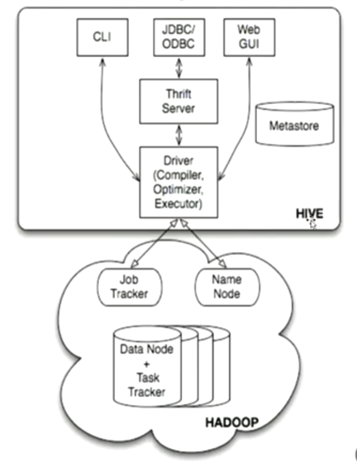

1.客户端，可能是CLI（command line interface）, JDBC/ODBC + thrift server(用于做远程RPC), web ui

2.核心（Driver），包含了编译器，解释器，执行器

3.Metastore 元数据

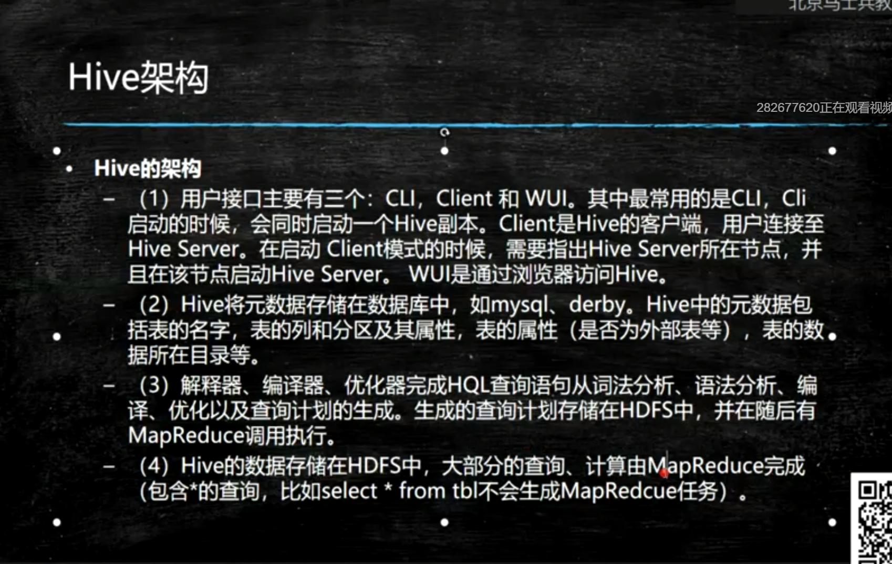

hive执行流程

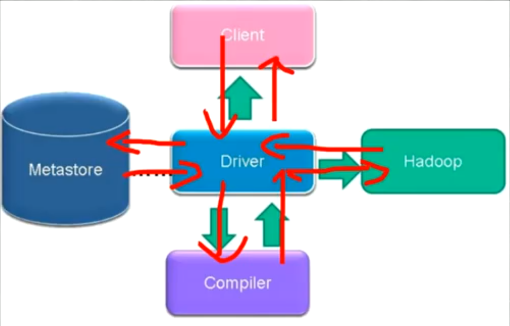

## 官网

[Hive](https://hive.apache.org/)

## Hive 搭建模式

1.本地内存数据库derby(不用,因为每次重启都会丢失数据)

2.远程连接数据库(个人,缺点是高耦合)

3.远程连接元数据存储服务器(Metastore Server)(企业)(开放服务器让其他组件共同访问元数据库)

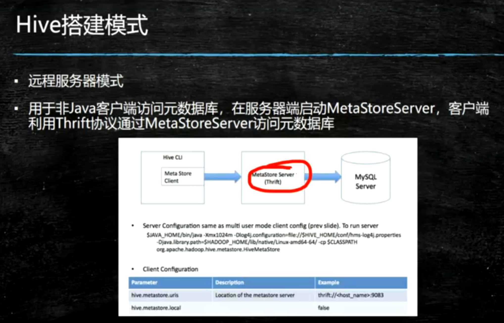

## 搭建

### 基础设施 + Remote

1.MySQL安装

2.安装后只有本机权限(本机能访问),需要更新用户表,用命令去更新

grant all privileges on \*.\* to 'root'@'%' identified by '123' with grant option;

把mysql的bind_address=127.0.0.1注释掉不然无法远程访问

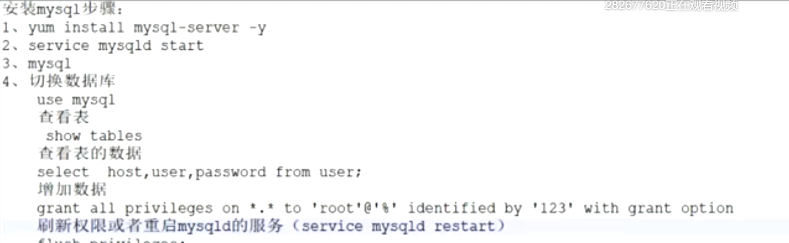

3.切换yum源

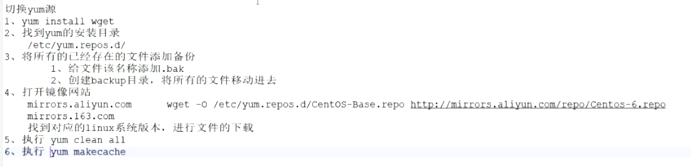

4.安装hive（hdfs和yarn需要已启动）（记得把驱动放在hive的lib中）（执行schematool -initSchema -dbType mysql）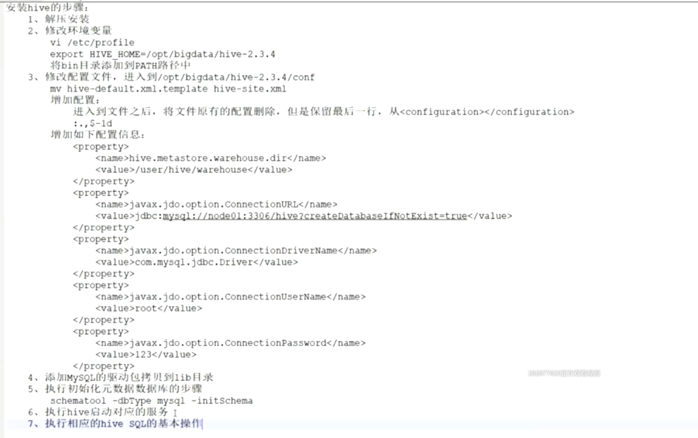

https://cwiki.apache.org/confluence/display/Hive/AdminManual+Metastore+Administration

5.hive启动

> hive

6.建表查看表元数据，desc formatted test

7.查看插入的数据在hdfs中的保存形式(一条一条插入很慢，要三五十秒，建议使用load方式加载数据)

> hdfs dfs -get /user/root/hive/hive.db/test/000000_0
>
> cat -A 000000_0(可以看到不可见字符)

### metastore方式

服务器：

| Config Param                          | Config Value                                                 | Comment                                                      |
| :------------------------------------ | :----------------------------------------------------------- | :----------------------------------------------------------- |
| javax.jdo.option.ConnectionURL        | `jdbc:mysql://<host name>/<database name>?createDatabaseIfNotExist=true` | metadata is stored in a MySQL server                         |
| javax.jdo.option.ConnectionDriverName | `com.mysql.jdbc.Driver`                                      | MySQL JDBC driver class                                      |
| javax.jdo.option.ConnectionUserName   | `<user name>`                                                | user name for connecting to MySQL server                     |
| javax.jdo.option.ConnectionPassword   | `<password>`                                                 | password for connecting to MySQL server                      |
| hive.metastore.warehouse.dir          | `<base hdfs path>`                                           | default location for Hive tables.                            |
| hive.metastore.thrift.bind.host       | <host_name>                                                  | Host name to bind the metastore service to. When empty, "localhost" is used. This configuration is available Hive 4.0.0 onwards. |

服务器启动： hive --service metastore

客户端

| Config Param                 | Config Value                  | Comment                                                      |
| :--------------------------- | :---------------------------- | :----------------------------------------------------------- |
| hive.metastore.local         | `false`                       | Metastore is remote. Note: This is no longer needed as of Hive 0.10. Setting *hive.metastore.uri* is sufficient. |
| hive.metastore.uris          | `thrift://<host_name>:<port>` | host and port for the Thrift metastore server. If hive.metastore.thrift.bind.host is specified, host should be same as that configuration. Read more about this in dynamic service discovery configuration parameters. default port is 9083 |
| hive.metastore.warehouse.dir | `<base hdfs path>`            | Points to default location of non-external Hive tables in HDFS. |

## Hive SQL

https://cwiki.apache.org/confluence/display/Hive//LanguageManual

>  不同于mysql，hive是读时检查，如果上传的数据错误，依旧可以上传，只不过读的时候只有符合规则的数据会被显示

### DDL

https://cwiki.apache.org/confluence/display/Hive/LanguageManual+DDL

有如下数据

> 1	小明	吃饭,睡觉	shanghai:pudong,jiangsu:suzhou
> 2	小红	吃饭,睡觉	shanghai:pudong,jiangsu:suzhou
> 3	小黑	吃饭,睡觉	shanghai:pudong,jiangsu:suzhou
> 4	小赤	吃饭,睡觉	shanghai:pudong,jiangsu:suzhou
> 5	小蓝	吃饭,睡觉	shanghai:pudong,jiangsu:suzhou
> 6	小绿	吃饭,敲代码	shanghai:pudong
> 7	小紫	玩游戏,睡觉	shanghai:pudong,jiangsu:suzhou

**创建表**

```hive
create table person(
 id int,
 name string,
 hobbies array<string>,
 address map<string,string>
)
ROW FORMAT DELIMITED
FIELDS TERMINATED BY '\t'
COLLECTION ITEMS TERMINATED BY ','
MAP KEYS TERMINATED BY ':';
```

删除表(可以看到数据一起被删除了)

```hive
drop table person;
```

**创建外部表**

先把数据上传到hdfs目录 

hdfs dfs -mkdir -p /data/person/

hdfs dfs -put data.txt /data/person/

```hive
create external table person_external(
 id int,
 name string,
 hobbies array<string>,
 address map<string,string>
)
ROW FORMAT DELIMITED
FIELDS TERMINATED BY '\t'
COLLECTION ITEMS TERMINATED BY ','
MAP KEYS TERMINATED BY ':'
LOCATION '/data/person/';
```

**删除后数据依然存在**

查看表结构

```hive
desc formatted person_external;

# col_name            	data_type           	comment             
id                  	int                 	                    
name                	string              	                    
hobbies             	array<string>       	                    
address             	map<string,string>  	                    
	 	 
# Detailed Table Information	 	 
Database:           	test                	 
OwnerType:          	USER                	 
Owner:              	root                	 
CreateTime:         	Sun May 15 08:26:11 CEST 2022	 
LastAccessTime:     	UNKNOWN             	 
Retention:          	0                   	 
Location:           	hdfs://hdfsCluster/data/person	 
Table Type:         	EXTERNAL_TABLE      	 
Table Parameters:	 	 
	EXTERNAL            	TRUE                
	bucketing_version   	2                   
	numFiles            	1                   
	totalSize           	376                 
	transient_lastDdlTime	1652595971          
	 	 
# Storage Information	 	 
SerDe Library:      	org.apache.hadoop.hive.serde2.lazy.LazySimpleSerDe	 
InputFormat:        	org.apache.hadoop.mapred.TextInputFormat	 
OutputFormat:       	org.apache.hadoop.hive.ql.io.HiveIgnoreKeyTextOutputFormat	 
Compressed:         	No                  	 
Num Buckets:        	-1                  	 
Bucket Columns:     	[]                  	 
Sort Columns:       	[]                  	 
Storage Desc Params:	 	 
	collection.delim    	,                   
	field.delim         	\t                  
	mapkey.delim        	:                   
	serialization.format	\t
```

内外部表的区别？

1.内部表创建时，数据创建在hive默认的目录中，外部表创建的时候，需要指定location，指定数据存放的地址

2.drop删除时，外部表只删除表数据不删除，但是内部表一起删除

应用场景

​	内部表要先创建表，再添加数据

​	外部表都可以，由于大数据出现的较晚，所以外部表使用居多，积压的数据可以通过外部表很好的分析

**创建分区表**

有时候由于数据量庞大,在查询的时候比较浪费资源,我们可以使用表分区的方式来解决这些问题,根据具体业务来使用

添加分区数据的时候必须添加所有分区列

删除的时候不需要指定所有分区列

```hive
create table person_partitioned(
 id int,
 name string,
 hobbies array<string>,
 address map<string,string>
)
PARTITIONED BY(age int, gender string)
ROW FORMAT DELIMITED
FIELDS TERMINATED BY '\t'
COLLECTION ITEMS TERMINATED BY ','
MAP KEYS TERMINATED BY ':';
```

通过观察分区表在hdfs的存储时可以知道,hdfs是一层层文件夹的形式来存储分区键的

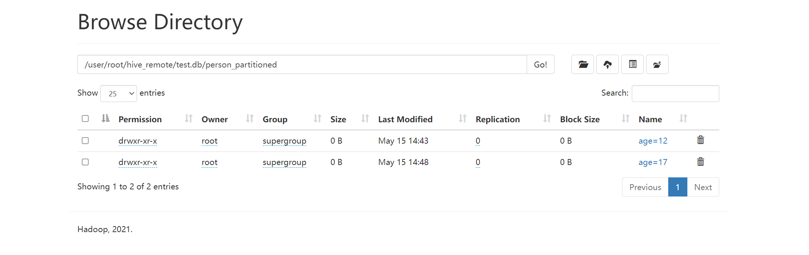

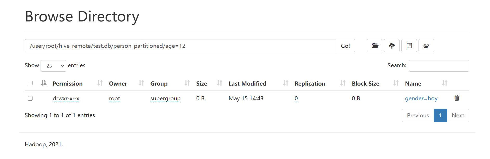


**Hive Serde**

对于复杂数据类型,使用简单的map,collection很难提取数据,可以使用Serde的方式去提取,如下数据,可以使用Serde匹配对应的正则表达式去提取数据

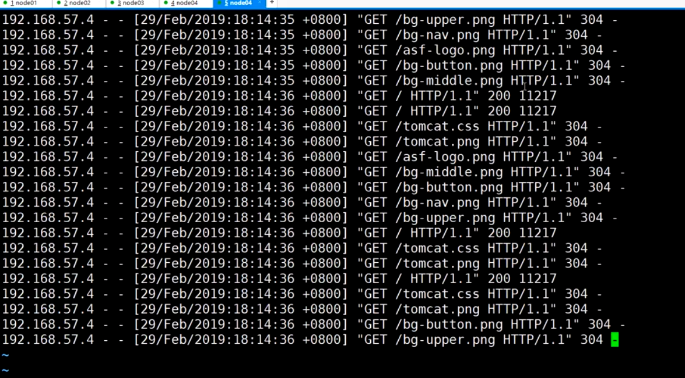

对应的建表语句如下

```hive
CREATE external TABLE apachelog (
  host string,
  identity string,
  `user` string,
  `time` string,
  request string,
  status string,
  agent string)
ROW FORMAT SERDE 'org.apache.hadoop.hive.serde2.RegexSerDe'
WITH SERDEPROPERTIES (
  "input.regex" = "([^ ]*) ([^ ]*) ([^ ]*) \\[(.*)\\] \"(.*)\" (-|[0-9]*) (-|[0-9]*)"
)
location '/data/tomcat/';
```

### DML

https://cwiki.apache.org/confluence/display/Hive/LanguageManual+DML#LanguageManualDML-InsertingdataintoHiveTablesfromqueries

> 数据使用load方式上传会非常快因为使用load和直接使用hdfs上传没区别，只不过从本地上传时使用的是put方法，而hdfs上传时采用move方法

**数据插入**

```hive
-- 第一种方式 load
load data local inpath '/home/timo/data.txt' overwrite into table person;
-- 第二种方式 insert,类似于sql语句,不推荐使用,会启用map reduce速度非常的慢
-- 第三种方式 从其他表导数据到当前表
insert into person_partitioned partition(age=17,gender='girl') select * from person;
-- hive自带的单源插入多表
FROM person insert into person_partitioned partition(age=17,gender='girl') select *;
```

删改有很多限制,不推荐在hive中进行数据删除和修改,即便可以做到,具体原因如下

1.首先,hdfs的本意就是数据永远只是append,不做删除和修改

2.然后如果要在hive中做数据的删改,一定要开启hive的transaction,但是实际上hive的transaction是不支持事务开启,回滚,提交等操作的永远是自动提交

3.然后如果要进行删改,表必须是桶

等等,由于hive的数据更新存在诸多限制,所以一般不做数据删改的操作

**加载分区数据**

```hive
load data local inpath '/home/timo/data.txt' overwrite into table person_partitioned partition(age=12,gender='boy');
```

**动态分区**

由于分区的创建条件很难划分,所以动态分区成了一种很好的选择

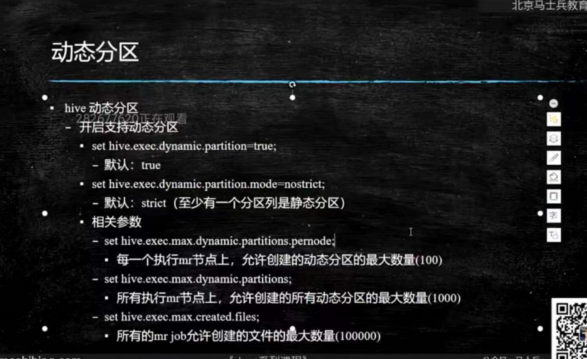

加载如下数据

> 1	小明	吃饭,睡觉	shanghai:pudong,jiangsu:suzhou	woman	12
> 2	小红	吃饭,睡觉	shanghai:pudong,jiangsu:suzhou	woman	13
> 3	小黑	吃饭,睡觉	shanghai:pudong,jiangsu:suzhou	woman	14
> 4	小赤	吃饭,睡觉	shanghai:pudong,jiangsu:suzhou	man	12
> 5	小蓝	吃饭,睡觉	shanghai:pudong,jiangsu:suzhou	man	13
> 6	小绿	吃饭,敲代码	shanghai:pudong	man	14
> 7	小紫	玩游戏,睡觉	shanghai:pudong,jiangsu:suzhou	woman	14

建表语句

> create table person_for_dynamic_partition(
> id int,
> name string,
> hobbies array<string>,
> address map<string,string>,
> gender string,
> age int
> )
> ROW FORMAT DELIMITED
> FIELDS TERMINATED BY '\t'
> COLLECTION ITEMS TERMINATED BY ','
> MAP KEYS TERMINATED BY ':';
>
> 
>
> create table person_dynamic_partition(
> id int,
> name string,
> hobbies array<string>,
> address map<string,string>
> )
> PARTITIONED BY(age int, gender string)
> ROW FORMAT DELIMITED
> FIELDS TERMINATED BY '\t'
> COLLECTION ITEMS TERMINATED BY ','
> MAP KEYS TERMINATED BY ':';
>
> set hive.exec.dynamic.partition.mode=nonstrict;
>
> insert into table person_dynamic_partition partition(age,gender) select id,name,hobbies,address,gender,age from person_for_dynamic_partition;
>
> -- 查看分区
>
> 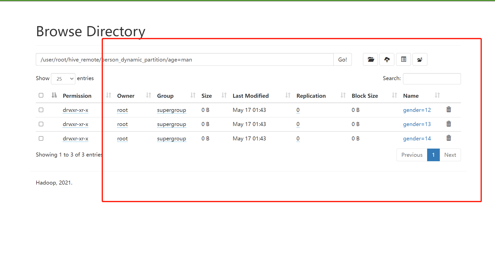
>
> 完成

### jdbc方式使用hive

hadoop启动hiveserver2,使用Hive Beeline或者java代码去访问

https://cwiki.apache.org/confluence/display/Hive/Setting+Up+HiveServer2#SettingUpHiveServer2-HiveServer2

https://cwiki.apache.org/confluence/display/Hive/HiveServer2+Clients

hivesever2为了保证安全,必须要设置用户名和用户组,在core-site.xml中，不然会报错，配置完成后重启NN和yarn，在Hive中，用户登陆时所写的用户，在对应目录下没有权限，所以需要通过伪装的形式通过验证，进行目录创建，并且把目录的owner移交给当前用户

```xml
<property>
	<name>hadoop.proxyuser.root.hosts</name>
	<value>*</value>
</property>
<property>
	<name>hadoop.proxyuser.root.groups</name>
	<value>*</value>
</property>
```

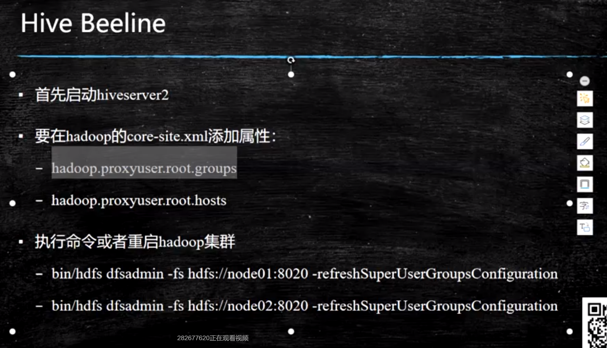

注意,这边默认的10000端口,只能够进行查询,不能加载数据,所以这个接口一般是给数据分析师使用的,原hive是给开发者使用的

beeing line连接: !connect jdbc:hive2://node03:10000/test

**jdbc连接（和连接其他数据库一模一样，只是改了协议）**

```java
package com.hadoop.service;

import java.sql.*;

public class ConnectHive {
    public static void main(String[] args) throws ClassNotFoundException, SQLException {
        Class.forName("org.apache.hive.jdbc.HiveDriver");
        String username = "1";
        String password = "1";
        String uris = "jdbc:hive2://node03:10000/test";
        Connection connection = DriverManager.getConnection(uris,username,password);
        Statement statement = connection.createStatement();
        ResultSet resultSet = statement.executeQuery("select * from person");
        while (resultSet.next()){
            System.out.println(resultSet.getString(1) + " " + resultSet.getString(2));
        }
    }
}
```

### Hive UDF

UDF分三种

1.UDF指单进单出

2.UDTF指单进多出

3.UDAF指多进单出

在Hive中,有些需求比较特殊,虽然Hive提供了很多函数,有时候依然满足不了用户的要求

https://cwiki.apache.org/confluence/display/Hive/HivePlugins

采用jar包的方式进行脱敏操作

```xml
<!-- 加载udf包 -->
<dependency>
    <groupId>org.apache.hive</groupId>
    <artifactId>hive-exec</artifactId>
    <version>3.1.3</version>
</dependency>
```

创建脱敏函数

```java
package com.hadoop.service;

import org.apache.hadoop.io.Text;

public class TuoMin extends UDF{
    public Text evaluate(final Text s) {
        if (s == null) { return null; }
        String s1 = s.toString();
        return new Text(s1.substring(0,4) + "xxxx" + s1.substring(8));
    }
}
```

打成jar包放入hive运行库

```hive
create temporary function tuomin as 'com.tuo.TuoMin';
select tuomin(host) from apachelog;
```

### Hive 函数

https://cwiki.apache.org/confluence/display/Hive/LanguageManual+UDF

Hive 提供的丰富的操作符和函数，有三角函数，聚合函数等

```hive
select map_keys(address) from person;
select mask_first_n(host,4,'x','x','x') from apachelog;
```

聚合函数完成wc

```hive
-- 创建表
create table wc(
phase string
);
-- wc
select keyword,count(1) as number from (select explode(split(phase," ")) as keyword from wc) k group by keyword;
```

### Hive运行方式总结

- CLI模式中
  - 可以直接与hdfs交互,dfs + 命令，如dfs -cat /data/person/data.txt;
  - 可以与linux交互，在命令前加!,如!pwd
- 脚本
- jdbc
- web gui（hwi，hue）

### Hive 参数变量

hive有四种命名空间，hive中的所有参数和变量都以命名空间开头

> hiveconfig: 编写hive-site.xml或者直接指定，在hive中使用set或者启动的时候使用hive --hiveconf hive.cli.print.header=true
>
> system 系统变量，可以通过set查看,包含JVM运行参数等,如system:user.name=root
>
> env 环境变量,例如env:JAVA_HOME
>
> hivevar 参数 hive -d val=1，可以在启动hive的时候传递，后面直接\${val}使用select  *  from  person  where  id = \${val}

#### Hive 参数

hive set命令，设置或查询hive中的参数

hive参数可以初始化，会启用当前用户家目录下的隐藏文件.hiverc文件，如果没有，可以直接创建，启动的时候会执行这些脚本

同时，家目录下还有个.hivehistory保存了历史操作

### Hive执行sql的方式

1.写一个sql文件，然后使用source sql，查出的数据还可以做重定向，导出数据

> hive -S -e "source sql" >> a.txt;

2.普通sql

### Hive 脚本运行模式

- Hive -e ""
- Hive -e "" > aaa
- Hive -S -e "" > aaa
- Hive -f file //直接执行文件中的脚本
- Hive -i sql //初始化，上面执行完毕都会退出，这个会直接留在hive中
- hive 中用source file直接脚本

### Hive分桶

为什么？

1.对于超大表，需要进行表分桶，以便在操作的时候操作几个分块，不要操作超大表，加快查询

2.分表是垂直分表，默认采用hash的方式去分数据，所以一般采用抽样的时候会用到分表操作

操作

https://cwiki.apache.org/confluence/display/Hive/LanguageManual+DDL+BucketedTables

```hive
create table bucketed(
num int,
name string
)
clustered by (num) into 4 buckets
row format delimited
fields terminated by ',';

load data local inpath 'data.txt' into table bucketed;
-- 此时执行mr，可以看到对应分桶后的效果，变成四个文件，分别存放部分数据
-- Hadoop job information for Stage-1: number of mappers: 1; number of reducers: 4
/* 
bucketed.num	bucketed.name
88	ai
44	mei
77	hao
33	mua
66	jia
22	hello
55	jiao
11	hi
*/
```

**分桶抽样（其实也可以不分桶进行抽样，只是分了比较快）**

https://cwiki.apache.org/confluence/display/Hive/LanguageManual+Sampling

语法：table_sample: TABLESAMPLE (BUCKET x OUT OF y [ON colname])

```hive
select * from bucketed tablesample(bucket 1 out of 2);
-- 表示取 y 个桶中的 第 x 个桶，相当于对当前现存的数据进行重新分桶，算法也是hash算法，但是不确定是哪种hash
select * from bucketed tablesample(bucket 1 out of 2 on rand());
-- 随机抽样，适合提取少量样本
```

### Hive Lateral View

https://cwiki.apache.org/confluence/display/Hive/LanguageManual+LateralView

由于使用UDTF函数的时候无法和其他UDTF函数组合使用，所以需要Hive Lateral View

语法：LATERAL VIEW udtf(expression) tableAlias as columnAlias (','columnAlias )

```hive
select count(distinct hobby),count(distinct main) from person
lateral view explode(hobbies) myTable1 as hobby
lateral view explode(address) myTable2 as main,second_main;
```

### Hive视图

https://cwiki.apache.org/confluence/display/Hive/LanguageManual+DDL#LanguageManualDDL-Create/Drop/AlterView

hive也支持视图

特点：

- 不支持物化视图（只有Oracle支持）
- 只能查询，不能加载数据操作(插入这种)（MySql单表是可以的，多表不行）
- 视图创建只保存一份元数据，查询视图时才执行子查询
- 支持迭代视图
- view中的order by和limit语句优先级最高

**语法**

```hive
CREATE VIEW [IF NOT EXISTS] [db_name.]view_name [(column_name [COMMENT column_comment], ...) ]`` ``[COMMENT view_comment]`` ``[TBLPROPERTIES (property_name = property_value, ...)]`` ``AS SELECT ...;

create view bucket_view
as
select * from bucketed;
-- 创建时不进行查询，真正查询视图时才去查询
select * from bucket_view
-- 在原表中插入一条新数据后，再查询视图，视图得到更新
show views; -- 2 版本支持
drop view bucket_view;
```

### Hive 索引（3.x被移除）

https://cwiki.apache.org/confluence/display/Hive/LanguageManual+DDL#LanguageManualDDL-Create/Drop/AlterIndex

目的：优化查询以及检索性能，后来功能被移除，要使用，提供了其他替代方案https://cwiki.apache.org/confluence/display/Hive/IndexDev，建议开发者使用Parquet和Orc的方式存储，这样能完成列扫描的操作

语法

```hive
CREATE INDEX index_name`` ``ON TABLE base_table_name (col_name, ...)`` ``AS index_type`` ``[WITH DEFERRED REBUILD]`` ``[IDXPROPERTIES (property_name=property_value, ...)]`` ``[IN TABLE index_table_name]`` ``[``   ``[ ROW FORMAT ...] STORED AS ...``   ``| STORED BY ...`` ``]`` ``[LOCATION hdfs_path]`` ``[TBLPROPERTIES (...)]`` ``[COMMENT ``"index comment"``];

-- 3.x无法使用
create index apachelog_index
on table apachelog(host)
as "org.apache.hadoop.hive.ql.index.compact.ComapctIndexHandler"
WITH DEFERRED REBUILD
in table apachelog_index_table;

-- 查询索引
show index t_index on psn2
-- 重建索引
alter index t_index on psn2
-- 删除索引
drop index t_index on psn2
```

### Hive join

https://cwiki.apache.org/confluence/display/Hive/LanguageManual+Joins

注意，join的时候多表join尽量使用同一join键，不然会产生多次mr，影响效率

有四种join方式

> inner
>
> left/right/full
>
> semi -- 实现了相当于exists/in的操作，比子查询快
>
> cross join

```hive
SELECT a.key, a.value FROM a WHERE a.key in (SELECT b.key FROM B);
-- 可以写成
SELECT a.key, a.val FROM a LEFT SEMI JOIN b ON (a.key = b.key)
```

### Hive Hbase整合
https://cwiki.apache.org/confluence/display/Hive/HBaseIntegration

```shell
hive --auxpath $HIVE_HOME/lib/hive-hbase-handler-3.1.3.jar,$HIVE_HOME/lib/zookeeper-3.4.6.jar --hiveconf hbase.zookeeper.quorum=node01,node03,node04
```

```hive
CREATE TABLE hbase_table_1(key int, value string) 
STORED BY 'org.apache.hadoop.hive.hbase.HBaseStorageHandler'
WITH SERDEPROPERTIES ("hbase.columns.mapping" = ":key,cf1:val")
TBLPROPERTIES ("hbase.table.name" = "xyz", "hbase.mapred.output.outputtable" = "xyz");
```

### Hive 权限管理

https://cwiki.apache.org/confluence/display/Hive/LanguageManual+Authorization

hive存在四种权限管理模式

- 基于metastore存储的（粒度太粗，没提供表的行级和列级的权限控制）
- 基于标准hiveserver2的（推荐）
- 基于apache ranger的（推荐）
- 老的默认的（丢弃）

#### Hive 授权（Hive server2模式下）

https://cwiki.apache.org/confluence/display/Hive/SQL+Standard+Based+Hive+Authorization

由于默认安全策略只是为了防止用户做错事，而不是防止坏人做坏事，所以需要权限控制

产生了metastore的权限管理，虽然实现了防止坏人做坏事，但是粒度不够，因为不能细粒度到sql层

最终产生了hiveserver2下的权限管理

**注意**

启动都，dfs,add,delete等命令禁用

通过set方式设置参数只限制到特定用户

宏操作和添加删除操作只被root用户持有

用户自定义函数只能被管理员添加

transform功能禁用

##### 概念

hive server2 基于role来赋予权限，而不是基于用户，某个role可以有某些权限，一个用户可以有多个role，最终实现用户通过role的权限的版本控制，默认包含的角色为admin，public

##### 配置

https://cwiki.apache.org/confluence/display/Hive/SQL+Standard+Based+Hive+Authorization#SQLStandardBasedHiveAuthorization-Configuration

hive-site.xml

```xml
<property>
    <name>hive.server2.enable.doAs</name>
    <value>false</value>
</property>
<property>
    <name>hive.users.in.admin.role</name>
    <value>root</value>
</property>
<property>
	<name>hive.security.authorization.manager</name>	<value>org.apache.hadoop.hive.ql.security.authorization.plugin.sqlstd.SQLStdConfOnlyAuthorizerFactory</value>
</property>
<property>
	<name>hive.security.authorization.manager</name>
   <value>org.apache.hadoop.hive.ql.security.authorization.plugin.sqlstd.SQLStdHiveAuthorizerFactory</value>
</property>
<property>
	<name>hive.security.authorization.enabled</name>
   <value>true</value>
</property>
<property>
	<name>hive.security.authenticator.manager</name>
    <value>org.apache.hadoop.hive.ql.security.SessionStateUserAuthenticator</value>
</property>
```

##### 实操

```hive
-- jiahao 启动hiveserver2使用beeline连接发现普通用户无法使用了
select * from person;
-- jiahao 查看当前用户，只有public
SHOW CURRENT ROLES;
-- root 查看role
SHOW ROLES;
-- root 查看失败，需要用set role方法去设置admin用户
set role admin;
-- root 查看成功
SHOW ROLES;
-- root 创建 role
create role person_role;
-- root 现在给jiahao 授予 person_role
grant person_role to user jiahao with admin option;
-- root 查看jiahao权限
SHOW ROLE GRANT USER jiahao;
-- root 查看role的归属
show principals person_role;
-- root 给role 赋予select 权限
grant select on table person to role person_role with grant option;
-- jiahao 查看表
select * from person;
-- root 查看权限
show grant user jiahao on table person;
-- root 收回权限
revoke role person_role from user jiahao;
-- root 删除role
DROP ROLE person_role;
```

### Hive调优

Hive优化

- 核心思想：把hive sql当作mr程序去优化
- 以下sql不会转为mr
  - select 仅查询本表字段
  - where仅对本表字段做条件过滤
- explain可以显示执行计划

https://cwiki.apache.org/confluence/display/Hive/LanguageManual+Explain

```hive
explain select count(*) from person;
-- 细化分析
explain extended select count(*) from person;
```

**Hive中的操作符**

操作符是hive处理的最小单元，每个操作符代表一个操作或者一个mr作业

例如

- Select Operator
- TableScan
- Limit
- File Output Operator
- Fetch Operator

**hive抓取策略**

针对某些情况不转mr

*设置*

```hive
set hive.fetch.task.conversion=none/more;
```

**hive本地执行(开发测试阶段)**

*设置*

```hive
set hive.exec.mode.local.auto=true;
```

限制比较多，比如文件数量大于4和文件大小大于128，仍使用集群方式运行

**并行计算**

*设置*

```hive
set hive.exec.parallel=true; -- 支持并行计算
set hive.exec.parallel.thread.number=3; -- 一次SQL中允许并行执行的job个数的最大值
```

**严格模式**

```hive
set hive.mapred.mode=nostrict; -- 设置mr模式为非严格
```

限制某些模式的使用，比如

- 查分区的时候需要带着分区键
- 排序的时候进行limit限制
- 不可使用笛卡尔积

**Hive排序**

order by 对结果全排序，只允许有一个reduce处理（数据量大，慎用，容易超时）

sort by 对单个reduce的数据进行排序（单个有序）

distribute by 分区排序，经常和sort by结合使用

Cluster by 相当于Sort By + Distribute By

- Cluster by不能通过asc，desc指定，可以通过distribute by column sort by column asc/desc的方式

**Hive join**

https://cwiki.apache.org/confluence/display/Hive/LanguageManual+JoinOptimization

*自动mapjoin*

通过修改以下配置启用mapjoin

- set hive.auto.convert.join=true;（默认开启）
- 该参数为true时，hive自动对左边的表统计量，小表加载进内存，对小表进行map join

相关配置

- hive.mapjoin.smalltable.filesize;
- 大表小表判断的阈值，如果小于该值会被加载进内存
- hive.ignore.mapjoin.hint;
- 默认值true，是否忽略mapjoin hint即mapjoin标记

*多连接的时候尽可能使用相同连接键，会转化成一个mr作业*

*大表join*

- 空key过滤，有时候join超时，因为某些key对应太多，过滤这些异常数据
- 空key转换，对应数据不是异常数据的时候，给key随机赋值，让它分布到不同的reducer上

**Map Side聚合**

通过设置以下参数开启map端聚合，类似于combiner，hive先对map端的数据进行一次预估，读10w条数据，然后计算聚合效果，如果聚合后数据量小于hive.map.aggr.hash.min.reduction * hive.groupby.mapaggr.checkinterval，那么就进行聚合

- set hive.map.aggr=true

相关配置

- hive.groupby.mapaggr.checkinterval
  - map 端group by执行聚合处理的多少行数据（100000）
- hive.map.aggr.hash.min.reduction
  - 进行聚合的最小比例
- hive.map.aggr.hash.percentmemory
  - map端聚合使用的内存最大值
- hive.groupby.skewindata
  - 是否对group by产生的数据倾斜做优化，默认false(优化的时候先开启第一个mr任务按照随机分区器把数据分到reduce端先进行一次处理，再执行用户的分区器进行处理)

**合并小文件**

对于小文件的读取，非常多的小文件造成了随机IO而非顺序IO，影响效率

- 设置合并属性
- hive.merge.mapfiles=true; 是否开启map端输出文件合并
- hive.merge.mapredfiles=true; 是否开启reduce端输出文件合并
- hive.merge.size.per.task=256\*1000\*1000 合并文件的大小

**去重统计**

对于count distinct的操作，hive使用一个reduce task去完成，数据量大的时候会超时，建议使用group by再count的方式进行计算

**控制hive中的map和reduce的数量**

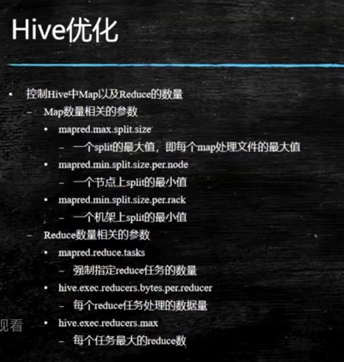

**hive JVM重用**

类似于池化的效果，用于小文件过多， map任务开启的任务数过多的情况使用

通过 set mapred.job.reuse.jvm.num.tasks=n;来设置

有缺点：设置开启后，会进行资源预分配，task一直占用字段，直到全部执行完毕，才会释放资源，如果最后只有一个task了，但是池中有十个task，剩下九个就会跟着这一个空转

## Hive server2 高可用

[高可用详情](hive_highavaliable.md)

## 文件存储格式

文件存储形式分为两种，一种为行式存储，一种为列式存储，常见的行式存储有TextFile，SequenceFile，常见的列式存储有ORC和Parquet

### Parquet

**为什么需要**

因为数据量比较大的情况下，相较于json这种存储格式，schema更加的固定，数据保存的更加完整，数据压缩比率高，并且更方便spark计算

**文件格式**

http://parquet.incubator.apache.org/docs/file-format/

分为三大块（数据与元数据分离的设计）

头尾4位魔数：PAR1

头部存储了文件元数据，可以是当前文件内的引用也可以是引用其他文件的，包括版本号，schema

中间把N列分为了M个行组进行存储，每一个行组中针对这些行的某一个列，顺序存储，存储完后继续以列为单位，存储这些行中对应的值

使用了thrift压缩协议对数据进行存储

尾部4位魔数：PAR1，标志parquet结尾

### ORC

ORC也是列式存储，区别在于它的压缩比例比Parquet更低，在hive上查询速度比spark快，不同于parquet它的尾部是元数据存储区域，而且由于它没有使用thrift，所以对复杂嵌套类型的schema的处理不是很好

[文件格式详情](fileformat.md)
