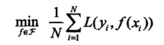
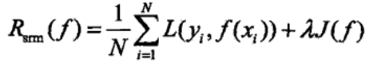

# 机器学习

## 推荐系统

### 分类

**根据实时性分类**

- 离线推荐
- 实时推荐

**根据推荐是否个性化分类**

- 基于统计推荐
- 个性化推荐

**根据推荐原则分类**

- 基于相似度推荐
- 基于模型的推荐
- 基于知识的推荐

**根据数据源分类**

- 基于人口统计学推荐
- 基于内容推荐
- 基于协同过滤推荐

### 协同过滤（Collaborative Filtering，CF）

对比基于内容（Content based，CB）：主要利用的是用户评价过的物品的内容特征来进行分析，好处是不需要用户做过一些显示的评价

**基于近邻的协调过滤**

- 基于用户（User-CF）
- 基于物品（Item-CF）

**基于模型的协调过滤**

- 奇异值分解（SVD）
- 潜在语义分析（LSA）
- 支撑向量机（SVM）

### 混合推荐

- 加权混合
  - 用线性公式按权重组合并在数据集上测试
- 切换混合
  - 在不同情况选择合适的推荐机制计算推荐
- 分区混合
  - 不同推荐结果分不同的区域显示
- 分层混合
  - 多种推荐机制链式调用，求出最终值

## 如何测试

### 离线实验

- 通过已经获取的用户历史行为数据，按照格式生成标准数据集
- 将数据集按照一定的规则分成训练集和测试集
- 在训练集上训练用户兴趣模型，在测试集上进行预测
- 通过实现定义的离线指标评测算法在测试集上的预测结果

### 用户调查

- 调查真实用户，让他回答问题，进行分析

### 在线实验

- AB测试

## 推荐准确度评测

### 评分预测

让用户给物品进行打分

一般采用均方根误差（RMSE）或平均绝对误差（MAE）计算

> 均方根误差：将用户评分减去预测评分然后平方，将所有值相加再除以总量，然后开根号
> 平均绝对误差：将用户评分减去预测评分，将所有值相加再除以总量

### Top-N推荐

给用户推荐列表，而不是单个物品

一般采用精确率（precious）和召回率（recall）来度量

> 实际上非常简单，**精确率**是针对我们**预测结果**而言的，它表示的是预测为正的样本中有多少是真正的正样本。那么预测为正就有两种可能了，一种就是把正类预测为正类(TP)，另一种就是把负类预测为正类(FP)，也就是
> ![[公式]](https://www.zhihu.com/equation?tex=P++%3D+%5Cfrac%7BTP%7D%7BTP%2BFP%7D)
> 而**召回率**是针对我们原来的**样本**而言的，它表示的是样本中的正例有多少被预测正确了。那也有两种可能，一种是把原来的正类预测成正类(TP)，另一种就是把原来的正类预测为负类(FN)。
> ![[公式]](https://www.zhihu.com/equation?tex=R+%3D+%5Cfrac%7BTP%7D%7BTP%2BFN%7D)

在信息检索领域，精确率和召回率又被称为**查准率**和**查全率**

还有一个**准确率**=正确分类/总数

## 数学基础

### 矩阵
#### 矩阵概念回顾

##### 方阵

m=n的矩阵叫n阶方阵，记作${A_n}$

##### 向量

$A_{1*n}$叫行向量

$A_{n*1}$叫列向量

##### 主对角线
左上角到右下角（只有方阵才有）

##### 零矩阵
所有元素均为0，用O表示

##### 单位矩阵
方阵主对角线元素均为1，其余为0，一般用I或者E表示

##### 对角矩阵
方阵除了对角线之外，其余为0，称为对角矩阵
##### 对称矩阵
元素以主对角线为对称轴对应相等

##### 方阵行列式（普通矩阵没有）

**计算低阶行列式**

- 对角线法则

**定义计算行列式**

0较多的情况，先求出排列的奇偶性，再求值

#### 矩阵乘法

- 数值与矩阵相乘
- 矩阵与矩阵相乘
  - 左矩阵行乘以右矩阵列（对应元素相乘），左边列数要等于右边行数

#### 矩阵转置

行变列，列变行，记作$A^T$，如下

$\begin{matrix} a & b \\ c & d \\ e & f \end{matrix}$

$\begin{matrix} a & c & e\\  b & d & f\end{matrix}$

#### 矩阵运算法则
[规则](html\matrix_rules.html) 

#### 逆矩阵

对于n阶方阵A，如果有n阶方阵B，使得$AB=BA=E$，称为A可逆，B为A的逆矩阵，记作$B=A^{-1}$

### 微积分

#### 导数

指二元n次方程函数某个点的切线斜率,$f'(x) > 0$表示沿x轴增加,$f'(x) < 0$表示沿x轴正方向减少

#### 偏导数

指m元n次方程函数某个点的切线斜率,例如f(x,y)固定x对y求偏导,即为$\frac{Ez}{Ey}$

#### 方向导数

偏导数的特殊情况,任意方向的变化规律

#### 梯度

某个点沿着哪个方向有最大的变化率

#### 凹函数和凸函数

任意连接两点都在函数上方名为凸函数

任意连接两点都在函数下方名为凹函数

### 概率论

#### 常用统计变量

**样本均值**

平均数

**样本方差**

每个值减去平均值求和再除以(n - 1)

**样本标准差**

方差开根号

#### 常见概率分布

**均匀分布**

**正态分布(高斯分布)**

**指数分布**

#### 重要概率公式

**条件概率公式**

A发生的概率下B发生的概率

$P(B|A)=\frac{P(AB)}{P(A)}$

**全概率公式**

$P(A)=P({A}|{B_1})P(B_1)+P({A}|{B_2})P(B_2)+P({A}|{B_3})P(B_3)+...+P({A}|{B_n})P(B_n)$

**贝叶斯公式**

对古典概率论的补充

$P(B_i|A)=\frac{P(A)P(B_i|A)}{全概率公式}$

## 概念

### 分类

#### 监督学习
提供数据并提供数据对应结果的机器学习
#### 无监督学习
提供数据并不提供数据对应结果的机器学习
**目的**
主要用于提炼数据特征

#### 强化学习
通过环境交互并获取延迟返回进而改进行为的学习过程

### 监督学习

**过程**

1.建立算法
2.数据训练
3.选择算法，构建模型

#### 分类
分类算法：输出值有限使用分类算法（离散）
回归算法：输出值是范围内的数为回归算法（回归）

*回归算法分类*

> 按输入变量个数区分：一元回归和多元回归
按模型区分：线性回归和非线性回归

#### 模型评估策略
##### 训练集和测试集
训练集：训练模型
测试机：训练完成后用于检测

##### 损失函数
表示为$L(Y,f(X))$
功能：用来衡量模型预测误差的大小
损失函数是系数的函数，损失函数值越小，模型越好

**种类**

0-1损失函数

> 预测相等，直接给1，否则为0

平方损失函数（一般选取，因为凸函数可以用最小值的数学公式去求解，`著名：最小二乘法`）

> $L(Y,f(X))=(Y-f(X))^2$

绝对损失函数

> $L(Y,f(X))=|Y-f(X)|$

对数损失函数

> $L(Y,P(Y|X))=-logP(Y|X)$

**经验风险最小化（ERM）**

训练数据集中的损失函数的平均数

*概念*

测试误差（泛化能力）和训练误差

> 测试误差：测试数据集的误差（较重要）
> 训练误差：训练数据集的误差

过拟合和欠拟合

> 过拟合：过渡解释（太精细）
> 欠拟合：过分模糊（太随意）

**正则化（对复杂模型的惩罚）**
`结构风险最小化（SRM，Structural Risk Minimization）`，在ERM基础上，防止过拟合提出的策略，当模型复杂度越大，正则化的值就越大，并且会加入到计算公式中

其中，J(f)为模型的复杂度，是定义在假设空间上的泛函。模型f越复杂，复杂度J(f)就越大。也就是说，复杂度表示了对复杂模型的惩罚。结构风险小的模型往往对训练数据和未知的测试数据都有较好的预测。比如，贝叶斯估计中的最大后验概率估计（MAP）就是结构风险最小化的例子。当模型是条件概率分布，损失函数是对数损失函数，模型复杂度由模型的先验概率表示时，结构风险最小化就等价于最大后验概率估计。

**奥卡姆剃刀**

如无必要，勿增实体

##### 交叉验证

**数据充足时**
- 数据集划分

  - 如果样本足够充足，数据分三块：训练集、验证集、测试集

  - 训练集训练模型，验证用于模型选择，测试用于评估

**数据不足时**

*简单交叉验证* 
1.数据随机分为两部分
2.不同条件（参数）训练模型，得到不同模型
3.测试集评估模型

*S折交叉验证* 
1.数据随机切分S份
2.S-1做训练集，1做测试集
3.重复选取训练集和测试集

*留一交叉验证* 
只取一部分作为测试集

#### 学习算法

##### 梯度下降法

常用的一阶优化方法，求解无约束优化问题最简单，最经典的方法之一

梯度方向：函数变化增长最快的方向，所以只要选取负梯度方向，就可以获取极小值

ps：适合损失函数是凸函数的极小值求解方法

##### 牛顿法和拟牛顿法

[牛顿法和拟牛顿法](https://zhuanlan.zhihu.com/p/46536960)

牛顿法（Newton method）和拟牛顿法（quasi Newton method）是求解无约束最优化问题的常用方法，有收敛速度快的优点。牛顿法是迭代算法，每一步都需求解目标函数的海塞矩阵（Hessian Matrix），计算比较复杂。拟牛顿法通过正定矩阵近似海塞矩阵的逆矩阵或海塞矩阵，简化了这一计算过程

