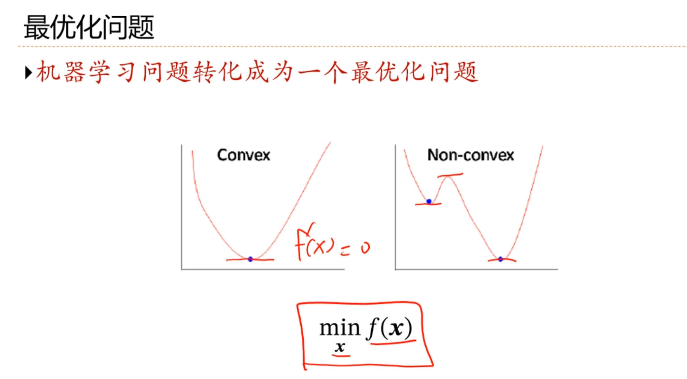

# 神经网络

## 概念

神经网络：（人工）神经元为基本单位的模型

深度学习：一类机器学习问题，主要解决贡献度分配问题

## 推荐资料

https://www.csie.ntu.edu.tw/~htlin/mooc/

https://speech.ee.ntu.edu.tw/~tlkagk/slide/Tutorial_HYLee_Deep.pptx

https://www.bilibili.com/video/av94519857/

## 论文

NeurlPS,ICLR,ICML,AAAI,IJCAI

ACL,EMNLP(NPL)

CVPR,ICCV(视觉处理)

## 人工神经网络

**主要考虑三方面**

*神经元激活规则*
映射关系（函数）

*网络拓扑结构*
不同神经元之间的连接关系

*学习算法*
训练来学习神经网络的参数

**网络形态**

前馈网络
记忆网络
图网络

# 机器学习

## 数学基础

### 随机事件

> 随机变量：
>
> - 离散随机变量：伯努利分布，二项分布（n次伯努利分布）
> - 连续随机变量：概率密度函数（满足连续空间的积分为1），高斯分布/正态分布
> - 累积分布函数：随机变量x的取值小于等于某个值a的概率
>
> 随机向量（多维度）：
>
> - 离散随机变量：联合概率，条件概率（已知联合概率和单独概率，求另一个概率），采样/抽样

*ps*

采样方法

> 均匀分布（计算机内使用）：线性同余发生器 $x_{t+1}=(ax_t + c)\ \ mod \ \ m$ ;m指[0-m)
>
> 随机采样：逆变换采样（连续分布）
>
> 
> 

数学期望

### 似然函数（likelihood）

.png)

## 定义

机器学习是指从有限的观测数据中学习（或“猜测”）出具有一般性的规律，并利用这些规则对未知数据进行预测的方法

## 问题分类

**回归问题**

.png)

**分类问题**

.png)

**聚类问题**

.png)

**强化学习**

.png)

## 机器学习类型

监督学习，无监督学习，强化学习

.png)

## 四个要素

数据 -》模型 -》 学习准则 -》 优化算法

### 模型

.png)

### 学习准则（损失函数）

.png)

**期望风险**

根据大数定律可知到达一定数量级后无限逼近期望风险

.png)

.png)

### 最优化问题

**凸函数的最优化问题**

找二阶导为0的点，求极值

**非凸函数最优化问题**

找多个极值点

#### 优化方法

**梯度下降法（gradient descent）**

.png)

这边需要计算搜索步长 -》 需要一个计算步长的算法（可以是自己定义也可以动态自动调整）

*概念：超参数*

通过手动试错调整的，在学习前输入的参数

*变种*

随机梯度下降法（stochastic gradient descent）：在每次迭代的时候只采集一个样本

优点：支持在线学习，计算开销小

缺点：无法充分利用计算机的并行能力

*折中 -》 Mini-Batch小批量 随机梯度下降法*

随机选取一小部分训练样本来计算梯度并更新参数（充分利用计算机的并行能力）

**实际操作**

选一组训练集和验证集，训练集每次小批量随机梯度下降的时候进行随机排序，再操作，终止条件是当验证集的错误率不再下降

.png)

#### 泛化和正则化

欠拟合：模型不好

过拟合：太贴近训练集，在未知数据上错误率很高

**泛化误差**

期望风险与经验风险的差异：由于经验风险接受的训练集有限，所以不等于期望风险，很容易有误差，这个误差就是泛化误差，泛化误差大就会产生过拟合

**机器学习的优化目标**

泛化误差小并且经验风险小

**正则化**

降低模型复杂度

.png)

**提前停止**

.png)

## 线性回归

### 模型

**一般角度**

.png)

**概率角度**

.png)

*似然函数*

.jpg)

*最大似然估计*

### 经验风险最小化

.png)

**矩阵微积分**

.png)

**经验风险最小化（ERM）**

.png)

$w = (xx{^T}){^-}{^1}xy$

最小二乘法（要求$xx{^T}$的结果可逆，需要为满秩矩阵）

**结构风险**

当$xx{^T}$不可逆时，用来约束w的大小，防止扰动过大

.png)

*岭回归*

## 曲线拟合

建模非线性模型

### 多项式曲线拟合

.png)

其中M为超参数

.png)

M过高会产生过拟合，M过小会产生欠拟合

*控制过拟合*

1.要进行正则化，λ也是超参数

.png)

2.增加训练集数量

