# Spark

大数据计算框架，是MR的高级封装

## Spark角色

### 对比MR与Spark

思考一下，MR在执行过程中的操作

1.先由MR client通过访问hdfs从而访问到对应的数据文件，使用RecordReader对数据进行读取并split，最后放到hdfs上

2.然后如果是MR on yarn的操作时，yarn会使用其中的Resource Manager对Node Manager的状态进行检查，并统一分配资源，开始执行任务

- yarn 先会随机挑选一台空闲的机器，创建一个AppMaster进程,AppMaster请求分配资源
- yarn 再根据资源情况在Node Manager中开辟多个container 进程，container进程开始后会向AppMaster进行注册
- AppMaster向各个Container发出任务执行的信息，各个Container各自拉取jar包和分片数据进行处理

3.处理的时候会反射调用MR的Mapper实现和Reduce实现，先进行Map，如果存在Reduce，还会产生一个shuffle 和 reduce的过程

以上过程，刨去yarn资源层，程序过程是这样的，其中的给Map和Reduce定义了stage的概念 1 app 1 job 1-2 stage (N mapTask M(M<N) reduceTask)

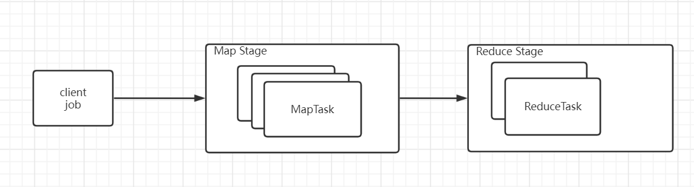

而如果要启动一连串操作，就得进行多次资源分配的操作，这之中浪费了时间，由于当前只有两种task，不能完成复用reduceTask的结果的功能，所以每次都要新开新的app进行操作

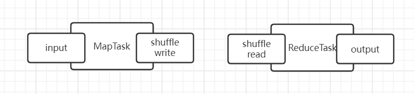

有一种好的解决方案就是在中间再加一层，如下

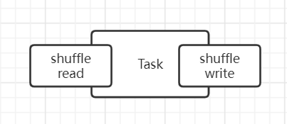

这样就能省略资源分配的过程，此时角色间的关系是 
1 app N job
1 Job N-stage  (N mapTask M(M<N) reduceTask)

而Spark就是帮我们多加了这个链条，帮助我们在reduce之后还能继续使用reduce后的数据集直接进行处理

## 对比JavaSpark和ScalaSpark完成WC

```java
public class JavaWordCount {
    public static void main(String[] args) {
        SparkConf sparkConf = new SparkConf();
        sparkConf.setMaster("local");
        sparkConf.setAppName("java wc");
        JavaSparkContext sc = new JavaSparkContext(sparkConf);
        JavaRDD<String> stringJavaRDD = sc.textFile("E:\\Spark\\testFile.txt");

        JavaRDD<String> stringJavaRDD1 = stringJavaRDD.flatMap(x -> Arrays.asList(x.split(" ")).iterator());
        JavaPairRDD<String, Integer> stringIntegerJavaPairRDD = stringJavaRDD1.mapToPair(x -> new Tuple2<>(x, 1));
        JavaPairRDD<String, Integer> stringIntegerJavaPairRDD1 = stringIntegerJavaPairRDD.reduceByKey(Integer::sum);
        stringIntegerJavaPairRDD1.foreach(x->System.out.println(x));
    }
}
```

```scala
object ScalaWordCount {
  def main(args: Array[String]): Unit = {
    val conf = new SparkConf()
    conf.setAppName("scala wc")
    //本地执行
    conf.setMaster("local")
    val sc = new SparkContext(conf)
    val rdd = sc.textFile("E:\\Spark\\testFile.txt")

    rdd.flatMap(_.split(" ")).map((_,1)).reduceByKey(_+_).foreach(println)
  }
}
```

明显java就算使用了函数式编程，依旧要处理部分迭代逻辑，看起来业务不清晰，而scala只处理业务逻辑，业务逻辑特别清晰

查看运行时的状态

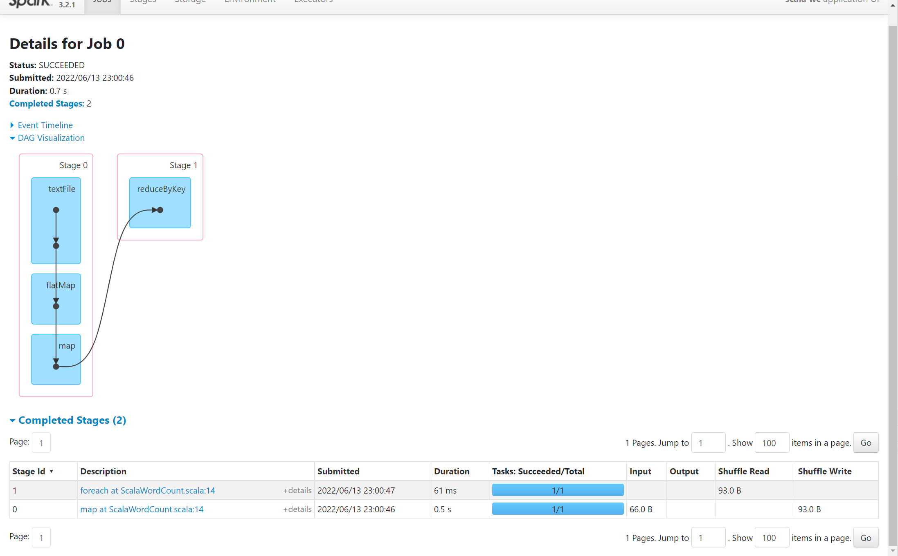

stage的语义是，能够放在同一个机器上进行处理的操作，不产生shuffle，就能放在一个stage上，一个stage有多个task

观察rdd复用的情况

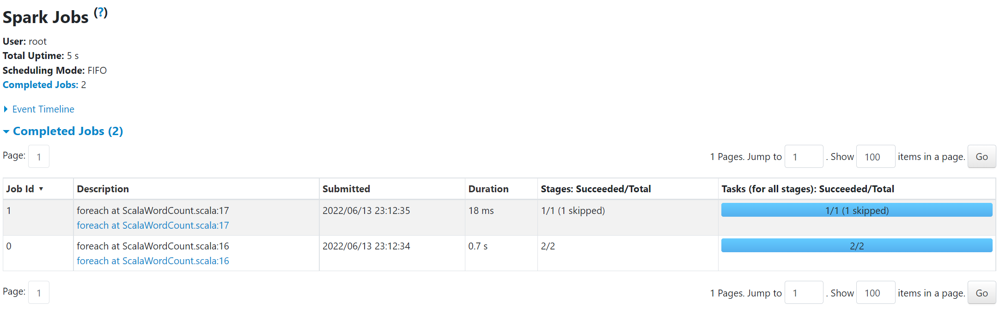

产生了两个job，并且复用了之前的rdd结果，只执行了最后一步

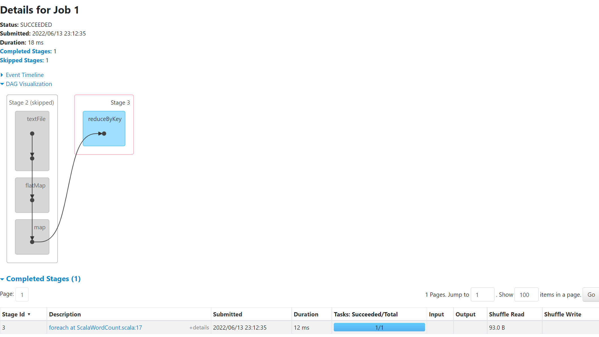

## spark rdd wc源码分析

rdd是个抽象类，有以下属性

- A list of partitions 是一组分片集合（RDD中分区和分片一个意思）（getPartitions）
- A function for computing each split 接收一个处理分片的方法（compute）
- A list of dependencies on other RDDs 依赖于其他RDD
- Optionally, a Partitioner for key-value RDDs (e.g. to say that the RDD is hash-partitioned) 可以为键值对类型的RDD选择分区器，默认hash分区
- Optionally, a list of preferred locations to compute each split on (e.g. block locations for an HDFS file)  计算向数据移动（compute）

**结论**

- split分片（分区）规则，默认等于文件块数量，如果输入的期望分片大小多余文件块，就按照期望值进行分片，如果小于，就按块数分片（所以切片大小默认等于块大小）
- （getPartitions）经过分片后，切片信息中包含了切片块所在的主机位置在哪里，切片大小等关键信息，以方便后续计算向数据移动

### client端

通过hadoopFileRDD这个RDD实例取值

然后和MR一样，核心InputFormat的Split和RecordReader，然后用的老版的MR包

**源码分析WC**

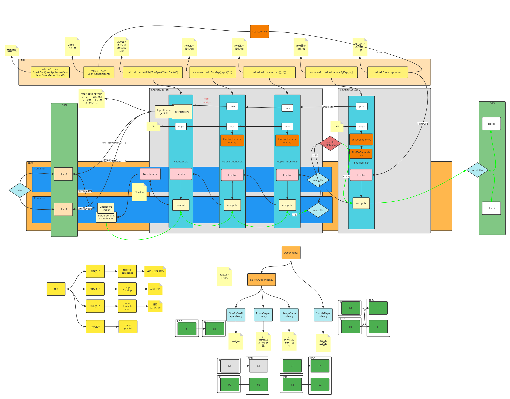

## Spark广播变量和累加器

### 广播变量

场景：

通常适用于需要把driver端的数据到executor端多次使用，并且逻辑不同的场景。如果不使用广播变量，那么在Driver端分发任务的时候，会把数据序列化到Task（taskbinary）中发送到executor端（注意这边taskbinary也使用了broadcast），Task类型（逻辑）越多，同一份数据被封装的次数越多，资源占用就越多，如果使用broadcast，会将数据通过blockManager（全局唯一）放入块中（Memory_And_Disk）（BroadcastBlockId），然后Task拿到封装后的broadcast对象，会先去本地获取，获取不到再去Driver端获取（甚至于后期还能在相邻的executor端就近获取），此时，不同逻辑的task共享同一份数据，减少blockManager上的资源损耗

ps：使用了类似于BT种子的传输技术，把获取到数据块的executor当作data server，就近拉取，解决 driver 单点网络瓶颈问题，data block多了会产生p2p传输，速度非常快

ps：spark sql中的map join正是用了broadcast

ps：RDD不可被broadcast，报错如下：Exception in thread "main" java.lang.IllegalArgumentException: requirement failed: Can not directly broadcast RDDs; instead, call collect() and broadcast the result.

https://blog.csdn.net/rlnLo2pNEfx9c/article/details/120245372

### 累加器

场景：

通常用于数据统计与分析，在单步执行完毕后，根据数据量进行进一步调优以及日志输出，有各种帮助分析的快捷方法如sum，count，avg

累加器只有在driver端才有作用，在executor端进行计算时，累加器单独计算，最后在driver端汇总

## Spark集合操作解析

spark集合存在几种类型，元素，键值对

### 单元素

```scala
val sparkConf: SparkConf = new SparkConf().setMaster("local").setAppName("集合")
val sparkContext: SparkContext = new SparkContext(sparkConf)
val listRdd1:RDD[Int] = sparkContext.parallelize(List(1, 2, 3, 4, 5))
val listRdd2:RDD[Int] = sparkContext.parallelize(List(3, 4, 5, 6, 7))
//单元素对象的交并差
println("==================单元素===================")
println("==================并集===================")
println(listRdd1.partitions.size) //1
println(listRdd2.partitions.size) //1
val listRdd3:RDD[Int] = listRdd1.union(listRdd2)
println(listRdd3.partitions.size) //2
listRdd3.foreach(println)
println("==================交集===================")
val listRdd4 = listRdd1.intersection(listRdd2)
listRdd4.foreach(println) // 
println("==================差集===================")
val listRdd5 = listRdd1.subtract(listRdd2)
listRdd5.foreach(println)
```

**union**

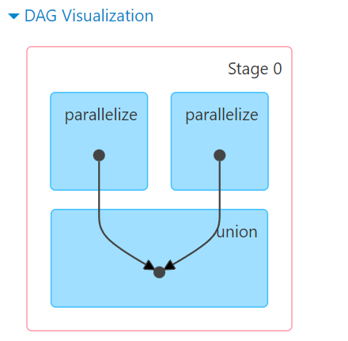

UnionRDD，RangeDependency，union操作不产生shuffle，union只是做了逻辑连接，最终执行还是在对应分区上各自执行，避免shuffle

**intersection**

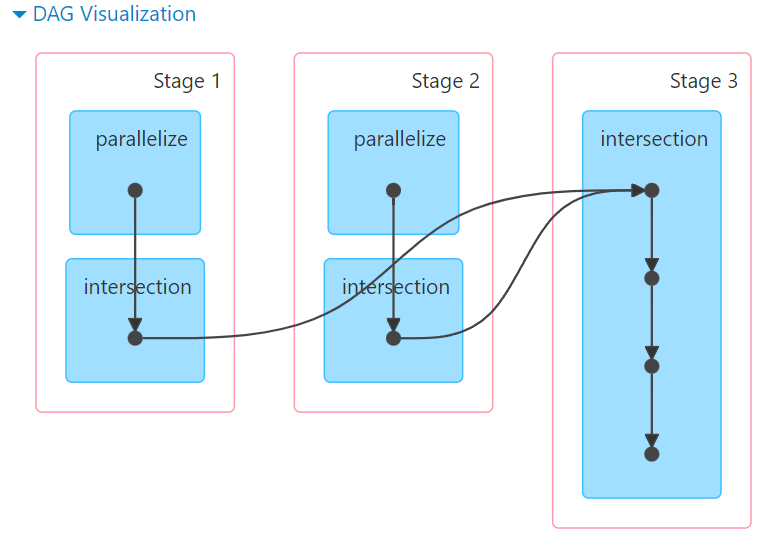

```scala
def intersection(other: RDD[T]): RDD[T] = withScope {
  this.map(v => (v, null)).cogroup(other.map(v => (v, null)))
      .filter { case (_, (leftGroup, rightGroup)) => leftGroup.nonEmpty && rightGroup.nonEmpty }
      .keys
}
```

一般情况下，在不同的机器中，由于算子计算时，可能不需要全量的数据，所以会进行shuffle来减少运算的数量

**substract**

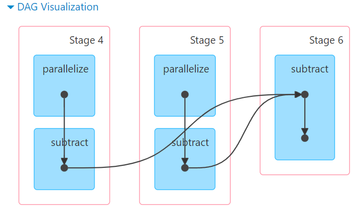

SubtractedRDD，一般使用ShuffleDependency，当算子在同一分区时，为OneToOneDependency，不产生shuffle

一般情况下，在不同的机器中，由于算子计算时，可能不需要全量的数据，所以会进行shuffle来减少运算的数量

**笛卡尔积**

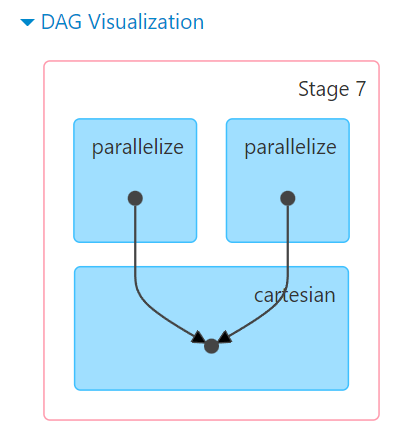

笛卡尔积时用全量拉取其他数据到本机进行笛卡尔积，这样的话所有数据都能被一次拉取并使用，不需要ShuffleRDD，能减少IO数量

**cogroup**

CoGroupedRDD，一般使用ShuffleDependency，当算子在同一分区时，为OneToOneDependency，不产生shuffle

这个操作会把两个两个相同key的数据的value合并为一条新的k，v（v用Tuple2包装），常用于k，v型数据的操作

### k，v

**join**

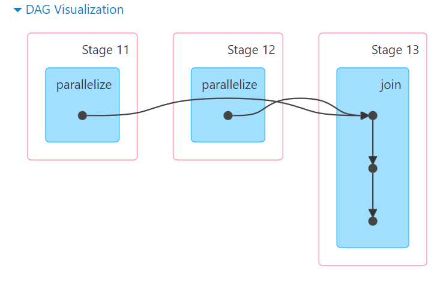

**leftOuterJoin**

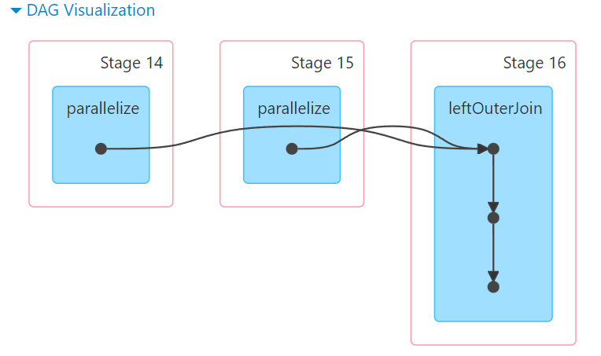

**rightOuterJoin**

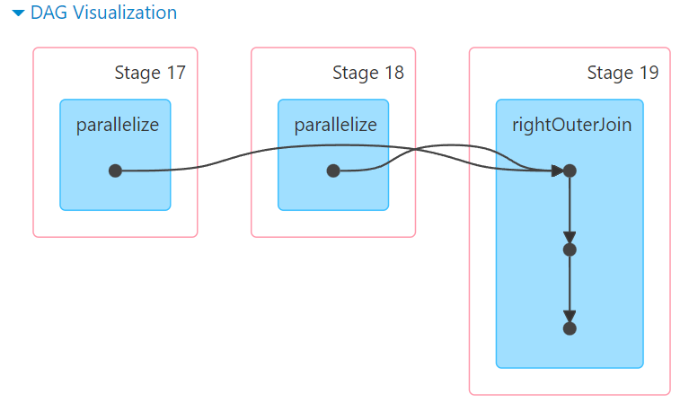

**fullOuterJoin**

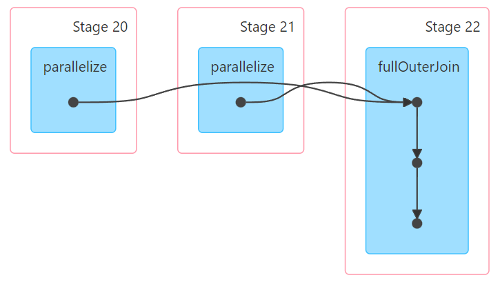

全都是shuffle，因为全都调用了cogroup

### 聚合

```scala
package com.sjh.service

import org.apache.spark.rdd.RDD
import org.apache.spark.{SparkConf, SparkContext}

object aggreate {
  def main(args: Array[String]): Unit = {
    val conf:SparkConf = new SparkConf().setAppName("agg").setMaster("local")
    val sparkContext:SparkContext = new SparkContext(conf)
    sparkContext.setLogLevel("ERROR")

    //数据
    val data:RDD[(String,Int)] = sparkContext.parallelize(List(
      ("foo",123),
      ("foo",12),
      ("foo",23),
      ("boo",4),
      ("boo",58),
      ("boo",46),
    ))

    //按key聚合
    val groupData: RDD[(String, Iterable[Int])] = data.groupByKey()
    groupData.foreach(println)
    //行列转换，两种
    println("==========================")
    groupData.flatMap( e=> e._2.map((e._1,_)) ).foreach(println)
    println("==========================")
    groupData.flatMapValues(e=>e).foreach(println)
    //只取前二
    println("==========================")
    groupData.mapValues(e => e.toList.sorted.take(2)).foreach(println)
    //聚合操作
    println("=============sum,count,min,max,avg=============")
    val sum = data.reduceByKey(_+_) // sum
    println("==============count============")
    val count = data.map(x=>(x._1,1)).reduceByKey((x,_) => (x + 1) ) //count
    println("=============max=============")
    data.reduceByKey((oldValue,newValue) => {
      if (oldValue > newValue) oldValue
      else newValue
    }).foreach(println) // max
    println("=============min=============")
    data.reduceByKey((oldValue,newValue) => {
      if (oldValue < newValue)oldValue else newValue
    }).foreach(println) // min
    println("=============avg=============")
    val avg: RDD[(String, Int)] = sum.join(count).mapValues(e => e._1/e._2)
    avg.foreach(println)
    println("=============avg optimize2=============")
    data.combineByKey(
      (_,1),
      (oldValue:(Int,Int),newValue)=>(oldValue._1 + newValue,oldValue._2 + 1),
      (oldValue:(Int,Int),newValue:(Int,Int))=>(oldValue._1 + newValue._1,oldValue._2 + newValue._2)
    ).mapValues(e=>e._1/e._2).foreach(println)
    println("=============avg optimize1=============")
    data.mapValues((_,1)).reduceByKey((oldValue,newValue) =>{
      (oldValue._1 + newValue._1,oldValue._2 + newValue._2)
    }).mapValues(e=>e._1/e._2).foreach(println)
    println("==========================")
    groupData.mapValues(_.sum).foreach(println)
    println(groupData.count())
    while (true){}
  }
}
```

### 分区

```scala
package com.sjh.service

import org.apache.spark.rdd.RDD
import org.apache.spark.{SparkConf, SparkContext}

import scala.collection.mutable.ListBuffer

object RddPartition {
  def main(args: Array[String]): Unit = {
    val sparkConf: SparkConf = new SparkConf().setMaster("local").setAppName("partition")
    val sparkContext: SparkContext = new SparkContext(sparkConf)
    sparkContext.setLogLevel("Error")
    //外关联 sql 查询
    val dataset: RDD[Int] = sparkContext.parallelize(1 to 10,2)
//    dataset.map(entity=>{
//      println("connect db")
//      println(s"select $entity")
//      println("close connect")
//      s"$entity selected"
//    }).foreach(println)

//    dataset.mapPartitionsWithIndex((index,entityItr)=>{
    // 内存积压
//      println(s"connect db, partition $index")
//      val entities: ListBuffer[Int] = ListBuffer()
//      while (entityItr.hasNext){
//        val next: Int = entityItr.next
//        println(s"select $next")
//        entities.+=(next)
//      }
//      println("close connect")
//      entities.iterator
//    }).foreach(println)

    //进阶，嵌套迭代器
    dataset.mapPartitionsWithIndex((index,entityItr)=>{
      val result: Iterator[String] = new Iterator[String] {
        println(s"connect db, partition $index")
        override def hasNext: Boolean = {
          if(!entityItr.hasNext){println("close connect")}
          entityItr.hasNext
        }

        override def next(): String = {
          val i: Int = entityItr.next()
          println(s"select ${i}")
          s"$i selected"
        }
      }
      result
    }).foreach(println)
  }
}
```

### 抽样，分区调优

```scala
package com.sjh.service

import org.apache.spark.rdd.RDD
import org.apache.spark.{SparkConf, SparkContext}

object Sample {
  def main(args: Array[String]): Unit = {
    val sparkConf: SparkConf = new SparkConf().setAppName("repartition").setMaster("local")
    val sparkContext:SparkContext = new SparkContext(sparkConf)
    sparkContext.setLogLevel("ERROR")

    val samples: RDD[Int] = sparkContext.parallelize(1 to 100, 5)
    //三个参数,是否重复。抽样样子（尽量趋于，但不保证，种子）
    samples.sample(true,0.1,222).foreach(println)
  }
}
```

```scala
package com.sjh.service

import org.apache.spark.rdd.RDD
import org.apache.spark.{SparkConf, SparkContext}

object Partition {
  def main(args: Array[String]): Unit = {
    val sparkConf: SparkConf = new SparkConf().setAppName("repartition").setMaster("local")
    val sparkContext:SparkContext = new SparkContext(sparkConf)
    sparkContext.setLogLevel("ERROR")

    val data: RDD[Int] = sparkContext.parallelize(1 to 10, 5)
    val datax = data.mapPartitionsWithIndex((pid,iter)=>{
      iter.map((pid,_))
    })
    //repartition永远会产生shuffle,永远产生正确的结果
    val value: RDD[(Int, Int)] = datax.repartition(4)
    val valuex =value.mapPartitionsWithIndex((pid,iter)=>{
      iter.map((pid,_))
    })
    datax.foreach(println)
    println("==========================")
    valuex.foreach(println)

    while (true){}
  }
}
```

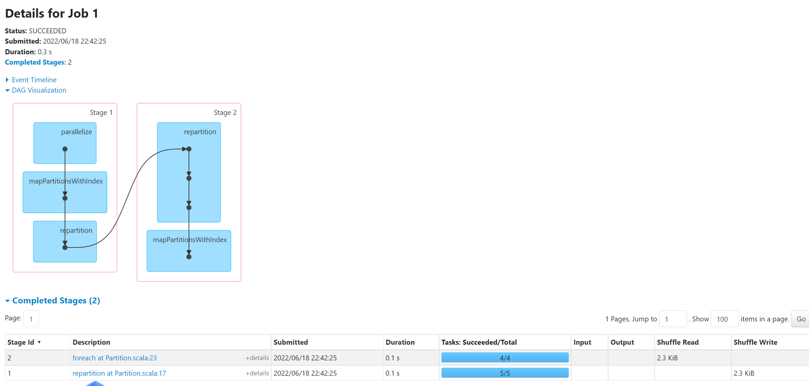

对于repartition算子，由于代码层调用的coalesce(x,shuffle=true)所以永远产生shuffle，并且会把数据均匀分布

而使用coalesce，shuffle=false时，如果是增加分区数，由于不需要减小分区而且不让产生shuffle，所以分区数不改变，不产生shuffle，如果是减少分区数，会建立ArrowDependency，然后在计算的时候把另外一个分区的全量数据移动拉取到当前分区上，实际的并发数就是当前设置的并发数

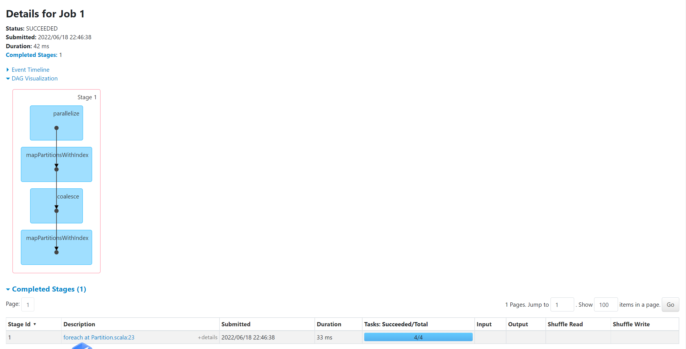

在分布式计算中，数据移动分为两种，一种是产生shuffle的，一种是不产生shuffle直接拉取全量的

```scala
data.reduceByKey(_+_).groupByKey().mapValues(_.map(_*10)).foreach(println)
data.reduceByKey(_+_).map(x=>(x._1,x._2*10)).groupByKey().foreach(println)
data.reduceByKey(_+_).mapValues(_*10).groupByKey().foreach(println)
```

key没有发生变化，分区器未发生变化，分区数未发生变化，可以使用mapValues进行优化（preservesPartitioning = true，保存前一个分区器），截断shuffle，减少一次shuffle

### 集群搭建

[配置](https://spark.apache.org/docs/3.2.1/configuration.html#configuring-logging)

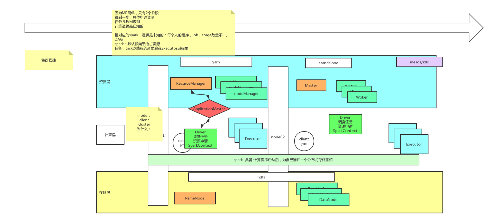

**资源层**

Spark在yarn上运行的时候，资源层会去向yarn申请资源，yarn的RS会为spark分配NM资源，而standalone模式会去自己创建一个资源层，拥有资源分配的master和其余的worker结点，还可以运行在mesos或者其他资源层上

Spark在执行的时候，job数量不可预知，例如使用spark shell的时候，所以spark默认抢占所有资源，以保证运行的速度和稳定

**存储层**

Spark可以使用hdfs这种分布式存储（角色NN,DN），也可以自己维护一个分布式存储系统

**计算层**

spark作为计算层，有自己的一些角色，分为Driver和Executor，Driver有两种运行模式，client和cluster，默认是client，在哪边启动driver，任务调度就在哪边发生，为了确保每次能在client端接收到数据，最好还是使用client模式

Driver端实现任务调度和资源申请，使用SparkContext控制整个任务执行，executor和driver会互相通讯

在任务开始执行的时候，会先在worker/NM端开启很多executors，然后执行任务时把task放入executor启动，task以线程的形式运行在executor中

#### standalone

https://spark.apache.org/docs/3.2.1/spark-standalone.html

可以发现，spark拥有自己的资源层，进行资源调用，而使用的存储层可以是本地可以是hdfs等分布式存储系统，是弹性的，故称RDD

##### master ha

重点：在每台master启动的时候会检测spark-env里的master，那个要指定为自己才能启动成功，需要一分钟左右进行主的切换

##### 开启历史记录

https://spark.apache.org/docs/3.2.1/spark-standalone.html#monitoring-and-logging

https://spark.apache.org/docs/3.2.1/monitoring.html

每个worker都会写日志到SPARK_HOME/work目录下，一份为stderr一份为stdout，日志是由work（计算层）写入的

```shell
spark.eventLog.enabled true
spark.eventLog.dir hdfs://hdfsCluster/spark-logs
spark.history.fs.logDirectory hdfs://hdfsCluster/spark-logs
```

```shell
./sbin/start-history-server.sh
```

开启log，访问http://node01:18080/

**任务提交**

https://spark.apache.org/docs/3.2.1/submitting-applications.html

可以写个任务提交脚本

```shell
NUM=$1

spark-submit \
--class org.apache.spark.examples.SparkPi \
--master spark://node01:7077,node02:7077 \
--executor-memory 2G \
--executor-cores 2 \
$SPARK_HOME/examples/jars/spark-examples_2.13-3.2.1.jar \
$NUM

# --total-executor-cores shandalone模式专用
```

driver 端的内存，在实际收集的时候较大或者在数据碎片过多时（会存储中间过程的元数据），需要调大

### spark on yarn

直接使用--master yarn

此时可以观察到一些角色

ExecutorLauncher(ApplicationMaster)，YarnCoarseGrainedExecutorBackend

在使用cluster模式时，存在AppMstr进程和ExecutorBackend进程，此时driver在AppMstr内部，提交任务的client端为spark-submit进程
在使用client模式时，存在ExecutorLauncher(ApplicationMaster)进程和ExecutorBackend进程，此时driver在spark-submit内部

**注意**

配置spark on yarn的时候，yarn运行需要spark的jar包，没有会先把本地jar上传上去，但是不建议多次上传jar包，会导致虚拟机磁盘膨胀，可以看hdfs的user/root/.sparkStaging验证

https://spark.apache.org/docs/3.2.1/running-on-yarn.html#adding-other-jars

spark.yarn.jars hdfs://hdfsCluster/user/root/jars/*.jar

## Spark源码3.2.1

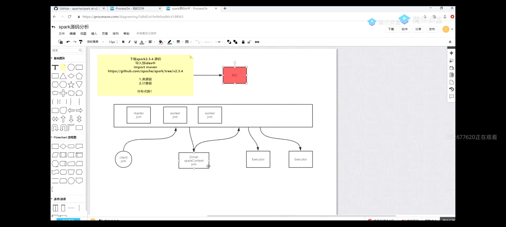

spark分为两个部分，standalone自带的资源层和spark计算层，要分析的时候先从资源层开始看

**spark rpc**

看源码之前，理解下rpc

rpc（远程过程调用），多台物理机之间的交互，首先需要一个传输层，有了传输层之后，如果数据在同一台机器上发送，到另外一台机器的另外两个服务中，需要产生路由，所以需要分发（nginx），然后考虑效率问题，需要有连接池的概念（包括线程池，连接池），接收端需要inbox来存储收到的信件（优化），最后数据通讯需要两端保持一致的`观点`（消息投递规则），也就是at most once(发一次就不管了)，at least once（在一段时间内未收到回复会重复发送），exactly once（消息幂等）

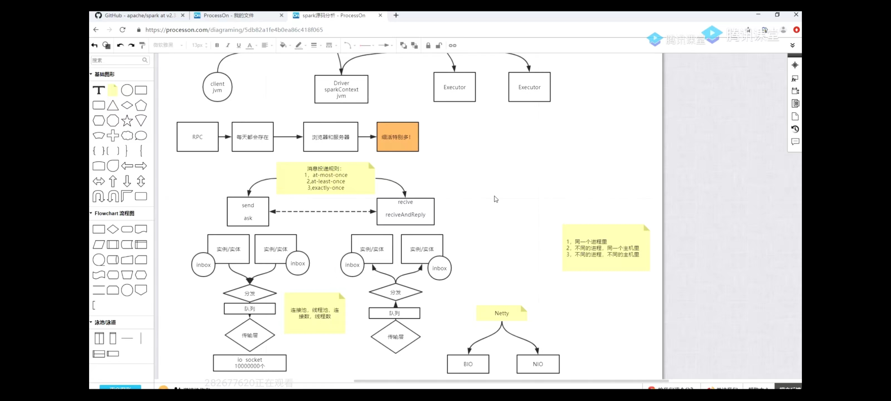

**入口**

sbin/start-all.sh -> 调用了 start-master.sh -> 调用了 start-workers.sh和start-slave.sh

- start-master.sh里面有scala的入口org.apache.spark.deploy.master.Master
- start-slave.sh里面有scala的入口org.apache.spark.deploy.worker.Worker

进入scala入口进行查看

**资源层**

**master**

1. Master -> RpcEnv -> NettyRpcEnvFactory -> NettyRpcEnv -> TransportServer -> TransportChannelHandler ->  RpcHandler -> receive() -> Dispatcher -> postMessage()
   - 可以看到Env创建时会启动Netty来实现RPC，并且挂起，等待消息过来，在TransportChannelHandler 的read0方法中处理消息，最终调用的是分发器的postMessage方法分发到对应的端口上
   - 可以看到远程过来的消息是RpcMessage
2. Master -> rpcEnv.setupEndpoint() -> dispatcher.registerRpcEndpoint() -> sharedLoop.register(name, endpoint) -> new Inbox()（初始化的时候会在它的messages里面存放OnStart样例）-> active.offer(往队列塞数据)
   - Dispatcher会随着Master的创建而创建，里面有endpoints属性，它存放了角色名称和其对应的端点的处理线程MessageLoop，SharedMessageLoop创建的时候会初始化threadpool，会挂起线程，等待处理active阻塞队列中的消息
   - 接收到队列发送的Master消息，会调用inbox的process方法，最终回调Master的onStart，Master就启动起来了

**worker**

1. worker的入口处要比master多注册一个master的信息结点，因为要与Master产生通讯

2. worker也会往SharedMessageLoop中发送消息，最终start起来，onStart时会向Master注册信息tryRegisterAllMasters(),开启线程向master进行注册，sendRegisterMessageToMaster(masterEndpoint)，样例类为RegisterWorker extends DeployMessage,send的时候最终发的是dispatcher.postOneWayMessage(message)

**交互**

1. Master接收消息，通过netty的read0方法接收到了OneWayMessage类型的消息，调用receive进行处理，处理的时候会返回给Slave RegisteredWorker消息，告诉Slave注册成功
2. Slave接收到消息后会开启定时任务，上报心跳
3. Slave还会发给Master WorkerLatestState消息，进行状态同步

**计算层（standalone）**

计算层的入口为spark-submit脚本

```shell
exec "${SPARK_HOME}"/bin/spark-class org.apache.spark.deploy.SparkSubmit "$@"
```

- 所以入口为org.apache.spark.deploy.SparkSubmit，并且传入了参数

- 参数一路往下带，最终会被带到runMain方法中，通过prepareSubmitEnvironment(args)方法准备了启动类childMainClass，可以看到，client模式直接在本地启动args.mainClass对应的类，也就是Driver，如果是cluster（standalone）模式则使用org.apache.spark.deploy.ClientApp进行启动，而yarn是org.apache.spark.deploy.yarn.YarnClusterApplication进行启动Driver

- 获得到prepareSubmitEnvironment(args)准备的数据后，由于ClientApp是SparkApplication的子类，所以调用app.start方法

- 此时参数被带到ClientApp的start中，准备向资源层请求开启driver，rpcEnv.setupEndpoint("client", new ClientEndpoint(rpcEnv, driverArgs, masterEndpoints, conf))，创建了一个ClientEndpoint端点，由上面源码分析可知，在端点创建时，一定会向MessageLoop中发送OnStart消息，所以查看ClientEndpoint的OnStart方法
- OnStart方法中定义了RPC的主类为org.apache.spark.deploy.worker.DriverWrapper，然后把用户的mainClass包装进了driverDescription，调用asyncSendToMasterAndForwardReply方法最终调用TransportClient的hannel.writeAndFlush(new RpcRequest(requestId, new NioManagedBuffer(message)))方法发送一个RpcRequest请求
- Master端接收并解析processRpcRequest((RpcRequest) request);封装RpcRequest为RpcMessage，最终调用到master的receiveAndReply(context)方法
- Master调用schedule()然后调用launchDriver()进行Driver的启动，会找到所有的worker，发送LaunchDriver消息

**Driver启动后**

- Driver启动后会调用org.apache.spark.deploy.worker.DriverWrapper类的主方法，找到用户参数中的mainClass，开启线程进行执行，在driver端反序列化类，并且调用main方法mainMethod.invoke(null, extraArgs.toArray[String])，用户类开始调用
- 用户类调用的时候会去new SparkContext，进入到SparkContext的初始化环节
- SparkContext初始化的时候会初始化SparkEnv，SchedulerBackend，TaskScheduler，DAGScheduler，HeartbeatReceiver
- 在初始化时可以看到executor的内存默认1024M，通过spark.executor.memory去设置，或者在环境变量中的SPARK_EXECUTOR_MEMORY，SPARK_MEM，优先级从高到低
- SparkContest的createTaskScheduler方法中会按照模式创建TaskScheduler和SchedulerBackend
- TaskScheduler的实现是TaskSchedulerImpl，SchedulerBackend的实现是StandaloneSchedulerBackend(standalone模式下的Backend)，并且继承了CoarseGrainedSchedulerBackend，在这个上面会启动一个DriverEndpoint
- 后续会调用TaskSchedulerImpl的start方法，从而调用了StandaloneSchedulerBackend的start方法，然后调用了父类的start进行token的获取，最后执行StandaloneSchedulerBackend的start方法（这边可以看到默认的spark.executor.cores为1），然后会通过ApplicationDescription的参数，依靠于StandaloneAppClient的onstart方法启动application，向Master发送一个RegisterApplication的消息
- Master接收到消息后，检查资源并发回给driver RegisteredApplication的消息，然后调用schedule方法开始分配executor
- startExecutorsOnWorkers()，这边可以看到每个excutor的核心数默认为1，并且最大核数如果不设置的话是无限的
- **分配executor的逻辑**：把可用的worker按照资源情况进行过滤，并按资源情况进行由高到低排序（核心数资源），调用scheduleExecutorsOnWorkers方法规划executor，通过allocateWorkerResourceToExecutors方法去分配executor
- **分配过程中可以看到spreadOutApps控制了executor是水平申请还是垂直申请，默认水平申请**
- 计算分配的executor计算完毕之后，调用launchExecutor方法，向worker发送了LaunchExecutor的消息
- worker的receive接收到消息后，由于linux的jdk和windows不一样，会fork出CoarseGrainedExecutorBackend进程，CoarseGrainedExecutorBackend会向Driver注册自己，注册时会发送消息到DriverEndpoint的RegisterExecutor
- 获取返回成功的结果后在本地发送本地RPC的RegisteredExecutor消息（不同于2版本在Driver端直接发送，为了保持数据一致性以及减少两台主机间的RPC次数）
- 获取到消息后，会fork创建executor进程（这里是启动了一个线程池，以方便后续跑task）后回发给Driver一个LaunchedExecutor的消息，Driver收到后调用makeOffers方法，完成注册的收尾工作

### 计算下列数据的pvuv

 [pvuvdata](spark.assets\pvuvdata) 

```scala
package com.sjh.service

import org.apache.spark.rdd.RDD
import org.apache.spark.{SparkConf, SparkContext}

object PvUv {
  def main(args: Array[String]): Unit = {
   val sparkConf:SparkConf = new SparkConf().setAppName("pvuv").setMaster("local")
    val sparkContext:SparkContext = new SparkContext(sparkConf)
    val pvuvDataset: RDD[String] = sparkContext.textFile("E:\\Spark\\src\\main\\resources\\pvuvdata",5)
    //求pv 并且top5
    //43.169.217.152	河北	2018-11-12	1542011088714	3292380437528494072	www.dangdang.com	Login
    pvuvDataset.map(x=>(x.split("\t")(5),1)).reduceByKey(_+_).sortBy(_._2,ascending = false).take(5).foreach(println)
    //求uv 并且top5
    //43.169.217.152	河北	2018-11-12	1542011088714	3292380437528494072	www.dangdang.com	Login
    pvuvDataset.map(x=>(x.split("\t")(5),x.split("\t")(0))).distinct().map( x=>(x._1,1) ).reduceByKey(_+_).sortBy(_._2,ascending = false).take(5).foreach(println)
    while(true){}
  }
}
```

观察job的个数，为什么是六个，而不是两个action产生两个job？

因为每个任务在sort前需要先按照key分区，把一组key按照partitioner放入同一个分区，然后再进行抽取

### 温度

```scala
package com.sjh.service

import org.apache.spark.rdd.RDD
import org.apache.spark.{SparkConf, SparkContext}

import scala.collection.mutable

object TQ {
  def main(args: Array[String]): Unit = {
    var sparkConf: SparkConf = new SparkConf().setMaster("local").setAppName("TQ")
    val sparkContext: SparkContext = new SparkContext(sparkConf)
    sparkContext.setLogLevel("ERROR")
    val fileData: RDD[String] = sparkContext.textFile("E:\\Spark\\src\\main\\resources\\tqdata")
    //2019-6-1	39
    //求同月份中温度最高的两天
    val baseData: RDD[(Int, Int, Int, Int)] = fileData.map((e: String) => {
      val datas: Array[String] = e.split("\t")
      val strings: Array[String] = datas(0).split('-')
      //year month day temperature
      (strings(0).toInt, strings(1).toInt, strings(2).toInt, datas(1).toInt)
    })
    implicit val ord: Ordering[(Int,Int)] = (x:(Int,Int),y:(Int,Int))=>{
      y._2.compareTo(x._2)
    }
    //1.先按照year+month构成键，day+temperature构成值，进行分组，然后内部排序
    println("============== 1 ==============")
    val kv: RDD[((Int, Int), (Int, Int))] = baseData.map((t4: (Int, Int, Int, Int)) => ((t4._1, t4._2), (t4._3, t4._4)))
    val grouped: RDD[((Int, Int), Iterable[(Int, Int)])] = kv.groupByKey()
    val result: RDD[((Int, Int), List[(Int, Int)])] = grouped.mapValues((iter: Iterable[(Int, Int)]) => {
        val filterDuplicateMap: mutable.HashMap[Int, Int] = mutable.HashMap()
        iter.foreach((e: (Int, Int)) =>{
          val temp: Int = filterDuplicateMap.getOrElse(e._1, -1)
          if (temp < e._2)filterDuplicateMap.put(e._1,e._2)
      })
      filterDuplicateMap.toList.sorted.take(2)
    })
    result.foreach(println)
    //2.按照year+month+temperature构成key，day构成value，进行排序，然后分组，输出
    println("============== 2 ==============")
    val kv1: RDD[((Int, Int, Int), Int)] = baseData.map((t4: (Int, Int, Int, Int)) => ((t4._1, t4._2, t4._4), t4._3))
    val sorted1: RDD[((Int, Int, Int), Int)] = kv1.sortByKey(ascending = false)
    //去重
    val duplicated: RDD[((Int, Int, Int), Int)] = sorted1.map((t: ((Int, Int, Int), Int)) =>((t._1._1,t._1._2,t._2),t._1._3)).reduceByKey((x: Int, y: Int) => if (x > y) x else y)
    val grouped1: RDD[((Int, Int), Iterable[(Int, Int)])] = duplicated.map((e: ((Int, Int, Int), Int)) => {
      ((e._1._1,e._1._2),(e._1._3,e._2))
    }).groupByKey()
    val result1: RDD[((Int, Int), List[(Int, Int)])] = grouped1.mapValues((iter: Iterable[(Int, Int)]) => {
      iter.toList.take(2)
    })
    result1.foreach(println)
    println("============== 3 ==============")
    //3.按照年月日，温度分组
    val kv2: RDD[((Int, Int, Int), Int)] = baseData.map((t4: (Int, Int, Int, Int)) => ((t4._1, t4._2, t4._3),t4._4))
    val sorted2: RDD[((Int, Int, Int), Int)] = kv2.reduceByKey((x: Int, y: Int) => if (x > y) x else y)
    val grouped2: RDD[((Int, Int), Iterable[(Int, Int)])] = sorted2.map((e: ((Int, Int, Int), Int)) => {
      ((e._1._1, e._1._2), (e._1._3, e._2))
    }).groupByKey()
    grouped2.mapValues((iter: Iterable[(Int, Int)]) =>{
      iter.toList.sorted.take(2)
    }).foreach(println)
    println("============== 4 ==============")
    val kv3: RDD[((Int, Int, Int), Int)] = baseData.map((t4: (Int, Int, Int, Int)) => ((t4._1, t4._2, t4._3), t4._4))
    //去重
    val duplicated2: RDD[((Int, Int, Int), Int)] = kv3.reduceByKey((x: Int, y: Int) => if (x > y) x else y)
    val sorted4: RDD[((Int, Int, Int), Int)] = duplicated2.map((t: ((Int, Int, Int), Int)) =>((t._1._1,t._1._2,t._2),t._1._3)).sortByKey(ascending = false)
    val grouped3: RDD[((Int, Int), Iterable[(Int, Int)])] = sorted4.map((e: ((Int, Int, Int), Int)) => {
      ((e._1._1,e._1._2),(e._2,e._1._3))
    }).groupByKey()
    val result3: RDD[((Int, Int), List[(Int, Int)])] = grouped3.mapValues((iter: Iterable[(Int, Int)]) => {
      iter.toList.take(2)
    })
    result3.foreach(println)    
    println("============== 5使用combinerByKey优化 ==============")
    val kv4: RDD[((Int, Int), (Int, Int))] = baseData.map((t4: (Int, Int, Int, Int)) => ((t4._1, t4._2), (t4._3, t4._4)))
    val c = kv4.combineByKey(
      //第一个元素输入
      (value:(Int, Int)) => {
        Array(value,(0,0),(0,0))
      },
      (oldV:Array[(Int,Int)],value:(Int, Int)) => {
        var flag = false;
        for(i <- oldV.indices){
          if(oldV(i)._1 == value._1){
            if (oldV(i)._2 < value._2){
              oldV(i) = value
              flag = true
            }
          }
        }
        if (!flag)oldV(2) = value
        Sorting.quickSort(oldV)
        oldV
      },
      (oldV1:Array[(Int,Int)],oldV2:Array[(Int,Int)]) => {
        val oldV: Array[(Int, Int)] = Array((0,0),(0,0),(0,0))
        for(valueI <- oldV1.indices){
          val value: (Int, Int) = oldV1(valueI)
          var flag = false;
          for(i <- oldV.indices){
            if(oldV(i)._1 == value._1){
              if (oldV(i)._2 < value._2){
                oldV(i) = value
                flag = true
              }
            }
          }
          if (!flag)oldV(2) = value
          Sorting.quickSort(oldV)
        }
        for(valueI <- oldV2.indices){
          val value: (Int, Int) = oldV2(valueI)
          var flag = false;
          for(i <- oldV.indices){
            if(oldV(i)._1 == value._1){
              if (oldV(i)._2 < value._2){
                oldV(i) = value
                flag = true
              }
            }
          }
          if (!flag)oldV(2) = value
          Sorting.quickSort(oldV)
        }
        oldV
      }
    )
    c.foreach(x=>{
      print(x._1+" ")
      x._2.foreach(print)
      println()
    })
    while (true){}
  }
}
```

总结：排序的时候，后面的排序需要是前面排序的子集，才能保证顺序不乱，二次排序的坑

