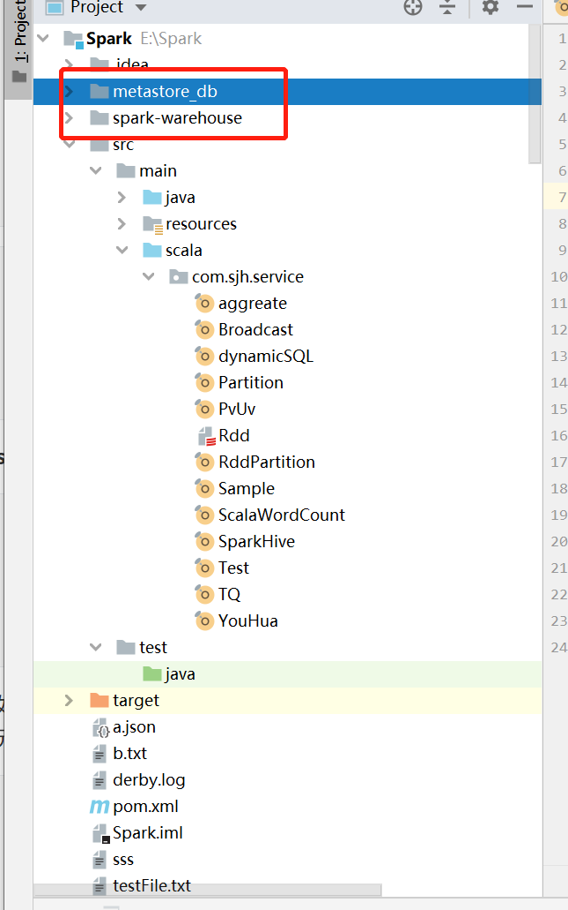
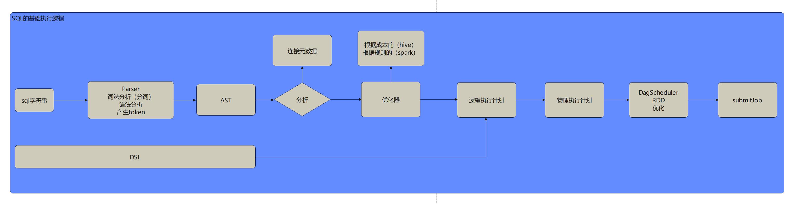
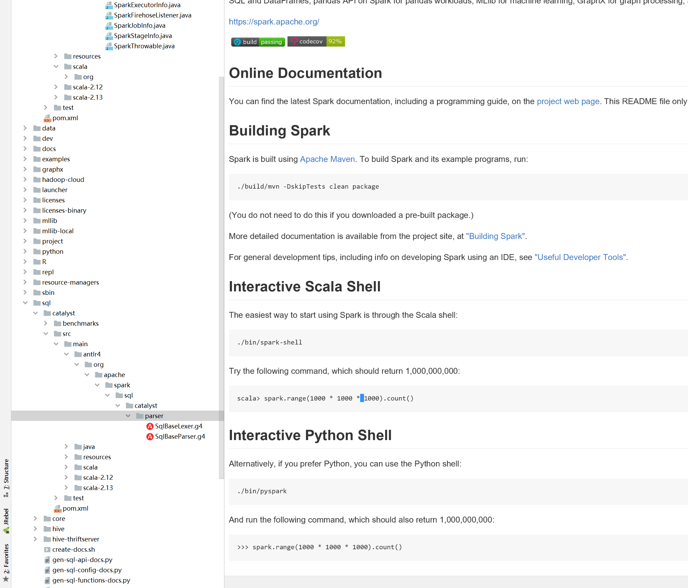

# Spark SQL

## 概念

spark为了方便用户使用，对底层低阶RDD算子的高级封装，产生了spark sql，以便让用户以低成本的代码使用spark

**hive on spark**

spark发展初期，hive已经产生并开始使用，当时hive技术架构为

Hive server2：用于为用户提供jdbc连接，不让hive直接暴露在用户眼中

Driver：用于处理用户请求

Metastore：把数据元数据存储在可靠的数据库中，推荐MySQL

计算层：MR

存储层：hdfs

资源层：各种

运行逻辑为：hive server2接收到用户请求，把hql语句交给Driver，Driver拿到hql后对语句进行语法分析以及词法分析，同时查询Metastore获取对应表元数据，从而获取元数据信息（包括文件存储的位置），然后对hql进行MR程序的转化，提交到资源层，计算完毕后，返回结果

*hive on spark的产生*

由于MR程序速度较慢，对数据的连续操作，要起很多个application去处理，最多只有两个stage，一个map，一个reduce，所以速度远不及spark，所以hive用spark替换了资源层，提高了运算速度，也叫hive on spark，此时spark只是作为计算层组件存在

**shark**

这个时期，spark团队与hive团队合作优化源码，由于hive on spark受限于hql解析的局限性，spark无法直接拿到用户传来的hql，无法使用到RDD的各种优化特性，所以两团队决定把源码各自修改下，提高运算速度

**spark on hive**

spark后期，spark发现hive的hql由于是提供给用户的，比较稳定，为了更好的加快计算，充分利用spark特性，就接管了hive的Driver，自己做了Driver，并且兼容了hive的元数据，因为一家公司的同一份元数据，应该只存在一个地方，而不应该存在多分存储在不同的地方，所以spark选取了hql以及metastore这两个比较稳定的部件，自己实现了其他组件，形成了spark sql，并且赋予了更多的能力，使它更加灵活

通俗来讲 spark on hive，就是spark 用了 hive的metastore

## 元数据

元数据描述了数据的样子，也就是俗称的schema

在以文件格式存储的数据中，比如csv，txt，如果只是把元数据写在某个地方统一管理，那人为使用的时候将非常困难，需要先手动去对应目录找到元数据信息，在映射到对应数据上

而在以表形式存储的数据中，元数据由数据库维护，其实最终都是对文件的操作，但是帮助用户屏蔽了这个复杂度，利用这一特点，我们可以用ddl把表元数据写入数据库中，当这个数据的存储路径指向外部文件路径的时候，就可以解析对应文件，这就是hive，hive中的元数据是最值钱的点

*思考： hive 如何使用 sql与元数据互动产生MR程序*

> 假设如下 sql，查询年龄大于20的人的名字，以及按名字分组后对应的人数
>
> select name,count(1) from person where age > 20 group by name
>
> 当hive接收到用户的sql，解析如下
>
> 1. from person；会去找是否之前产生过person表的ddl
> 2. where age > 20；这一步可以对应到MR的mapTask，先过滤数据
> 3. group by name； 对应输入到reduce端时，分组的key
> 4. select name,count(1); 对应reduceTask

### spark sql的元数据灵活度

spark sql可以

1.临时产生元数据，跑完就销毁，元数据不持久化，单次使用单次注册

2.元数据自主持久化（使用spark sql独立使用的元数据，不与其他程序共用）

3.使用别人提供的持久化的元数据（spark on hive，使用hive的元数据）

以上的实现，都通过catalog（目录，编目）产生一个解耦的模块，spark-sql不知道元数据在哪，一切都通过编目去操作，面向编目可以直接写DQL，而DDL功能只能连接持久化层使用，比如hive，编目也可以理解成一种数据映射

## 实操

https://spark.apache.org/docs/latest/sql-getting-started.html

**创建表并注册**

```scala
def main(args: Array[String]): Unit = {    val sparkSession: SparkSession = SparkSession.builder()
      .appName("app")
      .master("local")
      .getOrCreate()
    sparkSession.sparkContext.setLogLevel("ERROR")

    val database: Dataset[Database] = sparkSession.catalog.listDatabases()
    database.show
    val functions: Dataset[catalog.Function] = sparkSession.catalog.listFunctions()
    functions.show
    val frame: DataFrame = sparkSession.read.json("./a.json")
    //注册进spark session 中的 catalog 中
    frame.createTempView("ooxx");
    //查询表
    val data: DataFrame = sparkSession.sql("select * from ooxx")
    data.show
    val tables: Dataset[Table] = sparkSession.catalog.listTables()
    tables.show
    //创建data frame，理解spark sql实际就是一个由 数据 + schema 组成的二维表，DataFrame = Dataset[Row]
    val srcData: RDD[String] = sparkSession.sparkContext.textFile("./b.txt")
    //获取值
    val value: RDD[Row] = srcData.map((_: String).split("\t")).map((x) => Row.apply(x(0), x(1).toInt))
    //创建 schema
    val name: StructField = StructField("name", DataTypes.StringType)
    val age: StructField = StructField("age", DataTypes.IntegerType)
    val schema: StructType = StructType(Array(name, age))
    val frame1: DataFrame = sparkSession.createDataFrame(value, schema)
    frame1.show()
}
```

两种方式：

1.row类型的RDD + schema

2.bean类型的RDD + bean

```scala
object Rdd {

  def main(args: Array[String]): Unit = {
    val sparkSession: SparkSession = SparkSession.builder()
      .appName("app")
      .master("local")
      .getOrCreate()
    sparkSession.sparkContext.setLogLevel("ERROR")
    import sparkSession.implicits._
    val dataset: Dataset[String] = sparkSession.read.textFile("./b.txt")
    //用tuple转
    val value: Dataset[(String, Int)] = dataset.map((x: String) => {
      val strings: Array[String] = x.split("\t")
      (strings(0), strings(1).toInt)
    })
    value.toDF("name","age").show()
    //用bean转
    val value1: Dataset[Person] = dataset.map((x: String) => {
      val strings: Array[String] = x.split("\t")
      Person(strings(0), strings(1).toInt)
    })
    value1.show()
  }
}
```

**有意思的使用**

可以写一个等待用户输入的程序，把数据+元数据进行注册，用户就可以直接sql查询了

```scala
import scala.io.StdIn

while (true){
  val sql: String = StdIn.readLine()
  sparkSession.sql(sql).show()
}
```

**动态的表**

```scala
object dynamicSQL {
  def main(args: Array[String]): Unit = {
    val spark:SparkSession = SparkSession.builder()
      .master("local")
      .appName("dynamic sql")
      .getOrCreate()

    import scala.io.StdIn
    var str: String = "n"
    do{
      println("请输入DDL！")
      val sql: String = StdIn.readLine()
      println("请输入文件位置！")
      val path: String = StdIn.readLine()
      val regex: Regex = "(.*) table (.*)\\(((.*) (.*),?)+\\)".r
      val iterator: Regex.MatchIterator = regex.findAllIn(sql)
      val action: String = iterator.group(1)
      if ("create" == action) {
        val tableName: String = iterator.group(2)
        val schemas: String = iterator.group(3)
        val typeMap: Map[String, DataType] = Map(("string", DataTypes.StringType), ("int", DataTypes.IntegerType))
        val parse: Array[(String) => Any] = Array((x: String) => x, (x: String) => x.toInt)
        val struct: Array[StructField] = schemas.split(",").map(_.split(" ")).map(x => StructField(x(0), typeMap.get(x(1)).orNull))
        val schema: StructType = StructType(struct)
        val rdd: RDD[String] = spark.sparkContext.textFile(path)
        //val row: RDD[Row] = rdd.map(_.split("\t")).map((x: Array[String]) => {
        //  val array: Array[Any] = new Array(x.length)
        //  for (i <- x.indices) {
        //    array(i) = parse(i)(x(i))
        //  }
          //拆解array
        //  Row(array: _*)
        //})
        //简化版
        val row: RDD[Row] = rdd.map(_.split("\t")).map((x: Array[String])=>x.zipWithIndex)
          .map((x: Array[(String,Int)])=>x.map(y=>parse(y._2)(y._1)))
          .map(Row.fromSeq(_))
        val frame: DataFrame = spark.createDataFrame(row, schema)
        frame.createTempView(tableName)
      }
      println("是否继续书写DDL！")
      str = StdIn.readLine()
    }while("n" != str.toLowerCase())

    while (true){
      println("请输入DQL！")
      val dql: String = StdIn.readLine()
      spark.sql(dql).show()
    }
  }
}
```

**spark连接数据库**

```scala
def main(args: Array[String]): Unit = {
  val ss: SparkSession = SparkSession.builder()
    .appName("xxx")
    .master("local")
    .getOrCreate()

  val frame: DataFrame = ss.read.json("./a.json")
  val connectProperty:Properties = new Properties()
  connectProperty.put("driver","com.mysql.cj.jdbc.Driver")
  connectProperty.put("user","root")
  connectProperty.put("password","123456")
  frame.write.jdbc("jdbc:mysql://node01:3306/test","xxxx",connectProperty)

  frame.show()
}
```

```xml
<dependency>
    <groupId>mysql</groupId>
    <artifactId>mysql-connector-java</artifactId>
    <version>8.0.25</version>
</dependency>
```

**spark整合hive standalone模式**

```xml
<dependency>
    <groupId>org.apache.spark</groupId>
    <artifactId>spark-hive_2.13</artifactId>
    <version>3.2.1</version>
</dependency>
```

如果不借助hive，则默认数据库在当前项目目录下创建spark warehouse ，并且使用hive默认的derby数据库作为元数据

```scala
object SparkHive {
  def main(args: Array[String]): Unit = {
    val ss: SparkSession = SparkSession.builder()
      .appName("xxx")
      .master("local")
      .enableHiveSupport()
      //修改这个参数可以修改数据库位置，但是如果之前derby原信息存在，就算改变了这个位置，还是会去默认位置找derby
      .config("spark.sql.warehouse.dir","D:\\xxxooo\\")
      .getOrCreate()

    ss.sql("create database test")
    ss.sql("use test")
    ss.sql("create table ooxx(age int,name string)")
    ss.sql("insert into ooxx values(1,'shijiahao'),(5,'shijiahao1'),(3,'meijiaojiao')")
    ss.sql("select * from ooxx").show()
  }
}
```



**spark整合hive**

需要几个条件

1.hdfs已启动（因为数据会写入hdfs）

2.hive metastore已启动（因为要通过 metastore 管理元数据）

3.mysql已启动（因为hive metastore最好还是有个默认的关系型数据库来存储元数据，如果不存在，会开启默认内存数据库derby）

4.（代码使用）spark可以通过直接连接hive metadata来访问元数据和操作数据库（spark on hive），由于要操作hdfs，所以core-site和hdfs-site文件也是必不可少的

```scala
object SparkHive {
  def main(args: Array[String]): Unit = {
    val ss: SparkSession = SparkSession.builder()
      .appName("xxx")
      .master("local")
      .enableHiveSupport()
      //修改这个参数可以修改数据库位置
      .config("hive.metastore.uris","thrift://node02:9083")
      .getOrCreate()

    ss.catalog.listDatabases().show()
    ss.catalog.listTables().show()
     
    ss.sql("use hive")
    ss.sql("create table xxx(name string,age int)")
    
    val frame: DataFrame = ss.read.json("file:///E:\\Spark\\a.json")
    frame.write.saveAsTable("xxxx")
  }
}
```

此时如果创建视图不会产生临时表，但是可以通过DataFrame直接创建表，使用saveAsTable

5.（spark程序使用）让集群上的spark也可以直接使用hive的metastore，可以通过在spark配置文件下增加hive-site.xml后指定metastore完成

```xml
<?xml version="1.0" encoding="UTF-8" standalone="no"?>
<?xml-stylesheet type="text/xsl" href="configuration.xsl"?><!--
   Licensed to the Apache Software Foundation (ASF) under one or more
   contributor license agreements.  See the NOTICE file distributed with
   this work for additional information regarding copyright ownership.
   The ASF licenses this file to You under the Apache License, Version 2.0
   (the "License"); you may not use this file except in compliance with
   the License.  You may obtain a copy of the License at

       http://www.apache.org/licenses/LICENSE-2.0

   Unless required by applicable law or agreed to in writing, software
   distributed under the License is distributed on an "AS IS" BASIS,
   WITHOUT WARRANTIES OR CONDITIONS OF ANY KIND, either express or implied.
   See the License for the specific language governing permissions and
   limitations under the License.
-->
<configuration>
  <!-- WARNING!!! This file is auto generated for documentation purposes ONLY! -->
  <!-- WARNING!!! Any changes you make to this file will be ignored by Hive.   -->
  <!-- WARNING!!! You must make your changes in hive-site.xml instead.         -->
  <!-- Hive Execution Parameters -->
<property>
 <name>hive.metastore.uris</name>
 <value>thrift://node02:9083</value>
</property>
</configuration>
```

使用spark-shell比hive快的一点在于，spark-shell作为长服务，用户用的时候可以直接用启动好的executor，不用另外起集群

spark也直接提供了spark-sql服务，直接使用spark-sql --master yarn可以直接通过配置连接元数据进行操作，与hive共享元数据

start-thriftserver.sh可以启动一个长服务，对外提供jdbc的服务，可以直接用beeline连接

``!connect jdbc:hive2://node01:10000/hive``

### 复杂sql

函数按照计算可以分为：字符串函数，数值函数，金额函数，时间函数

按照用法分为：聚合函数，开窗函数，加工函数

**手写udf（用户自定义函数）**

```java
public class IsContainsUdf implements UDF2<Seq<String>,String, Integer> {

    @Override
    public Integer call(Seq<String> array,String regex) throws Exception {
        return array==null?0:JavaConverters.seqAsJavaListConverter(array).asJava().stream().anyMatch(x->Pattern.compile(regex).matcher(x).matches())?1:0;
    }
}
```

**手写udaf（自定义聚合函数）**

```java
public class PaperAuthorAffiliationCalculateAgg extends UserDefinedAggregateFunction {
    /**
    输入的schema
    **/
    @Override
    public StructType inputSchema() {
        StructField affiliationField = new StructField("affiliation", DataTypes.StringType,true, Metadata.empty());
        StructField authorField = new StructField("author", DataTypes.StringType,true, Metadata.empty());
        return new StructType(new StructField[]{affiliationField,authorField});
    }
    /**
    中间计算的schema
    **/
    @Override
    public StructType bufferSchema() {
        StructField countField = new StructField("count", DataTypes.IntegerType,true, Metadata.empty());
        return new StructType(new StructField[]{countField});
    }
    /**
    返回的数据类型
    **/
    @Override
    public DataType dataType() {
        return DataTypes.IntegerType;
    }

    /**
    是否幂等
    **/
    @Override
    public boolean deterministic() {
        return true;
    }
    
    /**
    初始值
    **/
    @Override
    public void initialize(MutableAggregationBuffer buffer) {
        buffer.update(0,0);
    }

    /**
    单条数据怎么放入内存，进行内存更新（输入的schema是buffer的schema和输入的schema）
    **/
    @Override
    public void update(MutableAggregationBuffer buffer, Row input) {
        int nullAtOne = input.isNullAt(0)?0:1;
        int nullAtTwo = input.isNullAt(1)?0:1;
        buffer.update(0,buffer.getInt(0) + nullAtOne + nullAtTwo);
    }

    /**
    数据溢写合并的时候，怎么进行合并（输入的2个值是buffer的schema）
    **/
    @Override
    public void merge(MutableAggregationBuffer buffer1, Row buffer2) {
        buffer1.update(0,buffer1.getInt(0) + buffer2.getInt(0));
    }

    /**
    怎么计算最终结果
    **/
    @Override
    public Integer evaluate(Row buffer) {
        return buffer.getInt(0);
    }
}
```

**case when**

```scala
def main(args: Array[String]): Unit = {
  val spark:SparkSession  = SparkSession.builder()
    .master("local")
    .appName("app")
    .getOrCreate()
  spark.sparkContext.setLogLevel("ERROR")

  import spark.implicits._

  val df:DataFrame= List(
    ("zhangsan",1,60),
    ("lisi",1,80),
    ("wangwu",1,60),
    ("zhangsan",2,60),
    ("lisi",2,90),
  ).toDF("NAME","COURSE","SCORE")

  df.createTempView("ooxx");

  spark.sql("select name,course,score," +
    " case " +
    " when score >= 90 then 'A'" +
    " when score >= 75 then 'B'" +
    " when score >= 60 then 'C'" +
    " else 'D' end as grade" +
    " from ooxx ").show()
}
```

**开窗函数**

开窗函数分为两个部分 函数 + over + 分区排序

常见的有 row_number() over (partition by name order by score desc)

## spark sql 源码

spark sql的执行流程

1.用户通过thriftserver，spark-shell，spark-sql提交SQL语句

2.spark的解析器拿到语句进行词法分析，语法分析，从而产生token

3.由token构成抽象语法树（antlr）

4.根据抽象语法树连接（捆绑）元数据进行分析（analyse）（在创建dataset阶段）

5.优化器基于规则进行优化，生成逻辑执行计划（执行action算子时）

6.进一步产生物理执行计划

7.转化成RDD，通过DagScheduler进行任务切分，分发任务，提交任务，走RDD的优化逻辑



**dataset转换为rdd流程**

1.SparkSession在构建时会持有SparkState属性，SessionState中存放了一个createQueryExecution的方法，这个方法接收一个逻辑执行计划，转化为物理执行计划，封装了一系列解析，优化执行的过程，返回的对象为QueryExecution，为SparkSql的核心

2.当用户开始加载数据时，会调用sparksession.read的各个方法，实际上就是调用了DataFrameReader的数据加载方法，如果是贴源数据，会直接构建映射关系，然后转成相对应的逻辑计划，最后调用sessionstate的executePlan方法转成QE，进行dataset的创建

3.当执行转换算子时，所有转换算子都要通过withTypePlan进行转换，通过传入之前的逻辑计划以及当前的操作，合成新的执行计划，并通过sessionstate进行qe的转化，构成新的dataset

4.当执行action算子时，调用withAction方法，先通过sparkPlan的execute方法，完成dataset到rdd的转换，转换完毕后再通过rdd的collect算子，进行触发，此时rdd就会提交任务走spark core中的流程

**spark sql直接写sql语句执行流程**

1.通过sparksession.sql方法写入sql语句

2.语句通过antlr生成的解析器进行分词，生成token，生成AST，然后由AST转换成逻辑执行计划

3.逻辑执行计划生成后调用analyse方法，把元数据（要么来自于内存要么来自于外部）注册进catalog，对元数据进行绑定，生成带了元数据信息的plan进而生成qe

```scala
def getTableMetadata(name: TableIdentifier): CatalogTable = {
  val t = getTableRawMetadata(name)
  t.copy(schema = CharVarcharUtils.replaceCharVarcharWithStringInSchema(t.schema))
}

def getTableRawMetadata(name: TableIdentifier): CatalogTable = {
    val db = formatDatabaseName(name.database.getOrElse(getCurrentDatabase))
    val table = formatTableName(name.table)
    requireDbExists(db)
    requireTableExists(TableIdentifier(table, Some(db)))
    externalCatalog.getTable(db, table) //如果没有，外部获取，连接hive元数据
}
```

4.qe传入Dataset初始化方法，返回Dataset

### spark sql优化

1.基于执行计划分析，主要查看谓词下推，列裁剪（跟源关系比较大）等优化情况

### antlr使用

antlr是一种解释语言的插件（语法分析器），它可以通过自己设定的一些语言解析规则，把对应的字符串，自动获取token，解析成抽象语法树，让人们进行使用

主要实现就是，写出自己的语法规则文件，然后让antlr自动生成对应的代码，最后把对应的代码（编译器）嵌入需要使用的代码中

```antlr
grammar xxx;

stmt : expr;

expr : expr ADD expr    # Add
     | INT              # Int
     ;

vector : '[' INT(','INT)+ ']'
    ;

plus: plus ADD plus
    | INT
    ;

NUL : '*';
ADD : '+';
DIV : '/';
MIN : '-';

INT : Digit+;
Digit : [0-9];

WS : [ \t\u000C\r\n]+ -> skip; // 跳过换行符等无用字符

SHEBANG : '#' '!' ~('\n'|'\r')* -> channel(HIDDEN);
```

```scala
//使用
//分词
val lexer = new xxxLexer(CharStreams.fromString("1 + 1"))
//获取tokens
val tokens = new CommonTokenStream(lexer)
//解析成语法树
val xx:xxxParser = new xxxParser(tokens)
println(xx.plus().toStringTree(xx))
```

spark sql的规则文件



可以看到当我们调用sql时使用的正是antlr

```scala
/** Creates LogicalPlan for a given SQL string. */
override def parsePlan(sqlText: String): LogicalPlan = parse(sqlText) { parser =>
    //singleStatement刚好对应语法规则中的singleStatement
  astBuilder.visitSingleStatement(parser.singleStatement()) match {
    case plan: LogicalPlan => plan
    case _ =>
      val position = Origin(None, None)
      throw QueryParsingErrors.sqlStatementUnsupportedError(sqlText, position)
  }
}

 protected def parse[T](command: String)(toResult: SqlBaseParser => T): T = {
    logDebug(s"Parsing command: $command")

    val lexer = new SqlBaseLexer(new UpperCaseCharStream(CharStreams.fromString(command)))
    lexer.removeErrorListeners()
    lexer.addErrorListener(ParseErrorListener)

    val tokenStream = new CommonTokenStream(lexer)
    val parser = new SqlBaseParser(tokenStream)
    parser.addParseListener(PostProcessor)
    parser.addParseListener(UnclosedCommentProcessor(command, tokenStream))
    parser.removeErrorListeners()
    parser.addErrorListener(ParseErrorListener)
    parser.legacy_setops_precedence_enabled = conf.setOpsPrecedenceEnforced
    parser.legacy_exponent_literal_as_decimal_enabled = conf.exponentLiteralAsDecimalEnabled
    parser.SQL_standard_keyword_behavior = conf.ansiEnabled

    try {
      try {
        // first, try parsing with potentially faster SLL mode
        parser.getInterpreter.setPredictionMode(PredictionMode.SLL)
        toResult(parser)
      }
      catch {
        case e: ParseCancellationException =>
          // if we fail, parse with LL mode
          tokenStream.seek(0) // rewind input stream
          parser.reset()

          // Try Again.
          parser.getInterpreter.setPredictionMode(PredictionMode.LL)
          toResult(parser)
      }
    }
    catch {
      case e: ParseException if e.command.isDefined =>
        throw e
      case e: ParseException =>
        throw e.withCommand(command)
      case e: AnalysisException =>
        val position = Origin(e.line, e.startPosition)
        throw new ParseException(Option(command), e.message, position, position,
          e.errorClass, e.messageParameters)
    }
  }
```

