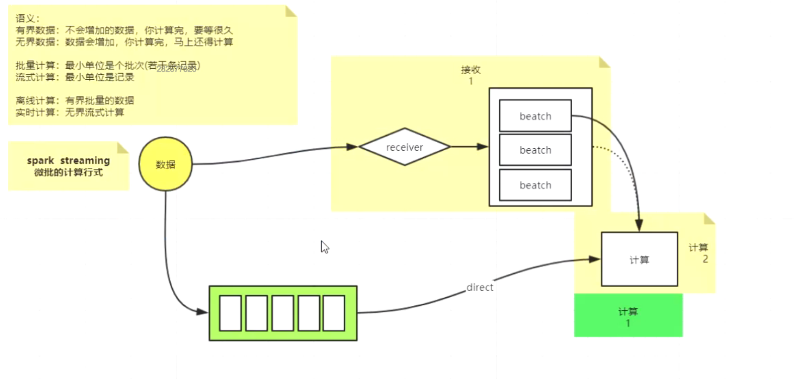
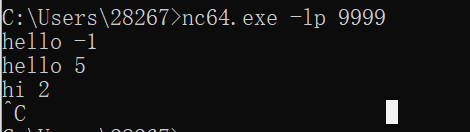
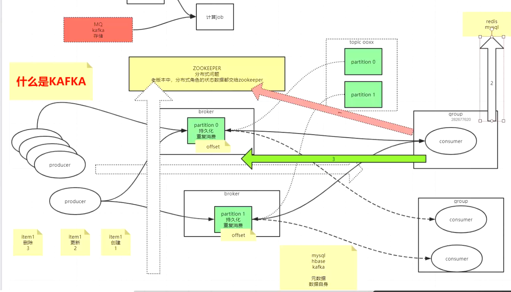

# Spark streaming

## 计算模式

分为流式计算和批量计算

流式计算的代表为storm，flink

批处理代表为spark

微批处理，伪流式计算spark streaming

流式计算和批处理的区别在于

1.批处理处理有界数据，流式计算处理无界数据

2.批处理处理的数据，到达边界时，需要等待数据都完成才能一起走下一步，流式处理的时候没有这个限制

3.批处理最小单位是批（若干条记录），流式计算最小单位是记录

ps：虽然批处理适用于离线计算，流处理适用于实时计算，但是加上时间维度后，实时计算是根据单位来算的，如果是天级别的实时计算，那么一天计算一次也算实时计算

ps：流与批最大的不同是，批处理的时候，很容易通过combiner来减少下游使用到的数据量，减少机器间拉取的数据体量，从而加速计算，而流式计算倾向于处理无界数据，数据来一条处理一条，基本无法用到combiner

## 数据分类

数据分为有界数据和无界数据

有界数据：数据不会增加，在某个时间段内的一批数据，计算完后需要过一段时间才进行计算

无界数据：数据会增加，计算完马上计算

## 时间维度

时间维度上来看，数据处理分为离线计算和实时计算

离线计算：有界的批处理

实时计算：无界的流式计算

## spark streaming的计算模式



1.不带存储的数据源：需要通过receiver来接收数据并保存，从而保证失败后可以再次消费

2.带存储的数据源（常见kafka）：使用直接处理的方式，不需要二次存储

## 实操

### ds实操（low level，现在推荐用struct）

#### 接收一批数据一个batch提交一个job

maven

```xml
<dependency>
    <groupId>org.apache.spark</groupId>
    <artifactId>spark-streaming_2.13</artifactId>
    <version>3.2.1</version>
</dependency>
```

使用socket接收数据

```scala
object StreamLearning {
  def main(args: Array[String]): Unit = {
    val sparkConf: SparkConf = new SparkConf().setMaster("local[2]").setAppName("test")
    val sc = new SparkContext(sparkConf)
    sc.setLogLevel("ERROR")
    //需要传入sc和批处理的间隔（多少时间内数据为一批）
    val stc = new StreamingContext(sc, Seconds(5))
    //接收socket的数据
    val ds: ReceiverInputDStream[String] = stc.socketTextStream("localhost", 9999, StorageLevel.DISK_ONLY)
    val dss: DStream[(String, Int)] = ds.flatMap(_.split(" ")).map((_, 1)).reduceByKey(_ + _)
    //输出算子
    dss.print()

    //正是开始开启线程等待输入处理数据
    stc.start()
    //等待处理完成后结束
    stc.awaitTermination()
  }
}
```

使用nc侦察模式建立sever，发送数据



或者使用socket发送数据

```java
def main(args: Array[String]): Unit = {
  val serverSocket = new ServerSocket(9999)
  val socket: Socket = serverSocket.accept()
  val stream: OutputStream = socket.getOutputStream
  var num = 0
  while (true){
    stream.write(s"hello ${num += 1}\n".getBytes())
    Thread.sleep(1000)
  }
}
```

自定义receive接收数据（模拟socket）

```scala
class MyStreaming(host:String,port:Int) extends Receiver[String](StorageLevel.DISK_ONLY){
  override def onStart(): Unit = {
    new Thread(){
      private val socket = new Socket(host, port)
      private val stream: InputStream = socket.getInputStream
      val bf:BufferedReader = new BufferedReader(new InputStreamReader(stream))
      var s:String = null
      while (!isStopped){
        s = bf.readLine()
        if(s != null) store(s)
      }
    }.start()
  }

  override def onStop(): Unit = println("stopped")
}
```

```scala
object StreamLearning {
  def main(args: Array[String]): Unit = {
    val sparkConf: SparkConf = new SparkConf().setMaster("local[2]").setAppName("test")
    val sc = new SparkContext(sparkConf)
    sc.setLogLevel("ERROR")
    //需要传入sc和批处理的间隔（多少时间内数据为一批）
    val stc = new StreamingContext(sc, Seconds(5))
    //接收socket的数据
//    val ds: ReceiverInputDStream[String] = stc.socketTextStream("localhost", 9999, StorageLevel.DISK_ONLY)
    val streaming = new MyStreaming("localhost", 9999)
    val ds: ReceiverInputDStream[String] = stc.receiverStream(streaming)

    val dss: DStream[(String, Int)] = ds.flatMap(_.split(" ")).map((_, 1)).reduceByKey(_ + _)
    //输出算子
    dss.print()

    //正式开始开启线程等待输入处理数据
    stc.start()
    //等待处理完成后结束
    stc.awaitTermination()
  }
```

**注意**

如果对于一批数据，处理时间过久，会造成后续数据的阻塞，主要是为了后续的状态服务所做的设计

#### 接收N批数据N个batch提交一个job(窗口API)

需求，来一个数据源，计算1s的批次处理结果和5s的批次处理结果

接收

```scala
object StreamNBatch {
  def main(args: Array[String]): Unit = {
    val sparkConf = new SparkConf().setAppName("test").setMaster("local[3]")
    val context = new SparkContext(sparkConf)
    context.setLogLevel("ERROR")
    //秒为最小批次单位
    val sc = new StreamingContext(context,Duration(1000))
    val ds: ReceiverInputDStream[String] = sc.socketTextStream("localhost", 9999)

    //窗口大小5s，滑动速度5s
    val nds: DStream[String] = ds.window(Duration(5000),Duration(5000))
    //val ddd5  = ds.map(_.split(" ")).map(x => (x(0), x(1).toInt)).reduceByKeyAndWindow(_+_,Duration(5000))
    val ddd5  = nds.map(_.split(" ")).map(x => (x(0), x(1).toInt)).reduceByKey(_+_)
    ddd5.print()

    val ddd: DStream[(String, Int)] = ds.map(_.split(" ")).map(x => (x(0), x(1).toInt)).reduceByKey(_+_)
    ddd.print()

    sc.start()
    sc.awaitTermination()
  }
}
```

数据源

```scala
object SendSocket {
  def main(args: Array[String]): Unit = {
    val serverSocket = new ServerSocket(9999)
    val socket: Socket = serverSocket.accept()
    val stream: OutputStream = socket.getOutputStream
    var ps:PrintStream = new PrintStream(stream);
    var num = 0
    while (true){
      ps.println(s"hello ${num}")
      ps.println(s"hi ${num}")
      ps.println(s"hi ${num}")
      num +=1
      Thread.sleep(1000)
    }
  }
}
```

**window通用概念**

窗口大小（W）：取出多少数据进行计算

步进（S）：多少时间进行一次计算

如果 W = 5, S = 1: 表示每隔1s取出前5s的数据进行计算（重合数据）

如果 W = 5, S = 5: 表示每隔5s取出前5s的数据进行计算

如果 W = 5, S = 10: 表示每隔10s取出前5s的数据进行计算（丢失数据）

#### 调用RDD进行数据处理

```scala
object StreamNBatch {
  def main(args: Array[String]): Unit = {
   val sparkConf: SparkConf = new SparkConf().setAppName("test").setMaster("local[3]")
    val context = new SparkContext(sparkConf)
    context.setLogLevel("ERROR")
    //秒为最小批次单位
    val sc = new StreamingContext(context,Duration(1000))
    val ds: ReceiverInputDStream[String] = sc.socketTextStream("localhost", 9999)
    //application级别的计算
    println("123")
    //transform是转换算子
    val dsTrans: DStream[String] = ds.transform(x => {
      println("123")
      x
    })
    //foreachRDD是末端算子，语义是需要把RDD执行起来，所以实现的时候务必调用RDD的action算子
    dsTrans.foreachRDD(x=>{
      //job级别的计算，这里可以用闭包来观察job数量，在driver端的另一个线程中执行
      x.foreach({
            //task级别的计算
        _=>println("入库")
      })
    })

    sc.start()
    sc.awaitTermination()
  }
}
```

#### 有状态计算

有些场景情况下，需要统计从开始到现在的状态，比如需要每五分钟统计一个从公司建立初到当前这个时间点内所产生的交易数量，这时候需要把之前所有的计算状态保存起来，保存到一个地方（spark利用checkpoint保存），然后计算的时候带着计算，可以加速计算

```scala
object StreamStates {
  def main(args: Array[String]): Unit = {
    val conf: SparkConf = new SparkConf().setAppName("test").setMaster("local[3]")
    val sc = new SparkContext(conf)
    sc.setLogLevel("ERROR")
    sc.setCheckpointDir("file:///E:/Spark/cp/")
    val ssc = new StreamingContext(sc, Duration(1000))
    val ris: ReceiverInputDStream[String] = ssc.socketTextStream("localhost", 9999)

    val t2: DStream[(String, Int)] = ris.map(_.split(" ")).map((x: Array[String]) => (x(0), x(1).toInt))
    //这个方法会先计算当前数据然后和老数据通过key进行join，来更新老数据，前面是新数据，后面为老数据
    val ds: DStream[(String, Int)] = t2.updateStateByKey((nv: Seq[Int], ov: Option[Int]) => {
      val sum: Int = nv.sum(Numeric[Int])
      Some(sum + ov.getOrElse(0))
    })
    ds.print()

    ssc.start()
    ssc.awaitTermination()
  }
}
```

每2秒统计一次五秒钟内的数据，直接借用增量计算，需要借助状态完成

```scala
object StreamStates {
  def main(args: Array[String]): Unit = {
    val conf: SparkConf = new SparkConf().setAppName("test").setMaster("local[3]")
    val sc = new SparkContext(conf)
    sc.setLogLevel("ERROR")
    sc.setCheckpointDir("file:///E:/Spark/cp/")
    val ssc = new StreamingContext(sc, Duration(1000))
    val ris: ReceiverInputDStream[String] = ssc.socketTextStream("localhost", 9999)

    val t2: DStream[(String, Int)] = ris.map(_.split(" ")).map((x: Array[String]) => (x(0), 1))
    //带状态的窗口(需要checkpoint，计算的时候只计算两端的变化)
    t2.reduceByKeyAndWindow((ov,nv) =>{
      //这个函数只会在第二次放入数据时才会生效，相当于mergeValue
        ov + nv
    },(ov,nv) =>{
      //这个函数每个job都会使用一次，nv的值由被去除部分的批次通过第一个函数计算得来，数据先通过减法函数减去不需要的部分，再通过第一个函数求新批次和，然后与老状态join产生新状态
      println(s"ov $ov")
      println(s"nv $nv")
      ov - nv
    },Seconds(5),Seconds(2)).print()

    ssc.start()
    ssc.awaitTermination()
  }
}
```

使用mapWithState来做全量有状态计算替代updateStateByKey，减少内存溢出的概率

```scala
object StreamStates {
  def main(args: Array[String]): Unit = {
    val conf: SparkConf = new SparkConf().setAppName("test").setMaster("local[3]")
    val sc = new SparkContext(conf)
    sc.setLogLevel("ERROR")
    sc.setCheckpointDir("file:///E:/Spark/cp/")
    val ssc = new StreamingContext(sc, Duration(1000))
    val ris: ReceiverInputDStream[String] = ssc.socketTextStream("localhost", 9999)

    val t2: DStream[(String, Int)] = ris.map(_.split(" ")).map((x: Array[String]) => (x(0), x(1).toInt))
    //这部需要做，不然会有重复key
    t2.reduceByKey(_+_).mapWithState(StateSpec.function(
      (k:String,nv:Option[Int],ov:State[Int])=>{
        val res = nv.getOrElse(0) + ov.getOption().getOrElse(0)
        ov.update(res)
        (k,res)
      }
    )).print()
    ssc.start()
    ssc.awaitTermination()
  }
}
```

### 集成kafka



通俗来讲就是MQ，有一些角色

broker：是用于数据存储，转发的集群，可以有多台，用于持久化数据

consumer：消费者，可以一对多也可以一对一，但是不能多对一（防止重复消费），所以并行度最高为broker个数

producer：生产者，与broker一对多，可以生产到不同的broker上

topic（虚概念）：表示一类数据

partition（实际的物理存储）：一个topic对应多个partition，分布在多个broker中，达到负载均衡的效果

group：消费组，同一个消费组数据只能被消费一次，代表一类消费逻辑

#### 分布式事务

kafka只保证分区内有序（通过offset），所以保证有序，需要打到同一个partition

#### zk的责任

老版本1.6之前，kafka使用zk完成分布式协调以及元数据的存储，但是后来发现，由于consumer的数量太多，consumer的offset等信息存储入zk造成压力过大，造成瓶颈，所以后续大家在使用的时候就把数据存入了redis或者mysql，但是redis固然快，但数据容易丢失，丢失造成消费进度丢失，代价惨重，但是如果开了持久化和强一致性，又导致速度变慢，所以在后续版本，kafka发现了这个问题，由于这个本来就是元数据存储产生的问题，而kafka又本身就是用来存数据的，所以后续版本做了一个topic来维护consumer的状态

#### 实操

安装kafka，配置环境变量，设置config中的broker id，zk连接，测试

```shell
# 启动
kafka-server-start.sh -daemon $KAFKA_HOME/config/server.properties
# 创建topic
kafka-topics.sh --create --topic kafka_learning --replication-factor 2 --partitions 3 --zookeeper node01:2181,node03:2181,node04:2181/kafka
# 查询topic
kafka-topics.sh --describe --topic kafka_learning --zookeeper node01:2181/kafka
# 开启producer
kafka-console-producer.sh --topic kafka_learning --broker-list node01:9092
# 开启consumer
kafka-console-consumer.sh --new-consumer --bootstrap-server node01:9092 --topic kafka_learning
# 查看kafka中新consumer的消费形式，默认会把偏移数据存放在kafka，而不是ZK中
kafka-topics.sh --list --zookeeper node01:2181/kafka
# 查看用于记录偏移的队列的情况，可以看到是50个分区，3副本的
kafka-topics.sh --zookeeper node01:2181/kafka --describe --topic __consumer_offsets
# 查看消费组
kafka-consumer-groups.sh --new-consumer --bootstrap-server node01:9092 --list
# 查看消费组情况
kafka-consumer-groups.sh --new-consumer --bootstrap-server node01:9092 --describe --group console-consumer-6046
# 偷懒tips，起别名
alias kg='kafka-consumer-groups.sh --new-consumer --bootstrap-server node01:9092'
kg --list
```

**kafka api部分**

> kafka的consumer，关于offset
>
> 1.自动维护offset：ENABLE_AUTO_COMMIT_CONFIG true,kafka会自动维护offset，但是维护的时候会先拉数据然后直接写offset，不管是否消费失败，会有数据丢失问题
>
> 2.手动维护offset：ENABLE_AUTO_COMMIT_CONFIG false
>
>   2.1 通过kafka 消费者的consumeSync进行同步，维护到kafka自己的__consumer_offset\_ 中
>
>   2.2 通过把offset写到redis或者mysql等方式，进行维护，当使用的时候，需要通过consumer创建的时候的listener进行协调，找到对应的partition需要消费的位置，然后开始消费
>
> 以上所有的offset的作用域都仅限于consumer启动时，运行后会在内存中维护offset（但是没有持久化）
>
> 3.AUTO_OFFSET_RESET_CONFIG，参考__consumer_offset\_的情况
>
>  earliest: CURRENT-OFFSET 特殊状态，group创建初期，为0
>
>  latest: LOG-END-OFFSET
>
> 4.seek覆盖性最强，在listener里面重写分区的偏移，就会从重写的地方开始读

> kafka的producer，关于key设计
>
> 由于kafka只保证分区有序，所以kafka会把相同的key发往同一分区，所以key尽量能保证事务

生产者

```scala
object KafkaProducerTest {
  def main(args: Array[String]): Unit = {
    val prop = new Properties()
    //启动时要连接的sever
    prop.put(ProducerConfig.BOOTSTRAP_SERVERS_CONFIG,"node01:9092")
    //key是String类型的
    prop.put(ProducerConfig.KEY_SERIALIZER_CLASS_CONFIG,"org.apache.kafka.common.serialization.StringSerializer")
    //value是String类型的
    prop.put(ProducerConfig.VALUE_SERIALIZER_CLASS_CONFIG,"org.apache.kafka.common.serialization.StringSerializer")
    //默认16384为一批，当达到这个数值或者对应linger_ms到达延迟时（默认5ms），会发送
    prop.put(ProducerConfig.BATCH_SIZE_CONFIG,500)
    prop.put(ProducerConfig.LINGER_MS_CONFIG,5)

    val kafkaProducer = new KafkaProducer[String,String](prop)

    //开始发送数据
    var key = 1
    var value = 1
    while (true){
      while(key % 100 != 0){
        val producerRecord = new ProducerRecord[String, String]("test1", s"item $key", s"value $value")
        val future: Future[RecordMetadata] = kafkaProducer.send(producerRecord)
        val metadata: RecordMetadata = future.get()
        println(s"send key: item $key value: value $value offset: ${metadata.offset()}")
        key += 1
        value += 1
      }
      Thread.sleep(1000)
      key += 1
      value += 1
    }
  }
}
```

消费者（自动提交）

```scala
def main(args: Array[String]): Unit = {
  val prop = new Properties()
  //自动提交
  prop.put(ConsumerConfig.ENABLE_AUTO_COMMIT_CONFIG,true)
  //启动时要连接的sever
  prop.put(ConsumerConfig.BOOTSTRAP_SERVERS_CONFIG,"node01:9092")
  //设置启动时消费位置
  prop.put(ConsumerConfig.AUTO_OFFSET_RESET_CONFIG,"earliest")
  //最大一次拉取条数，默认500
  prop.put(ConsumerConfig.MAX_POLL_RECORDS_CONFIG,"500")
  //消费组
  prop.put(ConsumerConfig.GROUP_ID_CONFIG,"consumer_test")
  //key是String类型的
  prop.put(ConsumerConfig.KEY_DESERIALIZER_CLASS_CONFIG,"org.apache.kafka.common.serialization.StringDeserializer")
  //value是String类型的
  prop.put(ConsumerConfig.VALUE_DESERIALIZER_CLASS_CONFIG,"org.apache.kafka.common.serialization.StringDeserializer")

  val consumer:KafkaConsumer[String,String] = new KafkaConsumer(prop)
  //订阅test1这个topic
  consumer.subscribe(Pattern.compile("learning"))

  while (true){
    val records: ConsumerRecords[String, String] = consumer.poll(Duration.ZERO)
    val iter: util.Iterator[ConsumerRecord[String, String]] = records.iterator()
    while (iter.hasNext){
      val record: ConsumerRecord[String, String] = iter.next
      val key: String = record.key()
      val value: String = record.value()
      val partition: Int = record.partition()
      val offset: Long = record.offset()
      println(s"key $key; value $value; partition $partition; offset $offset;")
    }
  }
}
```

消费者（指定消费分区 + 手动提交）

```scala
object KafkaConsumerTest {
  def main(args: Array[String]): Unit = {
    val prop = new Properties()
    //自动提交
    prop.put(ConsumerConfig.ENABLE_AUTO_COMMIT_CONFIG, false)
    //启动时要连接的sever
    prop.put(ConsumerConfig.BOOTSTRAP_SERVERS_CONFIG, "node01:9092")
    //设置启动时消费位置
    prop.put(ConsumerConfig.AUTO_OFFSET_RESET_CONFIG, "earliest")
    //最大一次拉取条数，默认500
    prop.put(ConsumerConfig.MAX_POLL_RECORDS_CONFIG, "500")
    //消费组
    prop.put(ConsumerConfig.GROUP_ID_CONFIG, "consumer_test3")
    //key是String类型的
    prop.put(ConsumerConfig.KEY_DESERIALIZER_CLASS_CONFIG, "org.apache.kafka.common.serialization.StringDeserializer")
    //value是String类型的
    prop.put(ConsumerConfig.VALUE_DESERIALIZER_CLASS_CONFIG, "org.apache.kafka.common.serialization.StringDeserializer")

    val consumer: KafkaConsumer[String, String] = new KafkaConsumer(prop)
    //指定分区消费assign
    val partitions: util.ArrayList[TopicPartition] = new util.ArrayList[TopicPartition]() {
      add(new TopicPartition("learning", 2))
    }
    consumer.assign(partitions)
    consumer.seek(new TopicPartition("learning", 2), 100)

    while (true) {
      val records: ConsumerRecords[String, String] = consumer.poll(Duration.ZERO)
      val iter: util.Iterator[ConsumerRecord[String, String]] = records.iterator()
      var lastRecord: ConsumerRecord[String, String] = null
      while (iter.hasNext) {
        val record: ConsumerRecord[String, String] = iter.next
        val key: String = record.key()
        val value: String = record.value()
        val partition: Int = record.partition()
        val offset: Long = record.offset()
        lastRecord = record
        println(s"key $key; value $value; partition $partition; offset $offset;")
      }
      //同步状态 1
      //consumer.commitSync()
      //同步状态 2
      if (lastRecord != null) {
        val partitionToMetadata = new util.HashMap[TopicPartition, OffsetAndMetadata]()
        //记住offset要 + 1，CURRENT-OFFSET表示开始位置（下次启动的时候不会自动 + 1,所以这边要加），LOG-END-OFFSET表示结束位置
        partitionToMetadata.put(new TopicPartition(lastRecord.topic(), lastRecord.partition()), new OffsetAndMetadata(lastRecord.offset() + 1))
        consumer.commitSync(partitionToMetadata)
      }
    }
  }
}
```

消费者（DStream）

```scala
package com.sjh.service

import java.util
import java.util.Map

import org.apache.kafka.clients.consumer.{ConsumerConfig, ConsumerRecord, OffsetAndMetadata, OffsetCommitCallback}
import org.apache.kafka.common.TopicPartition
import org.apache.spark.rdd.RDD
import org.apache.spark.streaming.dstream.InputDStream
import org.apache.spark.streaming.kafka010.{CanCommitOffsets, ConsumerStrategies, HasOffsetRanges, KafkaUtils, LocationStrategies, LocationStrategy, OffsetRange}
import org.apache.spark.streaming.{Duration, StreamingContext}
import org.apache.spark.{SparkConf, SparkContext}

/**
 * 使用kafka存储数据，非receiver的方式去处理数据
 */
object DsStreamTest {
  def main(args: Array[String]): Unit = {
    val sparkConf: SparkConf = new SparkConf().setMaster("local").setAppName("test")
    //ssc的配置
    //以下配置可以达到单次限流作用
    sparkConf.set("spark.streaming.kafka.maxRatePerPartition","3")
//    sparkConf.set("spark.streaming.receiver.maxRate","2")
    //第一批数据最大接收多少，要少于spark.streaming.kafka.maxRatePerPartition*分区数才有用
    sparkConf.set("spark.streaming.backpressure.enabled","true")
    sparkConf.set("spark.streaming.backpressure.initialRate","9")

    val sparkContext = new SparkContext(sparkConf)
    sparkContext.setLogLevel("ERROR")
    val ssc = new StreamingContext(sparkContext, Duration(1000))

    //配置kafka参数
    val kafkaParams: util.HashMap[String, Object] = new util.HashMap[String, Object]()
    kafkaParams.put(ConsumerConfig.BOOTSTRAP_SERVERS_CONFIG, "node01:9092")
    kafkaParams.put(ConsumerConfig.AUTO_OFFSET_RESET_CONFIG, "earliest")
    kafkaParams.put(ConsumerConfig.ENABLE_AUTO_COMMIT_CONFIG, "false")
    kafkaParams.put(ConsumerConfig.GROUP_ID_CONFIG, "ds_learning")
    kafkaParams.put(ConsumerConfig.KEY_DESERIALIZER_CLASS_CONFIG, "org.apache.kafka.common.serialization.StringDeserializer")
    kafkaParams.put(ConsumerConfig.VALUE_DESERIALIZER_CLASS_CONFIG, "org.apache.kafka.common.serialization.StringDeserializer")
    //这个配置会失效，需要使用stream的配置
    kafkaParams.put(ConsumerConfig.MAX_POLL_RECORDS_CONFIG, "1")
    //创建topic监控
    val topics = new util.ArrayList[String]()
    topics.add("learning")
    //从mysql查询offset
    val offsetMap: util.Map[TopicPartition, java.lang.Long] = new util.HashMap()
    offsetMap.put(new TopicPartition("learning",0),0L)

    //开启kafka流
    val kafkaDs: InputDStream[ConsumerRecord[String, String]] = KafkaUtils.createDirectStream(ssc,
      //一般选这个，自动分发分区给所有executors，让消费尽量分散
      LocationStrategies.PreferConsistent,
      ConsumerStrategies.Subscribe(
        topics,
        kafkaParams,
        offsetMap
      )
    )
    //直接打印由于序列化问题，打印不出来，需要封装一下，再打印(固定写法)
    kafkaDs.map((x: ConsumerRecord[String, String]) => (x.key(), x.value(), x.partition(), x.offset())).print()
    //手动维护offset
    //1.在executor端维护offset并不是一个好的做法，因为每个executor都要知道互相的状态才能够进行offset的维护，会产生分布式事务的问题
    //1.1如果repartition成1去处理，那么无法很好的利用executor的内存
    //2.在driver端维护offset
    //2.1 在executor端，使用写文件的方式，进行解耦
    //2.2 通过数据库的事务
    //    如果executor端去写数据，那么可能产生数据重复消费的问题，某些task成功了，任务提交，但是某些失败了，全部批次失败
    //    如果repartition成1，那么也有可能executor task执行完挂了，产生重复消费
    //    所以最好的方式是将数据收集到driver端，然后进行事务提交，提交完之后就进行offset的维护(维护到mysql或者redis或者kafka自身)，最靠谱（内存需要比较多）
    kafkaDs.foreachRDD(
      (rdd: RDD[ConsumerRecord[String, String]]) =>{
        println("============== ")
        rdd.foreach(println)
        //连接mysql
        //入库
        //维护offset到mysql
        val ranges: Array[OffsetRange] = rdd.asInstanceOf[HasOffsetRanges].offsetRanges
        ranges.foreach(println)
        kafkaDs.asInstanceOf[CanCommitOffsets].commitAsync(ranges, (offsets: util.Map[TopicPartition, OffsetAndMetadata], exception: Exception) => {
          if(offsets != null){
            val entry: util.Iterator[Map.Entry[TopicPartition, OffsetAndMetadata]] = offsets.entrySet().iterator()
            if(entry.hasNext){
              val next: util.Map.Entry[TopicPartition, OffsetAndMetadata] = entry.next
              println(s"partition ${next.getKey.partition()}; offset ${next.getValue.offset()}; ")
            }
          }
        })
      }
    )

    ssc.start()
    ssc.awaitTermination()
  }
}
```

```scala
//手动维护offset
//1.在executor端维护offset并不是一个好的做法，因为每个executor都要知道互相的状态才能够进行offset的维护，会产生分布式事务的问题
//1.1如果repartition成1去处理，那么无法很好的利用executor的内存
//2.在driver端维护offset
//2.1 在executor端，使用写文件的方式，进行解耦
//2.2 通过数据库的事务
//    如果executor端去写数据，那么可能产生数据重复消费的问题，某些task成功了，任务提交，但是某些失败了，全部批次失败
//    如果repartition成1，那么也有可能executor task执行完挂了，产生重复消费
//    所以最好的方式是将数据收集到driver端，然后进行事务提交，提交完之后就进行offset的维护(维护到mysql或者redis或者kafka自身)，最靠谱（内存需要比较多）
```
