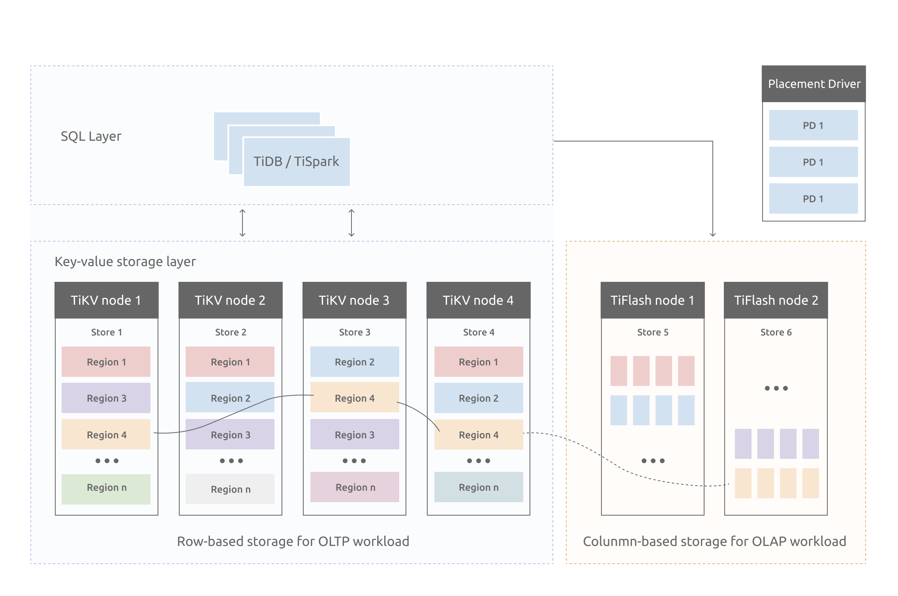
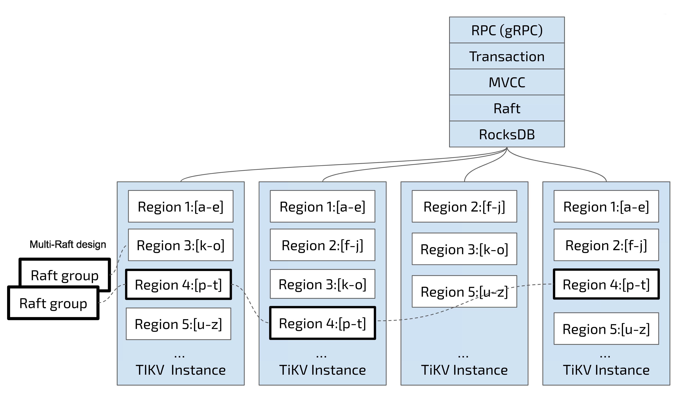

# TiDb

[官网](https://pingcap.com/zh/product/)

## 应用场景

- 对数据一致性及高可靠、系统高可用、可扩展性、容灾要求较高的金融行业属性的场景
- 对存储容量、可扩展性、并发要求较高的海量数据及高并发的 OLTP 场景
- Real-time HTAP 场景
- 数据汇聚、二次加工处理的场景

## NewSQL

### 特点

- 无限水平扩展
- 分布式强一致性
- 完整的分布式事务处理能力与ACID特性

### 选型

常见的NewSQL：Google的Spanner和F1，缺点，只能在谷歌平台上跑

## 定义

开源分布式数据库

**好处**

1.一键水平扩容或者缩容

2.金融级高可用

3.实时 HTAP

4.云原生的分布式数据库

5.兼容 MySQL 5.7 协议和 MySQL 生态

## 数据发展的阶段

**基于管理来看**

- 人工管理阶段（数据少）
- 文件系统阶段（普通数据）
- 数据库系统阶段（大数据量）

**基于模型来看**

- 层次与网状数据管理系统（指针维护数据间的关系）
- 关系数据库管理系统（二维表维护数据间关系）
- 新一代数据库（面向对象/特定领域）

## 数据库类型

### 关系型数据

**缺点**

海量数据无法处理

MSSQL，MySQL，Oracle，DB2，PostgreSQL

### NoSQL（not only SQL）

**缺点**

不支持ACID事务，不支持复杂SQL，不保证强一致性

#### 键值对数据库

MemcacheDB，Redis

#### 文档型数据库

MongoDB

#### 列式数据库

存储结构化半结构化数据

HBase，Cassandra

#### 图数据库

存储图关系

Neo4J

### NewSQL

集合NoSQL和关系型数据库的特性

## TiDB架构

计算与存储分离的架构(高度分层架构)（由于现阶段硬件与网络的发展推动了这一架构）

 

### 核心组件

#### TiDB Server（集群三核之一）

.png)

**计算层（无状态）**

兼容MySQL的计算引擎（>5.7），不落地数据

DDL语句，MVCC版本控制的老数据删除

1.接受客户端sql

2.解析编译

3.生成执行计划

4.执行

#### PD Server（集群三核之一）

.png)

**Placement Driver（大脑）**

1.负责元信息管理

2.分布式事务ID的分配

3.调度中心，分配（控制TiKV中region分布）等

> 1.每个TiKV节点定时发送自己的元信息给PD（分片数量，Leader数量，读写吞吐量）
>
> 2.PD接收数据进行计算，发出平衡调度（例如将region从较多的节点移动到少的节点）

为了保证HA，PD为三节点并且遵从raft协议

#### TiKV Server（集群三核之一）

.png)

**存储层**

**TiKV**

行式存储

分布式且支持事务的KV存储引擎，数据持久化（database和table的元信息持久化），算子下推，自身副本高可用和强一致性（multi-raft）

> 负责存储数据，从外部看 TiKV 是一个分布式的提供事务的 Key-Value 存储引擎。
>
> 存储数据的基本单位是 Region，每个 Region 负责存储一个 Key Range（从 StartKey 到 EndKey 的左闭右开区间）的数据，每个 TiKV 节点会负责多个 Region。
>
> TiKV 的 API 在 KV 键值对层面提供对分布式事务的原生支持，默认提供了 SI (Snapshot Isolation) 的隔离级别，这也是 TiDB 在 SQL 层面支持分布式事务的核心。
>
> TiDB 的 SQL 层做完 SQL 解析后，会将 SQL 的执行计划转换为对 TiKV API 的实际调用。所以，数据都存储在 TiKV 中。另外，TiKV 中的数据都会自动维护多副本（默认为三副本），天然支持高可用和自动故障转移。

**映射算法**

> 普通映射
>
> ```text
> Key:   tablePrefix{TableID}_recordPrefixSep{RowID}
> Value: [col1, col2, col3, col4]
> ```
> 主键索引映射
>
> ```text
> Key:   tablePrefix{tableID}_indexPrefixSep{indexID}_indexedColumnsValue
> Value: RowID
> ```
> 
> 二级索引映射
>
> ```text
> Key:   tablePrefix{TableID}_indexPrefixSep{IndexID}_{indexedColumnsValue}_{RowID}
> Value: null
> ```
>tablePrefix     = []byte{'t'}
recordPrefixSep = []byte{'r'}
indexPrefixSep  = []byte{'i'} 

**database、table元数据映射**

每个 `Database`/`Table` 都被分配了一个唯一的 ID，这个 ID 作为唯一标识，并且在编码为 Key-Value 时，这个 ID 都会编码到 Key 中，再加上 `m_` 前缀。这样可以构造出一个 Key，Value 中存储的是序列化后的元信息

##### TiFlash

列式存储（通过raft共识算法与TiKV同步）（OLAP）

.png)

##### 设计思想



1.kv键值对

> 以二进制方式有序存储键值对

2.RocksDB（本地存储）

> 基于facebook开源的优秀的单机KV存储引擎，借助rocksdb进行本地磁盘的写入

3.Raft协议

> 1.保证日志复制
>
> 2.leader选举
>
> 3.成员变更

4.Region

> 按照key连续分割range，默认单个大小为96M[StartKey,EndKey）
>
> 每一个副本叫做replica，其中一个作为Leader，另外作为Follower，Follower作为备数据，只进行写入，不进行读取



5.MVCC  

```text
Key1_Version3 -> Value
Key1_Version2 -> Value
Key1_Version1 -> Value
……
Key2_Version4 -> Value
Key2_Version3 -> Value
Key2_Version2 -> Value
Key2_Version1 -> Value
……
KeyN_Version2 -> Value
KeyN_Version1 -> Value
……
```

6.ACID

7.计算向数据移动


#### TiSpark（辅助解决复杂OLAP）

#### TiDB Operator（简化云上管理）

## 与MySQL差别

|                                                              | TiDB                                                         | MySQL        |
| ------------------------------------------------------------ | ------------------------------------------------------------ | ------------ |
| 默认排序规则                                                 | 二进制排序（区分大小写）                                     | 不区分大小写 |
| MySQL 复制协议                                               | 不支持 （[TiDB Data Migration (DM)](https://docs.pingcap.com/zh/tidb-data-migration/stable/overview)）（[TiCDC](https://docs.pingcap.com/zh/tidb/stable/ticdc-overview)） | 支持         |
| 存储过程与函数                                               | 不支持                                                       | 支持         |
| 触发器                                                       | 不支持                                                       | 支持         |
| 事件                                                         | 不支持                                                       | 支持         |
| 自定义函数                                                   | 不支持                                                       | 支持         |
| 外键约束                                                     | 不支持                                                       | 支持         |
| 全文/空间函数与索引                                          | 不支持                                                       | 支持         |
| 非`ascii`/`latin1`/`binary`/`utf8`/`utf8mb4` 的字符集        | 不支持                                                       | 支持         |
| SYS schema                                                   | 不支持                                                       | 支持         |
| MySQL 追踪优化器                                             | 不支持                                                       | 支持         |
| XML 函数                                                     | 不支持                                                       | 支持         |
| X-Protocol                                                   | 不支持                                                       | 支持         |
| Savepoints                                                   | 不支持                                                       | 支持         |
| 列级权限                                                     | 不支持                                                       | 支持         |
| `XA` 语法                                                    | 不支持                                                       | 支持         |
| `CREATE TABLE tblName AS SELECT stmt` 语法                   | 不支持                                                       | 支持         |
| `CHECK TABLE` 语法                                           | 不支持                                                       | 支持         |
| `CHECKSUM TABLE` 语法                                        | 不支持                                                       | 支持         |
| `GET_LOCK` 和 `RELEASE_LOCK` 函数                            | 不支持                                                       | 支持         |
| [`LOAD DATA`](https://docs.pingcap.com/zh/tidb/stable/sql-statement-load-data) 和 `REPLACE` 关键字 | 不支持                                                       | 支持         |

# 思考

## 为什么要使用NewSQL？

1.对比RDBMS，NewSQL可以处理海量数据

2.对比NoSQL，NewSQL可以进行OLTP和OLAP

## OLTP？

联机事务处理：支持短时间内大量并发的事务操作，强调强一致性

## OLAP？

联机分析处理：复杂的只读查询，读取海量数据进行分析计算

代表作：Greenplum，TeraData，AnalyticDB

## HTAP？

混合事务 / 分析处理，Hybrid Transactional/Analytical Processing

HTAP 数据库能够在一份数据上同时支撑业务系统运行和 OLAP 场景

代表作：TiDB，HybridDB for MySQL，BaikalDB

## RTO和RPO

rto：恢复时间目标（服务容灾相关）

rpo：恢复点目标（数据容灾相关）

## 数据架构选型的一些参考？

重要性逐级递减

1.稳定性（数据不可丢失 RPO=0，HA即RTO尽量小）

2.效率

3.成本

4.安全

5.开源（社区支持）

.png)

## TiKV心跳包都发了啥？

TiKV 节点信息和 Region 信息：

**TiKV 节点信息**

- 总磁盘容量
- 可用磁盘容量
- 承载的 Region 数量
- 数据写入/读取速度
- 发送/接受的 Snapshot 数量（副本之间可能会通过 Snapshot 同步数据）
- 是否过载
- labels 标签信息（标签是具备层级关系的一系列 Tag，能够[感知拓扑信息](https://docs.pingcap.com/zh/tidb/v4.0/schedule-replicas-by-topology-labels)）

**Region 信息**

- Leader 的位置
- Followers 的位置
- 掉线副本的个数
- 数据写入/读取的速度

## PD调度策略？

**一个 Region 的副本数量不正确**

比对当前心跳包中的region数量和实际不相符，需要通过 Add/Remove Replica 操作调整副本数量

