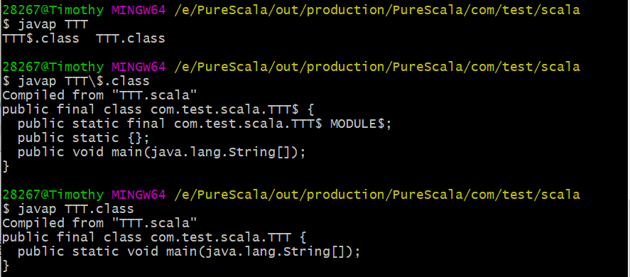

# Scala

[官网](https://www.scala-lang.org/)

面向对象的函数式编程语言

scala 是可以变成字节码的东西，最终可以跑在jvm上，也可以跑在js rc上，还有scala专用的运行环境scala-native

## 编译型语言和解释型语言的根本区别

在于编译型语言是强类型，也就是说编译型语言对于内存空间的规划是从编译阶段就产生了，比如int占四个字节，long占八个字节，而解释型语言只有在解释阶段才会划分长度，分配内存，这也是解释型语言慢的原因

## 各种语言对应的编程思想

面向过程的 C语言				第一类值 基本类型（一般没有指针，C算是bug）

面向对象的 JAVA语言，SCALA语言			第一类值  基本类型 + 对象类型

函数式的 JAVA语言，SCALA语言			第一类值  基本类型 + 对象类型 + 函数（变量可以是方法，在java 1.8之前，使用的是反射去做这种事情，1.8之后支持函数式编程）

## 特点

1.与java无缝连接

2.自己推断类型（在编译阶段如果推断类型错误会报错，不会在运行阶段报错）

3.支持并发和分布式开发

4.扩展java模式匹配，匹配类

5.高阶函数（函数作为参数和返回值传入）

6.扩展java多继承能力

## 基础环境

编译时：需要jdk（用来处理java语法）sdk（处理scala原生语法）

运行时：jre，jdk（非必须）

当前scala版本选择，scala *2.13.8*，为后续学spark 3做铺垫，spark3.21需要scala2.12以上版本

[scala插件](https://plugins.jetbrains.com/plugin/1347-scala/versions)下载对应版本

## 文档

[scala](https://docs.scala-lang.org/tour/tour-of-scala.html)

**注意**

1.val是不能被重设值的，是常量，var是变量

2.显示声明类型，和python一样

## 类型系统


## 使用

块级表达式

### Blocks

You can combine expressions by surrounding them with `{}`. We call this a block.

The result of the last expression in the block is the result of the overall block, too:

```scala
println({
  val x = 1 + 1
  x + 1
}) // 3
```

参数列表可以是多个

```scala
def addThenMultiply(x: Int, y: Int)(multiplier: Int): Int = (x + y) * multiplier
println(addThenMultiply(1, 2)(3)) // 9
```

### 个性化构造器

个性构造时必须先调用默认构造

```scala
package com.test.scala

object TestScalaObject{
  val x = new xx("132");

  def main(args: Array[String]): Unit = {
    println(x.name)
  }
}

class xx{
  var name = "lisi"
  def this(name:String){
    this
    this.name = name
  }
}
```

类名构造器

```scala
package com.test.scala

object TestScalaObject{
  val x = new xx("man","132");

  def main(args: Array[String]): Unit = {
    println(x.getSex)
  }
}
//类名构造器中传入的参数就是private，val常量类型的
//只有在类名构造器中的参数可以设置成var，其他方法函数中的参数都是val类型的，且不允许设置成var类型
class xx(sex:String){
  var name = "lisi"
  def this(sex:String,name:String){
    this(sex)
    this.name = name
  }

  def getSex: String ={
    sex;
  }
}
```

### 伴生

对于相同名称的object和class，产生伴生关系，class可以访问object中间的私有成员，包括属性和方法，相当于把两个东西合成了一个既带有静态方法又带有非静态方法的java类

```scala
package com.test.scala

object TestScalaObject{
  val x = new xx("man","132");

  def main(args: Array[String]): Unit = {
    println(x.getSex)
  }
}

class xx(sex:String){
  var name = "lisi"
  def this(sex:String,name:String){
    this(sex)
    this.name = name
  }

  def getSex: String ={
    xx.a
  }
}

object xx{
  private val a = "123"
}
```

## 类

### class

类似于java中普通类，类中方法均为非静态方法

### object

类似于java中的静态类，类中方法均为静态类，所以scala只能在这边跑run方法，单例对象，example：

```scala
object TTT {
  def main(args: Array[String]): Unit = {
    TestScalaObject.a();
    new TestScala().main();
  }
}
```



通过javap -v TestJava.class可以查看到编译后的信息，看到object转出来的class实际被编译成了java的静态方法，然后会产生一个带$的class类，里面都是需要实例化的对象方法，如果继承了app类，还会生成一个延时调用类，后缀为xxx\$delayInit\$body.class的

object和class把静态方法和非静态方法划清了界限，并且同名的object和class之间建立了伴生关系，对应的class实例可以直接使用object的私有属性和方法，伴生只能在同一个文件中

### trait

用于代替interface和abstract

```scala
package com.test.scala

trait Animal {
  def eat(str:String)
}

trait Social {
  def communicate(str:String): Unit ={
    println("communicate with others!")
  }
}

class Person extends Animal with Social {
  override def eat(str: String): Unit =
    println(s"person eat $str")
}

object Demo{
  def main(args: Array[String]): Unit = {
    val p = new Person()
    p.communicate("123")
    p.eat("123")
  }
}
```

### case class和case object

case class是class的扩展，当compiler看到case关键字时会生成一些方法，以方便函数式编程的使用，方便模式匹配（中间件使用）

1.会生成apply方法，让我们在使用的时候不需要new对象，可以省略new关键字

2.根据函数式编程的概念，已经定义好的对象的类构造器中的参数不应该再改变，所以对象中类构造器属性均为val

3.自动生成一个unapply方法

4.生成一个copy方法

5.生成equals和hashcode方法

6.生成toString方法

```scala
package com.test.scala

case class MyCase(){
  def xxx(a: Int):Int={
    println("123")
    123
  }
}

case object MyObj{
  def caseObj={
    println("asfasg")
  }
}

object main{
  def main(args: Array[String]): Unit = {
    val ca = new MyCase()
    val ca1 = new MyCase()
    ca.xxx(1)
    println(ca.equals(ca1))
    println(ca == ca1)
    MyObj.caseObj
    println(MyObj.toString)
  }
}
```

### 返回值

```scala
Unit //函数式编程的核心是把函数作为一种值，所以Unit类就类似于java的void，但是java的void是关键字，但是scala标榜函数式编程的思想，所以把返回值定义为Unit对象
```

## 流程控制

**if**

和java一样

**while**

和java一样（类似于python，没有a++这种写法，只有a += 1）

**for**

只支持增强for循环（迭代器模式）

```scala
//类似于python range
//获取集合1到10，左闭右闭
val a = 1 to 10
//获取集合1到10,步长为2
val a = 1 to (10,2)
//左闭右开
val a = 1 until 10
//可以通过if设置守卫来处理循环逻辑,业务逻辑与循环逻辑分开
for(i <- a if(i%2==0)){
   println(i)
}
//打印乘法表
for(i <- 1 until 10;j <- 1 until 10 if j <= i){
    print(s"$i * $j = ${i*j}\t")
    f (i == j)println()
}
//数据回收
val a = for (i <- 1 to 10)yield i*i
println(a)
//递归阶乘，注意递归的时候程序员要指定方法的返回类型
def factorial(n:Int): Int = {
   if (n == 1) 1
   n * factorial(n - 1)
}
println(factorial(5))
//默认值函数
def factorial(n:Int=4,a:Int = 2): Int = {
   if (n == 1)return 1
   print(a)
   n * factorial(n - 1)
}
println(factorial(a=3))
//签名和匿名函数，前面是签名（参数类型列表）=> 返回值类型，后面是对应的匿名函数
val f:(Int,Int)=>Int = (n:Int,a:Int)=> {a + n}
println(f(1,2))
```

## 函数

函数是scala中的一等公民，一切皆函数，加减乘除都是函数，而java中的加减乘除叫关键字

scala中语法没有基本类型，所以写一个3，其实scala帮你new了一个Int类

```scala
package com.test.scala

object TestScalaObject {

  def f(string: String)={println(string)}
  def func8[U](a: U, b: U, f: (U, U) => U): U = {
    f(a, b)
  }

  def main(args: Array[String]): Unit = {
    //基础函数
    def fun1(): Unit = {
      println("func1 xx")
    }

    fun1

    //递归函数
    def func2(num: Int): Int = {
      if (num == 1) return num
      num * func2(num - 1)
    }

    println(func2(3))

    //默认值函数
    def func3(num: Int = 3): Unit = {
      println(num)
    }

    func3()
    //匿名函数
    val func4: (Int, Int) => Int = (a: Int, b: Int) => {
      a * b
    }
    println(func4(1, 2))
      
	val add = (x: Int, y: Int) => x + y
	println(add(1, 2)) // 3
    //嵌套函数
    def func5(a: String): Unit = {
      def func(): Unit = {
        println(a)
      }

      func()
    }

    func5("String")

    //偏应用函数（partially applied function）
    def func6(a: Int, b: String, c: Double): Unit = {
      println(s"$a $b $c")
    }

    func6(1, "23", 2.3)
    val func6Apply = func6(_, "apply 6", _)
    func6Apply(4, 4.6)

    //可变参数函数
    def func7(a: String*): Unit = {
      a.foreach(println)
    }

    func7("qwe", "ert")

    //高阶函数(函数作为参数和返回值)
    def func8[U](a: U, b: U, f: (U, U) => U): U = {
      f(a, b)
    }
    def func8Ext:(Int,Int)=>Int = (a: Int, b: Int) => {
      a + b
    }
    println(func8(1, 2, func8Ext))
    /*
    如果要用一个常量或者变量接收一个函数，需要带 _,但是这种写法不适合泛型
     */
    val a2 = f _
    a2("123")
    //柯里化函数（Currying Function），多参数列表，应用于多个可变参数列表
    def func9(a:Int*)(b:String*)={
      a.foreach(println)
      b.foreach(println)
    }
    func9(123,123)("asr","asfg","Gh")
  }
}
```

## 集合

scala中分两类集合，可变集合和不可变集合，分别在scala包中的scala.collection.immutable.\*和scala.collection.mutable.\*中

为什么会产生这两种集合，因为在数据转换过程中，有些状态是要使用多次的，不可变类型保证了数据状态的稳定性

一些规律，对于计算类型的操作符方法，:在哪里就哪个先运算，并返回值，此时再进行=操作时就是赋值给当前对象，所以需要当前对象为非final对象，即var；=表示是否在原地进行处理；+表示拼接；-表示删除

关于Tuple，一共有Tuple1~Tuple22这22种类，因为它是编译解释语言，所以必须在编译阶段给出类型，所以需要预定义好这些Tuple，最常用的Tuple2常用于传键值对类型

关于Map，返回Optional类型，Optional类型有两种返回值，防止产生多余的判断，如果存在返回Some对象，如果不存在返回None对象，当使用getOrElse方法的时候，会拆解Some对象和None对象，返回对应的值

```scala
package com.test.scala

import scala.collection.mutable.ArrayBuffer

object TestScalaObject {

  def main(args: Array[String]): Unit = {
    //array
    println("======================= immutable array ============================")
//    val intArray:Array[Int] = Array(1, 2, 3, 5)
//    //遍历
//    intArray.foreach(println)
//    //取值，因为scala中[]表示泛型，所以取值用()
//    println(intArray(0))
    //可变array
    println("======================= mutable array ============================")
    var arrayBuffer:ArrayBuffer[Int] = scala.collection.mutable.ArrayBuffer(2, 4, 3, 5, 4)
//    val arrayBuffer1 = scala.collection.mutable.ArrayBuffer(1,1,1,1,1)
//    val arrayBuffer12 = scala.collection.mutable.ArrayBuffer(2,2,2,2)
    //增加一个元素到当前数组
    arrayBuffer.+=(12)
    val str:StringBuilder  = new StringBuilder()
    println(str)
    //拼成字符串
    arrayBuffer.addString(str,"#")
    println(str)
    //在前面增加一个元素并返回，原来保留
//    arrayBuffer.+:=(123)
//    println(arrayBuffer)
//    ww.foreach(print)
//    println()
//    //在后面增加一个元素并返回，原来保留
//    val ww1 = arrayBuffer.:+(123)
//    arrayBuffer.+=(123)
//    ww1.foreach(print)
//    println()
//    arrayBuffer.addOne(13)
//    //删除第一个碰到的元素
//    arrayBuffer-=(4)
    //拼接两个集合
//    val arrayBuffer13 = arrayBuffer++(arrayBuffer1)
//    println(arrayBuffer13)
//    //在当前传入的数组前面加一个数组
//    val arrayBuffer14 = arrayBuffer.++:(arrayBuffer1)
//    println(arrayBuffer14)
//    arrayBuffer14.foreach(println)
    //在当前传入的数组后面加一个数组，和concat一样
//    val arrayBuffer15 = arrayBuffer :++(arrayBuffer1)
//    println(arrayBuffer15)
//    arrayBuffer13.foreach(print)
//    arrayBuffer14.foreach(print)
//    println(arrayBuffer14)
//    arrayBuffer15.foreach(print)
//    println(arrayBuffer15)
//    for (arr <- arrayBuffer) {
//      println(arr)
//    }
    //list
    println("======================= immutable list ============================")
//    var value:List[Int] = List(123, 1)
//    val value1:List[Int] = List(123, 5)
    //遍历
//    value.foreach(println)
//    //取值
//    println(value(1))
//    //拼接两个list集合
//    val va = value:::(value1)
//    println(va)
//    value:+=(1)
    println("======================= mutable list ============================")
//    val listBuf = scala.collection.mutable.ListBuffer(1, 2, 4)
//    listBuf+=(1)
//    println(listBuf)
    println("======================= tuple ============================")
    val t1 = Tuple1(1)
    //取值
    println(t1._1)
    val t2 = (2,5)
    println(t2._2)
    val iterator1 = t2.productIterator
    iterator1.foreach(print)
    //map
    println("======================= map ============================")
    val value:Map[Int,Int] = Map((1, 2))
    //返回optional
    println(value.getOrElse(2,"as"))
    //iterator
    println("======================= iterator ============================")
    val iterator:Iterator[Int] = arrayBuffer.iterator
    println(iterator.map(_*2).sum)
    iterator.foreach(println)
    //注意这边不会再打印，因为当前迭代器对象游标已经指向结尾了
    iterator.foreach(println)
  }
}
```

### 迭代器原理

scala中的迭代器核心思想是懒加载计算以及迭代器的封装

每一次使用iterator方法，都会封装一个AbstractIterator的类，实现next和hasNext方法，然后返回，直到最后进行计算了，才开始一层层向上层迭代器进行返回，找到对应的数据，所以所占用的内存空间非常小

## 匹配

match关键字，写在方法上可以匹配类型，写在变量上可以判断变量

```scala
package com.test.scala

object Match {
  //基于方法的match，用于判断类
  def xxx(str:Any): Unit = str match{
    case str:Int => println(s"$str")
    case _ => println("cannot know it")
  }

  def main(args: Array[String]): Unit = {
    xxx(10:Int)
    var x:Any = 1
    x match{
      case 1 => println("one")
      case 2 => println("two")
      case 3 => println("three")
      case "asfg" => println(s"$x")
    }
  }
}
```

```scala
package com.msb.bigdata.scala
//match  swtich
object Lesson06_match {
  def main(args: Array[String]): Unit = {
    val tup: (Double, Int, String, Boolean, Int) = (1.0,88,"abc",false,44)
    val iter: Iterator[Any] = tup.productIterator
    val res: Iterator[Unit] = iter.map(
      (x) => {
        x match {
          case 1 => println(s"$x...is 1")
          case 88 => println(s"$x ...is 88")
          case false => println(s"$x...is false")
            //可以加守卫
          case w: Int if w > 50 => println(s"$w...is  > 50")
          case _ => println("wo ye bu zhi dao sha lei xing ")
        }
      }
    )
    while(res.hasNext)  println(res.next())
  }
}
```

## 偏函数

只处理一部分东西的函数

```scala
def main(args: Array[String]): Unit = {
  def par:PartialFunction[Int,String] = {
    case 1 => "123"
    case x:Int if x > 50 => s"over 50 is $x"
  }

  println(par(200))
}
```

## 隐式标记

类似于装饰器模式，把本不应该属于某个类的方法，赋予那个类

隐函数标记implicit能标记于变量或方法或者类上，隐式只在当前作用域中有效

当一个方法出现异常编译情况时，scala编译器会找当前作用域中是否有implicit标记的函数或类，然后查看当前隐式转换的类是否拥有对应的方法，最后生成对应的代码，来完成隐式转换类的业务逻辑

隐式转换出现在参数列表时，会使用当前域内能找到的隐式参数进行默认赋值，一个方法中带了implicit的参数列表，要么全部手动填充要么全部自动填充，要做到一半一半，使用柯里化函数，且把隐式参数放在后面

```scala
package com.test.scala

object ImplicitTest {
  def main(args: Array[String]): Unit = {
    val myList:java.util.ArrayList[Int] = new java.util.ArrayList()
    myList.add(1)
    myList.add(2)
    myList.add(3)
    myList.forEach(println)
    println("====================")
    //如果想要以下写法，第一种方法，也是隐式转化的基础，最终implicit代码会转成这种样子
    val value = new TTT[Int](myList)
    value.foreach(println)
    println("====================")
    //下面写真正的隐式转换类
//    myList.foreach(println)
    println("====================")
    //下面写真正的隐式转换方法
    implicit def safd[T](list:java.util.ArrayList[T]) = {
      new TTT(list)
    }
    myList.foreach(println)
    //隐式转换变量
    implicit val a = "123"
    def a1(input:String)(implicit help:String):String = {
      input + help
    }
    println(a1("1"))
  }
//  implicit class XXX[T](list:java.util.ArrayList[T]){
//    def foreach(f:(T)=>Unit):Unit = {
//      val value = list.iterator()
//      while(value.hasNext)f(value.next())
//    }
//  }

  class TTT[T](list:java.util.ArrayList[T]){
    def foreach(f:(T)=>Unit):Unit = {
      val value = list.iterator()
      while(value.hasNext)f(value.next())
    }
  }
}
```

## 语法糖

```scala
var a = 3
println(s"oo$a"); //字符串拼接，类同于python的a = "123";f"oo{a}";
println(s"oo${a + 1}");
```


## java和scala区别

1. java的只有class，interface或者@interface定义，scala中有object，class，case object，case class，trait定义
2. java的文件名中主类必须和文件名同名，scala没有限制（包级别区分），但是在同包下如果两个文件中拥有同名的object或者class，编译无法通过
3. scala中裸露的代码块（在默认构造方法中），是类在进行加载的时候或者创建的时候优先要执行的代码，对于class，则类似于java中的实例初始化时先走的构造方法，对于object，则是产生的那个带$的class文件的构造方法中会包含裸露代码

