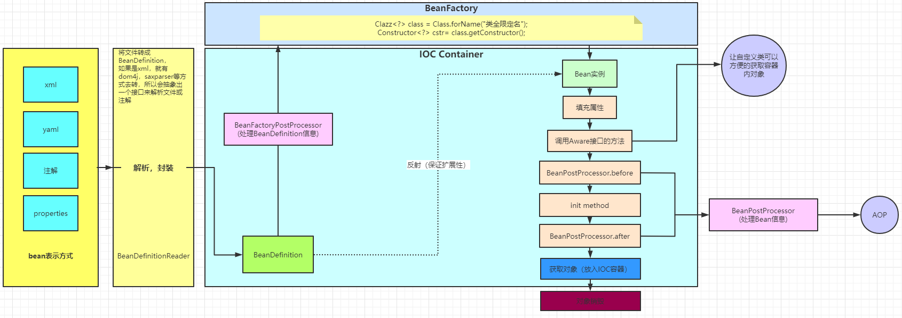

# Spring源码分析
## Spring概述
Spring是一个框架，是一个生态

### 获取反射的三种方式
Class.forName("全限定类名");
实例对象.getClass();
类.class

### 在不同的阶段要处理不同的工作，应该要怎么去做？
观察者模式，使用监听器，广播器和监听事件

### BeanFactory和FactoryBean的区别
都是用来创建对象的，但是BeanFactory创建过程要遵循完整创建过程，由Spring来控制，在容器开始的时候就创建了bean，FactoryBean只需要通过getObject去创建对象，由用户自己去控制对象的生成，更灵活，在被调用的时候被创建，不需要遵循bean的生命周期

### 总轴承

### 需要注意的接口
1.BeanDefinitionReader
2.BeanDefinition
3.BeanFactory
4.BeanFactoryPostProcessor
5.BeanPostProcessor
6.Aware
7.FactoryBean
8.Environment

## 事务

